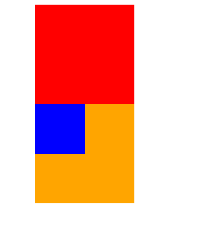

### 1.什么是浮动？

是一种布局的模式，常取的值有left和right

### 2.浮动的规则一

```
元素一旦浮动后
	1.脱离标准流
	2.朝着向左或者向右方向移动，直到自己的边界贴紧着包含块(一般是父元素)或者其他浮动元素的边界位置
	3.块级元素会层叠在上面，而行内和inline-block不会
定位元素会层叠在浮动元素上面
	各个关系：标准流 < 浮动 < 定位元素
```

### 3.浮动的规则二

```
浮动元素不能与行内级内容层叠，行内级内容将会被浮动元素挤出去
	1.是排在浮动元素后面，而不是两个内容层叠
	2.适用于做文字环绕图片
```

### 4.浮动的规则三

```
inline-block浮动是只会在自己本行左移或者右移，不会往上面移动
```

### 5.浮动的规则四

```
1.两个浮动的元素不会进行层叠
	1.1 左浮找左浮，右浮找右浮
	1.2浮动过程中，同一行空间不够会换行
```


### 5.现象的解释

现有代码：

```html
<div class="box">
    <div class="inner1"></div>
    <div calss="inner2"></div>
</div>
```

解释：

```
1.inner2进行左/右浮动时，只会在自己的当前行浮动
2.inner1进行左浮动时，inner2在没有浮动时，inner2会跑到第一行，与inner1进行层叠
3.inner1进行左浮动时，inner2里面有文本，文字会在层叠中剩余空间进行排布
4.两者都进行左浮动时，两个都会在第一行内依次靠左排列
5.两者都进行浮动，但是父元素没有设置高度，name父元素的高度会消失(高度塌陷)
```

### 6.浮动存在的问题

#### 6.1.高度塌陷

```
高度塌陷的原因：
当父元素没有设置 高度时，里面元素都设置成浮动，脱离了标准流，父元素读取不到高度，父元素的高度就会为0
```

### 7.解决浮动存在的问题

#### 7.1高度塌陷——方法一css属性——clear

```
常用取值：
	left：要求该元素的顶部要低于所有左浮动元素的底部，这样高度就以该元素为准了
	right: 同理
	both：低于所有的左右浮动元素
	
做法： 搞个div在浮动元素下面，设置该属性就行
```

### 8.BFC (block format context)

作用： **用于决定块盒子的布局及浮动相互影响范围的一个区域**。 

#### BFC的创建方法

- **根元素**或其它包含它的元素；
- **浮动** (元素的`float`不为`none`)；
- **绝对定位元素** (元素的`position`为`absolute`或`fixed`)；
- **行内块**`inline-blocks`(元素的 `display: inline-block`)；
- **表格单元格**(元素的`display: table-cell`，HTML表格单元格默认属性)；
- `overflow`的值不为`visible`的元素；
- **弹性盒 flex boxes** (元素的`display: flex`或`inline-flex`)；

但其中，最常见的就是`overflow:hidden`、`float:left/right`、`position:absolute`。也就是说，每次看到这些属性的时候，就代表了该元素以及创建了一个BFC了。

#### BFC应用场景

例子1：

- 三个盒子，红盒子，橙盒子是两个包含块
- 橙色盒子又包含着蓝色盒子



- 如果将蓝色盒子的margin-top设为20px，照理说橙色盒子不会动。
- 但是实际情况如下
- 橙色盒子一起动了


如何解决这个现象呢？触发BFC

- 将蓝色盒子开启float：left 可以
- 将蓝色盒子设为display：inline-block
- 蓝色盒子的*position: absolute;*
- 橙色盒子设置为`overflow`的值不为`visible`的元素
- 橙色盒子设置display: flex;


