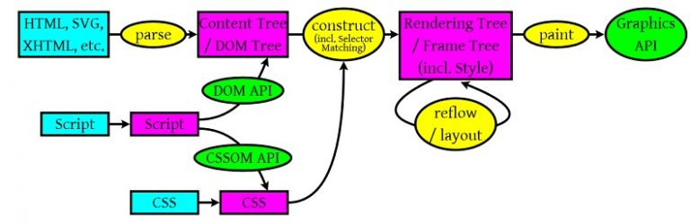

## 一、浏览器渲染原理

上图我们可以看出，浏览器会解析三个模块：

- `HTML`,`SVG`,`XHTML`，解析生成`DOM`树。
- `CSS`解析生成`CSS`规则树。
- `JavaScript`用来操作`DOM API`和`CSSOM API`，生成`DOM Tree`和`CSSOM API`。

## 二、什么情况下会造成重排重绘？

重排：元素的宽高，位置发生了变化。需要重新验证计算 `Render Tree `.一旦某一个节点发生重排的话，可能会引起子元素、父元素、兄弟元素的位置发生变动，所以重排的成本，性能消耗很高。

以下操作会导致**重排**或**重绘**。

- 删除，增加，或者修改`DOM`元素节点。
- 移动`DOM`的位置，开启动画的时候。
- 修改`CSS`样式，改变元素的大小，位置时，或者将使用`display:none`时，会造成**重排**；修改`CSS`颜色或者`visibility:hidden`等等，会造成**重绘**。
- 修改网页的默认字体时。
- Resize窗口的时候（移动端没有这个问题），或是滚动的时候。
- 内容的改变，(用户在输入框中写入内容也会)。
- 激活伪类，如:hover。
- 计算`offsetWidth`和`offsetHeight`。

## 三、减少重排重绘

- 尽量避免`style`的使用，对于需要操作`DOM`元素节点，重新命名`className`，更改`className`名称。
- 如果增加元素或者`clone`元素，可以先把元素通过[`documentFragment`](https://developer.mozilla.org/zh-CN/docs/Web/API/DocumentFragment)放入内存中，等操作完毕后，再`appendChild`到`DOM`元素中。
- 不要经常获取同一个元素，可以第一次获取元素后，用变量保存下来，减少遍历时间。
- 尽量少使用`dispaly:none`，可以使用`visibility:hidden`代替，`dispaly:none`会造成**重排**，`visibility:hidden`会造成**重绘**。
- 不要使用`Table`布局，因为一个小小的操作，可能就会造成整个表格的**重排**或**重绘**。
- 使用`resize`事件时，做**防抖**和**节流**处理。
- 对动画元素使用`absolute / fixed`属性。
- 批量修改元素时，可以先让元素脱离文档流，等修改完毕后，再放入文档流。

