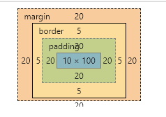

### 1.标准盒模型

元素大小是 padding + margin + border + content，内容大小就是content大小，宽高设置多少那content就是多少，总体元素会随着宽高的改变而改变。

例如：

- 宽高都为100px
- padding和margin都是20px
- border是5px
- 那么他的内容是100x100

```css
    .box {
      background-color: red;
      width: 100px;
      height: 100px;

      padding: 20px;
      margin: 20px;
      border: 5px solid blue;
    }
```



### 2.IE盒子模型

他的元素总大小是padding+margin+border+content，但是他的内容大小是 padding+border+content

content的大小为 width - 2xpadding - 2xborder

例如：

- 设置宽高为100px
- padding&margin都为20px
- border为5px
- 它content大小为100 - 2xborder -  2xpadding = 50x50

```css
    .box {
      background-color: red;
      width: 100px;
      height: 100px;

      padding: 20px;
      margin: 20px;
      border: 10px solid blue;

      box-sizing: border-box;
    }
```

### 3.总结

标准和模型和IE盒子模型的区别就是内容（直接设置宽高）代表的意思

标准盒模型：设置宽高是给content设置的，content = width x height

IE盒模型：设置的宽高是给content+padding+border设置的，content的大小是width- 2xborder -  2xpadding 


通过box-sizing可以转换盒子模型

