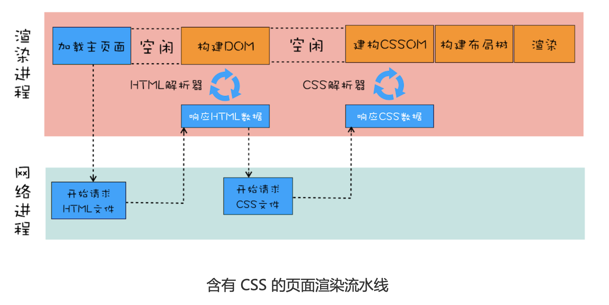
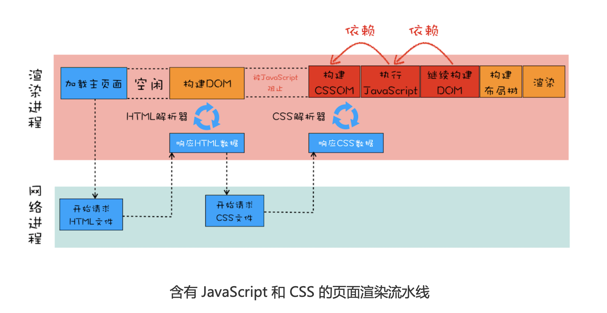

### 1.前言

前面学习了DOM的生成过程，分析JS如何阻塞DOM生成，这里学习渲染流水线中的 CSS，css是页面中非常重要的资源，理解CSS怎么工作，才能更好的优化页面。

三个方面：

- 先站在渲染流水线视角学习css如何工作
- 通过css的工作流程分析性能瓶颈
- 最后讨论如何减少首次加载时的白屏时间

### 2.渲染流水线中的 CSS

```css
//theme.css
div{
color : coral; background-color:black
}
```

```html
<html>
<head>
	<link href="theme.css" rel="stylesheet">
</head>
<body>
	<div>geekbang com</div>
</body>
</html>
```

这两段代码被别是css和html，html中导入css文件，现在分析一下打开这段HTML文件时的渲染流水线：



- 发起主页面请求，发起方可能是渲染进程，也可能是浏览器进程，该请求在网络进程执行。
- 网络进程接收到返回的HTML数据之后，发送给渲染进程，渲染进程开始**解析HTML构建DOM**
- 请求HTML数据和构建DOM中间有一段空闲时间，这个**空闲时间可能成为页面渲染的瓶颈**

渲染进程接受HTML文件字节流时，会先开启**预解析进程**，遇到JS或CSS文件，预解析就会提前下载，但是DOM构建好，css未下载好，这段时间，渲染流水线无事可做，因下一步是合成布局树，所以这里需要等待css加载完并解析成CSSOM。

### 3.渲染流水线为何需要CSSOM？

和HTML一样，渲染引擎无法识别css文件，需要将其解析成渲染引擎可以理解的结构CSSOM。和DOM一样，SCCOM也有两个作用：

- 提供给JS操作样式表的能力
- 为布局树的合成提供基础样式信息

### 4.文件中含有JS，CSS文件的渲染流水线

- 这样的话DOM的解析因为JS暂停
- JS的执行又因为CSS，需要暂停
- 所以DOM需要等JS和CSS都完成后才会构建完毕
- 所以在部分情况下CSS也会阻塞DOM解析

```html
<html>
<head>
<link href="theme.css" rel="stylesheet"> </head>
<body>
    <div>geekbang com</div>
    <script>
			console.log('time.geekbang.org') </script>
    <div>geekbang com</div>
</body>
</html>
```



减少白屏时间：

- 通过内联 JavaScript、内联 CSS 来移除这两种类型的文件下载，这样获取到 HTML 文件 之后就可以直接开始渲染流程了。
- 但并不是所有的场合都适合内联，那么还可以尽量减少文件大小，比如通过 webpack 等 工具移除一些不必要的注释，并压缩 JavaScript 文件。
- 还可以将一些不需要在解析 HTML 阶段使用的 JavaScript 标记上 sync 或者 defer。
- 对于大的 CSS 文件，可以通过媒体查询属性，将其拆分为多个不同用途的 CSS 文件，这 样只有在特定的场景下才会加载特定的 CSS 文件。

