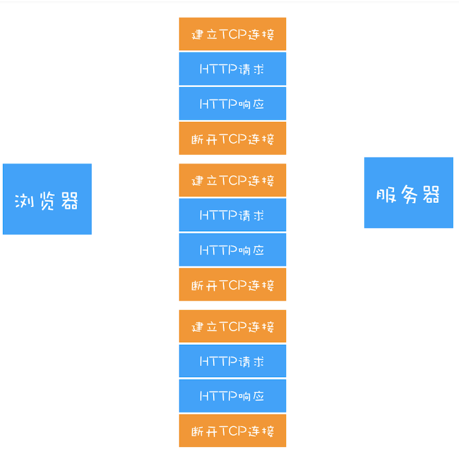

## 一、HTTP/0.9

在网络之间传输HTML文本，所以叫**超文本传输协议**，HTTP都是基于TCP协议的。

流程：

- 请求
- DNS查询IP地址
- 三次握手建立连接
- 客户端发起请求
- 服务器响应
- 断开连接

## 二、浏览器推动的HTTP/1.0

> 之后在浏览器上不仅仅是HTML文件，有CSS，JS，图片，音频，视频等不同类型的文件。因此需要一个支持多类型的协议，HTTP1.0出来了。

以前在0.9时代浏览器只会发简单的请求，不能告诉服务器更多的信息，服务器也是一样，直接返回数据，没有更多的信息告诉浏览器。

所以，要想支持多类型，HTTP/1.0引入了响应请求头。都是以KEY-VALUE存在的。

## 三、HTTP/1.1

> 网络已经发展到HTTP1.0页不能满足需求了，所以又在HTTP1.0做了大量改进。

### 1.改进持久连接

**HTTP1.0短连接**：HTTP1.0每进行一次通信，都需要 **建立TCP连接，传输HTTP数据，断开TCP连接**。每请求一次就要断开连接一次。效率很低。

- 对于当时的环境，文件小，请求数量也少，所以这么做没什么问题。
- 但是现在，网页很丰富，请求资源涉及很多，再这样的话，是不行的。



**HTTP1.1长连接**

HTTP1.1中长连接是默认开启的，所以无需做任何操作，想要关闭的话就用， Connection: close ；

目前浏览器对于同一域名，默认允许同时建立6个TCP持久连接。

### 2.不成熟的 HTTP 管线化

持久连接虽然可以减少TCP的建立断开次数，但是他需要等待前面的请求返回之后，才能进行下一次请求。如果TCP通道中的某个请求因为某些原因没有及时返回，那么就会阻塞后面的所有请求，这就是**队头阻塞**。

### 3.提供虚拟主机的支持

在HTTP1.0中，每个域名绑定唯一IP地址，因此一个服务器只支持一个域名。有了虚拟主机，单独的域名可以共用同一个IP地址。

一次，HTTP1.1的请求头添加了 **Host**字段，表示当前域名地址，这样服务器可以根据不同服务器做出不同的处理。

### **总结**

```
HTTP1.1为网络效率做了很大的优化，最核心的是三个：
	1.持久化连接。
	2.浏览器为每个域名最多同时维护6个TCP连接。
	3.使用CDN的实现域名分片机制。
```


## 四、HTTP/2.0

### HTTP/1.1的问题

虽然1.1进行很多有化，也有不错的效果，但是 **HTTP1.1对带宽的利用率不理想**。

比如：100M的宽带他的最大速度为12.5M/s,但实际上可能只有2.5M/s。

主要原因有三：

**原因——TCP慢启动**

TCP协议传输数据时，用缓慢的速度去发送数据，然后再加快数据的传输，类似于汽车启动。

慢启动是巍峨减少网络拥堵的一种策略，没法改变它。

慢启动带来的性能问题：

- TCP建立好连接，马上就要发起资源请求的。
- 但是由于慢启动，耗费的事件就变长，造成了首次渲染页面的事件变长。

**原因二——多TCP连接，竞争带宽**

当文件较多时，多个TCP一起使用，下载关键资源，下载音频，视频等，TCP又无法识别资源的优先级，造成关键资源的下载慢。

**原因三——HTTP1.1队头阻塞**

虽然1.1持久连接，但是一个管道同一时刻智能处理一个请求，该请求没有结束前，其他请求只能处于阻塞状态。这意味我们不能随意在一个管道中请求和接收内容。

### HTTP/2.0多路复用

TCP有问题，但是不能换掉TCP，所以，2.0的思路就是一个域名只是用一个TCP长连接来传输数据，这样整个页面的下载过程只需要一次慢启动，同时也避免了多个TCP连接竞争带宽所带来的的问题。

