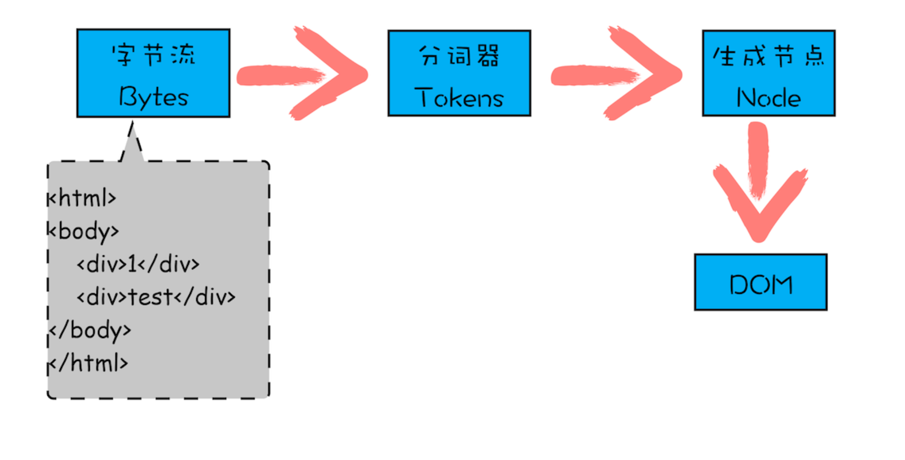

### 一、什么是DOM

从网络传给渲染引擎的 HTML 文件字节流是无法直接被渲染引擎理解的，所以要将其转化为渲染引擎能够理解的内部结构，这个结构就是 DOM。DOM 提供了对 HTML 文档结构化的表述。在渲染引擎中，DOM 有三个层面的作用。

- 页面：DOM是生成页面的基础数据结构。
- JS视角：DOM提供给JS操作的接口，通过这套接口，JS可以对DOM结构进行访问，从而改变文档结构，样式内容。
- 安全视角：DOM是安全的防护线，一些不安全的内容在DOM解析的阶段就会被举止门外

简单来说，DOM是表述HTML的内部数据结构，他会将Web页面和JavaScript脚本连接起来，过滤掉不安全内容。

### 二、如何生成DOM

在渲染引擎内部，有一个叫**HTML解析器（HTMLParser）**的模块，它的职责就是负责将HTML字节流转换为DOM结构，那么：
- HTML解析器又是如何工作的？
- HTML解析器是等整个HTML文档加载完成之后开始解析的，还是随着HTML文档边加载边解析的？

答案：HTML解析器并不是等待整个文档加载完之后再解析的，而是**网络进程加载了多少数据，HTML解析器便解析多少数据**

**接受数据流程：**

1. 网络进程接收到响应头，根据响应头的content-type判断文件类型，比如text/html，就是一个HTML类型文件
2. 创建一个渲染进程
3. 渲染进程准备好之后，**网络进程和渲染进程之间会建立一个共享数据的管道**。
4. 网络进程接收到数据后就往这个管道里面放，而渲染进程则从管道的另外一端不断地读取数据，并同时将读取的数 据“喂”给 HTML 解析器。
5. 网络进程接受数据倒入另外一端 **渲染进程的解析器** 会动态接收字节流，并将其解析为 DOM。

**解析成DOM：**

上图可知，字节流转换为 DOM 需要三个阶段。

#### **第一个阶段，通过分词器将字节流转换为 Token。**

- V8引擎第一步也是将JavaScript解析成一个个的Token的。
- 解析HTML也是一样，需要通过分词器先将字节流转换成一个个Token，分为**Tag Token** 和 **文本Token**。

由图可以看出，Tag Token 又分 StartTag 和 EndTag，比如<body>就是 StartTag ，</b ody>就是EndTag，分别对于图中的蓝色和红色块，文本 Token 对应的绿色块。

#### 后续的二三阶段是同步进行的

- 将Token解析为DOM节点，并将DOM节点添加到DOM树中。
- HTML解析器有一个**Token栈结构**，用于计算节点之间的父子关系，前面生成的token会被压倒这个栈中。
- 如果压到栈中的是**StartTag Token**，HTML 解析器会为该 Token 创建一个 DOM 节 点，该节点加入到DOM树中，其父节点就是栈中相邻的那个元素生成的节 点。
- 如果分词器解析出来是**文本Token**，那么会生成文本节点，然后将该节点加入到DOM树中，文本Token不需要压入到栈中，他的父节点就是当前栈定Token对应的DOM节点。
- 如果分词器解析出来的是**EndTag 标签**，比如是 EndTag div，HTML 解析器会查看 Token 栈顶的元素是否是 StarTag div，如果是，就将 StartTag div 从栈中弹出，表示 该 div 元素解析完成。

通过分词器产生的新 Token 就这样不停地压栈和出栈，整个解析过程就这样一直持续下 去，直到分词器将所有字节流分词完成。

### 三、**JavaScript** **是如何影响** **DOM** **生成的**

#### 1.在两个div中间插入一段JS脚本

- 遇到JS之前，就和上面解析的流程一样。
- 但是解析到script标签，渲染引擎判断这是一段脚本，HTML解析器就会暂停DOM的解析
- 暂停的原因是 **接下来JS可能会修改当前已经生成的DOM结构**

