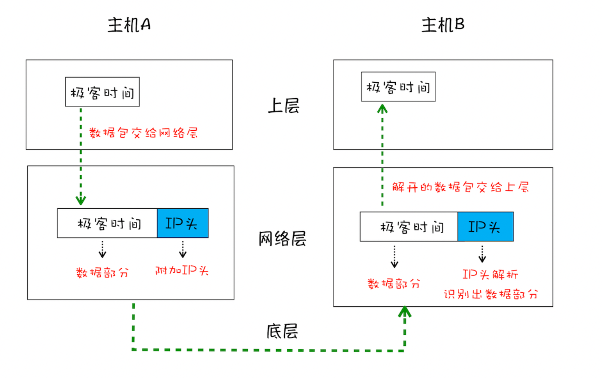
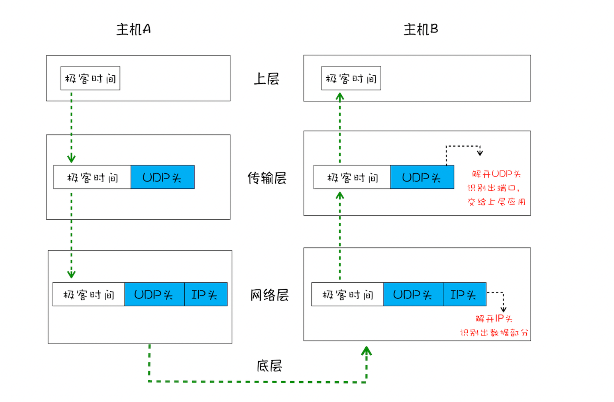
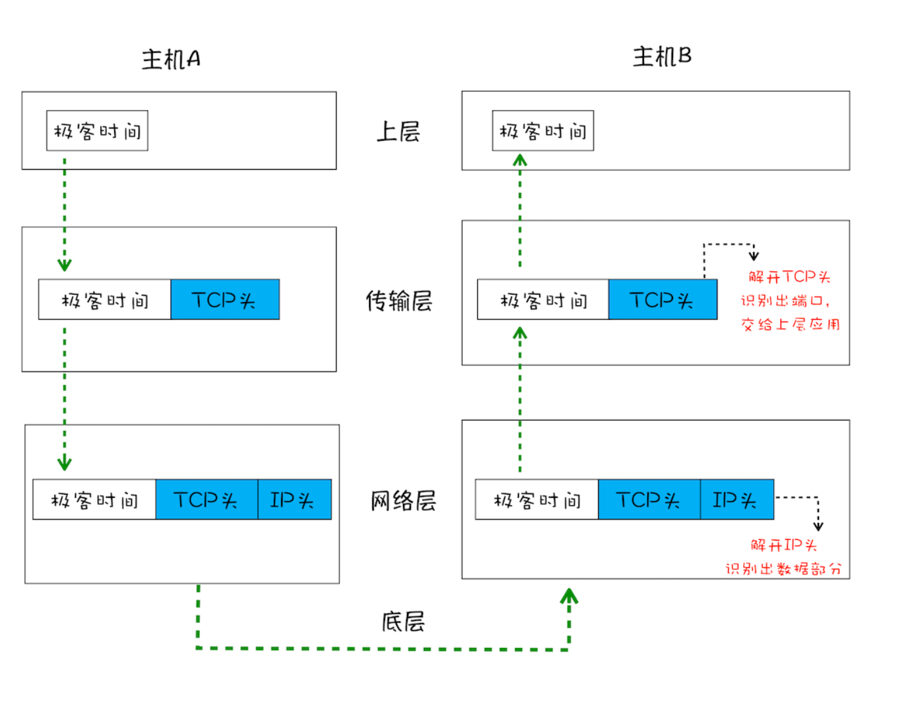
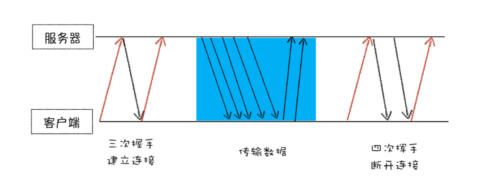
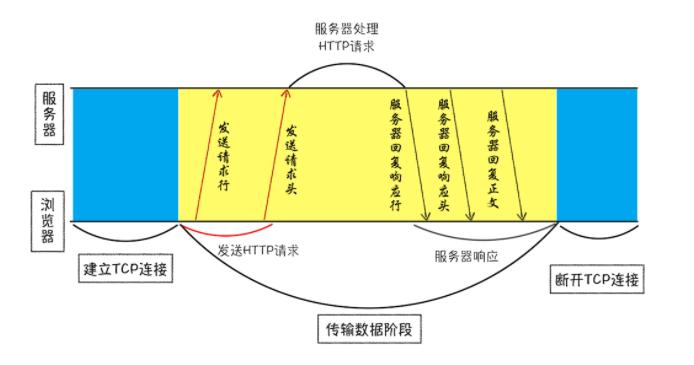
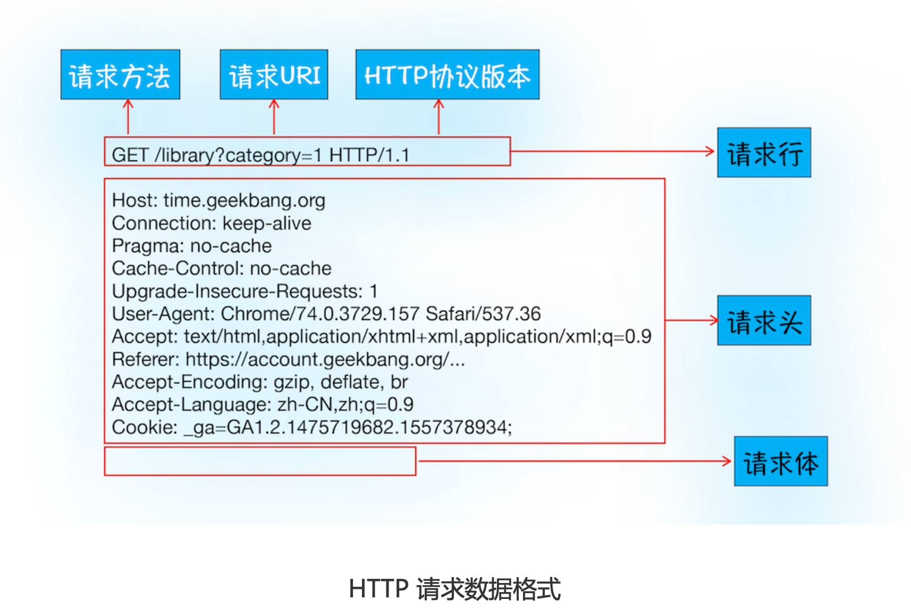
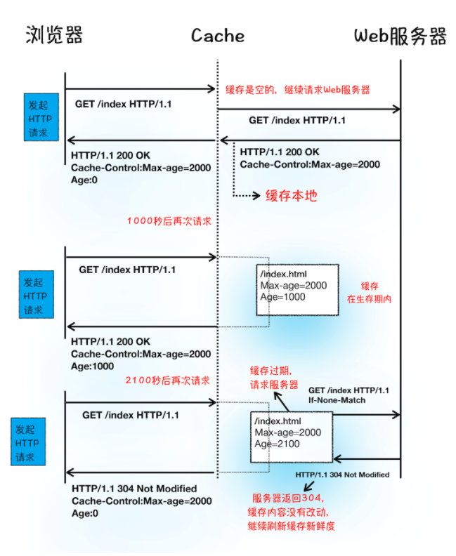
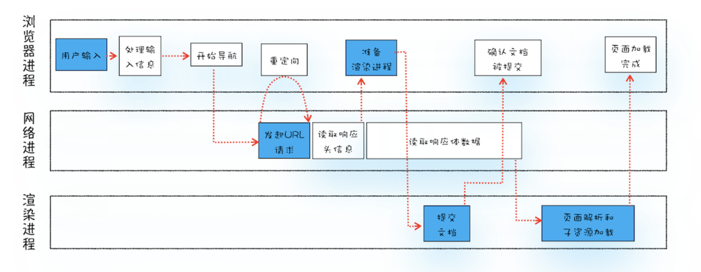

# 一、宏观视角的下的浏览器

## 1.1打开浏览器，为什么有多个进程

#### 并行处理

- 同时处理多个没有依赖的任务
- 就是多线程的原理
- 可以提升效率

#### 线程VS进程

- 多线程可以并行处理任务，但是线程是不能单独存在的，他是由进程来启动和管理的。
- 一个进程就是一个程序的运行实例，详细点就是：
  - 启动一个程序，操作系统为该程序新建一块内存，用于存放代码、运行中的数据和一个执行任务的主线程。
  - 这样的运行环境叫进程
- 进程中任意一个线程出错，都会导致整个进程崩溃
- 线程之间共享进程的数据
- 当一个进程关闭之后，操作系统会回收进程所占用的内存
- 进程之间的内容互相隔离
  - 一个进程崩溃或者挂起，不会影响其他进程
  - 如果要通信的话，就涉及到进程间的通信机制了（IPC）

## 1.2TCP协议：如何保证页面文件能被完整送达浏览器？


在衡量Web性能有一个非常重要的指标——**FP（First Paint）**，是**指从页面加载到首次开始绘制的时长**。影响该指标非常重要的一个因素就是**网络加载速度**。


想要优化Web页面的加载速度，需要对网络有充分了解。特别是对网络传输协议，不管是HTTP还是Websocket，都是基于TCP/IP的，只有清楚这些原理，才能更好的去优化Web性能，可以轻松定位Web问题。


在网络中，一个文件通常会被拆分成很多数据包来进行传输，而在数据包传输的过程中又有很大概率丢失或者出错。**那么如何保证页面文件能被完整的送达浏览器呢？**


- 数据包如何送达主机？
  - 互联网都是通过数据包传输数据的，一个文件会被拆分成许多数据包来传输
- 主机如何将数据包转交给应用？
- 数据是如何被完整地送达应用程序？


#### **1.数据包如何送达主机**

- 数据包想要在网上传输，就要符合IP协议，不同在线设备都有唯一的地址，和家里的门牌号一样
- 计算机的地址就是IP，访问任何网站都是你的计算机向另外一台计算机请求信息

::: tips

把一个数据包从主机A传输到主机B，在传输之前，数据包上会加上主机B的IP地址信息，同时也会主机A自己的IP地址，就跟发快递一样，有发送地址和目标地址。这样才能回复信息。这些信息会被添加进IP头的数据结构里。IP头是IP数据包开头的信息，内容有：**IP版本**、**源IP地址**、**目标IP地址**、**生存时间**等信息。

:::



**数据包从主机A到主机B发生了什么**

- 应用层将数据包交给网络层
- 网络层将IP头附加到数据包上，组成新的IP数据包，并交给底层
- 底层通过物理网络将数据包传输给主机B
- 数据包传输到主机B的网络层，主机B解析数据包的IP头信息，拆开的数据交给上层


#### 2.UDP：把数据包送达应用程序

**为什么要有UDP**

- IP是非常底层的协议，只负责把数据包送达对方电脑，但是不知道送给哪个程序，一条信息过来不知道是给微信还是QQ
- 为此，计算机在IP协议的基础上开发了能和应用打交道的协议——“**用户数据包协议**（User Datagram Protocol）”，简称**UDP**。

**UDP介绍**

- UDP最重要的信息是端口号，每个想访问网络的程序都要端口号，这样就能把数据精准的送达到某个程序
- 和IP头一样，端口号也会被放进UDP头，UDP头和原始的数据包组合成新的UDP数据包。
- UDP头除了目的端口，还有源端口号的信息



**通过UDP数据包从A主机到B主机发生了什么**

- 上层把数据包交给传输层
- 传输层在数据包前面加上UDP头，组成新的UDP数据包，在将新的UDP数据包交给网络层
- 网络层将IP头附加到数据包上，组成新的IP数据包，交给底层
- 数据包传给主机B的网络层，主机B拆开IP头的信息，将拆开的数据包部分交给传输层
- 在B的传输层，数据包中的UDP头会被拆开，并根据UDP中所提供的端口号，把数据部分交给上层的应用程序
- 最后，数据包信息被主机B的应用程序使用


#### TCP：把数据完整地送达应用程序

- 对于浏览器请求，或者邮件这些重要的信息，传输必须要保证数据的完整性以及可靠性
- UDP传输存在两个问题：
  - 数据包传输过程中容易丢失
  - 大文件拆成小数据包传输，不同时间到达接收端，UDP是不知道如何组装这些数据包的，所以无法还原成完整的数据
- 基于这两个问题，可以使用TCP，具有以下特点
  - 对应丢失的数据包，TCP提供了重传机制
  - TCP引入了数据包排序机制，可以把乱序的数据包组合成完整的文件
  - TCP头除了目标端口和本机端口，还有用于排序的序号



- 通过上图可以发现TCP单个数据包传输和UDP的流程差不多，不同的是，TCP头部信息保证了一大块数据传输的完整性


**TCP的生命周期**



- 先**建立连接**。通过三次握手建立客户端和服务端的连接。TCP提供面向连接的通信传输。**面向连接**指在数据通信开始之前先做好两端的准备工作。三次握手是指在建立一个TCP连接时，两端总共需要发送三个数据包确认连接的建立
- **传输数据**，传输时，**接收端需要对每个数据包进行确认操作**，当发送端发送一个数据包后，在规定的时间内没有接收到接收端返回的确认消息，就判定为数据包丢失，就会触发发送端的重发机制。然后就是一个大文件会被拆分成许多数据包，到达接收端后会按照TCP头部的序号去组装数据包，**保证了数据的完整性**。
- **断开链接**，数据传输完成，终止连接，涉及到四次挥手保证双方断开连接。


**总结**

- TCP保证了数据的可靠性，但是牺牲了数据包的传输速度，三次握手和数据包校验机制把传输过程中的数据包数量提高了一倍

## 1.3 HTTP请求流程：为什么很多站点第二次打开速度会很快？

::: tips

HTTP协议是建立在TCP基础上的。**HTTP是一种允许浏览器向服务器获取资源的协议，是Web的基础**。由浏览器发起请求，获取不同类型的资源。

:::

- 为什么第一次打开一个站点时，打开速度很慢，再次访问时就变得很快了
- 当登录一个网站之后，下次再访问，就已经是登录状态了，怎么做？
- 上面的特性都和HTTP协议相关

### 浏览器端发起请求

#### 1.构建请求

- 首先需要构建**请求行**信息，然后浏览器准备发起网络请求

```http
GET /index.html HTTP1.1
```

#### 2.查找缓存

- 在发起真正的网络请求之前，浏览器回去查找浏览器缓存中是否有要请求的文件。
  - 如果有，则拦截请求，使用缓存
  - 减小了服务器压力，提升了渲染速度
- 查找失败则进入网络请求的过程

#### 3.准备IP地址和端口

- 需要先了解下HTTP和TCP之间的关系：
  - 浏览器使用HTTP协议作为应用层协议，用于封装请求的文本信息
  - 使用TCP/IP作传输层协议将它发到网络上
  - 所以HTTP开始工作之前，浏览器通过TCP与服务器建立连接
  - 也就是说HTTP的内容是通过TCP的传输数据阶段来实现的



**思考**

- HTTP网络请求的第一步是什么？与服务器建立连接
- 建立连接需要哪些信息？IP地址和端口号
- 如何获取IP地址和端口号？
  - 根据HTTP请求的话，只有一个URL
  - 通过URL可以根据DNS获取到IP
  - 端口没有指定默认是80
- 其中DNS是负责把域名和IP地址做一一映射关系
  - DNS的数据可以被缓存，如果某个域名已经解析过了，浏览器可以缓存解析的结果，下一次查询可以直接使用

#### 4.等待TCP队列

- 通过上面步骤IP和端口都有了，但也不能立马就建立连接
- 因为同一个域名最多建立6个TCP连接，也就是该域名同时有10个请求发生，4个请求会进入排队等待状态
- 要是少于6个，那么就进行第5步

#### 5.建立TCP连接

- 三次握手

#### 6.发送HTTP请求

- 建立连接之后，浏览器就可以向服务器请求数据了



**请求行**

- 首先发送请求行，包含了请求方法，请求URI，HTTP版本号

**请求头**

- 把浏览器的基础信息告诉服务器
  - 比如操作系统，浏览器内核，域名信息，浏览器端的Cookie信息

### 服务端处理HTTP请求

#### 1.返回请求

- 一旦服务器处理结束，便可以返回数据给浏览器了。可以通过curl查看返回的数据

```
curl -i  https://time.geekbang.org/
```

- 返回结果如下


#### 2.断开连接

- 一般来说服务端返回请求后就关闭TCP连接，但是浏览器或者服务器在头部信息加上了 *Connection:Keep-Alive*
- 那么TCP连接在发送后任然保持打开状态这样浏览器就可以通过同一个TCP连接发送请求。
- 这样做是为了省去下一次连接所需要的时间，提高了性能，因为复用了该连接


#### 3.重定向

- 还有一种情况就是当你在浏览器打开 *baidu.com*，最后打开页面的地址是 *https://baidu.com*
- 这两个url之所以不一样，是因为涉及到了一个**重定向操作**
- 输入 *curl -I baidu.com*，看看返回什么
  - 返回包含*Location: https://baidu.com*，代表这会重定向到这个url

### 总结

#### 1.为什么很多站点第二次打开会很快

- 第一次加载页面时，缓存了一些耗时的数据
- 缓存了哪些数据：
  - DNS缓存和页面资源缓存
  - DNS缓存较为简单，只需把IP和域名对应起来



#### 2.如何保持登录状态

- 用户第一次需要向服务器发送post请求提交自己的账号密码
- 服务器接收到信息，回去后台校验，通过后会生成一个标识用户的字符串，写到响应头的Set-Cookie字段里（如 *Set-Cookie: UID=3431uad;*）
- 浏览器接收到服务器的响应后，开始解析响应头，有Set-Cookie这个字段，浏览器就会把它保存在本地
- 再次访问时，浏览器会发起HTTP请求，但是在发起请求之前，浏览器会读取之前保存的Cookie数据，把数据写进请求头的Cookie字段里，浏览器会把改请求头发给服务器。
- 服务器收到HTTP请求头数据后，会查找请求头是否有Cookie字段，有的话读取字符串，服务器查询后台，判断是登录状态，然后生成包含该用户信息的页面数据，并把生成的数据发送给浏览器
- 浏览器收到该含有当前用户的页面数据后，就可以正确展示用户登录的状态信息了

## 1.4从输入URL到页面展示发生了什么？

- 下图是输入URL之后到渲染页面发生的一系列流程：



- 从上图不难发现，整个过程需要不同进程的配合：
  - 浏览器进程负责用户交互，子进程管理和文件存储等功能
  - 网络进程是面向渲染进程和浏览器进程提供网络下载功能
  - 渲染进程是负责把从网络下载的资源解析成可以显示和交互的页面。因为渲染进程所有的内容都是通过网络获取的，会存在一些恶意代码利用浏览器漏洞对系统进行攻击，所以渲染进程的代码是不被信任的。这也是为什么Chrome让渲染进程运行在安全沙箱里，就是为了保证系统的安全。

## 1.4渲染流程（上）HTML、CSS和JavaScript，是如何变成页面的？

- 弄清楚渲染流程非常重要
- 优化页面卡顿，JS优化动画流程，优化样式防止强制同步

### 构建DOM树

- 浏览器无法直接理解和使用HTML，需要将HTML转换为浏览器能直接
