### 一：一笔画系列

概念：

- 奇点数：这个店延伸出去的个数是奇数
- 偶点数：这个点延伸出去的个数是偶数

判断：

- 奇点数是0 || 2 个，就是一笔画。
- 奇点数>=4，笔画数为奇点数/2

注意：

- 奇点数一定是偶数个，不是的话就是数错了

#### 考法：

- 判断一笔画/多笔画图形
- 按笔画数分组
- 九宫格每行/每列笔画数相同
- 局部图形一笔画
- 直线/曲线图形一笔画。
- 笔画数与封闭面、之娴熟、曲线书、交点数量间的关系。

#### 常见一笔画图形

- 多个封闭图形，没有公共边。下图1和4和
- 多个封闭图形只有交点。1和3
- 一条直线加上一个封闭图形。下图2

#### 常见两笔画图形：

- 连个竖线加封闭图形 1
- 十字叉加上1或多个封闭图形 2，3, 4
- T字加上封闭图形 5

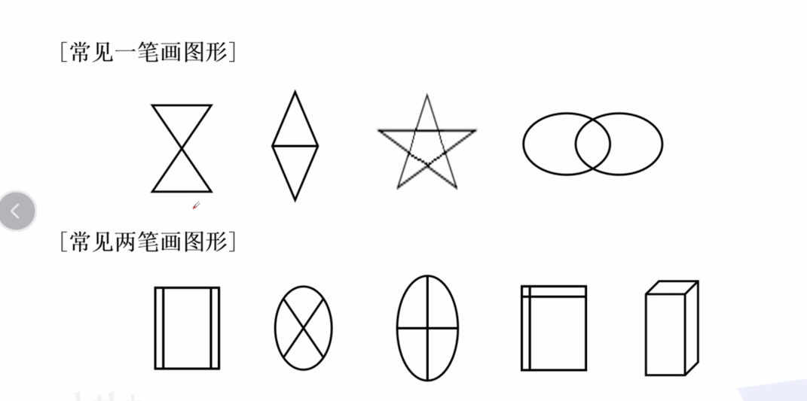

#### 练习：

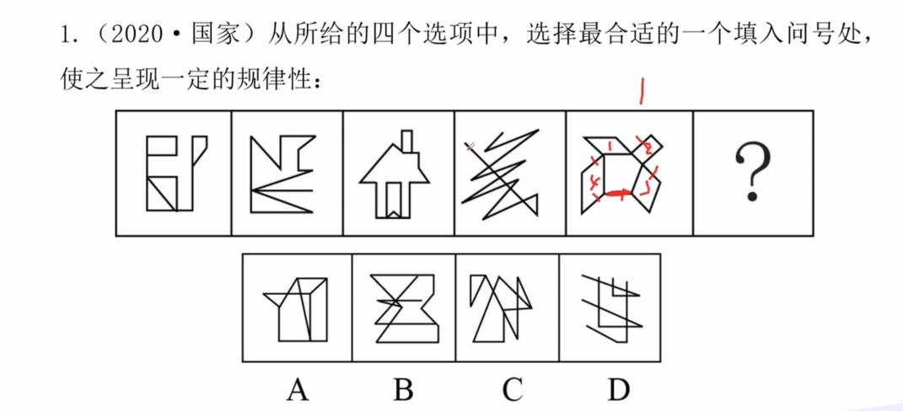

- 图一：奇点是两个
- 图二：一条线上一个封闭图形
- 图三: 多个封闭图形有交点
- 图四：两个奇点
- 图五：一条直线加多个封闭图形
- 选项C：一条直线加多个封闭图形

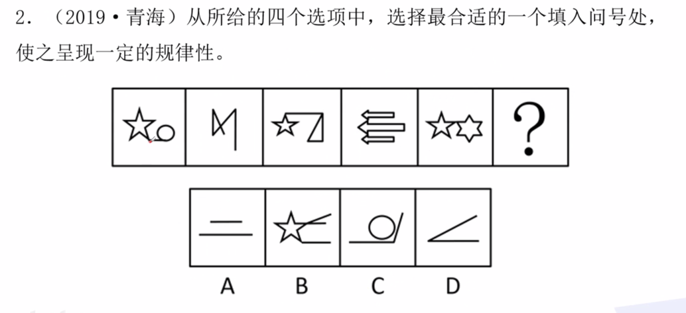

- 图一：一条直线加上两个封闭
- 图二：奇点数2
- 图三：1直线+2封闭
- 图四：n封闭+交点
- 图五：2封+1交点
- 选项：D

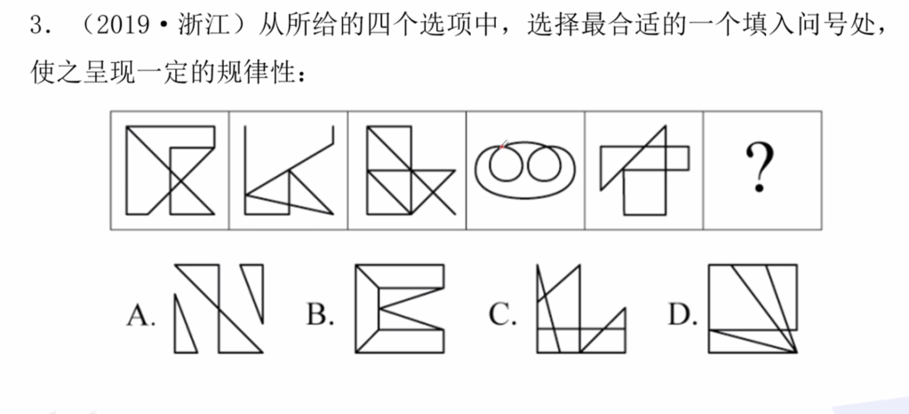

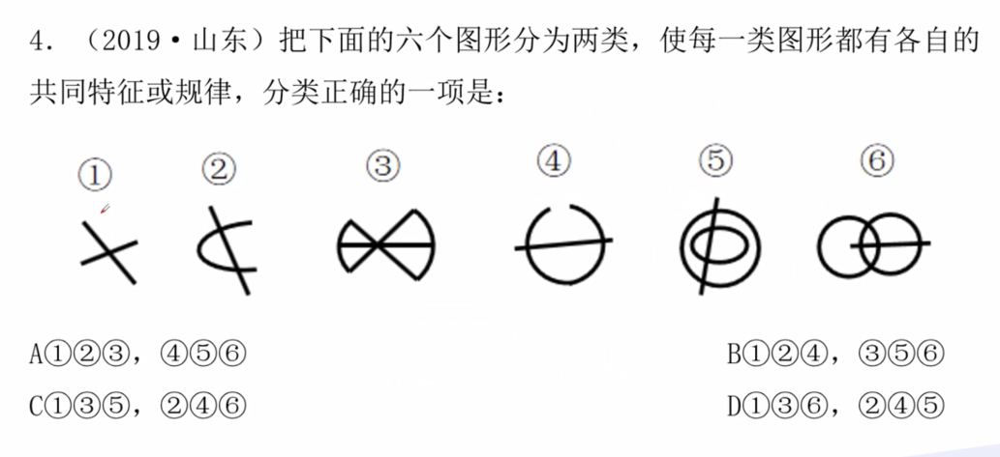

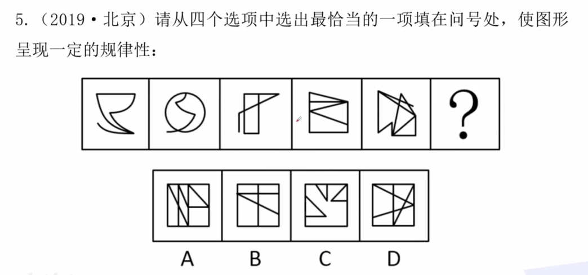

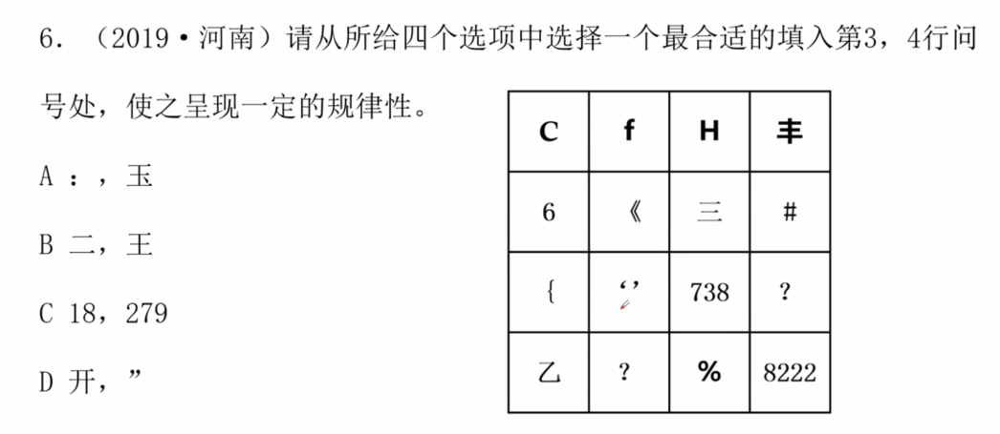

### 二：图形旋转/翻转

判别方法：

- 图内组成元素不变，相对位置基本相同
- 旋转：内部元素指针方向不变
- 翻转：内部元素指针方向改变

#### 练习：

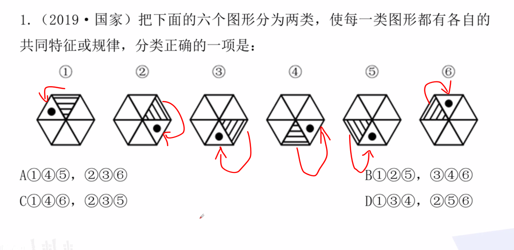

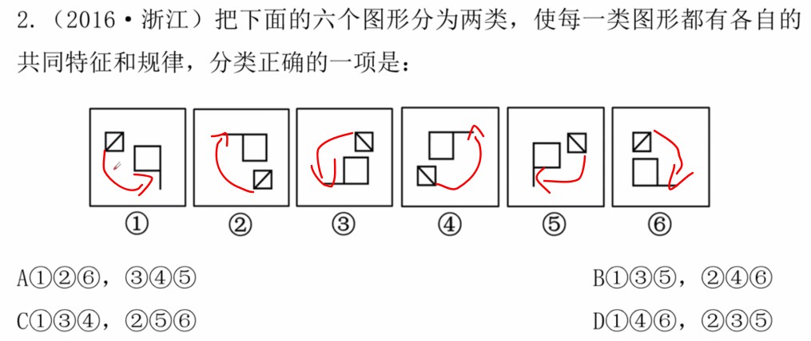

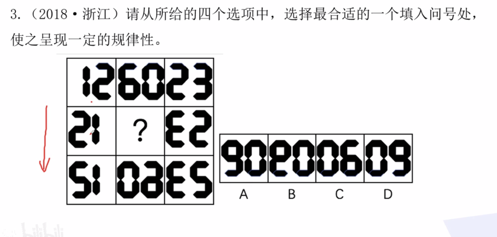

- 按列来分：第二行是根据第一行中心对称的
- 第三行和第二行是互相对折的。
- 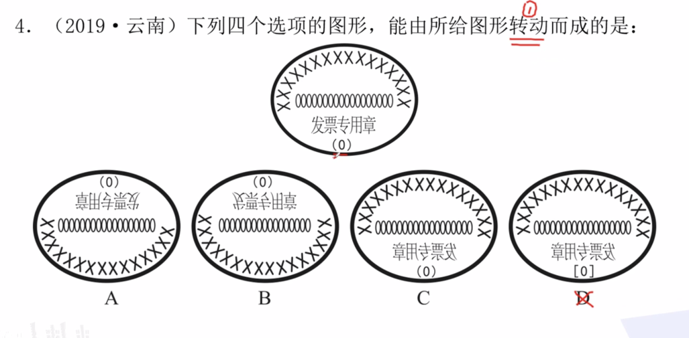
- 注意细节：0个数和x个数等。

### 三：图形移动（重点）

判别：

- 组成元素相同，元素位置不同

考察方向：

- 方向：横向，竖向，斜线，环线；折返，循环。
- 步长：相等，递增，递减，增减。

历年考法：

- 小黑点位置移动。
- 直线位置移动
- 每行、每列元素整体移动。
- 相同元素位置移动
- 点线组合移动

#### 练习：

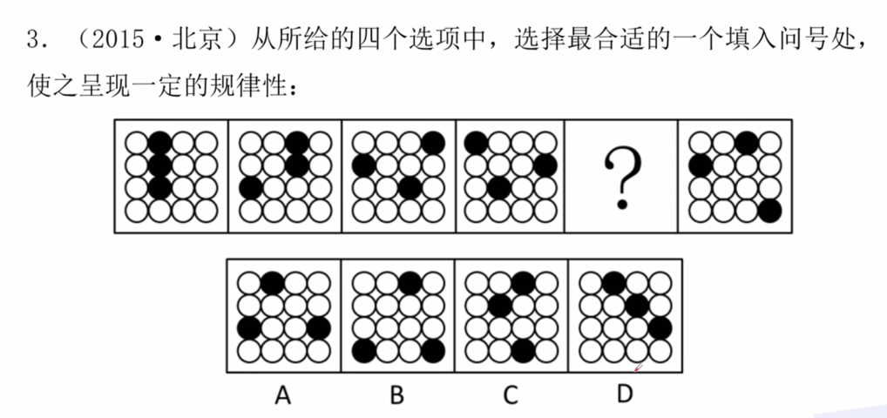

- 明显看出第一行的是顺时针向右移动一格。故A || D
- 第一行的是→ ↓ ← ？ ↑ 看出是一个螺旋扩大，所以应该填←，对应A

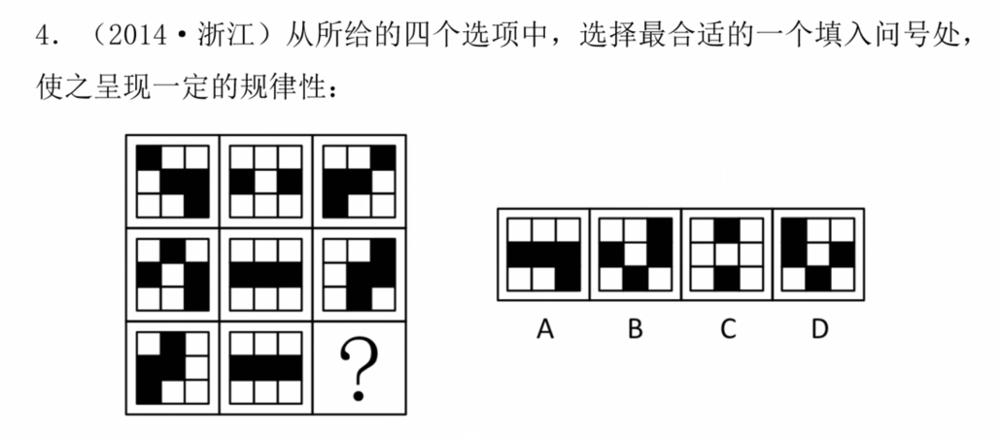

- 上面数量减少，考虑重合情况，设定1,2,3,4 => 
- 图一 → 图二：1往下走一格，2往上走一格，3向右一格，4向右二格。

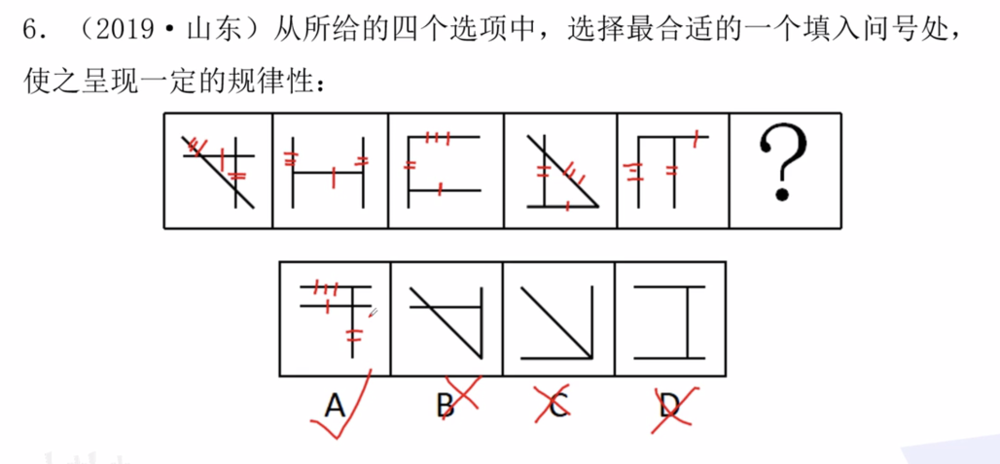

- a线上中 -> 中 -> 下中 -> 下 -> 上 ->上中: 排除 C和 D
- b线右中，右，左，左中，中，右中：排除B 选A
- c线，斜着，竖着，横着，斜着，竖着，所以下一个是横着，选A

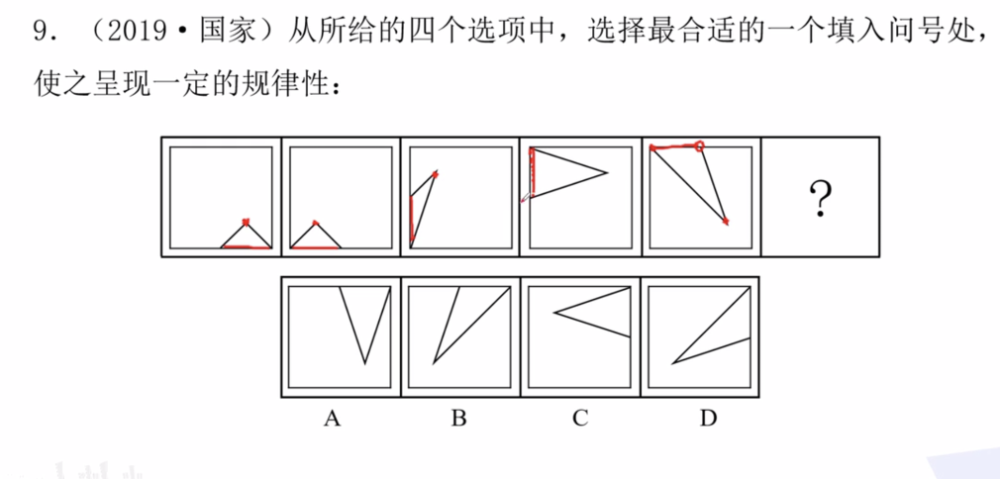

- 看边和顶点。选B。
- 边是逆时针围绕着正方形走
- 点是将方块分成四等分，分别在四个小方块走。

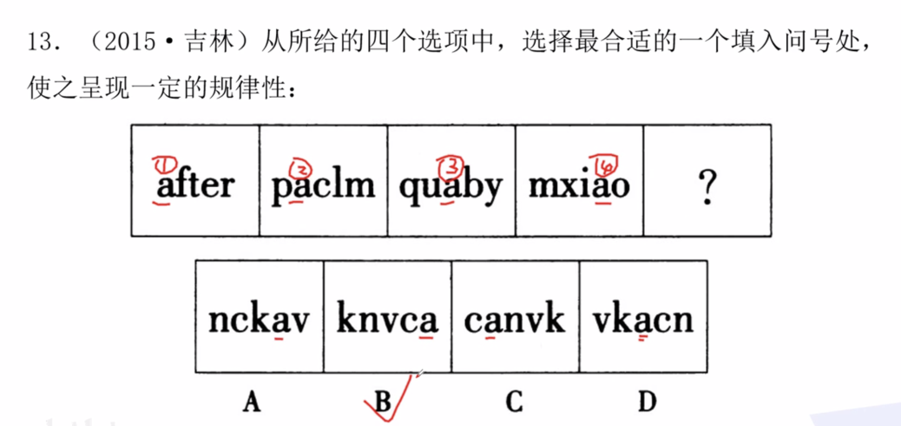

- a元素的移动

### 四：秒杀元素遍历

判别该类型方法：

- 相同元素（颜色，形状）在不同位置重复出现。

实例：

- 第一行，第二行有向上三角形，所以第三行也要有，排除B
- 第一行，第二行向上T，第三行没有，所以选D

### 五、秒杀元素置换

概念：图形依据一定的规律，将两个含有多种元素的图形进行叠加变换，使元素的种类与数量发生变化。

判断：图形结构，颜色或者形状不同。

注意：

- 置换既可以是，也可以是形状。
- 置换的角度：横向，竖向，米字型。

考法：

- 颜色置换
- 形状置换
- 置换和其他规律组合

例子：

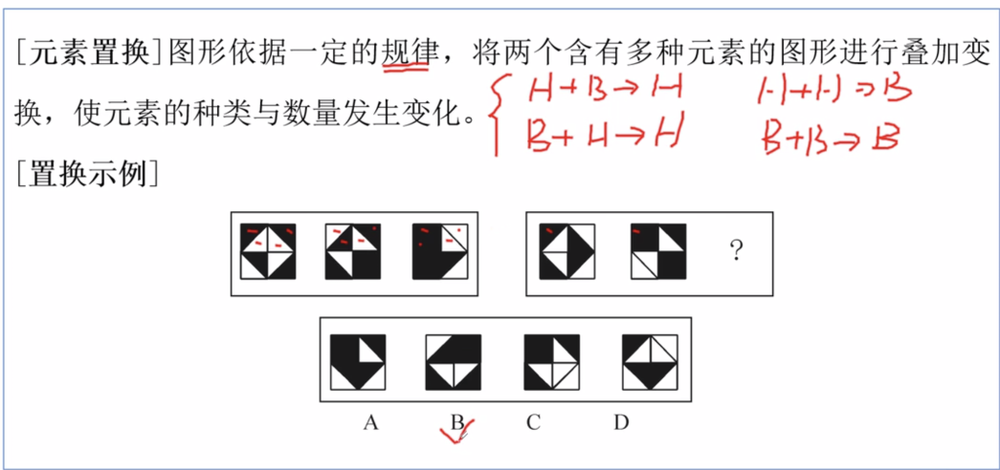

#### 练习

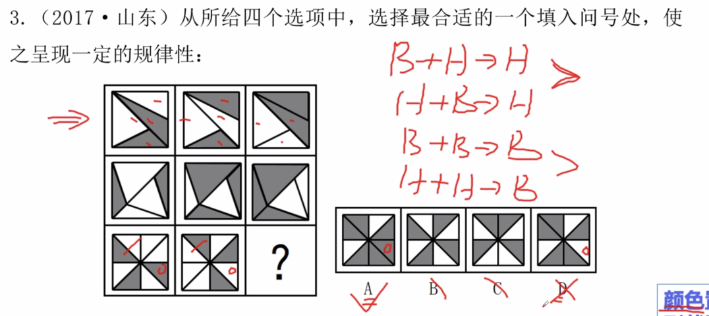

- 横向置换

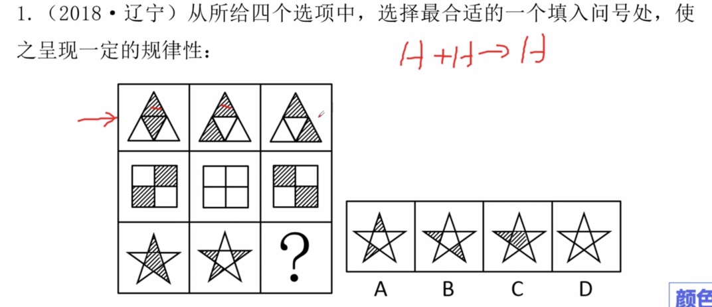

- 横向置换

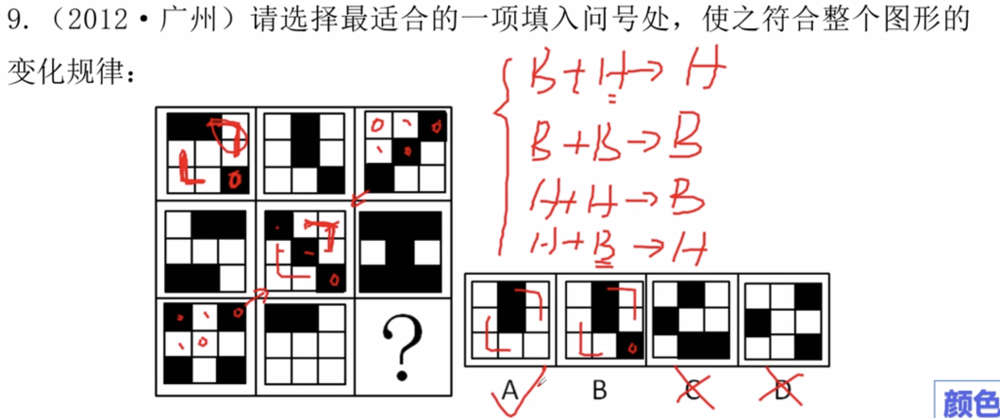

- 米字型置换，较难。

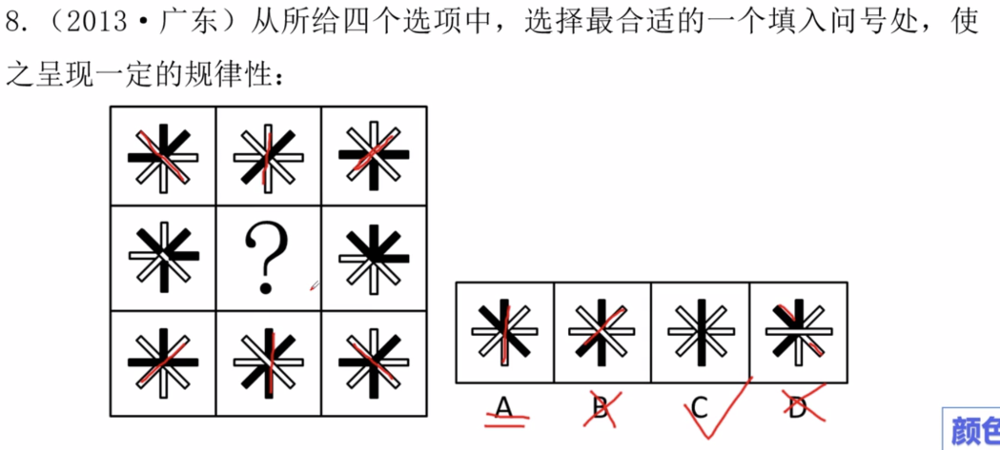

- 米字型置换
- 使用排除法5

### 六、去同存异，去异存同

判别方法：图形相似，有相同线条，有不同线条，有不同线条。

考法：

- 旋转之后 在判断。
- 对折之后在去同存异
- 叠加之后