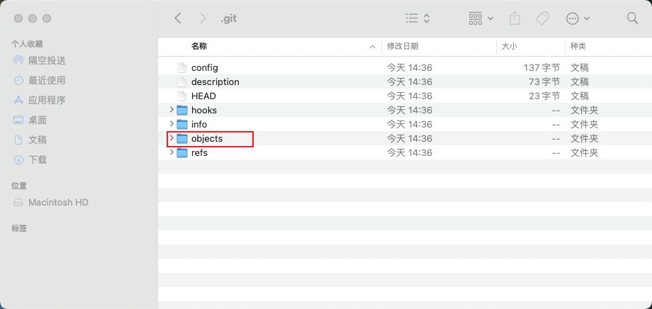
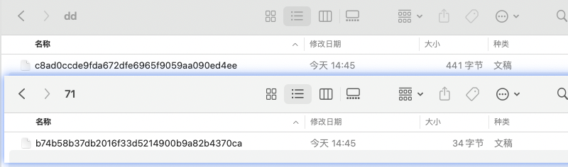
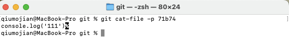
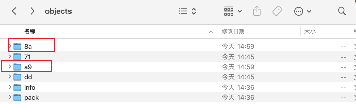
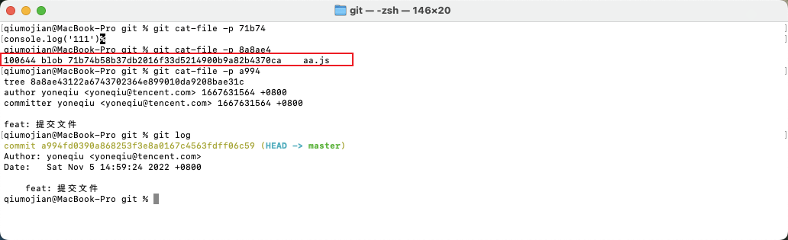
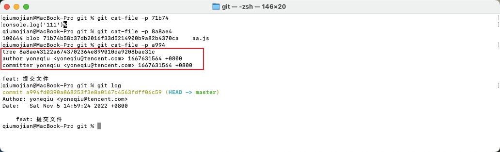
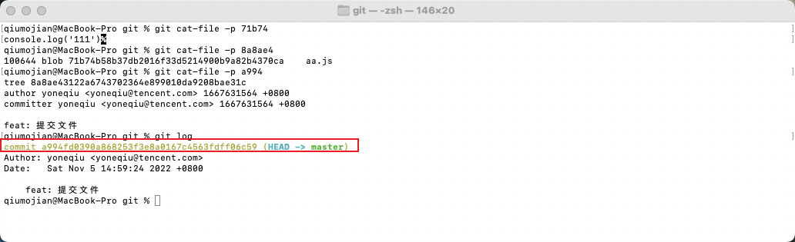
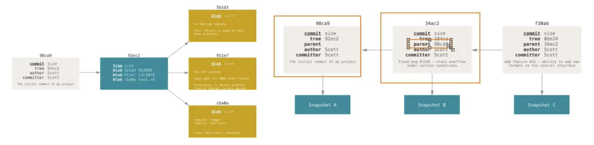

### 一、Git add 的原理

- 首先查看该仓库的.git文件夹（mac使用 `shift+command+.`）
  - 所有文件存储其实都是在objects里面的
  - Ojbects下面有两个文件夹：*info*和*pack*文件夹，默认什么都不操作的情况下，这两个都是空文件夹，因为这个git仓库还没有帮我们存过东西



- 现在执行`git add .`，这样就将文件加入到暂缓区里面了
  - 就会发现objects下面多了两个文件夹71和dd
  - 71和dd文件夹下面又有一个文件，二进制的   
  - 可以使用 `git cat-file -p [目录名+ 文件名]` 查看文件内容
    - git cat-file -p 71b74





**注意：git add 之后，文件是被暂时以二进制的方式存起来了，并没有和某一个提交对象关联**

### 二、git commit 

- 执行`git commit -m 'feat: 提交文件'`

  - 多出对应的两个目录分别是：81和a9

  

  - 首先看下8a里面的文件，执行`git cat-file -p 8a8ae4`，输出如下图所示
    - blob：代表这是一个二进制文件
    - 71b74：很熟悉，就是我们之前`git add .`生成的目录名+文件名
    - aa.js：就是在原来项目里面提交的文件

  

  - 在查看下另外一个文件：a9目录下面的94f
    - 每一次的commit的对象就是这个文件夹了，每一次提交了哪些文件和信息都在里面
    - 注意看：第一行的提交树，不就是上面的那个8a8ea4吗？里面有我们这里次提交的文件，以及源文件的索引
    - 下面就是提交人和提交message

  

  - 每一个commit都对应一个sha1校验和
    - git log 输出commitId就是我们对应的a994那个commit信息的**目录名+文件名**

  

- 在进行提交操作时，git会保存一个提交对象（commit object）：
  - 里面有指向暂存内容快照的指针
  - 还有姓名，邮箱，message，以及父对象的指针
  - 而由多个分支合并产生的提交对象有多个父对象
  - 首次提交没有父对象，之后的提交对象都会有一个父对象
  - 所以只有commit的时候，才能知道这次commit是谁操作的，操作那些信息等等


### 三、tag的原理

- master都是永远指向最新的一次提交，head就指向你的master
- 这个时候打上tag，该版本就和master一样指向最后一次提交
- 又有新的提交的时候，tag还执行原来的那个提交，而master指向变为最新

### 四、branch

- git如何判断当前在哪个分支上面呢？
  - HEAD指向谁就在哪个分支
  - 可以通过`git log --pretty=oneline`查看

### 总结

- git add仅仅只是将文件以二进制的形式存储起来
- 但是git commit 后就把对应的文件用git log，sha1校验和，二进制索引起来，也就是说对应的commit做了哪些操作，修改了什么都能被追踪
- Git commit做了很多事情：
  - 生成一个索引文件（8a8ae4）：里面记录了哪个二进制文件（71b74），以及对应的源文件名(aa.js)，二进制文件名就是我们git add的文件(71b74)
  - 还有一个提交信息的文件(a994)：里面记录了这次的commit有哪些索引文件(8a8ae4)，+ 提交人+提交日期+commit_message
  - git log：commit_id（a994），就是commit之后生成的提交信息文件名（a994）
- 所以git底层通过commit建立了很多索引去存储，查找文件的



```
一、git add 
	1.添加到暂缓区
	2.具体表现就是在objects下面创建目录和二进制文件，二进制文件就存着你的代码

二、单次git commit 
	1.每一次的commit都有一个sha1校验和，前面两位是objects下面的目录名，后面都是该目录下面存储的文件名
	2.通过上面这个sha1校验和可以找到对应的文件，里面有提交树，提交人，提交时间，提交信息；提交树也是一个sha1校验和，前两...，后面...
	3.通过这个提交树的sha1校验和可以找到对应的文件，里面存储的是一个sha1校验和（目录+文件）与对应的源文件名
	4.通过上面那个sha1校验和可以找到我们git add 存储的文件
	
三、多次提交
	1.每一次提交都是一个快照
	2.第二次提交的时候就会多一个信息，就是你的parent，记录你的上一次提交
```

