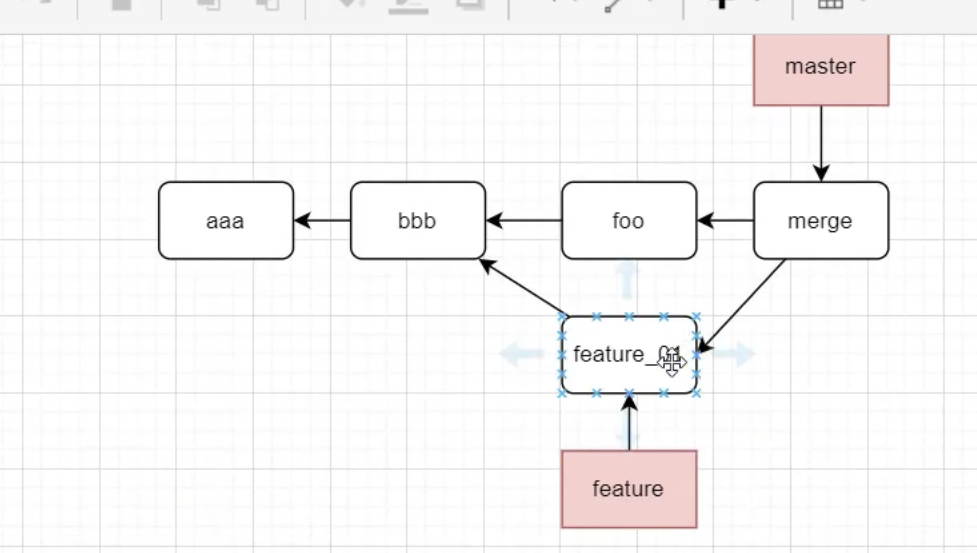

````bash
# 修改最近一次commit的message
git commit --amend

# 多个commit合并成一个
git rebase -i 基于哪一个的hash
然后用s替换pick

# 取消最近几次的commit(慎用，不可恢复)
git reset --hard 回退的hash
## 一、Git基本配置

### 1.1global、local、system登录

```bash
# 设置全局/当前仓库用户
git config --local/global user.name 'coderqmj'
git config --local/global user.email '1732935973@qq.com'
# 查看当前配置
git config --local/global --list
````

### 1.版本回退/前进

#### 方法一：

进行多次 commit，想回到某一个 commit 之前的版本，可以使用

- git reset --hard HEAD^
- 其中一个^可以回退一次 commit 之前， HEAD^^回退两个版本。
- 可以使用 HEAD~n 回退 n 个版本。

回退版本之后，又想去到最版本，

- git reset --hard \${git log}
- 版本号写前几位就行了

### 2.暂存区/工作区

本地文件就是工作区，add 之后就是就是暂存区，commit 之后就是提交到本地分支里面，push 之后就是远程分支了。

### 分支管理

#### 创建远程`origin`的`dev`分支到本地

- git checkout -b dev origin/dev

#### 删除远程分支

git push origin --delete [branchname]

#### 删除本地分支

#### 多人开发

两个人在同一个分支上面进行开发，这时候你修改了内容并推送远程。你同事又修改了相同文件，并试图推送。那么这个时候就会报错。

- git branch --set-upstream-to=origin/dev dev 本地分支与远程分支进行连接。
- 先 git pull 把远程最新代码抓取下来。
- 有冲突的话就先解决冲突，在提交。


1.开发新需求都需要更新 master 最新代码，然后从 master 分支上拉最新的分支出来进行开发。

2.合并代码时，不要将其他分支的代码合并到自己的分支，不是自己改的代码，不要提交。

3.要经常提交代码，不要改动一大推代码再提交，否则容易造成代码冲突。

```
1.在master git pull拉取最新代码。问题可能出在这。
2.创建
3.
```

#### 合并分支

- 首先提交开发分支
- 切换到需要合并的分支上，如 test
- git merge 开发分支。
- 更新远程 test 分支。

### git 开发流程

```
1.去最新代码 git pull origin master
2.git checkout -b 你的分支
3.git push origin 你的分支
4.git pull
5.将远程和本地进行连接git branch --set-upstream-to=origin/你的远程 你的本地
6.git pull
7.coding...
8.git add -A -> git commit -> git push
9.合并分支test，标题按照规范，描述需要尽量详细。
10.测试环境没问题合并预发环境，预发环境没问题合并到master。
```

### 3.Tag的使用

- 某一个重要的功能开发OK了，对某个版本做一个备份，会打上一个标签
- 不要在tag里去修改东西，应该是基于某个tag创建分支，再开发

```bash
git tag v1.0.0  # 某个版本打tag

git tag -a v1.0.1 -m 'feat: 搜索功能' # 具有标注的tag

git show tag v1.0.1 # 查看tag信息

git push origin v1.0.0  # tag推送到远程

git push origin --tags # 所有tag推到远程

git tag -d v1.1.0 # 删除tag

git push -delete <tagname> # 删除远程tag

git checkout <tagname> 进入到某个tag
```

### 4.git提交对象（原理）（待重新学习）

- git add之后发生了什么？
  - 会把文件暂时存到 `.git/objects/00/80ce946fa481f28033832995db96414b5d6114`下面
  - 里面都是二进制，可以用 `git cat-file -p 0080c` 查看文件
- git commit发生了什么？
  - 

### 5.git rebase

- 之前的git merge，在两个开发分支上去开发功能再合到master上，merge之后最新提交就有两个父节点了，就不是树结构



 

- 开发分支开发完之后，就在开发分支上`git rebase master`:
  - 这样当前分支的的父节点就指向master指向了
  - 然后再把当前分支合并到master上就行了
- 使用场景：
  - 你的分支是从最新的master上切出来的，但是又有其他同事也在开发，然后比你早提交了
  - 这个时候最好rebase一下，直接merge的话，就不是线性结构了
- 总结：
  - merge用于记录git的所有历史，那么分支的历史错综复杂，也全部记录下来
  - rebase用于简化历史记录，将两个分支的历史简化，整个历史更加简洁
  - 永远不在在主分支上使用rebase，会造成大量的提交历史在master分支中不同
