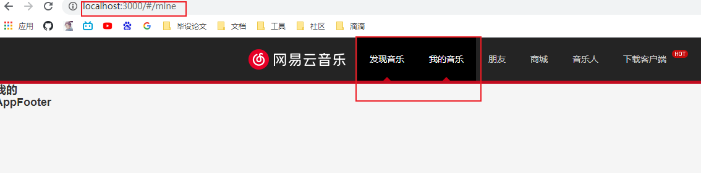

### 2021/05/15

#### 1.React中NavLink（a）标签active问题

**问题**

- a标签中匹配到了两个active的class属性，显然不合理

**分析原因**

- 这是由于React中的NavLink匹配规则，路由匹配上的a标签会active
- 但是该匹配规则是模糊匹配，路由`/`和`/mine`都会匹配上，所以 **发现音乐**都会active

**解决办法**

- 使用exact关键字进行精确匹配



### 2021/02/01

#### 1.线上事故分析总结

**问题：**

- 在做根据key跳转至编辑页面时，使用了copyKey的文本作为id跳转(编辑页面可以使用copyKey和id作为参数请求一样的数据)，虽然展示没有问题，但是编辑页面中三个相关的操作(新增语言，编辑文案，编辑翻译)需要是id的，使用了copyKey就会报错。
- 测试这个需求时仅仅只是测试了点击copyKey是否能够跳转，跳转页面能否正常展示，但是并没有去点击里面的功能是否能正常使用，直接上了线。
- 上线后使用人员出现bug，影响了主流程，我却没有以最快的时间去解决这个线上bug，而是研究哪些操作是需要传入的id的（因编辑页面逻辑比较复杂，涉及三个不同模块，每个模块对应好几个编辑操作），等理完这些逻辑后已经过去很多时间了，实在不应该。

**分析原因：**

- 没有仔细测试，测试发现问题的话就不会上线，这是最根本的原因。
- 发现问题后没有想办法恢复正常使用。
- 把时间花在研究代码上，而不是询问别人自己遇到的问题

**思考与总结：**

- 这个需求不难，但确实发生了事故，还浪费了时间。经过自己的思考，已经发现了问题所在，针对这些问题，总结出类似情况的对策：
  - 上线前仔细测试代码可能会影响的各个模块。
  - 线上出现问题应该以最快的时间使其恢复使用。
  - 尽快与后端商量好相应的对策，不懂的地方尽快问写代码的人弄懂，而不是自己研究。

### 21/01/15--20

#### 1.文案兜底问题

**问题**：

- 通过文案审核时，会有弹窗提示，如果修改人和审批人一样就显示 `你是否要通过改文案？` ，但如果修改人和审核人不一样就显示`改文案不是你修改的，确认通过吗？`
- 正常情况下只需要判断两者是否相等就行了，但是当时没有考虑到边界问题：
  - 如果修改人没有数据呢？if判断是结果是不相等的，就会使用后者文案，但显然前者文案更合适
  - 要是没有取到审核人数据呢？和上面结果也是一样不合理的。

**解决**：

- 我们应该把某些不确定用什么文案的边界条件使用普通文案，因为普通文案的含义是包含特殊文案的。

**感悟**：

- 这个问题并没有技术上的难点，这个问题属于细节性问题，但是通过这样一个小问题，可以锻炼我们的思维能力，让我们做事情变得更加严谨，周到。

#### 2.父子组件重复请求问题

**问题**：

- 在父组件里嵌套了一个子组件，但是没有请求到数据时，子组件是不进行展示的，我的做法是在子组件和父组件都进行了一次请求，这样的做法显然是不合理的，因为这样在同一个页面中对一个接口发起两次请求。

**解决**：

- 父组件请求一次，再通过props传入子组件，然后在子组件中判断传进来的数据。

**感悟**：

- 这还是一个细节性问题，虽然对项目运行没什么影响，但是对细节的处理是否周到往往是判断一个工程师好差的一个重要标准。

#### 3.小数失去精度

**问题**：

- 年度报告数据在展示百分比时，后端返回的数据时0.xx的形式，百分比是以`${0.xx*100}%`形式展示的，并没有进行处理，所以当小数为0.07，0.14，0.28...等都会失去精度，例如`0.07*100=7.0000000000000001`,展示在前端肯定是不行的。

**解决**：

- 因为后端返回的结果是保留两位小数的，所以我们只需要对运算结果进行`parseInt`就行了。

**感悟**：

- 这个问题也是属于细节问题，但是如果以前没碰到过，很大概率你是考虑不到的这种情况的，所以应该多踩坑多总结，把类似的问题收集起来。


### 21/01/04--14

#### 1.合并常见问题

**问题**：

- 两分支同时使用一个master开发，一个代码线上线了，一个代码就落后了，就可能会产生冲突问题。

**解决办法**：

- 把本地master更新到最新。
- 在本地合并开发分支合并master的代码，手动解决冲突。

**感悟：**

- git命令不会难，只是缺乏练习。

#### 2.json转数组

**问题：**

- 后端返回文案列表数据时，是一个对象里面包含若干条键值对。
- 在antd里面的Table肯定是无法展示的，需要传入数组才行。

**解决办法：**

- 使用了 Object.keys(json)解决

```js
 const listSource = res.data;
  const source = [];
  listSource && Object.keys(listSource).forEach((key, i) => {
    const obj = {
      key: i,
      uikey: key,
      text: listSource[key]
    }
    source.push(obj);
  })
```

**感悟：**

- 以前对于这个手写是在面试题中学习，一直没有于实际场景中结合，没想到在这个项目中不知不觉就和这个手写来了一场邂逅，感觉以前手写题没白刷。

#### 3.&&符号展示出现 ‘0’的问题

**问题**

- 在做导出Excel的下载按钮时，我是想在Table数据的total为0时就不展示下载按钮。
- 使用了 total && 显示按钮的代码，结果直接展示 ‘0’了。

**解决办法：**

- 使用三目

```js
{
  total ?
  <div className="dashboard-content-scroll-download" style={{top: buttonTop}}>
    <Button size="small" icon="download" onClick={this.onDownloadTable.bind(this)}>
      {<FormattedMessage id='Download'/>}
    </Button>
  </div> :
  ""
}
```

#### 4.React路由传参

**问题：**

- 需要从一个页面的表单中点击元素跳转到另外一个页面。
- 该页面需要用到表单里面的数据，如模块名称，id等。

**解决办法：**

- 使用了 /:id动态路由的方式。
- 使用了search的方式。
- query和state，其中state是加密传输的。

### 21/01/04

#### 1.React路由匹配问题

**问题：**

- 需要在原来的基础上加上一个新页面
- 但是加上之后匹配到的是上面 language/:id这个路由

**解决办法：**

- 最后解决的方案是将language/module这个路由放在动态路由的上面

**感悟：**

- 对路由的匹配规则认识的不够清晰造成的问题，前端路由现在是非常重要的一块知识，应该熟练掌握路由的匹配规则，前端路由的原理等知识。才能更放心，更大胆的使用它们。

### 20/12/28

#### 1.多次请求语言列表问题

**问题：**

- 原因列表属于固定的数据，第一次请求到就可以保存一直使用。
- 但是我将它和请求任务列表的请求函数放在同一个useEffect里面，所以每次重新请求任务列表时，都会重新去请求语言列表。

**解决：**

- 将只要执行一次的请求函数单独放在一个useEffect里面，将该useEffect第二个参数依赖传空，那么就可以只请求一次。

**感悟：**

- 虽然不这么做也可以完成需求，但是会造成性能上的浪费，对于大型项目来说，积少成多，会严重影响影响性能，所以应该养成习惯。

### 20/12/25+合并之前

#### 1.git 开发流程及规范

**问题：**

- 之前对git多人协作开发不是很熟悉，造成了在年度报告项目中影响开发流程。
- 对很多命令不是很确定，不是很敢使用。

**解决：**

```
1.去最新代码 git pull origin master
2.git checkout -b 你的分支
3.git push origin 你的分支
4.git pull
5.将远程和本地进行连接git branch --set-upstream-to=origin/你的远程 你的本地
6.git pull
7.coding...
8.git add -A -> git commit -> git push
9.合并分支test，标题按照规范，描述需要尽量详细。
10.测试环境没问题合并预发环境，预发环境没问题合并到master。
```

**感悟：**

- git是多人开发中必不可少的工具，其用法并不难，不需要去理解东西，应该做的是多使用熟练即可。

#### 2.页面滚动到指定位置

**背景：**

- 年度报告项目由四个屏组成，第一屏点击一个按钮可以滑动到第二屏。

**问题：**

- 尝试了很多方法，window.scrollTo在原生上有效，但是在React里面不管用。

**解决：**

- 尝试了scrollIntoView函数。
- getElementById('dataPage')是第二屏的节点。

```js
const scrollTo = () => {
  document.getElementById('dataPage').scrollIntoView({
    behavior: 'smooth'
  });
};

```


#### 3.使每个屏都和当前页面宽高一样

**问题：**

- 自己写死某个宽高在不同设备里面展示的肯定有问题，所以应该动态获取当前设备屏幕的高度

**解决：**

- window.innerHeight可以获取到当前页的高度。
- 但是该高度是除去侧边控制面板的高度，所以每次打开面板都会出现问题。

**感悟：**

- 该解决方案虽然可以动态获取高度，但我觉得任然不是最佳解决方案。

#### 4.文案在不同位置展示的问题

**背景：**

- 因为是国际化平台，所以涉及到多种语言，其中数据展示在中文和英文里面男的位置是不一样的。
- 例如：你最忙的一个月是7月  July is your busiest month.

**问题：**

- 当时不知道怎么解决，甚至不知道数据如何在文案中间展示。

**解决：**

- 在文案中使用占位符，展示的时候进行匹配。

```
<FormattedMessage 
  id="PM_PorkText_0"
  values={{
    month:getMonth(storyData['busyMonth']),
    count:storyData['busyMonthPrdCnt'],
    wordcount:storyData['busyMonthWordCnt']
}}/>

"PM_PorkText_0":"{month} is your busiest month this year. You submitted {count} requests including {wordcount} words to be translated. Thanks for your hard work!",

"PM_PorkText_0":"{month}月是你最忙的1个月，总共提了{count}个翻译任务，包括{wordcount}字。辛苦啦！",

```

