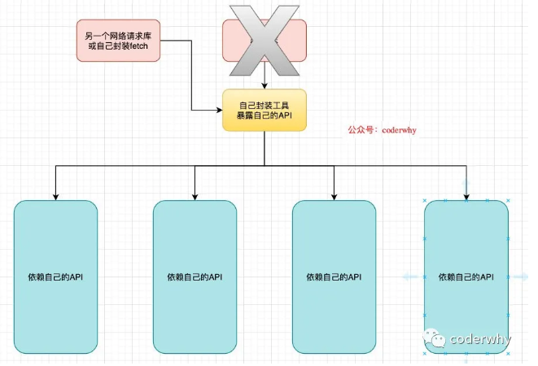

### 1.为什么封装

为什么我们要对axios进行二次封装呢？

- 明明可以直接使用axios开发；
- 假如有n多处直接依赖axios，有一天axios不再维护，那将要修改n多处的代码，非常麻烦。
- 这种情况可以对网络请求进行二次封装。
- 只暴露自己封装的API

自己封装，只暴露自己的API：



### 2.2. axios二次封装

创建一个service文件夹（其他名字都可以），用于存放所有的网络请求相关的内容。

创建文件config.js，用于存放一些配置信息：

```js
exportconst TIMEOUT = 5000;

const devBaseURL = "https://httpbin.org";
const proBaseURL = "https://production.org";
console.log(process.env.NODE_ENV);
exportconst baseURL = process.env.NODE_ENV === 'development' ? devBaseURL: proBaseURL;
```

创建request.js，用于封装请求对象：

```js
import axios from'axios';

import {
  TIMEOUT,
  baseURL
 } from"./config";

const instance = axios.create({
  timeout: TIMEOUT,
  baseURL: baseURL
})

axios.interceptors.request.use(config => {
  // 1.发送网络请求时，在页面中添加一个loading组件作为动画；

  // 2.某些网络请求要求用户必须登录，可以在请求中判断是否携带了token，没有携带token直接跳转到login页面；

  // 3.对某些请求参数进行序列化；
  return config;
}, err => {
  return err;
})

instance.interceptors.response.use(response => {
  return response.data;
}, err => {
  if (err && err.response) {
    switch (err.response.status) {
      case400:
        err.message = "请求错误";
        break;
      case401:
        err.message = "未授权访问";
        break;
    }
  }
  return err;
})

exportdefault instance;

```

使用测试：

```js
request({
  url: "/get",
  params: {
    name: "why",
    age: 18
  }
}).then(console.log).catch(console.error);

request({
  url: "/post",
  method: "post",
  data: {
    name: "kobe",
    age: 40
  }
}).then(console.log).catch(console.error);
```


 

