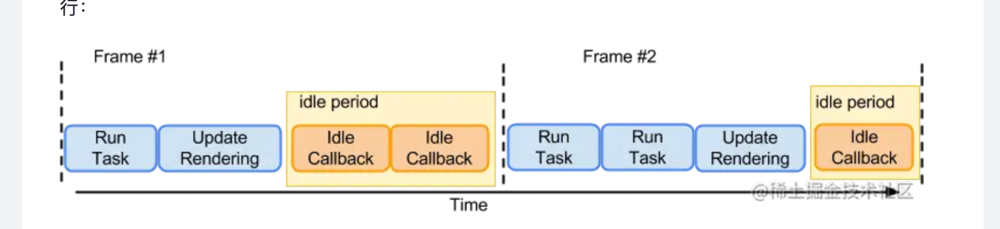

### 1.语法介绍

- [MDN](https://developer.mozilla.org/zh-CN/docs/Web/API/Window/requestIdleCallback)
- **`requestIdleCallback`**传入一个函数，当浏览器空闲的时候，传入的函数被调用
- 作用：可以使开发者能在事件循环中持续执行低优先级事件(fiber更新比较，提交)
- const handle = requestIdleCallback(callback, options)
  - 两个参数，第一个回调函数，第二个timeout，如果有正值而回调在 timeout 毫秒过后还没有被调用，那么回调任务将放入事件循环中排队。
  - handle是返回的一个ID，cancelIdleCallback(handle)可以取消事件

```
requestIdleCallback((deadline) => {
    console.log(deadline)
}, {timeout: 1000})

```

### 2.查看当前剩余多少时间

- 其中 9 表示返回的 ID，35.6 表示预估的剩余毫秒数

```
requestIdleCallback((deadline) => {
    console.log(deadline.timeRemaining())
}, {timeout: 1000})
```

### 3.执行时机

- [W3c`requestIdleCallback`规范](https://www.w3.org/TR/requestidlecallback/)

- 在完成一帧中的输入处理、渲染和合成之后，线程会进入空闲时期（idle period）
- 直到下一帧开始，或者队列中的任务被激活，又或者收到新的用户输入。requestIdleCallback就是在这段空闲时间执行



- 空闲时间出现的时机
  - 动画（active animations）和屏幕刷新（screen updates）中频繁出现：一般留下来的空闲时间都比较短，60HZ设备下，小于16ms
  - 屏幕没有刷新会有大量空闲时间：但是为了不可预知的任务留下充足时间，比如用户输入，否则会产生延迟感，空闲时间最长为50ms，如果50ms空闲时间结束后，会开启一下个50ms的空闲时间

### 4.总结

- 屏幕有刷新/更新，浏览器会计算出当前剩余空闲时间：时间充足，会执行requestIdleCallback。
- 如果没有刷新/更新，浏览器会安排最长连续为50ms的空闲时间
- 为什么是50ms：
  - 因为100ms内用户操作的响应会被认为是瞬时的
  - 空闲时间50ms，任然有50ms给用户响应操作，会不让用户感觉到有延迟
- 因为最大空余时间是50ms，所以每秒最多执行20次？

### 5.避免操作DOM

- 适合用于执行低优先级任务，比如 你不希望某个数据统计的大量计算，阻碍了代码执行，就可以放在requestIdleCallback执行
- **特别注意** ：
  - 避免空闲时间操作DOM，空闲执行回调的时候，当前帧已经结束绘制了，所有布局的更新计算也都完成了
  - 如果空闲时间改变布局，可能会强制停止浏览器并重新计算，这是完全没必要的
  - 如果需要改变DOM，应该使用requestAnimationFrame