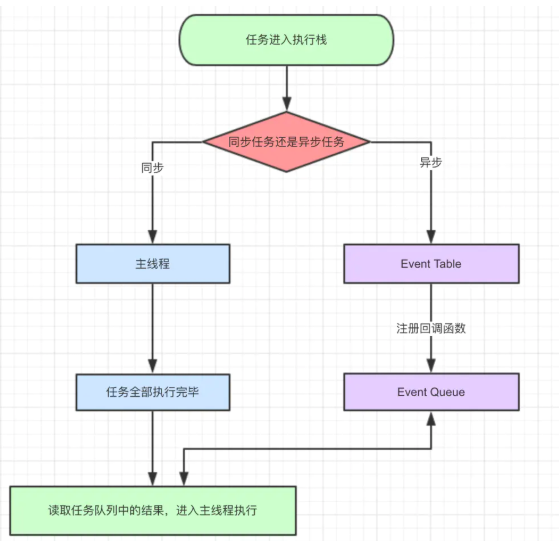
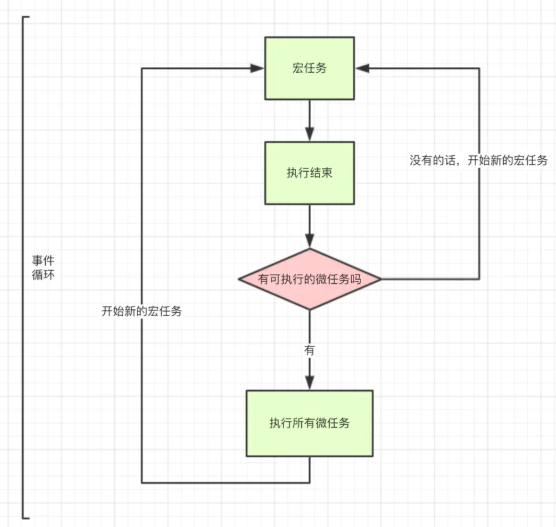

### 一、JavaScript是单线程

JavaScript是一门单线程语言，因为JavaScript用于操作DOM，假如这里要增加节点，那里有要删除节点，就不知道该听谁的了。

### 二、JavaScript事件循环

JavaScript是单线程的，说明他在一个时间点就只能做一件事情，那么问题来了，它按什么顺序执行的的呢？万一某行代码耗时过长阻塞运行了呢？因此，我们任务将任务分为两类：

- 同步任务
- 异步任务

打开网页的时候，网页渲染就是一大堆同步任务，如渲染骨架和页面元素。而加载音乐，图片之类需要耗时的任务就是异步任务。

- 同步任务和异步任务进入不同的场所，同步任务进入主线程，异步任务进入Event Table并注册回调函数
- 当指定任务完成后，Event Table会将这个函数移入Event Queue
- 主线程任务执行完毕为空，去Event Queue读取对应的函数，进入主线程执行
- 上述过程不断重复，称为Event Loop

### 三、宏任务、微任务

除了广义上的同步任务，异步任务外，还细分了宏任务，微任务

- 宏任务：整体script，setTimeout，setInterval
- 微任务： Promise，process.nextTick ，.then

- 整体代码作为宏任务，进入主线程
- 遇到其他宏任务的话，(setTimeout...)分发到宏任务队列
- 遇到微任务，分发到微任务队列
- 再把本轮的微任务队列里面的微任务执行完，去读取宏任务队列里面的任务，进行下一轮循环