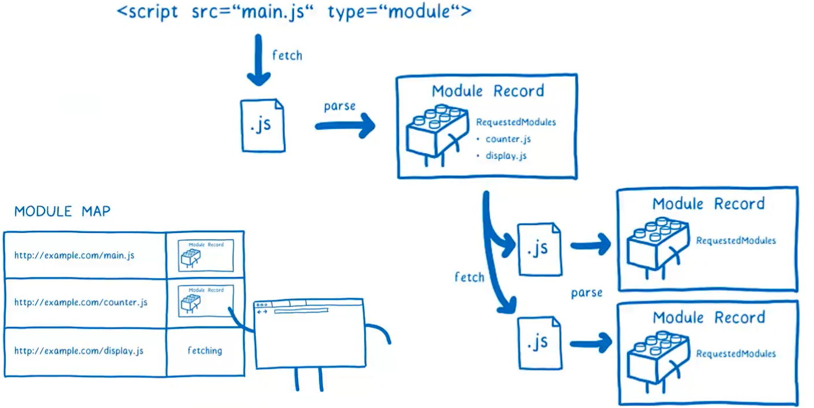
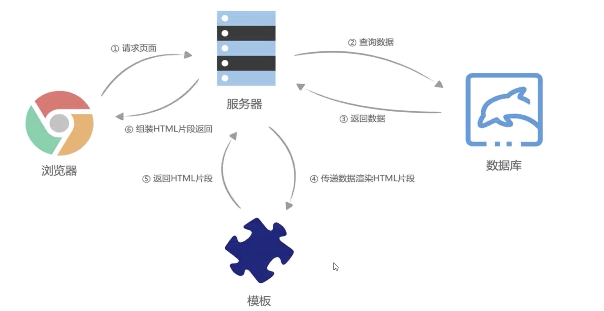
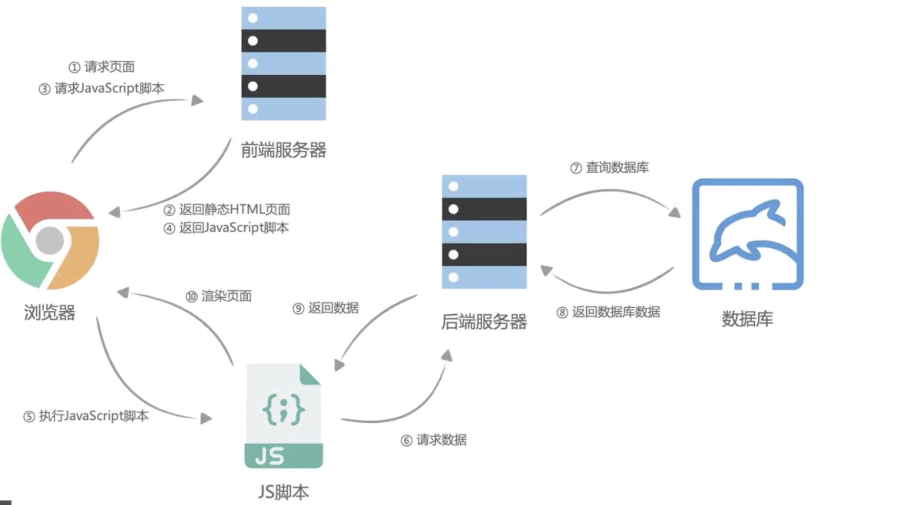

## 一、JS函数式编程

### 1.1理解JavaScript纯函数

- 纯函数是函数式编程中有一个非常重要的概念，JS符合函数式编程的范式，所以也有纯函数的概念
  - 在React开发中纯函数的应用场景非常多
  - 比如React组件就被要求像是一个纯函数（不想你去修改传过来的props，为啥是像，因为有class组件），redux中还有一个reducer的概念，也是要求必须是一个纯函数
  - 所以学习掌握纯函数对于理解很多框架设计是非常有帮助的
- 维基百科对于纯函数的定义：
  - 在此函数在**相同的输入值**时，需要产生**相同的输出**
  - 函数的输出和输入值以外的其他隐藏信息或者状态无关，也和由I/O设备产生的外部输出无关。
  - 该函数不能有语义上可观察的函数**副作用**，如“触发事件”，做一些没有定义的操作，比如点击了一次浏览器。

#### **副作用的理解**

- 副作用本身是一个医学的概念，吃药时解决了身上的痛点，就可能产生了副作用
- 在计算机科学中，也引入了副作用的概念，表示在执行一个函数时，除了返回值以外，还对调用函数产生了附加影响

#### 纯函数的例子

- slice就是一个纯函数，不会操作源函数，且返回一个新数组（splice不是，会操作源数组，且返回新数组）

```js
const names = ['aaa', 'bbb', 'ccc', 'ddd'];
// slice每次都是一样的
const newNames = names.slice(0, 2);
const newNames = names.slice(0, 2);
const newNames = names.slice(0, 2);

// splice每次就不一样，
```


```js
// 纯函数
function bar(num1, num2) {
	return num1 + num2;
}

// 纯函数
function bbc(info) {
	return {
    ...info,
    age: 100
  }
}

// 非纯函数
var name = 'qmj'
function foo() {
	name = 'xxx'
}

// 涉及到参数修改也是非纯函数
function baz(info) {
	info.age = 100;
}
baz({name: 'qmj', age: 18  })
```

#### 纯函数的优势

- 可以安心的编写和安心的使用
- 编写的时候保证了函数的纯度，只是单纯的实现自己的业务逻辑就行，不需要关心传入的内容是如何获得的或者依赖其他的外部变量是否已经发生了修改。
- 在用的时候，你确定你的内容不会被任意修改，并且自己确定的输入，一定有确定的输出


### 1.2JavaScript函数柯里化

- 柯里化也是函数式编程的重要概念
- 维基百科：
  - 在计算机科学中，柯里化（Currying）
  - 是把接收多个参数的函数，变成接受一个单一参数（最初函数的第一个参数）的函数，并且返回接收余下的参数，而且返回结果的新函数的技术。
  - **如果你固定某些参数，你将得到接收余下参数的一个函数**
- 总结：
  - 只传递给函数一部分参数来调用它，让他返回一个函数去调用处理剩余的参数
  - 这个过程就叫柯里化

#### 柯里化的过程和结构

```js
// 源函数
function foo(a, b, c, d) {
  return a + b + c + c;
}

// 柯里化过程
function bar(a) {
  return function(b) {
    return function(c) {
      return function(d) {
        return a + b + c + d;
			}
    }
	}
}
```

#### 简化柯里化

```js
// 方式一：箭头函数，本质上和上面的是一样的
const sum1 = x => y => z=> {
  return x + y + z
}
const sum1 = x => y => z=> x + y + z
```

### 1.3柯里化的作用

#### 让函数的职责单一

- 在函数式编程里面，希望一个函数处理的问题尽可能单一，而不是将一大推的处理过程交给一个函数去处理
- 我们是否就可以将每次传入的参数在单一的函数中进行处理，处理完后在下一个函数中再使用处理后的结果

#### 逻辑复用

- 场景一：比如需要对5和很多数进行相加

```js
function makeAdder(count) {
	return function(num) {
		return num + count;
  }
}

var adder5 = makeAdder(5);
adder5(10) // 15
adder5(20) // 25
adder5(30) // 35 
```

- 场景二：打印日志

```js
function log(data, type, message) {
  console.log(`[${data.getHours()}:${data.getMinutes()}][${type}]: [${message}]`)
}

log(new Date(), 'DEBUG', '控制台错误')
log(new Date(), 'DEBUG', '未校验')
log(new Date(), 'DEBUG', '查询数据错误')

// 上面的代码每次都需要传入相同的参数，很麻烦，不优雅

// 优雅的写法
const curryingLog = data => type => message => {
  console.log(`[${data.getHours()}:${data.getMinutes()}][${type}]: [${message}]`);
}

const messageCurrying = curryingLog(new Date())('DEBUG');
const logMessage1 = messageCurrying('代码Bug')
const logMessage2 = messageCurrying('cssBUG')
const logMessage3 = messageCurrying('语法错误')
console.log(logMessage1, logMessage2, logMessage3)

// 逻辑得到复用，且代码非常优雅
```

### 1.4柯里化函数的实现

- 上面几个函数都是在手动的去柯里化
- 现在希望有一个函数帮我们自动的去转换，直接返回的函数就是柯里化后的函数

```js
function Currying(fn) {
	return function curried(...args) {
    if(fn.length <= args.length) {
      return fn.apply(this, args)
    } else {
      function curried2(...args2) {
        return curried.apply(this, [...args, ...args2])
      }
      return curried2
    }
	}
}
```

#### 柯里化的例子

- vue中的渲染器
- redux的redux-thunk的实现原理

### 1.5组合函数

- 组合（Compose）函数是在JavaScript开发过程中对一种函数的使用技巧、模式
  - 比如我们现在需要对某一个数据进行函数的调用，执行两个函数fn1和fn2，这两个函数是依次执行的
  - 那么如果每次我们都需要进行两个函数的调用，操作上就会显得重复
  - 是否可以将这两个函数组合起来，自动依次调用呢？
  - 这个过程就是对函数的组合，我们称之为组合函数（Compose Function）

#### 举个例子

- 简单实现两个函数的组合

```js
function double(num) {
   return num * 2
}

function square(num) {
  return num ** 2
}

// 不组合
const res = square(double(10)); // 400

// 组合
function composeFn(m, n) {
  return function(count) {
    return n(m(count))
  }
}

const newFn = composeFn(double, square)
console.log(newFn(10))
```

- 实现通用函数组合

```js
function Compose(fns) {
  // 处理传入的不是函数，抛出异常
  let length = fns.length;

  function compose(...args) {
    let index = 0;
    let result = length ? fns[index].apply(this, args) : args;
    while (+index < length) {
      result = fns[index].call(this, result)
    }
    return result;
  }
  return compose;
} 
```

## 二、JSON

### 2.1JSON概述

#### JSON由来

- 在目前开发中，JSON是一种非常重要的数据格式，不是编程语言，而是一种可以在服务器和客户端之间传输的数据格式
- JSON全称是（JavaScript Object Notation）（JavaScript对象符号）：
  - JSON是一种轻量级资料交换格式，属于JS的子集
  - JSON提出来的时候主要应用于JavaScript中，但目前已独立于编程语言，可以在各个语言中使用
  - 很多编程语言都实现了将JSON转成对应模型的方式
- 其他传输格式
  - XML：在早期网络传输中主要使用XML进行数据交换，但格式解析，传输方面都不如JSON，所以目前很少用了
  - Protobuf：目前使用的越来越多传输格式是protobuf，但是直到2021年才支持JS，所以前端中用的很少。
- 目前JSON被使用的场景越来越多
  - 网络中传输的JSON数据
  - 项目中的配置文件
  - 非关系型数据库将json作为存储格式

### 2.2JSON序列化

- 某些情况下我们希望将JavaScript中的复杂类型转换成JSON格式的字符串，方便对其处理
  - 比如我们希望将一个对象保存在localStorage中
  - 但是我们直接存放一个对象，就直接被转化成[object Object]格式的字符串， 并不是我们想要的结果

```js
const obj = {
  name: "qmj",
  age: 18
}

localStorage.setItem("obj", obj) // [object Object]

// 正确用法，将对象转为字符串
const objString = JSON.stringify(obj)

// 将字符串转换为对象
const info = JSON.parse(objString);
```

#### JSON.stringify一些细节

- 不传第二个参数是直接转化的，但JSON.stringify是有第二个参数的，还有第3个参数

```js
const obj = {
  name: "qmj",
  age: 18,
  height: 1.88
}
// 1.第二个参数：传入数组，设定哪些需要转化
const objString = JSON.stringify(obj, ["name", "age"]);  // 这样只会转化name和age两个字段

// 2.第二个参数：传入回调函数
const objString1 = JSON.stringify(obj, (key, value) => {
  if(key === 'age') {
    return value + 1
  } else {
    return value
	}
});
// objString1的年龄就变成虚岁了

// 3.第三个参数，space
const objString2 = JSON.stringify(obj, null, 2)  // 被格式化，会换行，且缩进2个空格
```

####  JSON.parse的一些细节

- 也有第二个参数

```js
// 第二参数为回调函数
const obj1 = JSON.parse(objString, (key, value) => {
  if(key === 'age') {
    return value - 1
  } 
  return value
});

// 
```

## 三、浏览器存储方案

### 3.1Storage

- WebStorage主要提供了一种机制，可以让浏览器提供一种比cookie更直观的key、value存储方式
  - localStorage：本地存储，提供的是一种永久存储方法，关闭网页再进来还是会保存状态
  - sessionStorage：回话存储，关闭页面再进来就没有了。

## 四、ES6的类

### 1.类的定义方式

```js
// 类的声明
class Person {
  
}
function Person {
  
}
// 类的表达式
const Animal = class {
  
}
const Animal = Function() {
  
}
```

#### ES6类的特点

- `typeof Persion`是function
- 有原型，原型上也有constructor
- 是个语法糖，本质上做的事情就是和函数类一样

### 2.Class的构造函数

函数类是可以直接传递参数的，因为是个函数，但是class怎么传递参数？

- class里面有专属的constructor函数去接收参数
- 一个类只有一个构造函数

```js
class Person {
  constructor(name, age) {
    this.name = name;
    this.age = age;
  }
}
let p1 = new Person("qmj", 18 )
// new 之后做的事情
1.在内存中创建一个对象
2.将类的原型prototype赋值给创建出来的对象 moni.__proto__ = Person.prototype
3.将对象赋值给函数的this
4.执行函数体中的代码
5.自动返回创建出来的对象
```

### 3.Class类的方法定义

**普通方法**：通过实例去调用

**访问器**：供外部访问，修改属性

**静态方法**：不用通过实例去调用，直接使用类名去调用就可以

```js
class Person {
  constructor(name, age) {
    this.name = name;
    this.age = age;
  }
// 普通方法  
  running() {
    
  }
  
// 访问器
  get name() {
    return this.name;
  }
  
  set name(newName) {
		this.name = newName
  }
}

// 静态方法
	static createPerson() {
    
  }
```

### 4.类的继承

使用**extends**关键字即可

JS引擎在解析子类的时候有要求，如果有实现继承，那么子类的构造方法中，在使用this之前就需要super  

子类传参多于父类，就需要使用**super**关键字

```js
class Person {
  constructor(name, age) {
    this.name = name;
    this.age = age;
  }
}
// 错误的继承
class Student extends Person {
  constructor(name, age, sno) {
    this.name = name;  // 这样的话会报错
    this.age = age;
  }
}
// 正确的继承
class Student extends Person {
  constructor(name, age, sno) {
    super(name, age)
 		this.sno = sno;
  }
}
```

#### 方法可以被重写

- 包括静态方法 
- 也可以通过super.xxx复用父类的逻辑

## 五、Promise

### 1.promise的起源

- 之前写异步代码的时候，要么就是自己去封装request函数，要自己去设计回调函数、回调函数名称、回调函数的使用

- 要么就是使用第三方，按照别人的规范去写，设计也是不同的，必须看源码或者文档

- 更好的方案就是promise，给调用者一个承诺，规范了所有编写代码的逻辑

  - 给出回调数据时，就可以创建一个Promise对象
  - 通过new创建Promise对象时，我们需要传入一个回调函数，称之为executor
    - 这个回调函数立即执行，并且给传入另外两个回调函数resolve和reject
    - 调用resolve时，会执行Promise对象的then方法传入的回调函数
    - 调reject回调函数时，会执行Promisecatch方法传入的回调函数

  **什么是promise**

  - 就是一种机制，让你规范的编写异步代码
  - 写起来到处都是回调，规定了成功、失败会执行哪些回调，这就是一种规范

  

  

  ### 2.promise基本使用

  ```js
  // 下面new Promise(fn)fn就是executor，会立即执行
  const primise = new Promise(() => {
    console.log("这里会被立即执行");
  });
  // executor也有两个参数resolve成功回调，reject失败回调
  const primise = new Promise((resolve, reject) => {
    console.log("这里会被立即执行");
  });
  ```

  **例子**

  ```js
  function getData() {
    return new Promise((resolve, reject) => {
      // 这里面写请求的代码
      if ("成功") {
        resolve("success");
      } else {
        reject();
      }
    });
  }
  const promise = getData();
  promise.then((res) => {
    console.log("成功了", res);
  });
  ```

  

## 六、生成器和迭代器

### 1.什么是迭代器？

::: tip 迭代器

迭代器本身是一个对象，它可以帮助我们对某个数据接口进行遍历。在JS中，迭代器也是一个具体的对象，其必须要符合迭代器协议：1.迭代器协议定义产生一些列值的方式；2.在JS中这个标准就是一个特定的next方法；

:::

## 七、模块化

::: tip 什么是模块化

1.模块化开发最终目的是将程序划分成一个个的小结构（表现就是一个个文件）

2.这个结构中编写属于自己的逻辑代码，有自己的作用域，不会影响到其他结构

3.这个结构可以将自己希望暴露的变量、函数、对象等导出给其它结构使用

4.也可以通过某种方式，导入另外结构中的变量、函数、对象等

:::

### 1.没有模块化带来的问题

- 多个JS之间没有自己的作用域，造成命名冲突（早期通过自执行函数来解决）

### 2.CommonJS规范和Node关系

- CommonJS是一个规范，而Node实现了这个规范

#### **CommonJS使用**

- 使用方式很简单：

```js
// index.js
const name = "qmj";
const foo = (name) => {
  console.log("my name is", name);
};

module.exports = {
  name,
  foo,
};

// qmj.js
const { name, foo } = require("./index");

console.log(foo(name));
```

#### **CommonJS原理**

- 需要明确的是：
  - index.js文件通过module.exports关键字导出了一个对象（module.exports=originObject）
  - 然后qmj.js文件通过require函数（参数为路径）得到了一个对象（const object = require(path)）
- 那么其实可以推理：
  - 通过require函数，传入唯一的路劲可以把对应的module.exports返回
  - 那么就可以得到 object = module.exports = originObject
  - 这3个东西其实都是一个东西
- 验证：
  - 在qmj.js中改变info的信息，然后通过定时器延迟在index.js获取info的内容，发现被改变了

#### **exports**

- 使用：
  - 发现还有另外一种导入方式，会感觉很奇怪

```js
// index.js
const name = "qmj";
const age = 18;

exports.name = name;
exports.age = age;

// qmj.js
const { name, age } = require("./index");

console.log(name, age);
```

- 关于这一块的源码
  - 所以exports和module.exports和{}都是等价的
  - exports就相当于拿到这个对象往里面塞属性
  - 所以最终导出的依然是module.exports

```js
module.exports = {};
exports = module.exports;
```

- 需要注意的点
  - exports = { name, age }这样导出一定是不行的
  - 因为我们最终导出的一定是module.exports
  - exports直接等于一个对象就相当于重新给exports赋值了，并不会影响到module.exports

#### **exports存在的意义（了解）**

- 因为exports导出才真正符合CommonJS规范
- 只是在node中另外实现了module.exports
- 大家习惯于后者，慢慢抛弃了exports

#### require(x)查找规则

- 情况一：X是一个核心模块（path、http之类的）
  - 直接返回核心模块，并停止查找
- 情况二：x是路径
  - 文件x => x.js => x.json => x.node
- 情况三：x不是路径也不是核心模块
  - 回去当前文件夹下的node_modules => 上层....直到根目录的node_modules

#### **模块的加载过程**

- 结论一：模块在第一次被引入时，模块的js代码会被执行一次
- 结论二：模块被多次引入时，会缓存，最终只加载（运行）一次
  - 因为每个模块对象都有一个属性：loaded
  - 只要被加载过了，就会把它设置未true
- 结论三：循环引用
  - 这样就行程了一个图结构（图的遍历就有DFS和BFS）
  - node就是使用深度优先

#### CommonJS缺点

- 缺点一：加载模块是同步的
  - 同步意味着只有等到对应的模块加载完毕，当前模块中的内容才能被运行
  - 这个在服务器（node中，服务端）没什么问题，因为服务器加载的js文件都是本地的，速度很快
  - 但是在前端就会涉及到引入服务端的js，那样就非常不友好

### 3.ESModule（重点）

- 和CommonJS不同点
  - 使用import和export
  - 采用编译期的静态分析，并且也加入了动态引入的方式

#### ESModule基本使用

- 如果是直接导入的话不能直接支持，需要在script标签加上type属性，值为module
- 导入的文件名还需要加上后缀名

### 4.ESModule原理

#### 主要流程

- 阶段一：构建，找到下载地址（这也就是为什么html需要启动服务才可以下载，本地就不行file:///下载不了），下载下来，将其解析成模块记录（Module Record）
  - 模块记录：一个js文件对应一个Module Record
- 阶段二：实例化，对模块进行实例化，并且分配内存空间，解析模块的导入和导出语句，把模块指向对应的内存地址
- 阶段三：运行，运行代码，计算值，并且将值填充到内存地址中
  - 为什么还需要运算呢，是因为阶段二之后，会导出属性，但是对应的属性都为undefined
  - 实例化的时候，内部代码只执行关键字的部分，比如只执行import和export，其他如const name = 'qmj'不会执行
  - 阶段三就是将数据具体对应的值计算出来并赋值给他

#### 构建

 

- 首先读取到type=“module”，就会开始下载这个main.js
- 然后对其进行静态分析，静态分析只会执行import之类的语句，其他不执行
- 静态分析之后会生成Module Record的数据结构，里面会有RequestModules字段，代表有哪些js还需要下载，上图就是还需要下载counter.js和display.js
- 然后将这两个js都下载下来

**问题**

- 多个文件导入同一个js会多次下载吗？
  - 不会，每次下载之后会有一个Module Map的数据结构，url和Record对应起来了

## 八、网络请求

### 8.1服务端渲染

- 早期页面都是通过后端渲染来完成的，也就是SSR
  - 客户端发起请求=>服务端收到请求生成HTML=>页面刷新=>客户端加载新HTML
- 弊端：
  - 这些数据库操作，查数据等前端开发不熟悉也不专业，基本就由后端自己开发
  - 只要是请求数据导致DOM结构发生变化，整个html是重新渲染的，带宽开销增大，而且浏览器性能不好
  - 而且也违背了程序员的“DRY”（Don't Repaet Yourself）原则
  - 业务是越来越复杂，后端即开发网页又开发服务端，工作量巨大
  - Ajax出来之后，可以只想服务端请求新数据去动态替换文档，而不需要刷新整个文档，慢慢出现了前后端分离



### 8.2前后端分离

- 标题，内容啥的都不能写死了，html文件基本就只有一个壳子+css文件+js文件
- js去请求数据，服务端返回，然后拿着这个数据进行渲染
- Ajax最吸引人的就是异步特性（不阻塞JS执行），不重新刷新页面就可以与服务端通信，交换数据，更新页面



### 8.3HTTP请求

- HTTP请求头有很多重要的信息
- `content-type` : 请求携带的数据类型
  - `application/json` ：表示json类型
  - `text/plain`: 表示文件类型
  - `multipart/form-data` : 表示上传文件
- `content-length` : 文件大小长度，自动计算
- `keep-alive` : 
  - Http1.0 要手动开启
  - http1.1默认开启，不同浏览器不同连接时长，node是5s
- `accept-coding` : 告诉服务器接受的压缩格式，比如js可以用gzip
- `accept` : 告诉服务器接受返回数据的格式

### 8.4 XHR发送请求


