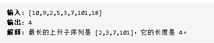
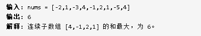
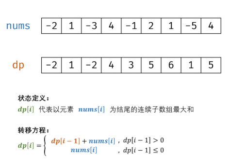
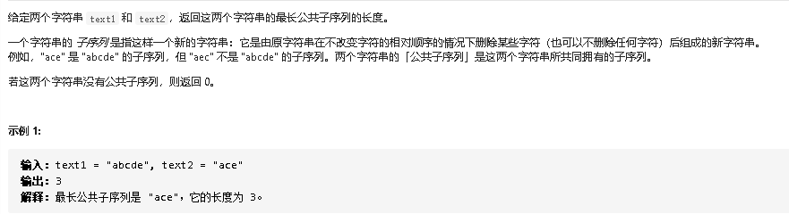

## 一、动态规划的解题模板

- 定义状态
- 设置初始值
- 确定状态转移方程 

## 二、动态规划刷题

### 2.1.LeetCode300最长上升子序列

题目描述：



解题思路：

- base case是传进来的数组长度为0和1的时候
- 设定dp数组长度为nums的长度，初始值都为1
- 通过循环记录每个dp[i]对应的值，dp[i]的值是上一个dp[j]最大值+1和dp[i]本身的最大值
- 遍历dp[i]，返回最大dp[i]

完整代码：

```javascript
var lengthOfLIS = function (nums) {
  let len = nums.length
  // base case
  if (len === 0) return 0
  if (len === 1) return 1
  let dp = Array(len).fill(1)
  for (let i = 0; i < len; i++) {
    for (let j = 0; j < i; j++) {
      if (nums[i] > nums[j]) {
        dp[i] = Math.max(dp[i], dp[j] + 1)
      }
    }
  }
  let maxLength = 0
  for(let i =0;i<dp.length;i++) {
    maxLength = Math.max(maxLength,dp[i])
  }
  return maxLength;
};
```

### 2.2. 剑指Offer42

题目描述：



解题思路：

- 分别计算出以nums[i]结尾的连续数组最大和
- 在循环的过程中,dp[i-1]>0,则dp[i] = nums[i] + dp[i-1]
- dp[i-1]<=0,则 dp[i] = nums[i]
- 在找出dp数组中最大值即可



代码：

```javascript
var maxSubArray = function(nums) {
  let dp = []
  dp[0] = nums[0]
  let max = nums[0];
  if(nums.length === 1) return nums[0]
  for(let i =1;i<nums.length;i++) {
      if(dp[i-1]>=0) {
          dp[i] = nums[i] + dp[i-1]
      }else {
        dp[i] = nums[i]
      }
      max = Math.max(max,dp[i])
  }
  return max
};
```

优化：

- 其实最后一个值只需要知道前面一个值就行，不需要数组将前面所有值存储起来

```js
var maxSubArray = function(nums) {
  let prev = nums[0]
  let max = prev
  if(nums.length ===1) {
    return nums[0]
  }
  for(let i =1;i<nums.length;i++) {
    if(prev<0) {
      prev = nums[i]
    }else {
      prev = prev + nums[i]
    }
    max = Math.max(max,prev)
  }
  return max
};
```


### 2.3 Leetcode322 找零钱

假设有25、20、5、1分的硬币，现要找客户41分，怎样才能最少硬币数？


#### 思路一：

- 假设dp(n)是凑到n分序号的最少硬币个数。
- 第一次选择了25，那么dp(n) = dp(n-25) +1
- 第一次选择了20，那么dp(n) = dp(n-20) +1
- 第一次选择了5，那么dp(n) = dp(n-5) +1
- 第一次选择了1，那么dp(n) = dp(n-1) +1

所以dp(n) = min{dp(n-25), dp(n-20), dp(n-5), dp(n-1)} + 1

#### 缺点：

- 和斐波那契数列一样存在重复运算
- 属于暴力递归（自顶向下，存在重叠)
- 在大问题中调用小问题

例如：

- coins(6)

```
coins(6) = coins(1) +coins(5)
```


#### 优化：

- 通过记忆化搜索（求解过的值存起来，存于数组）
- 递推（自底向上）

```js
// 递推，自底向上
function changeMoney2(n) {
  if (n < 1) return -1;
  let dp = [];
  dp[0] = 0;
  for (let i = 1; i <= n; i++) {
    let min = Number.MAX_VALUE;
    if(i >= 1) min = Math.min(dp[i-1],min);
    if(i >= 5) min = Math.min(dp[i-5],min);
    if(i >= 20) min = Math.min(dp[i-20],min);
    if(i >= 25) min = Math.min(dp[i-25],min);
    dp[i] = min + 1;
  }
  return dp[n];
}
```

#### 思考题：想拿到币种？

- 每次拿到min时就记录下该币种

- 先拿到凑够n个币所需的最后一枚cions[n];
- 倒数第二枚为cions[n-cions[n]];

```js
function changeMoney3(n) {
  if (n < 1) return -1;
  let coins = [];
  let dp = [];
  dp[0] = 0;
  for (let i = 1; i <= n; i++) {
    let min = Number.MAX_VALUE;
    if (i >= 1 && dp[i - 1] < min) {
      min = dp[i - 1];
      coins[i] = 1;
    }
    if (i >= 5 && dp[i - 5] < min) {
      min = dp[i - 5];
      coins[i] = 5;
    }
    if (i >= 20 && dp[i - 20] < min) {
      min = dp[i - 20];
      coins[i] = 20;
    }
    if (i >= 25 && dp[i - 25] < min) {
      min = dp[i - 25];
      coins[i] = 25;
    }
    dp[i] = min + 1;
  }
  let res = [];
  res[0] = dp[n];
  while (n>0) {
    res.push(coins[n])
    n -= coins[n];
  }
  return res;
}
```

### 2.4最长公共子序列



1.dp(i,j)含义：

- dp(i,j)是text1和text2前面i，j的最长公共子序列个数。

2.初始状态

dp(i,0) 和 dp(0,j)初始值均为0、

3.状态转移方程

text1[i-1] = nums[j-1] 那么 dp(i,j) = dp(i-1,j-1) + 1

text1[i-1] != nums[j-1] 那么 dp(i,j) = max{dp(i-1,j),dp(i,j-1)}

```js
var longestCommonSubsequence1 = function(text1, text2) {
  if(text1.length===0 || text2.length === 0) return 0;
  let dp = new Array();
  for(let i = 0;i<=text1.length;i++) {
    dp[i] = new Array()
    for(let j = 0;j<=text2.length;j++) {
      dp[i][j] = 0;
    }
  }

  for(let i = 1;i<=text1.length;i++) {
    for(let j = 1;j<=text2.length;j++) {
      if(text1[i-1] === text2[j-1]) {
        dp[i][j] = dp[i-1][j-1]+1
      }else {
        dp[i][j] = Math.max(dp[i][j-1],dp[i-1][j])
      }
    }
  }
  return dp[text1.length][text2.length]
};
```


### 2.5最长公共子串


