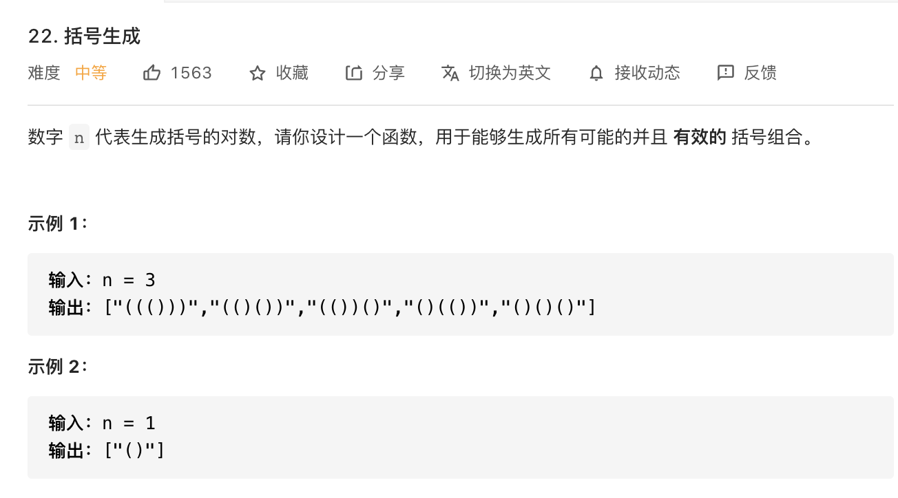

### 1.回溯的代码框架

```js
result = []
def backtrack(路径, 选择列表):
    if 满足结束条件:
        result.add(路径)
        return
    
    for 选择 in 选择列表:
        做选择
        backtrack(路径, 选择列表)
        撤销选择
```

### 2.例题

#### 1.括号生成



**思路**

1. 定义结果数组，定义递归函数。

**代码**

```js
var generateParenthesis = function(n) {
    let res = [];
    const dfs = (left, right, str) => {
        if(str.length === n*2){
            res.push(str);
            return;
        }
        if(left>0){
            dfs(left-1,right,str+'(');
        }
        if(left<right){
            dfs(left,right-1,str+')');
        }
    }
    dfs(n,n,'');
    return res;
};
```

