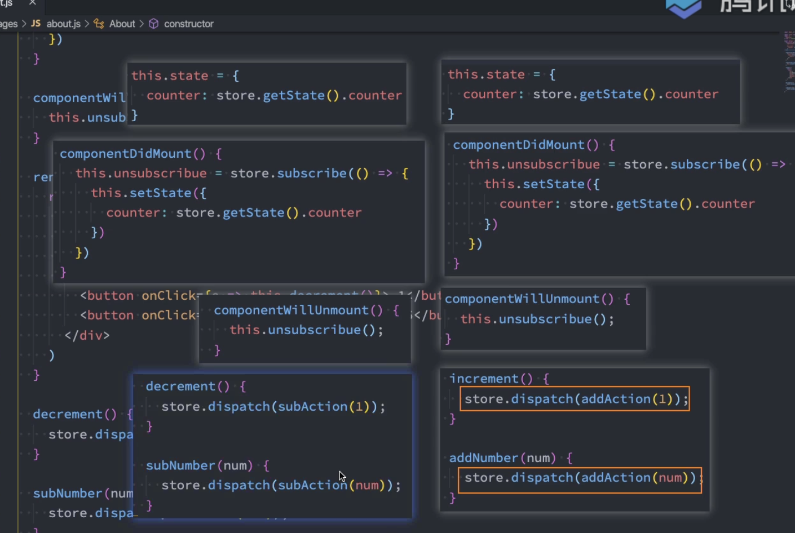

### 1.React中的keys作用？

```
作用：Keys是React中用于追踪列表中元素的增、删、改时的辅助标识

具体：
	key是列表子元素的唯一标识符，新的组件可能对这个列表进行了
	增加，删除，重新排列子元素的操作，有了key的话，新旧组件对比
	到相同的key，就可以避免节点不必要的删除与创建操作，时节点的
	复用性提高，达到了提高性能的目的
	
	key 相同，但属性不同，只会更新属性；
	key不同，则会销毁组件，重新创建新组件
	
1.首先key是ReactElement的一个属性，默认是null，如果外界传值会把值转为字符串
2.packages/react/src/ReactElement.js 源码中有校验key的操作，对于单一元素，没有key，也不会报错
3.在fiber的数据结构中，也有key，默认null，外界有传入就是string
4.在React的diff算法中，key的作用是判断该节点是否可以复用，提高性能
5.多节点diff的时候，会优先去处理更新操作，会去遍历节点，然后调用updateSlot去diff新旧fiber，生成一个新fiber
6.如果生成新fiber为null，说明老fiber不可用，退出这一轮循环
7.如果有新fiber，但是fiber.alternate === null说明不可复用，则需要删除这个老fiber
8.如果遍历完子节点newChildren，则可以把剩下的老fiber都删除了，他们已经没用了
9.如果老fiber遍历完，但是newChildren还没遍历完，说明剩下的新fiber都是新增节点，需要遍历剩下的新newChildren，创建出新fiber
```

```
1.如果是开发环境，会判断当前key是否合法，不过不合法，就会在控制台报错
2.然后会去遍历新newChildren列表，然后和老fiber一起传入updateSlot去生成新fiber，不一定能生成；
	1.updateSlot如果接收到的newChildren是number类型或者string类型：
		1.那就需要直接更新这个文本节点，如果当前老fiber是null，那么直接创建createFiberFromText，TextFiber即可
		2.如果当前的老fiber不为null，那就要用useFiber将老fiber和当前文本组合生成一个新fiber返回即可
	2.如果newChild是一个对象
		1.并且newChild.type是ReactElement的话，如果新旧key不相等，直接返回null，说明需要整个替换
		2.如果新旧key是相等的，需要把新旧节点传进去进行updateElement操作，
			1.如果新节点类型是Fragment，那就需要把老fiber和新节点的children传到updateFragment去更新，如果老fiber是null或者老fiber的类型不是Fragment，那就直接创建fragmentFiber即可
			2.如果新节点的类型不是Fragment，并且oldFiber不是null：
				1.需要对比新旧elementType是否相等，如果是相等，则使用useFiber方法将新旧节点创建出一个新fiber并返回
			3.如果老fiber是null，那就直接使用新节点调用createFiberFromElement，创建出新fiber直接返回
	3.如果newChild是一个数组，说明他是一个列表，就直接创建一个FragmentFiber
3.如果updateSlot生成的新fiber是null，并且老fiber也是null，那直接设置为下一个oldFiber，并且跳出这个循环，进入下一个循环
4.如果生成的newFiber.alternate=null，但是oldFiber是有值的，说明没有复用节点，则直接删除oldFiber
```

### 2.React diff流程？key的作用？

```
packages/react-reconciler/src/ReactChildFiber.js/reconcileChildrenArray
1.React Element的类型，$$typeof: react.element | react.Fragment;  key?: string; type: 标签类型
2.为什么需要diff，因为浏览器操作dom消耗较高，不复用，而且老是操作DOM也不行，最好是收集到一批更新一批，那页面性能就变差
2.React16+为了优化性能，将vDOM转为fiber，将树转为链表去渲染，工作流程是先调和，再提交
	1.调和：就是遍历节点生成新fiber的过程，给新fiber做好标记，过程可中断
	2.提交：根据新fiber的标记，递归批量操作DOM，生成视图
3.我们diff过程就是在调和阶段，第一次渲染是无需diff的，直接将vdom转为fiber提交即可
4.第二次渲染的时候，会产生新的DOM，那这个新DOM就需要和oldFiber做对比，生成新fiber：
	1.可复用就是修改标记，复用不是照搬，而是更新
	2.剩余不可复用打上删除标记
	3.新增的dom就会在newFiber打上新增标记
5.diff也就是调和函数里面有两个for循环去遍历新节点：
	1.第一次遍历，一一对比oldFiber和新节点（vdom），调用updateSlot，去生成newfiber：
		1.updateSlot先判断传进来的节点的是否文本，判断是否number或者string就行，文本节点是没有key，所以需要判断新增还是更新，如果oldFiber==null或者不是文本节点，那需要创建一个textFiber并返回
		2.如果是一个对象，并且是ReactElement，并且key相等，并且element.type也相等，那么就调用useFiber复用起来
		3.如果是一个对象，并且是ReactElement，并且key不相等，那就结束第一个循环了
		4.如果vdom处理完了，那就把老fiber节点删除就行了，
		5.如果vdom还没有处理完（因为不相等key结束for遍历），比如ABCD节点更新为 ACBE节点，A在第一个循环中被复用到了，但是遍历到C的时候，发现老fiber对应的是B，所以生成的newFiber就是null了，然后需要进行第二次遍历，先把剩下的oldFiber存到一个map里面，key作为key，value是fiber
		6.然后遍历剩下的新节点，通过updateFormMap方法，里面去查询map中查找是否有可以复用的，不管差没查到，都进入
		7.类似于updateSlot，先判断是文本节点还是ReactElement节点，文本节点没有key，所以使用index查询，查找到复用，没查找到新建
		8.判断到当前节点是ReactElement节点，使用useFiber复用，并且将oldFiber从map删除，如果还有剩余oldFiber，则都需要删除
6.useFiber复用操作简单：
	1.useFiber内部其实就是根据老fiber和新VDOM去创建一个新fiber，tag，key之类的都是复用，只有props内容使用新VDOM的
	2.本质上就是生成一个新的fiber对象，内容只有30行代码
7.不复用使用createFiberFromElement根据element创建全新fiber的话，它就要调用createFiberFromTypeAndProps创建
	1.创建过程十分复杂，200多行代码
	2.需要判断各种情况，比如你的type是函数还是字符串，还是其他类型等等，开销大
		
```

### 3.Fiber原理

```
1.React是React16引入的特性，大大提高了React页面的性能，可以更好的应用于大型复杂的项目，使用了requestIdleCallback+deadline.timeRemaining() > 1判断当前空余时间是否足够，一直在空闲时间里面不断while循环判断当当前是否需要更新.
2.用nextUnitOfWork（下个工作单元）标记当前是否需要更新，最开始render的时候就是div根节点。
3.如果存在用nextUnitOfWork，并且时间空闲，while循环里面会调用performUnitOfWork去调和（reconcileChildren）组件，并且返回下一个（子节点，兄弟，父亲），到while循环里面继续调和（reconcileChildren），直到performUnitOfWork返回undefined，说明所有节点都遍历过了
4.调和子节点：调和的时候，要对比新旧Fiber是否相同的type，相同说明是更新操作。如果有子节点但是type不同，说明是一个替换或者新增操作，有旧fiber且type不同，则需要将该fiber标记为删除，并且加入删除数组中
5.调和完所有fiber之后，就会进入提交（commit）阶段
	1.首先遍历删除节点数组中的元素，进行commitWork，找到父元素然后将该元素的真实DOM删除：domParent.removeChild(fiber.dom);
	2.然后从根fiber开始，递归调用commitWork，判断是更新/替换/新增操作，然后操作真实DOM
	3.commit阶段不可中断，递归的
6.setState也会生成nextUnitOfWork，触发fiber调和更新，而且会比较新旧DOM
```


### 2.refs的作用

```
作用：安全访问某个元素或者某个组件实例的句柄。
使用场景：媒体播放，文本选择，触发强制动画
```

### 3.React的setState

```
1.在 React 类组件中，为什么修改状态要使用 setState 而不是用 this.state.xxx = xxx?
	- React是需要根据最新的state来重新渲染界面，但是这种修改方式，React并不知道数据发生变化
	- React并没有实现Vue的监听数据变化
	- 我们必须通过setState告诉React数据发生变化
	- 数据确实能发生改变，但是不能重新渲染
2.setState 函数做了哪些事情？
	-	Component.prototype.setState实现的setState
	- this.updater.enqueueSetState(this, partialState, callback, 'setState');
	- setState里面调用了更新器的enqueueSetState
	- 获取当前fiber，根据这个fiber创建一个update对象
	- 然后把这个更新加入到更新队列里面，然后把更新队列里面的
```


### 3.修改了state进行相关的操作

```
1.通过setState的第二个回调函数
2.通过生命周期函数
```

### 4.diff算法说一下

### 5.setState什么时候是同步的，什么时候是异步的？

```
一.同步情况
	1.setTimeout里面是同步的
	2.原生DOM事件(addEventListener)是同步的

二、异步
	1.合成事件
	2.生命周期
```

### 6.哪里可以拿到最近的state值

```
1.生命周期函数componentDidUpdate

2.setState里面的第二个回调参数可以拿到最近的值
```

### 7.多个setState的合并

- 还是1
- 源码内部用了do while循环

```js
  increment() {
    this.setState({
      counter: this.state.counter + 1
    });

    this.setState({
      counter: this.state.counter + 1
    });

    this.setState({
      counter: this.state.counter + 1
    });
  }
```

- 如果想要它累加呢？
- 将第一个参数设置为函数(prevState, props),拿到先前的state

```js
increment() {
  this.setState((prevState, props) => {
    return {
      counter: prevState.counter + 1
    }
  })

  this.setState((prevState, props) => {
    return {
      counter: prevState.counter + 1
    }
  })

  this.setState((prevState, props) => {
    return {
      counter: prevState.counter + 1
    }
  })
  }
```

### 8.父子组件通信/兄弟组件通信

```
Context/eventBus
父传子：props
子传父：props，在父组件创建好函数，传入props中，在子组件里取出来，从而达到使用父组件的state。
兄弟：event bus安装第三方、context Provider提供数据，Consumer里面使用数据
redux
```

### 9.react渲染DOM的原理

```
JSX -> 虚拟DOM -> 真实DOM
1.首先我们一般都使用JSX去写一些DOM，但本质上这是一种语法糖，内部会帮我们做一个转换，将JSX语法转换成
React.createElement(标签，属性，子组件)这个函数。
2.React.createElement：
	这个函数主要做三样事情：
		1.取出config属性
			1.key，ref，source等等
			2.创建一个属性的对象，将每个属性通过for in循环config进行存储至props中
		2.处理children
			1.判断孩子长度是否>1，1的话props.children=children;
			2.>1的话，创建一个数组childrenArray，通过遍历children，将数组赋值，最后props.children=childrenArray
		3.返回ReactElement（虚拟DOM）
```

### 10.React更新流程

```
props/state改变 -> render函数重新执行 -> 产生新的DOM树
-> 新旧DOM树进行diff -> 计算差异进行更新 -> 更新到真实的DOM
```


### 11.React和Vue的差异

```
1.创建组件的方式
	vue通过.vue文件就可以创建一个组件
	react通过js创建类组件(继承Component)和函数组件

2.更新状态不一样
	vue拿到data可以直接进行修改
	react通过setState修改，用新的state替换旧state

3.生命周期
	vue里面有beforeCreate，created ，react没有
	vue没有手动判断组件是否需要更新，react有shouldComponentUpdate

4.组件通信
	vue父传子props，子传父通过emit。react的props则是两者都可以
	跨组件vue用事件总线，react用context
	
5.书写方式
	vue封装了很多指令：v-bind，v-for；react更多的是用原生js，更加纯粹
```

### 12.jsx的本质/虚拟DOM的创建过程

```
jsx 仅仅只是 React.createElement(component, props, ...children) 函数的语法糖。
所有的jsx最终都会被转换成React.createElement的函数调用
```

### 13.useSelector缺点？怎么解决

```
他会使本不该重新渲染的页面发生重新渲染，
第二个参数用shallowEqual，进行浅层比较
```

### 14.为什么使用Redux? Redux更新数据后为什么重新渲染

```
1.redux完美解决了组件之间的通信问题，不然就要通过props传来传去，有redux，每个组件都可以从redux获取最新store数据，也可以修改store里面的数据。
2.数据修改时可以被追踪

重新渲染：
	在componentDidMount订阅了store的变化，且在componentWillUnmount进行取消订阅。
	用connect纯函数实现的
```

### 14.纯函数connect

```

```


### 15.请求数据存到redux过程

```js
1.定义接口，定义常量
2.在reducer里面定义数组用于存储
3.在reducer里面case，并返回修改的数据
4.在actionCreators里面定义getXXXAction
5.在actionCreators里面定义changeXXXAction供getXXXAction使用
    const changeHotRecommendAction = (res) => ({
      type: actionTypes.CHANGE_HOT_RECOMMEND,
      hotRecommend: res.banners
    })

    export const getHotRecommendAction = () => {
      return dispatch => {
        getHotRecommend().then(res => {
          console.log(res)
          dispatch(changeHotRecommendAction(res))
        })
      }
    }
6.在相关页面使用useDispatch和useEffect请求
  const { hotRecommend } = useSelector(state => ({
    hotRecommend: state.getIn(['recommend',hotRecommend])
  }),shallowEqual)
  
  const dispatch = useDispatch();

  // 其他hooks
  useEffect(()=>{
    dispatch(getHotRecommendAction(limit))
  },[dispatch])
```

### 15.redux请求数据过程

```
1.首先封装请求数据的函数，导出
2.定义常量。
4.在actionCreators定义action，action由type和payload对象组成。拿到请求结果，放入state里面
3.在业务代码中dispatch(action)，他会自动调用reducer。
3.在reducer里面进行switch case actionType，返回最新的state
5.在组件里面进行useEffect请求。
```

### 16.生命周期

```
常用：
1.Constructor：初始化内部state，绑定this
2.componentDidMount: 组件挂载到DOM上就会回调
	1.依赖DOM的操作
	2.发送网络请求
	3.添加订阅事件(在unmounted里面取消)
3.componentDidUpdate
	1.更新后立即调用
	2.如果需要与新旧props进行对比可以在这里
4.componentWillUnmount：组件即将被移除，回调
	1.清理操作
	2.订阅事件，timer，取消网络请求
5.shouldComponentUpdate	
	1.手动判断组件是否更新

不推荐使用：
	willMounted，willUpdate
	
官方文档：
	官方文档分为常用生命周期和不常用生命周期
		常用生命周期：
			1.constructor
			2.render
			3.componentDidMount
			4.componentDidUpdate
			5.componentWillUnMount
		不常用：
			1.getDerivedStateFromProps：在调用render方法之前调用
			2.getSnapshotBeforeUpdate：在最近一次渲染输出之前调用，是组件在发生更改前那个DOM获取信息，如滚动位置。这个生命周期任何返回值都会传给componentDidUpdate。
			3.shouldComponentUpdate：手动判断组件是否需要更新。
```

### 17.useMemo和useCallback的区别

```
1.useMemo是让函数在依赖不改变的情况下，不对这个值进行重新运算	
1.useCallback是对函数进行缓存，用于子组件引用父组件的函数，父组重新渲染，避免函数的引用发生改变

2.useMemo优化的是函数进行运算的开销
2.useCallback优化的组件重新渲染的开销
```

###  18. ImmutableJs  

```
1.使用原因
	reducer里面很多数据，每次修改数据时就要重新浅拷贝(因为react不支持直接修改state)，返回新对象，开销大，浪	 费性能。

2.原理：修改了对象，就返回新的对象，但是旧的对象不发生改变；使用了持久化数据结构，他会尽可能利用之前的数据不会造成性能浪费，使得内存不会被浪费；是一个树结构；

3.使用：
	1.把对象变为Immutable对象，Map(对象),但是只会浅层，使用fromJS会深拷贝转换
	2.设值：info.set(属性，'值')
	3.取值：state.get('name') 或者 state.getIn('recommend','hotRecommend')
```

### 19.react-hooks

```
1.useState 定义数据
2.useEffect 模拟生命周期函数
	1.在里面做网络请求，订阅事件，取消订阅
	2.第一个参数相当于mounted，return那个就是unmounted
3.useContext
	1.可以做一些数据的共享
	2.使用createContext创建相应的context
	3.用Provider作为数据的提供者，将想要被使用数据的组件包裹起来；
	4.在使用数据的组件里面使用useContext，把创建的context传入，就可以拿到共享数据
4.useReducer
	1.不是reducer的替代，是useState的一中替代
	2.state处理的逻辑比较复杂，可以通过useReducer进行拆分

5.useCallback，对性能做优化
	1.对函数进行了缓存，防止子组件做不必要的渲染
	2.用在子组件使用了父组件的函数，如果父组件重新渲染，那么函数的引用就会变，造成子组件认为两次传进来的函数不一样，从而进行渲染。
	3.可以使用依赖判断其是否需要更新

6.useMemo
	1.对函数是否运行做一些优化
	2.在开发中，组件经常用到一些需要经过计算的属性，但是有些时候这个属性没有发生变化的，但是还是会重新进行计算
	3.需要一个记忆值，将它缓存下来，依赖不变的情况下就不用做不必要的计算
	
7.使用useCallback和useMemo注意事项：
	1.本身也有一定的开销（比如在每次渲染时都要比较依赖项数组），谨慎使用，特别是在计算开销不大的情况下
	2.函数和计算简单的情况下无需，反复创建的开销可以忽略，就不要用，过度优化也会使代码变得复杂，且消耗其他性能
```

### 20.redux-hooks

```
1.useDispatch
	1.一般都在useEffect里面
	2.派发相应的action，做一些reducer数据的修改；
2.useSelector
	1.获取redux里面的数据
	2.一般都会用一个浅层比较shallowEqual去
```

### 21.setState为什么异步?

```
1.一句话总结：显著提高性能。
2.解释：
	1.每调用一次setState就代表着render频繁调用，重新渲染页面。效率低。
	2.异步的话可以获取到多个更新，然后批量处理。
3.同步更新state，但是没有执行render那么state就不能和props保持同步；就会产生很多问题。
```

### 22.为什么使用setState？不直接修改this.state

```
1.直接修改this.state，React是不知道数据发生变化的。
2.因为他没有像vue中做了数据数据监听。
3.
```

### 23.setState怎么实现的？

```
1.setState有两个参数，第一个partialState，第二个callback
2.首先判断partialState必须是function，object，null中的一个，否则报错
3.执行的是this.updater.enqueueSetState(this, partialState, callback, 'setState');
	每个类组件都有updater
	enqueueSetState根据不同的上下文，生成一个currentTime，再用currentTime计算一个过期时间。
	这个过期时间只有两个值，一个Sync，一个Batched，对应同步，异步（批量处理）
```

### 24.setState如何立即获取到更新后的值

```
1.setState里面有第二个参数，是一个回调函数，可以在里面获取到。
2.在componentDidUpdate生命周期也可以获取到最新的值。
```

### 25.setState多次合并的问题

```
1.setState在传入对象时，多次累加就只会执行一次。
2.想要多次累加的话，可以将setState的第一个参数换为函数。
```

### 26.高阶组件HOC

```
概念：
	和高阶函数很像，把一个组件作为参数传入，经过处理，返回一个新的组件。我的理解就是在使用之前对组件做一个劫持，对它做很多的操作，再去使用。
作用：
	使代码更优雅，代码可以复用，很多组件需要使用到一些共同属性，一个一个写就很麻烦，直接一个withRouter即可
应用：
	1、增强props(withRouter)
缺点：
	1.有嵌套关系，结构不够美观，阅读性较差
	2.出现了hooks解决了很多问题
注意：高阶组件是一个函数，而不是一个组件

```

### 27.React传参方式

### 28.React每次setState都会引起diff算法吗

```
不一定

理由：
	1.当进行了SCU优化时，setState之后又进行了浅层比较，有可能就是在浅层比较阶段没有深入对比下去，然后又是state里面对象没有拷贝，造成浅层比较判定值都一样。所以，setState之后，可能不会发起diff算法。
```

### 29.RN和React的区别

```
RN：用对应的是移动应用平台															React：渲染品台是浏览器HTML渲染
RN：都是用JSX语法进行开发，都是利用虚拟DOM这个特性
RN：自动匹配不同手机的大小
RN：很多css3样式不能使用box-shadow
```

### 30.redux原理

### 31.redux dispatch之后如何引发页面渲染的

### 32.为什么使用Redux

### 33.hooks原理？如何自定义hooks

### 34.父子组件的挂载，卸载顺序

```
挂载：
	1.父组件即将挂载
	2.子组件即将挂载
	3.子组件挂载完成
	4.父组件挂载完成
卸载：
	
```

### 35.React Hooks常见的坑？怎么解决？

```
1.hook必须放在最上层，也就是返回的后面。
2.对于有依赖，有缓存的请求hook，在进行修改数据之后，依赖项没有改变，导致不回去请求数据库中最新的数据。（第三方库的useQuery)
3.优化一方面性能的同时也降低了另外一部分的性能，使用是有代价的，（对比前后Deps依赖，进行了shallowEqual，开销不一定谁大谁小）
4.闭包引发的问题，会导致保存了旧值，使用const currentState = React.useRef(state)可以解决这个问题，拿到最新的值
5.修改状态是异步的，不能够立马获取的最新的值（目的是提高性能，批量处理，而不是修改一次就重绘一次）
```

### 36.类组件和函数组件的区别

```
1.函数式在一定程度上降低了代码量，useeffect合并了componentDidMount、componentDidUpdate 和 componentWillUnmount。
2.提供了很多好用的hook，包括了优化性能的hook（useMomo,useCallback）
3.写法简洁，更容易阅读和上手
4.和官网搭配的RTK结合起来，react+redux+hooks项目可以用更少的代码完成更多的事情
```

### 37.组件里为什么要导入import React from 'react';

```
1.因为React组件会在JS文件里面写JSX，JSX的本质又是React.createElement，最终会被编译成React.createElement，如果不导入的话，找不到React会报错
```

### 38.React17为什么不用引入React

```
1.React 更新引入了 react/jsx-runtime, 改变了 JSX 编译模式, 不再是 React.createElement
2.同时编译工具(react 的预设 @babel/preset-react), 针对 jsx 不但会帮我们进行编译, 还会帮我们手动引入所需要的包
// 由编译器引入（禁止自己引入！）
import { jsx as _jsx } from 'react/jsx-runtime';

function App() {
  return _jsx('h1', { children: 'Hello world' });
}

```

### 39.hook为什么放在最上面？为什么要用链接结构

```
1.我们每个每个hook的顺序，将每个state放入数组中，每个元素都会被标记cursor，重新渲染时，cursor变为0重新渲染；
2.如果有if语句之类的，就会导致cursor对应不上

链表结构：
	1.链表可以高效的插入和删除，在组件生命周期中，可能会频繁加入和移除hook
	2.链表的数据结构更简单，容易理解和实现，容易维护
	3.保证了执行顺序：可以确保执行顺序和添加顺序一致，因为使用index记录，不然会导致错乱和预期之外的逻辑
```

### 40.React为什么有合成事件

```
1.React合成事件是对原生DOM事件的封装，用事件委托来实现高性能处理事件。将事件监听添加到父元素上，不是子元素上。
2.优点：
	1.提高性能：通过在文档根节点上添加事件监听，而不是每个子元素单独添加监听器，节省了内存和事件处理时间
	2.跨浏览器兼容性：React合成事件抹平了不同浏览器之前的差异，提供了统一事件处理的API
	3.自动管理事件池：React使用事件回收池和重用合成事件对象，减少垃圾回收的压力
```

### 41.JSX到渲染屏幕的过程

```
fiber+源码
1.首先JSX的写法就是一个语法糖，本质上就是一个React.createElement(tag, props, children)
2.然后通过createElement会创建出来一个JavaScript对象树，这个树就是虚拟DOM树，有tag信息，props，还可能有多个children子节点
3.以root节点为例，有了虚拟DOM之后，会调用render方法，将我们element与container关联起来，生成work in process Root和nextUnitOfWork，这两个数据结构就是fiber
4.然后requestIdleCallback空闲的时候，一直循环调用workloop，看当前是否有fiber需要处理
5.然后拿着这个根fiber一直深度优先遍历它的子fiber，兄弟fiber，去调和每一个fiber。调和就是给每个fiber都标记上，到底是插入还是更新，还是删除节点。
6.所有需要调和的fiber完成后，就需要进行commit提交fiber，commit就是判断fiber的tag到底是更新/删除/添加，然后去操作真实DOM
7.上面完成后真实DOM就渲染出来了。

关键：
	1.通过requestIdleCallback不断扫描当前的空余时间里是否有fiber需要调和
```

### 42.React为什么需要虚拟DOM

```
1.性能优化：虚拟DOM是用JS对真实DOM的描述，当组件发生变化的时候，这个时候JS创建一个新的虚拟DOM去和旧的虚拟DOM对比更新就行（调和），可以避免频繁操作真实DOM带来的性能开销
2.通过document.createElement创建出来就是一个很复杂的对象,element非常大，属性巨多，频繁操作引起重排重绘
3.比如，ul>li展示了5个数据，现在增加到10条数据，那至少要操作5次createElement，每一次创建都触发渲染，效率低
4.我们可以对批量的操作进行合并，虚拟DOM就是一次性创建好，然后直接渲染出来，
5.原理就是对多个DOM操作，在虚拟DOM里面体现出来，然后根据虚拟DOM的属性一次性更新到真实DOM上
6.上面是我的理解，但是我在看React官网介绍虚拟DOM的时候，没有说这些性能优化的东西，
	1.React官网上面说的是，虚拟DOM帮助我们从命令式编程（创建DOM）转到了声明式编程（描述DOM）
	2.虚拟DOM是一个编程理念，UI以一种虚拟化的方式保存在内存中，并且是一个简单的JS对象
	3.可以通过调和让虚拟DOM和真实DOM同步起来
	4.这种编程方式赋予React声明式API
	5.只需要告诉UI是什么状态，React去确保DOM和这些状态匹配
	6.我们不需要操作DOM，可以从手动更改DOM、属性操作、事件处理解放出来
2.隔离真实DOM，Ract将更新UI的逻辑（过程）与真是DOM分割
2.易于测试，JS对象可以写单元测试
```

### 43.React合成事件

```
1.在底层磨平不同浏览器的差异
2.合成事件不是原生DOM事件，但它包含了原生DOM事件的引用，可以通过e.nativeEvent访问
```

### 44.单向数据流

```
1.官网上说React组件是一个树状结构，单向数据流指的是数据通过props从上往下传递
2.个人理解：组件内部单项数据流：UI界面产生一个动作action => 修改了状态state => 体现到UI上面，这个过程是单向的
3.Redux单向数据流：首先UI派发dispatch(action) => action传递给reducer => reducer返回新的state => 渲染UI，形成一个闭环，都是单向的
```

### 45.React每次setState都会触发diff吗？

```
1.函数式组件是都会的，类组件不一定。
2.类组件里面有shouldComponentUpdate，如果固定返回false，那就不会触发渲染，也就是不会触发diff
3.SCU做优化的时候，也会去进行一个浅层比较的，浅层比较出来是false，那就不渲染，也就不会diff
4.因为深层比较的消耗还不如重新去渲染
```

### 46.如何封装一个组件

```
```


## HOOKS

### 1.useState原理

````
1.调用useState本质上内部调用的是dispatcher：resolveDispatcher().useState(initialState)
2.那这个dispatcher是什么，内部有什么东西呢？第一次进来的时候是啥都没有的，所以需要挂载hooksDispatcher
3.里面有mountState，也就是useState。
4.mountState里面做了啥呢？
	1.首先调用mountWorkInProgressHook生成了一个空hook，初始值，链表的next，队列等啥都是空的
	2.然后判断当前的初始值是否为函数，如果是函数那就执行得到初始值，赋值给这个hook的记忆值（hook.memoizedState）
	3.然后会生成一个队列，将队列放入hook中
	4.然后生成dispatch，同时将dispatch加入queue中，也就是setState修改方法，需要把队列和当前fiber（全局对象）传进去生成
5.如何生成dispatch？
	1.因为需要再浏览器空闲时间才执行fiber的更新，所以生成dispatch函数里面生成了一个update，多次调用生成多个update
	2.update里面有next属性，也就是链表结构，浏览器空闲的时候会一个一个拿出来更新
6.执行setCount发生什么？
	1.本质上就是执行内部的dispatchAction
	2.首先会创建一个update，因为浏览器需要等空闲时间才能执行fiber更新，然后把update存进queue里面 
	3.然后拿到update里面的action一个一个执行更新
		1.执行lastRenderedReducer获取到最新的值，然后把最新的值保存下来，渲染更新
````

### 2.手写useState、useEffect

```
```

### 3.函数组件重新渲染的时候怎么拿到useState之前的状态，而不是得到初始化的状态

```jsx
1.可以使用useRef
import React, { useState, useEffect, useRef } from 'react';

function App() {
  const [count, setCount] = useState(0);
  const prevCountRef = useRef();

  useEffect(() => {
    prevCountRef.current = count;
  });

  const prevCount = prevCountRef.current;

  return (
    <div>
      <h1>现在的count: {count}</h1>
      <h2>之前的count: {prevCount}</h2>
      <button onClick={() => setCount(count + 1)}>增加count</button>
    </div>
  );
}
```

## 三、Redux

### 1.connect纯函数原理



```
1.数据取用和订阅状态变化和生成action要在每个组件都操作一次，大量冗余代码
2.所以需要一个方法将冗余代码抽离，所以需要connect高阶纯函数：
	1.mapStateToProps 将store里面的数据共享给组件
	2.mapDispatchToProps 将dispatch函数传给组件，让他自己完成相关操作
    return <WrappedComponent {...this.props} // 将自己本身的属性传给组件
                                 {...mapStateToProps(store.getState())} //将store里面数据共享给组件
                                 {...mapDispatchToProps(store.dispatch)}/> // 将dispatch这个函数传给它，自己完成操作
      }
const mapStateToProps = state => ({
  topBanners: state.recommend.topBanners
});
const mapDispatchToPRops = dispatch => ({
  getBanners: () => {
    dispatch(getTopBannerAction())
  }
});
3.将组件的需要的state和action都传入props里面
```

