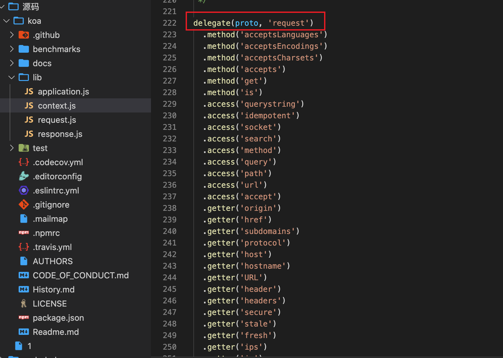
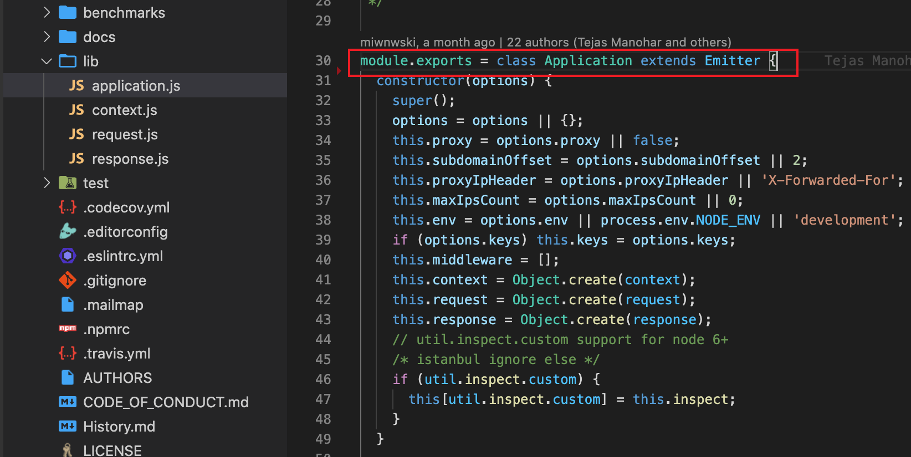
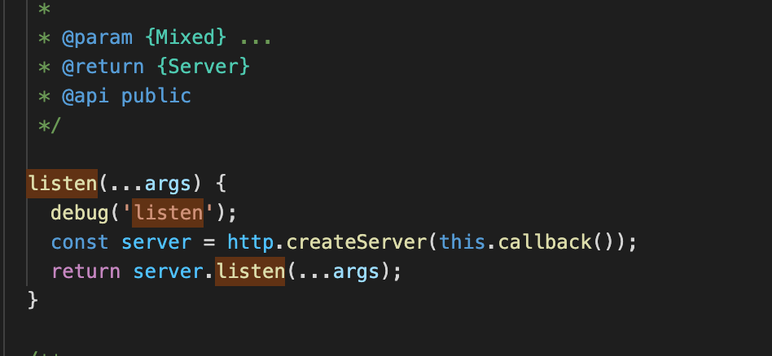
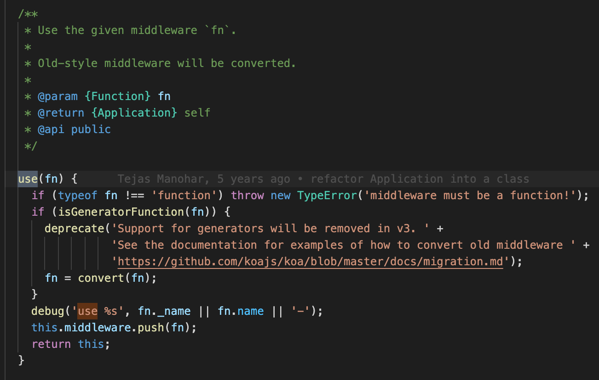
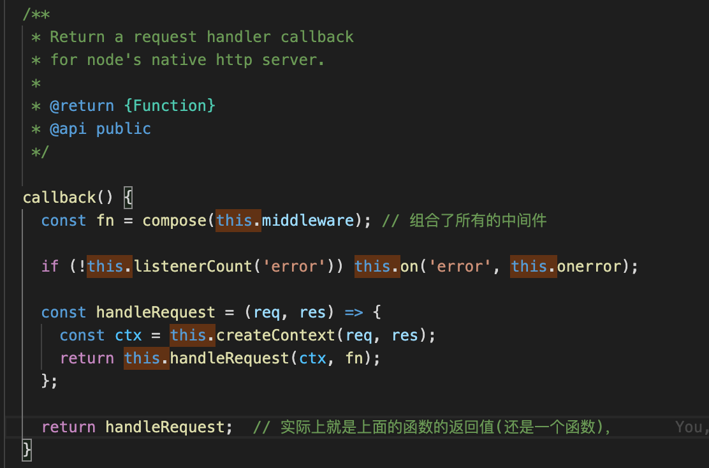
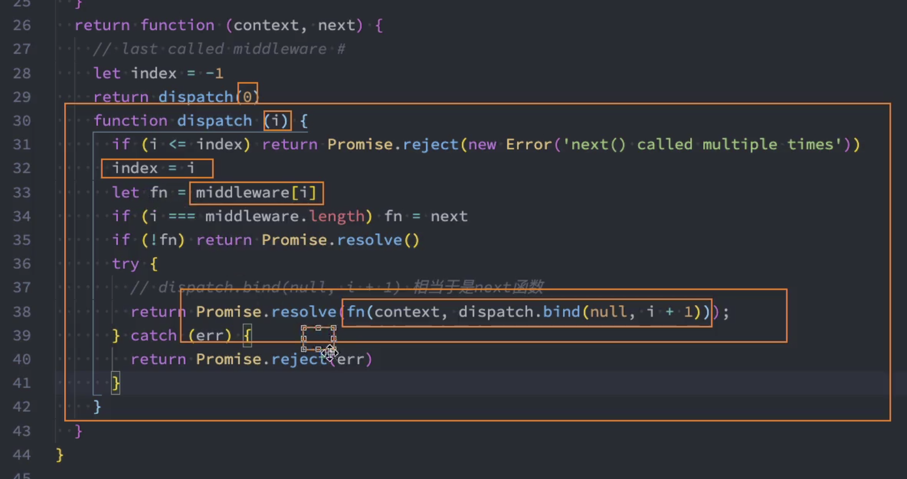
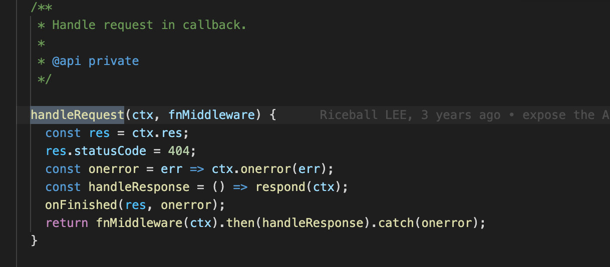
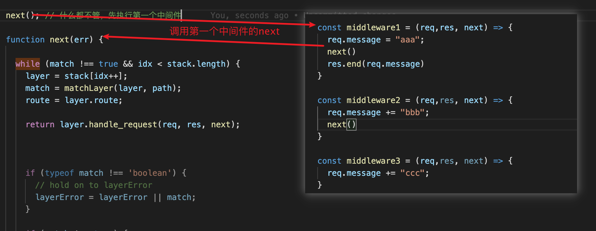
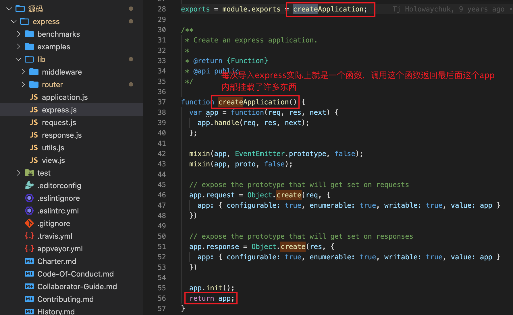
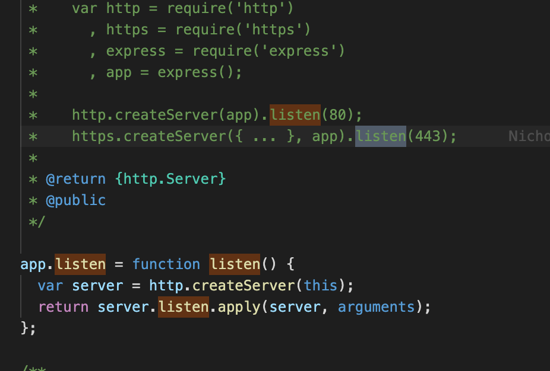

## 一、Node

## 二、Koa

### 1.代理方法相关

- 什么ctx.request.query/path/url = ctx.query/path/url?
- ctx.response同理，中间的请求和相应都可以省略掉，源码做了什么呢？
- 其实在内部做了代理，在你调用**ctx.响应方法**/**ctx.请求方法**，是内部帮你用代理去调用**ctx.request.响应方法**

**参数proto**

- 相当于context，直接调用这些方法的时候，是帮你查找proto上面的方法去调用
- 所以在项目中放心的去使用ctx.body返回东西，ctx.status去返回状态

### 2.Koa的本质

- 就是一个类，每次`const koa = new Koa()`得到的都是它的实例

### 3.app.listen的本质

- 实际上就是调用http.createServer这个方法

#### 4.app.use注册中间件

- 要求传入中间件的必须是function
- 确定是function后，就直接把fn放到中间件数组中

### 5.Koa的响应

- 处理响应的就是http.createServer中的this.callback()这个函数的返回值
- 看看this.callback的源码

### 6.compose函数组合中间件

- 在里面调用一个dispatch(index)函数
- fn是中间件，所以每次成功之后就会调用下一个中间件, fn(context, dispatch.bind(null, i+1));
- 在每一个中间件ctx.body，并不会立马返结果，要所有中间件处理完才会

## 三、Express

### 1.中间件执行机制

- 每个中间本身就是一个next，第一个next是默认执行的
- 在执行第一个中间，有碰到next，就再去进行匹配，调用下一个中间件，形成一个函数调用栈的过程
- 当最后一个next执行完，就会执行最后一个next后面的，再到第二个函数执行第二个函数next后面的，直到第一个中间件next后面的执行完，才算完全执行完。

### 2.express的本质

- express就是一个函数，内部初始化了很多东西
- 最后返回的这个app也是一个函数(对象)，内部可以调用很多方法，如listen等

### 3.app.listen的本质

- 本质上就是在内部调用http.createServer这个方法

