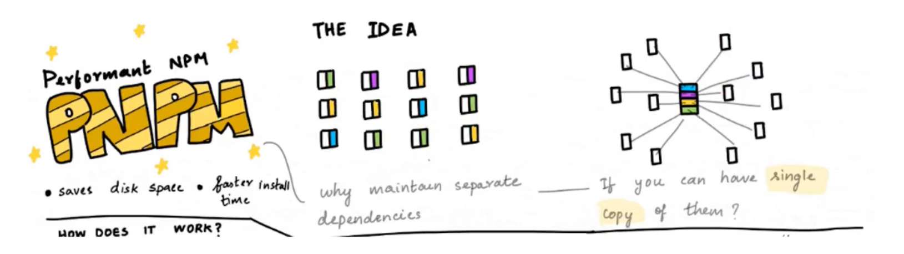
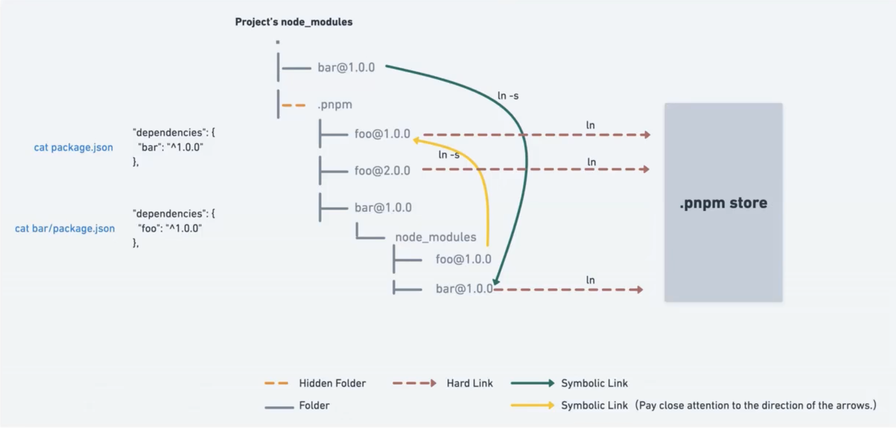

# pnpm

### 1.之前的包管理工具存在的问题

- 了解一个新技术最好的方式就是看它解决了哪些痛点

- 之前常用的包有yarn、npm
- 安装一个包的位置：1.全局；2.局部
  - 比如说我有一个项目为project1，要安装webpack用于打包，那webpack又依赖很多其他的包（可能有几十个），那除了webpack还可能安装其他很多包，比如react，vue，axios等等。
  - 那么，我们个人电脑上还可能有project2、project3很多其他项目，上面提到的东西很可能都会再安装一遍
  - 
  - 一个包就有300M+，那么到时候n个项目就有n*300M+的体积了，非常占用容量了
  - npm和yarn都存在上面提到的问题，pnpm的出现就解决了上面提到的问题

### 二、什么是pnpm

- 官网解释：我们可以理解成是performant npm 的缩写
  - 快速：pnpm比其他包管理工具快2倍
  - 高效：node_modules中的文件链接自特定的内容寻址存储库
  - 严格：pnpm默认创建了一个非平铺的node_modules，因此代码无法访问任意包
  - 支持monorepos：pnpm内置支持单仓多包

### 三、硬链接、软连接概念

- 硬链接（hard link）:
  - 是电脑文件系统中的多个文件平等地共享同一个文件存储单元
  - 删除一个文件名字后，还可以用其他名字继续访问该文件
  - 解释：在操作系统里，找到该文件的名字，点击打开会通过寻址方式找到真实磁盘的地址，读取这个数据，这个就叫硬链接
  - 创建硬链接文件：ln aaa.js aaa_hard.js ，这两连个文件名就指向磁盘里同一份数据了，修改其中一个就会影响另外一个就会发生改变
- 软链接（soft link）
  - 是一类特殊的文件
  - 其包含一条以绝对路径或者相对路径的形式指向其他文件或者目录的引用
  - 解释：快捷键就是软链接，快捷方式保存着一个文件路径，找到该文件，然后通过硬链接去读取数据
  - 创建软连接：ln -s aaa_hard.js aaa.js，软链接的文件是无法编辑的，只有找到原文件才能编辑，软链接就是快捷键，帮你找到原文件然后打开
  - 删除原文件后，软链接的文件就无法打开了，但是硬链接是可以的

### 四、pnpm到底做了什么操作

- 当使用npm或者yarn时，如果你有100个项目，并且所有项目都一个相同的依赖包，那么，你在硬盘上就需要保存100份相同的依赖包
- 如果使用pnpm，依赖包将被存放在一个统一的位置，因此
  - 如果你对同一依赖包使用相同版本，那么磁盘上只有这个依赖包的一份文件
    - 举例：当项目1、项目2、项目3等都用到了axios且版本相同，它只有第一次才会执行下载操作，后面的项目直接硬链接一个就行，后续无需下载、解压之类操作，提高了效率，节省了磁盘空间 
  - 如果对同一依赖包需要使用不同版本，则仅有版本之间不同的文件会被存储起来
  - 所有文件都保存在硬盘上统一的位置
    - 当安装软件包时，所有文件都硬链接到磁盘真实数据，而不会占用额外空间
    - 这样可以在项目项目之间方便地共享相同版本的依赖包

### 五、非扁平化管理方式

- 当使用npm或者yarn的时候，所有软件包都将被提升到node_modules的根目录下
  - 导致的问题是：源码可以访问本不属于当前项目所设定的依赖包，package里面没有，但是访问到了
- pnpm会创建一个非扁平的node_modules
  - pnpm会将项目的依赖放在node_mudules根目录下，然后软链接到.pnpm文件下

