##  一、浏览器内核

> 谷歌之前用的是webkit，后来又使用Blink，属于为webkit的一个分支，谷歌开发，用于谷歌浏览器。

#### 什么是浏览器内核？

```
事实上，浏览器内核指的是浏览器的排版引擎：
	排版引擎也叫浏览器引擎，页面渲染引擎，样板引擎。
```

#### 渲染流程就是那张图了

在html里面可以执行JS是因为每个浏览器都有JS引擎

#### JS引擎

- webkit的JS引擎，苹果公司开发
  - 两部分：webCore(HTML解析)+JSCore
- V8谷歌开发，很强大。

#### V8如何运行JS

- 源码100W行c++代码
- 主要原理：
  - 黑色的是模块。
  - 分别是解析器、解释器、

```
1.Parse将JS代码转换成AST(abstract syntax tree)抽象语法树.
2.Ignition将语法树解释成字节码（类似汇编代码），字节码再进一步转成汇编，再转机器码，交给cup执行
```

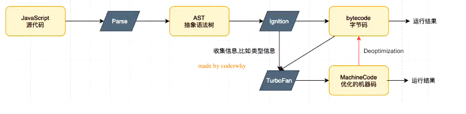

#### 为什么V8高效

```
1.因为js是一门解释型语言，转成字节码交给cpu执行过程较为复杂，效率较低，需要字节码转汇编再转机器。
2、v8对js执行过程做了优化：
	1.会收集信息（博客上的图），如参数类型。
	2.将这些代码通过另外一个模块TurboFan将字节码直接转换成优化好的机器码，下一次再运行类似函数时就直接走TurboFan模块。
3.收集到了足够的类型信息，将字节码直接转换成优化好的机器码。直接进行执行。之后在运行代码走这个过程效率变得更高。

缺点/问题：
	1.比如一个sum(num1, num2)函数，第一次传入的是数字，那么下次再转换成机器码的时候传入的参数也会被按照数字来处理。
	例子：sum('AA','bbb'),就会让两个字符串进行拼接。
解决(博客的图)：
	转换成机器码之后再多一笔操作，
	Deoptimization（反向优化）：
		在某些特殊的情况下，反向优化成字节码，再优化成机器码执行。
```

## 二、邂逅NODE

#### 2.1常见的node全局对象

- process对象：process提供了Node进程中相关的信息：

  - node中的运行环境，参数信息等；
  - 可以将环境变量读取到process的env中。

- console

- 定时器函数

  - ```js
    setTimeout(() => {
      console.log('setTimeout')
    }, 1000);
    
    setInterval(() => {
      console.log('setInterval')
    }, 1000);
    
    setImmediate(() => {
      console.log('setImmediate')
    })
    
    process.nextTick(()=> {
      console.log('process.nextTick')
    })
    // nextTick -> setImmediate -> setTimeout -> setInterval...
    ```

  - 

#### 2.2特殊的全局对象

> 这些全局对象实际上是模块中的变量，只是每个模块都有，看起来像全局变量。但是在命令行交互中不可以使用，比如，__ dirname, __filename, exports, module, require().


## 一、JavaScript模块化

### 1.1什么是模块化？

- 模块开发开发最终目的是将程序划分成一个个小的结构。
- 这个结构中编写属于自己的逻辑代码，有自己的作用域，不会影响其他结构。
- 这个结构可以将自己希望暴露的变量，函数，对象等导出给其结构使用。
- 也可以导入另外结构的变量函数，对象等。

### 1.2没有模块化带来的问题

- 变量 全局污染

### 1.3模块化的规范

> 模块化有AMD，CMD，CommonJS等是定义用什么样的归案去写代码，统一规范。每个模块化都有两个核心功能，模块本身导出暴露的属性，模块又可以导入自己需要的属性。

#### CommonJS和Node

- CommonJS是一个规范，而node是CommonJS在服务端一个具有代表的实现。
- webpack（模块化打包工具）打包工具具备对CommonJS的支持和转换。

所以，node中对CommonJS进行了支持和实现，让我们在开发node的过程中可以方便的进行模块化开发：

- 在Node中每一个js都是单独的模块；
- 这个模块中包括CommonJS规范的核心：exports，module.exports, require;
- 我们可以使用这些变量来方便的进行模块化开发。

#### exports 和 require

在单独的模块里面定义了变量可以用`exports`导出，可以用`require`导入；

```js
// a.js
const name = 'qmj';
exports.name = name;

// b.js
const obj = require('./a.js');
console.log(obj.name) // qmj
```

#### module.exports

- 既然可以用exports直接导出，为什么常用的是module.exports。
  - exports和module.exports的区别？
    - 在内部做的事情是 module.exports = exports;
    - 如果自己module.exports = {}那么就可以断开引用了
- 通过查询维基百科CommonJS规范的解析：
  - CommonJS中是没有module.exports的概念的；
  - 但是为了实现模块的导出，Node中使用的是Module（一个js文件就是一个module实例）的类，每一个模块都是Module的实例，就是module。
  - 所以在node中真正用于导出的其实根本不是exports，而是module.exports;
  - 因为module才是导出的真正实现者。

```
// a.js
const name = 'qmj';
module.exports = {
	name: name;
};

// b.js
const obj = require('./a.js');
console.log(obj.name) // qmj
```

## 三、常见内置模块

### 1.路径的模块——path

> 在不同操作系统中路径的形式有可能是不一样的，有的是// 有的是\ 那么一套代码就不可以在不同操作系统中使用了。那么调用path模块可以解决这个问题。

```js
const path = require('path');
const basePath = '/User/qmj';
const fileName = 'abc.txt';

const filepath = path.resolve(basePath, fileName)

```

#### path的方法

****

```js
const path = require('path');


// 1.获取路径信息
const filepath = 'User/qmj/abc.txt';

console.log(path.dirname(filepath))  // User/qmj
console.log(path.basename(filepath)) // abc.txt
console.log(path.extname(filepath)); // .txt

// 2.join路径拼接

const basepath1 = '/User/qmj';
const filename = 'aaa.txt';
const filepath1 = path.join(basepath1, filename) 

console.log(filepath1) // \User\qmj\aaa.txt

// 3.路径拼接

const filepath2 = path.resolve(basepath1, filename);
console.log(filepath2)  // D:\User\qmj\aaa.txt
```

### 2.文件系统 ——fs模块

node中文件系统的api很多，但是大多数api都提供了三种操作方式：

- 方式一：同步操作文件：代码会被阻塞，不会继续执行。
- 方式二：异步回调函数操作文件：代码不会被阻塞，需要传入回调函数，当获取到结果时，回调函数被执行；
- 方式三：异步Promise操作文件：代码不会被阻塞，通过fs.promises调用方法操作，会返回一个Promise，可以通过then，catch进行处理。

#### fs的三种操作模式

```js
const fs = require('fs')

// 读取文件信息
const filepath = "./a.txt"

// 1.方式一：同步操作 阻塞
const info = fs.statSync(filepath)
console.log(info)

// 2.方式二：异步操作 不会阻塞
fs.stat(filepath, (err)=> {
  if(err) {
    console.log(err)
    return;
  }
  console.log(info)
})
// 3.方式三 promise的方式，不会回调地狱
fs.promises.stat(filepath).then( info => {
  console.log(info);
}).catch(err => {
  console.log(err)
})
```

#### 文件描述符

- 在POSIX系统上，对于每个进程，内核都维护着一张当前打开着的文件和资源的表格。
- 每个打开的文件都分配额一个成为文件描述符的简单的数字标识符。
- 在系统层，所有文件系统操作都是用这些文件描述符来标识和跟踪每个特定的文件。
- Windows系统使用了一个虽然不同但概念上类似的机制来跟踪资源。

```js
const fs = require('fs')

fs.open("./a.txt",(err,fd) => {
  if(err) {
    console.log(err)
    return
  }

  // 可以通过描述符去获取文件的信息 异步
  fs.fstat(fd, (err, info) => {
    console.log(info)
  })
  console.log(fd)  // 先被执行
})
```

#### 文件的读写

- fs.writeFile(文件，内容，options, err回调)
  - options：flag可以有不同写入操作，追加，覆盖等等，a追加

```js
const fs = require('fs')

const content = '吃了吗？hahh'

fs.writeFile('./a.txt',content,{flag: "a"}, err => {
  if(err) console.log(err)
})
```

#### 文件夹的操作

```js
const fs = require('fs');
const path = require('path')

// 1.创建文件夹
const dirname = './qmj';
if(!fs.existsSync(dirname)) {
  fs.mkdir(dirname, err => {
    if(err) console.log(err)
  })
}

// 2.读取文件夹中的所有文件
const getFilename = (dirname) =>{
  fs.readdir(dirname,{withFileTypes: true}, (err,files)=>{
    for(let file of files) {
      if(file.isDirectory()) {
        const filepath = path.resolve(dirname,file.name)
        getFilename(filepath)
      }else {
        console.log(file)
      }
    }
  })
}
    
getFilename(dirname)
// Dirent { name: 'bb.txt', [Symbol(type)]: 1 }
// Dirent { name: 'qmj.txt', [Symbol(type)]: 1 }
// Dirent { name: 'aa.js', [Symbol(type)]: 1 }
// Dirent { name: 'cc.png', [Symbol(type)]: 1 }
```

### 3.events模块

####  events基础方法

- 创建发射器
- 注册监听
- 发射事件
- 取消监听

```js
const EventEmitter = require('events');

// 创建发射器
const emitter = new EventEmitter();

// 2.监听某一个事件
// on是addListener的别名、

const listener2 = (args) => {
  console.log('监听到click2事件',args);
}
emitter.on('click', listener2)
emitter.on('click', args => {
  console.log('监听click1事件', args)
})

// 3.发出一个事件 
setTimeout(() => {
  emitter.emit('click', 'qmj', 'link', 'kobe');
  emitter.off('click',listener2) // 取消监听
  emitter.emit('click', 'qmj', 'link', 'kobe');
}, 2000);


```

#### events获取信息

- 获取注册事件
- 获取注册函数个数
- 获取注册函数名称

```js
const EventEmitter = require('events');

// 创建发射器
const emitter = new EventEmitter();

// 2.监听某一个事件
// on是addListener的别名、

const listener2 = (args) => {
  console.log('监听到click2事件',args);
}
emitter.on('click', listener2)
emitter.on('tap', args => {
  console.log('监听click1事件', args)
})

// 获取注册事件
console.log(emitter.eventNames())
// 获取注册函数个数
console.log(emitter.listenerCount('click'))
// 获取注册函数名称
console.log(emitter.listeners('click'));
```

#### events不常用方法

- once 值监听一次
- prependListener优先执行
- removeAllListeners移除所有，可以传参数

## 四、发布自己的npm

### 1.npm的原理

- 查看缓存位置 npm config get cache

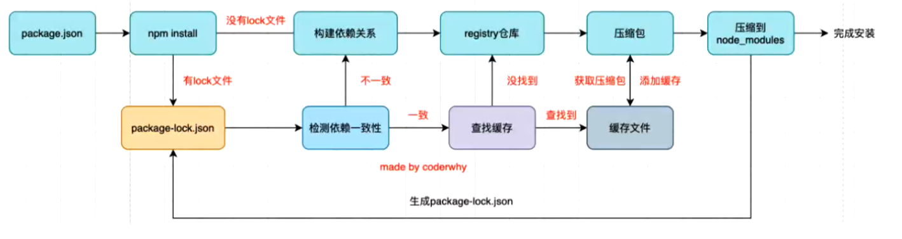

### 2.开发自己的脚手架模板

原因：

- 使用官方的是毫无配置的。
- 没有划分目录结构、config.js。
- 没有请求相关的第三方库。
- 没有element-ui，antd等ui库
- 也没有路由相关的配置

那么每一次创建项目的时候又要去下载这些常使用的第三方，所以我们可以定义一个模板进行复用。


#### 自定义终端命令

- 在终端输入qmj时报错。
- 第一：先要在index.js入口文件配好环境 *#!/user/bin/env node*
- 第二：在package.json里面 "bin": {  "qmj": "index.js" },
- 第三：终端运行 npm link就可以连接你的qmj命令
- 输入qmj会执行index文件。

#### 增加自己的options

- 可以在终端中使用，--help可以查看这些命令
- 可以用on监听哪个option被监听。

```js
#!/usr/bin/env node
const program = require('commander')
// 查看版本号
program.version(require('./package.json').version)
// 增加自己的options
program.option('-q --qmj', 'a qmj cli');
program.option('-d --dest <dest>', 'a destination folder, 例如： -d /src/components');
program.option('-f --framework <framework>', 'your framework');

program.on('--help', function() {
  console.log("")
  console.log("Other");
  console.log(" other options~")
})
program.parse(process.argv)
console.log(program.dest)
```

#### 定义创建项目的action

- 克隆项目
  - 用到一个叫download-git-repo的库，传入参数等
- 执行npm install
  - 需要注意判断不同的平台，在win上面执行的是npm.cmd
  -  await commandSpawn(command, ['install'], {cwd: `./${project}`})
- 运行npm run serve
  - await commandSpawn(command, ['run', 'serve'], {cwd: `./${project}`})
- 打开浏览器
  - 用到一个open的库

## 五、文件处理

### 5.1Buffer

#### buffer和二进制

- 对于前端来说，很少和二进制打交道，但是对于服务端为了做更多的功能，我们必须直接去操作其二进制的数据；
- Node为了可以方便开发者完成更多功能，提供了一个类Buffer，属于去全局。
- Buffer中存储的是二进制数据，那么到底是如何存储呢？
  - -我们可以将Buffer看成是一个存储二进制的数组。
  - 这个数组中的每一项，可以保存8位二进制：00000000
- 为什么是8位？
  - 一位二进制存储数据量小。
  - 8位就是一个单元，这个单元称为一个字节。
  - 1byte=8bit，1kb=1024byte，1M=1024kb；

#### buffer和字符串

- 可以得出结论一个英文字符占一个字节，一个中文占三个字节

```js
const message1 = "Hello"; 
const message2 = "你好啊"; 
const buffer1 = new Buffer.from(message1)  // <Buffer 48 65 6c 6c 6f> 16进制
const buffer2 = new Buffer.from(message2)  // <Buffer e4 bd a0 e5 a5 bd e5 95 8a>
```

#### buffer操作图片

- writeFile可以直接复制图片
- sharp这个库可以操作图片

### 5.2Stream

> 流是从一个文件读取数据时，文件的二进制（字节）数据源源不断的被读取到我们程序中；这一连串的字节，即使我们程序中的流。它可读可写。

- 之前学过readFile和writeFile方式读写文件，那为什么还要流呢？
  - -直接读写文件的方式，无法控制一些细节的操作；
  - 比如什么位置开始读，读到什么位置，一次星都区多少个字节；
  - 读到某个位置后，暂停读取，某个时刻恢复读取等等；

## 六、HTTP

### 6.2 header属性

- content-type
  - application/json 表示是一个json类型
  - text/plain表示是一个文本类型
  - application/xml表示是xml类型
  - multipart/form-data表示是上传文件

- content-length：文件大小和长度
- keep-alive：
  - http是基于tcp协议的，但是通常在进行换一次请求和相应会立刻中断。
  - http1.0中，想要保持持续链接：
    - 请求头加 connection：keep-alive
    - 服务端在响应头加connection: keep-alive
    - 当客户端再次请求时，就会使用同一个连接，直接一方中断连接；
  - 在http1.1中，默认开启connection:keep-alive的
    - 不同web服务器会有不同的保持keep-alive的时间
    - node中就是默认5s
- accept-encoding：告诉服务器，客户端支持的文件压缩格式，比如js文件客户已使用gzip编码
- accept：告知服务器，客户端可以接受文件的格式类型。
- user-agent： 客户端的相关信息。

### 6.3响应

#### 响应结果

res.end('hello') === res.write('hello') + res.end()

#### 响应状态码

两种设置状态码的方式：

- res.statusCode = 400
- res.writeHead(503, {})

#### 设置响应header

- res.setHeader('Content-Type', "text/plain;charest=utf-8")
- res.writeHead('200', { 'Content-Type': "application/json;charest=utf-8" })

### 6.4HTTP发送请求

#### 方式一：get请求

```js
//1.get请求
http.get('http://localhost:1732', (res) => {
  res.on('data', (data) => {
    console.log(data.toString())
  })
  res.on('end', () => {
    console.log('结束')
  })
})
```

#### 方式二：post请求

- 它要比get多做一步end的操作，get不用是因为内部已经实现了

```js
const req = http.request({
  method: 'POST',
  hostname: 'localhost',
  port: '1732',
}, (res) => {
  res.on('data', (data) => {
    console.log(data.toString())
  })
  res.on('end', () => {
    console.log('结束')
  })
})
req.end()
```

### 6.5文件上传

#### 文件上传——错误示例

- 原因是这样得到的数据时包含 图片信息+其他信息
- 其他信息就是图片名字，content-type等等

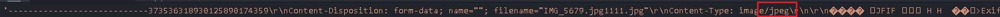

```js
const http= require('http');
const fs = require('fs');

// 错误写法
const server = http.createServer((req ,res) => {
  if(req.url === '/upload') {
    if(req.method === 'POST') {
      const flieWriter = fs.createWriteStream('./foo.png',{flags: 'a+'});
      req.on('data', (data) => {
        console.log(data);
        // 包含着图片+其他信息，所以不能正常显示。
        flieWriter.write(data);
      });

      req.on('end', ()=> {
        console.log('文件上传成功！！');
        res.end('文件上传成功~')
      })
    }
  }
})

// 监听端口
server.listen(1732, '0.0.0.0', () => {
  console.log('服务器启动在1732端口')
});
```

#### 文件上传——正确的示例

- 需要对获取到的data做处理，只获取data里面图片的数据就行
- 需要做三件事情：
  - 去掉image/png前面的
  - 去掉\r\n\r\n
  - 去掉后面的boundary。-----------2157

```js
const http= require('http');
const fs = require('fs');
const qs = require('querystring');

// 错误写法
const server = http.createServer((req ,res) => {
  if(req.url === '/upload') {
    if(req.method === 'POST') {
      req.setEncoding('binary');
      let body = '';
      const totalBoundary = req.headers['content-type'].split(';')[1];
      const boundary = totalBoundary.split('=')[1];
      req.on('data', (data) => {
        body += data;
      });

      req.on('end', ()=> {
        console.log(body)
        // 处理body
        // 1.处理img前面的问题
        const payload = qs.parse(body, "\r\n", ":")
        const type = payload["Content-Type"]; // 拿到图片类型
        // 拿到图片的位置
        const typeIndex = body.indexOf(type);
        const typeLength = type.length;
        let imageData = body.substring(typeIndex+typeLength )

        // 3.去掉空格
        imageData = imageData.replace(/^\s\s*/, '');
        
        // 4.将最后的boundary去掉
        imageData = imageData.substring(0, imageData.indexOf(`--${boundary}--`)) 
        fs.writeFile('./foo.png', imageData, {encoding: 'binary'}, (err) => {
          console.log('文件上传成功')
        })
        console.log('文件上传成功！！');
        res.end('文件上传成功~')
      })
    }
  }
})

// 监听端口
server.listen(1733, '0.0.0.0', () => {
  console.log('服务器启动在1732端口')
});
```

## 七、框架

### 7.1.Express

#### 7.1.1express的使用

- 安装 npm i -g express-generator
- 创建 express express-demo
- 安装依赖 npm i 
- 启动项目 node bin/www

#### 7.1.2解剖express

**基本情况**

- express实际上是一个函数，创建application的函数
- 三部曲也是导入，创建实例，启动监听
- 根据不同请求调用不同方法

```js
// 1.导入
const express = require('express');

// 2.创建app
const app =  express();

// 4.做出处理
app.get('/', (req, res, next) => {
  res.end('Hello express!')
})

app.post('/login', (req, res, next) => {
  res.end('Please login~')
})

// 3.启动监听
app.listen(8000, () => {
  console.log('服务器启动成功~')
})
```

#### 7.1.2认识中间件

- express是一个路由和中间件的Web框架，它本身的功能非常少
  - Express应用程序本质上是一些列中间件函数的调用


- 什么是中间件？
  - 中间件本质是传递给express的一个回调函数
  - 这个回调函数接收三个参数：
    - 请求对象（request）；
    - 响应对象（response对象）
    - next函数（在express中定义的用于执行下一个中间件的函数）


- 中间件可以执行哪些任务呢？

  - 执行让任何代码
  - 更改请求（request）和响应（response）对象
  - 结束请求-响应周期（返回数据）
  - 调用栈中的下一个中间件


- 如何将一个中间件应用到我们的应用程序中？
  - express主要有两种方式：app/router.use和app/router.methods
  - methods值的是常用的请求方式，比如app.get 或者 app.post等；


- use的用法，因为methods的方式本质是use的特殊情况
  - 普通中间件不管是get和post都可以请求成功，但是又多个use时，只会作用在第一个中间件。
  - 如果不想只调用第一个，那就next

**普通中间件**

- 普通中间件不管是get和post都可以请求成功，但是又多个use时，只会作用在第一个中间件。
- 如果不想只调用第一个，那就next

```js
const express = require('express');

const app = express();

// 编写普通中间件

// 1.use注册中间件
app.use((req, res, next) => {
  console.log("注册了第01个普通中间件~");
  next()
})

app.use((req, res, next) => {
  console.log("注册了第02个普通中间件~");
  next()
})

app.use((req, res, next) => {
  console.log("注册了第03个普通中间件~");
  res.end("hello qmj11111")
})

app.listen(8000, () => {
  console.log("普通中间件服务器启动成功~");
})
```

**路径中间件**

- 路径匹配上了，但是没有指定，所以不管get，post都可以请求到
- 同样也是next到哪里就执行到哪里

```js
const express = require('express');

const app =  express();

// 路径匹配中间件
app.use('/home', (req, res, next) => {
  res.end('Welcome to Home~')
})

app.listen(8000, () => {
  console.log('服务器启动成功~')
})
```


**方法和路径中间件**

```js
const express = require('express');

const app =  express();

app.get('/home', (req, res, next) => {
  res.end('Hello express!')
})

app.post('/login', (req, res, next) => {
  res.end('Please login~')
})

app.listen(8000, () => {
  console.log('服务器启动成功~')
})
```


**注册连续中间件**

```js
// 1.导入
const express = require('express');

// 2.创建app
const app =  express();

app.use((req, res, next) => {
  console.log('中间件');
  next();
})

// 4.做出处理
app.get('/home', (req, res, next) => {
  console.log("中间件01")
  next();
}, (req, res, next) => {
  console.log("中间件02")
}, (req, res, next) => {
  console.log("中间件03")
}, (req, res, next) => {
  console.log("中间件04")
  res.end('home page')
})

app.post('/login', (req, res, next) => {
  res.end('Please login~')
})

// 3.启动监听
app.listen(8000, () => {
  console.log('服务器启动成功~')
})
```


- 注意的地方：

  - 如果没在一个中间件中调用end，那么必须调用next，否则一直会停留在该中间件中。
  - app.get 和 app.post也是一个中间件 
  - 不调用next永远匹配都是第一个中间件
  - 如果哪一个没有next，那么就在就在那个调用完就不会下一个了

  

#### 7.1.3中间件的应用

**json解析**

- 普通解析的话不同路径就需要做相同业务逻辑。
- 使用公共中间件就可以抽离出相同业务，就比如解析Json
- 或者也可以使用内部实现好的`app.use(express.json())`

```js
const express = require('express');

const app =  express();

// 手动判断，内部有已经实现好的
// app.use((req, res, next) => {
//   console.log(req.headers['content-type'])
//   if(req.headers['content-type'] === 'application/json') {
//     req.on('data', (data) =>{
//       const info = JSON.parse(data.toString());
//       req.body = info;
//     })

//     req.on('end', () => {
//       res.end('haha');
//       next();
//     })
//   } else {
//     next();
//   }
// })

app.use(express.json())

app.post('/login', (req, res, next) => {
  console.log(req.body);
  res.end('hhahah')
  req.on('end', () => {
    res.end('qmj, Welcome Back~');
  })
})
app.post('/products', (req, res, next) => {
  console.log(req.body);
  res.end('hhahah')
  req.on('end', () => {
    res.end('qmj, Welcome Back~');
  })
})

app.listen(8000, () => {
  console.log('服务器启动成功~')
})
```

**表单提交——form-data**

- 安装第三方库——mulfer
- 非文件类型使用any

```js
const express = require('express');
const multer = require('multer');

const app = express();

const upload = multer();

app.use(upload.any());  // 非文件类型用any


app.post('/login', (req, res, next) => {
  console.log(req.body)
  res.end("登陆成功")
})

app.listen(8000, () => {
  console.log("form-data解析服务器启动成功~")
})
```


**文件上传——form-data**

- 将key设为file类型
- 使用multer里面的diskStorage。
- destination和filename都是要一个回调函数，分别存下路径和文件名信息

```js
const path = require('path');

const express = require('express');
const multer = require('multer');

const app = express();

const storage = multer.diskStorage({
  destination: (req, file, cb) => {
    cb(null, './upload/');
  },
  filename: (req, file, cb) => {
    cb(null, Date.now() + path.extname(file.originalname));
  }
})

const upload = multer({
  // dest: './upload/'
  storage
});

app.use(upload.any());  // 非文件类型用any

app.post('/upload', upload.single('file') , (req, res, next) => {
  console.log(req.body)
  res.end("文件上传成功")
})

app.listen(8000, () => {
  console.log("form-data解析服务器启动成功~")
})
```


**解析参数**

```js
// 1.导入
const express = require('express');

// 2.创建app
const app =  express();

// 4.做出处理
app.get('/products/:id/:name', (req, res, next) => {
  console.log(req.params);
  res.end('获取商品数据详情~')
})

app.get('/login', (req, res, next) => {
  console.log(req.query)
  res.end('登陆成功')
})
// 3.启动监听
app.listen(8000, () => {
  console.log('服务器启动成功~')
})
```

### 7.2Koa

#### 7.2.1koa的基本使用

- 返回的是一个类，所以要大写。
- 中间件没有和express那种res.end，而是使用response.body

```js
const Koa = require('koa');

const app = new Koa();

app.use((context, next) => {
  context.response.body = "欢迎来到koa~";
})

app.listen(8000, () => {
  console.log("koa程序启动成功~")
})
```

#### 7.2.2koa的中间件

- 只能通过app.use来注册中间件
- koa不像express可以注册方法中间件（get/post等）
- 也没有path中间件匹配路径
- 没有有像express那样的连续注册中间件

```js
...
app.use((context, next) => {
  if(context.request.url === '/login') {
    if(context.request.method === 'GET') {
      context.response.body = "登陆成功~";
    }
  }
})
...
```

#### 7.2.3koa的路由

- koa是非常轻量的，内部没有实现路由。
- 一般要使用第三方，最多的是——koa-router
- koa官方提供了一个好用的功能，就是方法不存在时返回提示信息。
- 一般使用如下

```js
// user.js 路由文件
const Router = require('koa-router');

const router = new Router({prefix: '/users'})

router.get('/', (ctx, next) => {
  ctx.response.body = "user lists~"
})

router.put('/', (ctx, next) => {
  ctx.response.body = "put request ~"
})

module.exports = router;

// 使用路由文件
...
app.use(userRouter.routes());
app.use(userRouter.allowedMethods()); // 不存在请求方法，提示错误信息
...
```

#### 7.2.4参数解析——query&params

- ctx.request.params
- ctx.request.query

#### 7.2.5参数解析——json&urlcoded

- 不像express有现成的app.use(json())进行解析
- 需要使用第三方库 `koa-bodyparser`
- 使用和app.use(json())类似，只不过不是官方提供
- 可以解析urlcoded，但不能提供解析form-data表单数据，和express一样
- 想要解析需要安装第三方库。express是multer，koa是koa-multer

```js
// ...导入代码
app.use(bodyparser());
app.use((ctx, next) => {
  console.log(ctx.request.body);
  ctx.response.body = "参数解析json";
})
// ...监听代码
```


#### 
## 八、MySQL

### 8.1MySQL基本概念

#### 8.1.1配置环境变量

`export PATH=$PATH:/usr/local/mysql/bin`

#### 8.1.2数据库连接终端

**方式一**

`mysql -uroot -p12345678`

**方式二**

`mysql -uroot -p`

#### 8.1.3基本命令

**查看所有数据库**

`show databases;`

- 初始是四个数据库
  - information_schema：信息数据库，记录MySQL在维护的其他数据库、表、列访问权限信息。
  - performance_schema：性能数据库，记录MySQL Server数据库引擎在运行过程中的一些资源消耗相关信息。
  - mysql：用于存储数据库管理者的用户信息、权限信息以及一些日志信息等。
  - sys：相当于简易版的performance_schema，将性能数据库中的数据汇总成更容易理解的形式。

**创建数据库**

`create database if not exists name`

**创建数据表**

create table moment( title varchar(20), content varchar(512));

**插入数据**

insert into users (name, age, height) values ('qmj', 18, 1.88)

| 命令                                                         | 作用                             |
| ------------------------------------------------------------ | -------------------------------- |
| select database();                                           | 查看当前使用的数据库             |
| use databasename;                                            | 使用某个数据库                   |
| show tables/ create table tablename;                         | 查看表、创建表                   |
| insert into users xx valuesxx;                               | 插入数据                         |
| id INT PRIMARY KEY AUTO_INCREMENT,                           | 将id设为主键                     |
| desc tablename;                                              | 查看表结构                       |
| alter table `users` rename to user;                          | 重命名表明                       |
| alter table `users`  add `updateTime` timestamp;             | 添加新列                         |
| alter table `users`  change `phoneNumber` `telNumber` varchar(20); | 修改字段名称                     |
| alter table `users`  modify `phoneNumber`  varchar(20);      | 修改字段类型                     |
| alter table `users` drop `name`;                             | 删除字段                         |
| create table `user1` like `users`;                           | 根据一个表结构去创建另外一个表   |
| create table `user2` (select * from user);                   | 根据一个表中的内容去创建另一个表 |
| primary key (student_id, course_id)                          | 联合主键                         |

#### 8.1.4GUI操作MySQL软件

**Navicat**

#### 8.1.5MySQL数据类型

| 类型               | 含义                                |
| ------------------ | ----------------------------------- |
| YEAR/DATE/DATETIME | YYYY/YYYY-MM-DD/YYYY-MM-DD hh:mm:ss |
| CHAR(0-255)        | 固定长字符型                        |
| VARCHAR(0-65535)   | 可变长字符型                        |
| TEXT               | 存储大的字符串                      |
| INT                | 数字                                |
|                    |                                     |


### 8.2MySQL语句

一般把sql语句分为四个种类：

- DDL： 数据定义语言
  - 对数据库，数据表进行创建，删，改等操作
- DML：数据操作语言
  - 对数据表进行添加，删除，修改
- **DQL：数据查询语言**（重点）
  - 从数据库中查询记录

### 8.3数据表的操作

#### 8.3.1新建表

```mysql
CREATE TABLE IF NOT EXISTS `students` (
	`name` VARCHAR(10),
  `age`  int,
  `score`  int,
  `height`	DECIMAL(10,2) #保留两位小数
);
```

#### 8.3.2删除表

```mysql
DROP TABLE IF EXISTS `moment`;
```

#### 8.3.3查看创建表的SQL语句

```mysql
SHOW CREATE TABLE `student`;
```

#### 8.3.4DML——数据库的增删改

| 命令                                                         | 作用                     |
| ------------------------------------------------------------ | ------------------------ |
| inset into users values (xx, xx);                            | 插入数据                 |
| default current_timestamp;/                                  | 默认设置创建值/更新值    |
| alter table `users` add `createTime` timestamp default current_timestamp; | 添加字段并设置为当前时间 |
| alter table users modify updateTime timestamp on update current_timestamp; | 更新时间                 |
| delete from users where id = 4;                              | 删除表中某一个数据       |
| update users set age=20, height=1.80 where id = 2;           | 更新数据                 |

### 8.4DQL——数据查询语句

- 先在表中插入数据，安装`npm i mysql2`
- js脚本插入数据便于练习查询语句

```js
const mysql = require('mysql2');
 
const connection = mysql.createConnection({
  host: 'localhost',
  port: 3306,
  user: 'root',
  password: '12345678',
  database: 'coderhub'
});

const statement = `INSERT INTO products SET ?;`
const phoneJson = require('./phone.json');

for (let phone of phoneJson) {
  connection.query(statement, phone);
}
```

#### **1.基本查询**

**查询所有的字段**

`select * from products;`

**查询指定字段**

`select title, price from products;`

**对字段结果起别名**

`select title as phoneTitle, price as phonePrice from products;`

#### 2.where 条件判断

**查询价格小于1000的手机**

`select * from products where price < 1000;`

**价格等于999的手机**

`select * from products where price = 999;`

**价格不等于999的手机**

`select * from products where price != 999;` 

#### 3.where逻辑运算语句

**价格1000-2000的手机**

`select * from products where price > 1000 and price < 2000;`

`select * from products where price > 1000 && price < 2000;`

`select * from products where price between 1000 and 2000;`  包含等于

**价格在5000以上或者是华为手机**

`select * from products where price > 5000 || brand = '华为';`

#### 4.where模糊查询

- 结合 **like**关键字。
- %表示匹配任意一个的任意字符，包括0
- _表示匹配一个的任意字符

**查询手机名字带M的**

`select * from products where title like '%M%';`

**查询title第二字是M的**

`select * from products where title like '_M%';`

**取多个值中的一个**

`select * from products where brand in ('华为', '小米');`

#### 5.结果排序

- 通过order by字段
- 升序ASC, desc降序

**按照价格升序**

`select * from products order by price asc;`

#### 6.分页查询

`select * from products limit 20 offset 0;`

- 第一个代表offset，第二个limit

`select * from products limit 0, 20;`

### 8.5聚合函数

- 是对这组数据进行操作
- 比如这些手机总价值多少，最贵的手机是哪个。

#### 8.5.1聚合函数的使用

**求出所有手机的总价格**

```mysql
select sum(price) from products;
#起别名
select sum(price) as totalPrice from products;
```

**算出华为手机的总价格**

```mysql
select sum(price) from products where brand='华为';
```

**算出华为手机的平均价格**

```mysql
select avg(price) from products where brand='华为';
```

**最高/最低手机的价格**

```mysql
select max(price) from products where brand='华为';
select min(price) from products where brand='华为';
```

**华为手机的个数**

```mysql
select count(*) from products where brand='华为';
```

**个数去重查询**

```mysql
select count(distinct price) from products;
```

#### 8.5.2 group by

- 默认情况下所有数据为一组
- 比如华为一组，苹果一组，OPPO一组

**以品牌分组**

```mysql
# 平均价格，总个数，平均分，但是没有显示品牌
select avg(price), count(*), avg(score) from products group by brand;
# 前面加上brand可以显示品牌
select brand, avg(price), count(*), avg(score) from products group by brand;
```

**注意：**

- 只有group by才可以前面放字段，而前面的单独聚合函数不可以。
- 前面字段只可以放被分组的，brand不能放title

#### 8.2.3 having的使用

- 在查询到的基础上再做筛选
- 用法就是将where改为having就可以了，where在group by后面是会报错的

**在求出上面表的基础上，想要得到平均价格2000以上的数据**

```mysql
select brand, avg(price) price, count(*), avg(score) from products group by brand having price>2000;
```

**评分大于7.5分手机的平均价格是多少？**

```mysql
select avg(price) from products where score > 7.5;
```

**升级：按照品牌分类**

- 先求出均分大于7.5所有的手机，在进行分类

```mysql
select brand,avg(price) from products where score > 7.5 group by brand;
```

#### 8.6多张表关联

**为一张表设置外键**

- 有外键引用时另外一张表的id是不能随便改的

```mysql
alter table products add foreign key(brand_id) references brand(id);
```

**如何删除关联外键的字段**

- 更新或者删除时可以设置几个值：
  - restrict 默认，会检查是否有关联外键，有就不允许更新，删除。
  - no action和上面一样的，是sql标准
  - cascade 当更新或删除时，会检查该记录是否有关联的外键记录，有的话：
    - 更新：一起更新。
    - 删除：关联的记录一起删除

**修改brand_id关联外键时的action**

- 获取到外键的名称：`show create table product;` 找到外键的名称。

- 根据名称将外键删除：`alter table products drop foregin key products_ibfk_1;`

- 重新添加外键约束：

  - ```mysql
    alter table products add foreign key (brand_id) references brand(id)
    																								on update cascade
    																								on delete restrict;
    ```

### 8.6多表查询

#### 8.6.1笛卡尔乘积查询

**获取两个表的集合**

- 它得到的总共结果是 两个总数的相乘 108 * 6 条数据
- 叫做**笛卡尔乘积**，该表会和另外一个表每一条数据结合

`select * from products, brand;`

**获取两个表的交集**

- 只需要把products中的`brand_id`和brand表的`id`对应上即可
- 最终获得60条交集，是我们想要的结果

```mysql
select * from products, brand where products.brand_id = brand.id;
```

上面这种方式把两个表都查询到再做筛选，非常影响性能，**不推荐。**

#### 8.6.2SQL JOIN

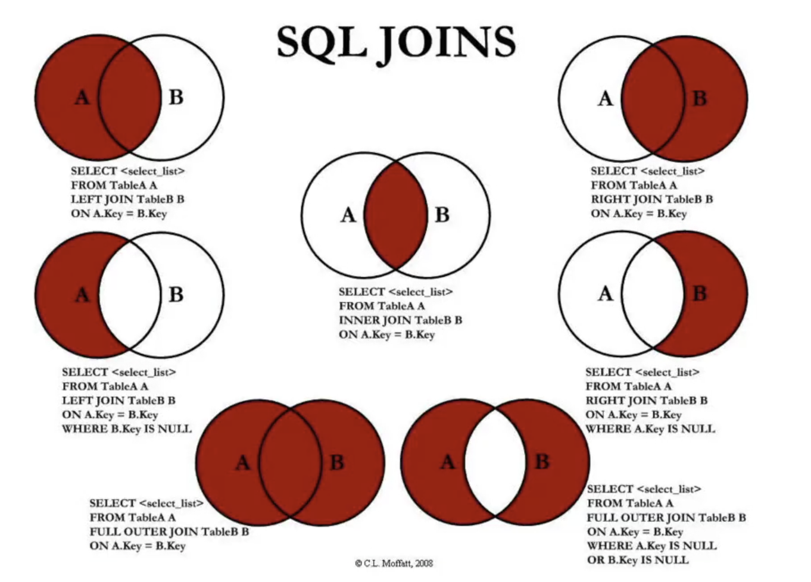

#### **8.6.3左连接**

**查询所有手机以及品牌信息为null（brand表没有就是null）**对应(1,1)

```mysql
select * from products left join brand on products.brand_id = brand.id;
```

**查询没有品牌对应的数据**(2,1)

- 其实也可以直接查询products表。
- 这个是在查到(1,1)表的基础上再选出(2,1)

```mysql
select * from products left join brand on products.brand_id = brand.id where brand.id is null;
```

#### **8.6.4右连接**

**查询右表所有数据(1,2)**

```mysql
select * from products right join brand on products.brand_id = brand.id;
```

**查询右表独有的数据**(2,3)

```mysql
select * from products right join brand on products.brand_id = brand.id where products.brand_id is null;
```

#### 8.6.5内连接

**查询两个的交集**(2,2)

- 和`select * from products, brand where products.brand_id = brand.id;`作用一致，但是性能显著提升。

```mysql
select * from products join brand on products.brand_id = brand.id;
```

#### 8.6.6全连接

- mysql不支持全连接
- 想要达到全连接可以用左连接联合右连接(1,1)和(1,2)
- 结果是左表total + 右表中左表没有的

**查询所有的(3,1)**

```mysql
select * from products left join brand on products.brand_id = brand.id
union
select * from products right join brand on products.brand_id = brand.id;
```

**查询结果除去交集(3,2)**

- 就是(2,1)联合(2,3)

```mysql
select * from products left join brand on products.brand_id = brand.id where brand.id is null
union
select * from products right join brand on products.brand_id = brand.id where products.id is null;
```

### 8.7多对多表设计

#### 8.7.1数据准备

```mysql
#学生表
create table if not exists students(
	id int primary key auto_increment,
  name varchar(20) not null,
  age int
);

#课程表
create table if not exists courses (
	id int primary key auto_increment,
  name varchar(20) not null,
  price double
);

#插入学生表数据
insert into students (name, age) values ('qmj', 18); 等等...

#插入课程表数据
insert into courses (name, price) values ('英语', 100);
```

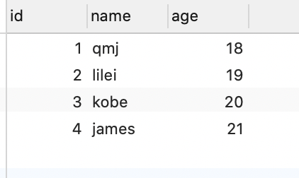

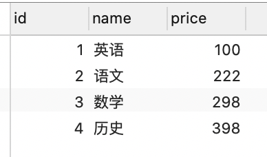

#### 8.7.2多对多相关概念

- qmj选了多少课？
- 哪些课没有被选择过？

要想高效的查询上述数据，需要在两个表之间建立一个关系表：

- qmj选择了英语，语文；lilei选择了数学
- 这个表有两个外键，students_id和courses_id
- 建议取表名`students_select_courses`

| id   | student_id | course_id |
| ---- | ---------- | --------- |
| 1    | 1          | 1         |
| 2    | 1          | 2         |
| 3    | 2          | 3         |

**之后**

**查询的时候就可以把三张表联合起来查询**

#### 8.7.3建立关系表

- 需要两个外键去约束

```mysql
#创建表
create table if not exists students_select_courses(
	id int primary key auto_increment,
  student_id int not null,
  course_id int not null,
  #设置外键
  foreign key (student_id) references students(id) on update cascade,
  foreign key (course_id) references courses(id) on update cascade
);

```

#### 8.7.4学生进行选课

```mysql
#qmj选择了语数英
insert into students_select_courses (student_id, course_id) values (1,1);
insert into students_select_courses (student_id, course_id) values (1,2);
insert into students_select_courses (student_id, course_id) values (1,3);
#lilei选择语文历史
insert into students_select_courses (student_id, course_id) values (2,2);
insert into students_select_courses (student_id, course_id) values (2,4);
#kobe选择英语历史
insert into students_select_courses (student_id, course_id) values (3,1);
insert into students_select_courses (student_id, course_id) values (3,4);
```

#### 8.7.4多对多查询练习

**1.所有有选课的学生，选了哪些课程**

- 总体的就是把三张表有关联的都找出来
- 先把学生和关联表交集数据查出来
- 在上面的基础上和课程表联合查询
- 就是两个内连接，参照(2,2)

```mysql
select stu.id stuId ,stu.name stuName, stu.age age, cs.name courseName, cs.price price
from students stu 
join students_select_courses ssc on stu.id = ssc.student_id
join courses cs on ssc.course_id = cs.id;

```

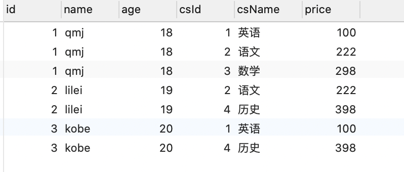

**2.查询学生的选课情况**

- 不关心选的什么课, 模型是两个左连接(1,1)
- 只要知道这个学生选了还是没选

```mysql
select stu.id stuId ,stu.name stuName, stu.age age, cs.name courseName, cs.price price
from students stu 
left join students_select_courses ssc on stu.id = ssc.student_id
left join courses cs on ssc.course_id = cs.id;
```

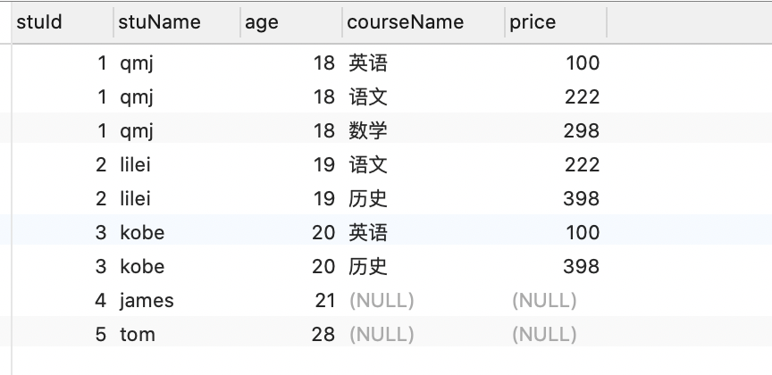

**3.哪些学生没有选课**

- 非常简单，只需要在2的基础上选出课程id为null的就行
- 注意一个坑，where 判断时不能用别名，要cs.id,而不是csId

```mysql
select stu.id stuId ,stu.name stuName, stu.age age,cs.id csId,, cs.name courseName, cs.price price
from students stu 
left join students_select_courses ssc on stu.id = ssc.student_id
left join courses cs on ssc.course_id = cs.id
where cs.id is null;
```


**4.查询哪些课没有被选择**

- 这个需求就要以课程表为主了
- 和学生没选课是一样的

```mysql
select stu.id stuId ,stu.name stuName, stu.age age,cs.id csId, cs.name courseName, cs.price price
from students stu 
right join students_select_courses ssc on stu.id = ssc.student_id
right join courses cs on ssc.course_id = cs.id
where stu.id is null;
```

**5.某一个学生选择哪些课程**

- 查看上面的筛选表格得知，在学生选课表基础上where id = x;即可

```mysql
#查询qmj选了那些课
select stu.id stuId ,stu.name stuName, stu.age age, cs.name courseName, cs.price price
from students stu 
left join students_select_courses ssc on stu.id = ssc.student_id
left join courses cs on ssc.course_id = cs.id
where stu.id = 1;
```

### 8.8返回结果的设计

#### 8.8.1将联合查询到的数据转成对象（多对多）

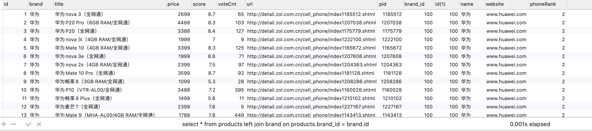

上面的结果显然不是我们想要的，我们想要这种查到的数据以json的形式返回

```json
{
	id: 1,
  title: '华为nova3',
  price: 2699,
  brand: {
		brandId: 2,
    name: '华为',
    website: 'www.huawei.com'
  }
}
```

**使用json_object将返回结果json化**

```mysql
select
	products.id id, products.title title, products.price price,
	json_object('id', brand.id, 'name', brand.name, 'website', brand.website) brand
from products
left join brand on products.brand_id = brand.id;
```

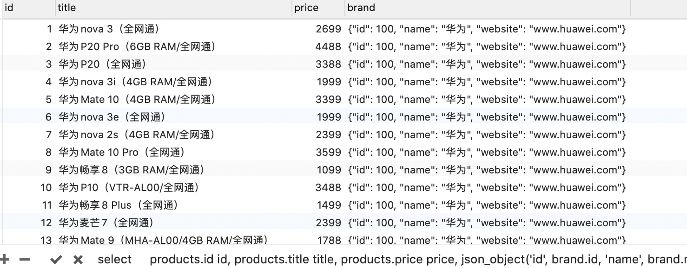

#### 8.8.2将查询到的多条数据，组织成对象，放入数组（多对多）


我们想要的数据是：

```json
{
  id: 1,
  name: 'qmj',
  age: 18,
  courses: [
    {id: 1, courseName: '英语', price: 100},
    {id: 2, courseName: '语文', price: 222},
    {id: 3, courseName: '数学', price: 298}
  ]
}
```


- 用id对他们分组，然后json_arrayagg配合json_object即可

```mysql
#学生课表查询json数组化
select 
	stu.id id, stu.`name` name, stu.age age,
	json_arrayagg(json_object('id',cs.id, 'name', cs.`name`, 'price', cs.price))
from students stu
join students_select_courses ssc on ssc.student_id = stu.id
join courses cs on ssc.course_id = cs.id
GROUP BY stu.id;
```

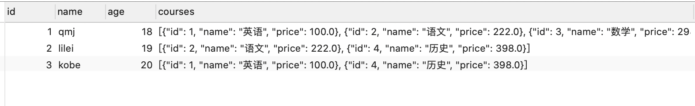

### 8.9node中使用数据库

- 安装mysql2
  - npm i mysql2

#### **8.9.1简单使用**

```js
const mysql = require('mysql2');

// 1.创建连接
const connection = mysql.createConnection({
  host: 'localhost',
  port: 3306,
  database: 'coderhub',
  user: 'root',
  password: '12345678'
})

// 2.执行mysql语句
const statement = `
  select * from products where price > 6000
`
connection.query(statement, (err, res, fields) => {
  console.log('res=>', res);
  // 拿到结果后终止
  connection.end();
})
```

#### 8.9.2预处理语句

- 提高性能
  - `select * from products where price>6000 and score>7`这种性能低
    - sql语句需要经过**解析->优化->转换->执行**
    - 每执行一次都要经过四个步骤，性能低
  - select * from products where price>？ and score>？
    - prepare()
    - query(6000,7)就可提升性能
    - 因为`prepare`的时候前面三个步骤都已经准备好了，不会重复执行
- 防止SQL注入
  - 原生语句是非常容易被SQL注入的
    - 比如需要账号密码正确才能查询敏感信息
    - 那么`select * from user where name=qmj and pssaword=123 or 1=1`就永远成立了
    - 所以他进入哪个页面都能成功，甚至是admin的权限都有
  - 因为预处理的时候就已经规定格式了，没有什么or 1 =1插入的机会

**connection.execute**

- 内部先调用prepare，再调用query
- 再次执行时会用LRU算法，对其缓存，节省了statement编译的时间，提升性能

```js
const mysql = require('mysql2');

// 1.创建连接
const connection = mysql.createConnection({
  host: 'localhost',
  port: 3306,
  database: 'coderhub',
  user: 'root',
  password: '12345678'
})

// 2.执行mysql语句
const statement = `
  select * from products where price > 6000 and score > 7
`

connection.execute(statement, [6000,7], (err, res) => {
  console.log(res)
})
```

#### 8.9.3连接池

**场景：**

- 创建了一个connection，发起了多个请求，那么很有可能这个连接被占用，难道需要每一次创建一个新的连接吗？

**解决：**

- 实际上mysql2提供了连接池(connection pools)
- 连接池在需要的时候自动创建连接，创建的连接也不会被销毁，放到连接池中，后续可以使用
- 可以在创建连接池的时候设置limit，设置最大的创建数

#### 8.9.4认识ORM

- 是对象和数据表的一种映射
- 不要去编写sql语句，直接去修改对象达到修改数据库的目的
- 常见的ORMJava中有mybatis，Hibernate，Node中有Sequelize

## 九、项目

### 9.1项目初始化

#### 技术栈

- koa+mysql+react
- 其他：
  - `dotenv`: 将.env文件加载到环境变量
  - `koa-router`: 帮助koa完成方法，路径匹配
  - `mysql2`,`bodyparser`，`jsonwebtoken`

#### 目录结构划分


### 9.2编写接口

#### 9.2.1大致逻辑

- main.js里面只做监听app，app从app文件里面导入。
- app.js里面注册各种第三方，`koa-router`，`bodyparser`等
  - app.js里面注册了各种路由，路由是在router文件中导入
- router文件在里面设置各种方法及路径，以及中间件操作
  - 但是每个中间件操作交给controller实现
    - controller内部一般做获取用户参数，开始查询，返回结果
  - 用类的方式导出controller
- controller内部做的数据查询交给service去做
  - 创建一个类，在内部实现方法，最后 new Class()导出
  - 内部做一些数据库交互的语句

#### 9.2.2用户注册

**加密存储密码**

#### 9.2.3用户登录

**验证登录**

`cookie+session+token(jwt)`

### **9.3登录凭证**

- 登陆成功后，让服务器给发一个登录凭证，两种方式：
  - cookie+session
  - token令牌

#### cookie

- 小型文本文件，网站用于存储在用户本地终端上的数据
- 浏览器在特定情况下携带cookie来发送请求，可以通过cookie来获取一些信息
- 有内存cookie和硬盘cookie两种：
  - 内存cookie保存在内存，关闭就消失，生命周期短暂
  - 硬盘cookie存在硬盘中，有过期时间，手动清理或者时间到期消失。
- 如何判断内存cookie还是硬盘cookie？
  - 没有过期时间就是内存cookie。
  - 过期时间不为0、负数就是硬盘。
- 设置cookie过期时间？
  - **expires**：固定的过期时间，年月日几点几分几秒。一般不会这样设置。
  - **max-age** ：设置过期的秒数，从现在开始7天，30天等等。
- cookie的作用域？
  - 你不能把baidu.com的cookie带到google.com里，所以有一个作用域的
  - domain：哪些主机可以接受cookie
    - 不指定的话，默认是origin，不包括子域名
    - 指定domain的话，就包括子域名
- 如何设置cookie
  - 客户端和服务端都可以设置，但一般情况下无服务设置的比较多。

```js
//客户端设置cookie
document.cookie = 'name=qmj;max-age=60*60*24;';

// 删除cookie
把max-age设置为0就是删除cookie

// 服务器设置cookie
ctx.cookie.set("name", "lilei", {
  maxAge: 5*1000,    //在node中maxAge的单位是毫秒
})
```

#### session

- session是基于cookie的。
- node中可以安装 `koa-session`

```js
//node中使用seesion 
const Session = require('koa-session');
const session = Session({
  key: 'sessionid',
  maxAge: 10*1000,
  signed: false,  // 默认是true的
}, app);
app.use(session);
```

#### 总结session和cookie

- cookie会被附加在每个HTTP请求中，无形增加了流量。
- cookie是明文传输的，所以存在安全性问题，在header里面拿到
- cookie大小是4kb，对于复杂的需求不够
- 对于浏览器外的前端，iOS，安卓，必须手动设置cookie和session
- 对于分布式系统和服务器集群中如何可以保证其他系统也可以正确的解析session？

#### token

- token相当于令牌，在账号密码正确的情况下，给用户颁发的。
- 这个令牌后续可以访问一些或接口者资源

#### JWT的Token组成

- header
  - alg：采用的加密算法，默认是 HMAC SHA256(HS256), 对称性加密
  - type: JWT，固定值
  - 通过base64Url算法进行编码
- payload
  - 携带的数据，比如我们可以将用户的id和name放到payload中
  - 默认会携带iat（issued at）令牌 的签发时间
  - 可以设置过期时间：exp（expiration）
  - 通过base64Url算法编码
- signature
  - 设置一个secretKey，通过将前两个的结果合并后进行HMACSHA256的算法
  - HMACSHA256（header + .base64Url + .base64Url(payload, secretKey)）;
  - 但是secretKey泄露非常危险，之后就可以模拟颁发token，也可以解密token；

```js
const jwt = require('jsonwebtoken');
const SERCET_KEY = "xxx";
const token = jwt.sign(user, SERCET_KEY, {
  expiresIn: 10
});

```

#### 非对称性加密RS256

- 需要公钥验证令牌和私钥颁发令牌
- 使用openSSL创建私钥，再根据私钥生成公钥

```bash
#进入交互
openssl

#生成私钥 生成rsa算法 导出 私钥 1024长度
genrsa -out private.key 1024

#通过私钥生成公钥 rsa -in private.key作为输入 表示生成公钥 导出 导出名字
rsa -in private.key -pubout -out public.key
```

**加密**

```js
// 根据加密算法生成token签名，
const token = jwt.sign({ id, name }, PRIVATE_KEY, {
  expiresIn: 60 * 60 * 24,
  algorithm: "RS256"
});

// 验证token
```

**解密**

```js
const verifyAuth = async (ctx, next) => {
  console.log("验证授权的middleware~");

  // 1.获取token
  const authorization = ctx.headers.authorization;  // 存储在头部字段中
  const token = authorization.replace('Bearer ', ''); // 将头部字段中的Bearer 去除，只取token相关

  // 2.验证token 需要拿到公钥 传入token，公钥，加密算法，返回结果里面有生成token的id，name信息
  try {
    const result = jwt.verify(token, PUBLIC_KEY, {
      algorithms: ['RS256']
    });
    ctx.user = result;
    await next();
  } catch (err) {
    const error = new Error(errorTypes.UNAUTHORIZATION);
    ctx.app.emit('error', error, ctx);
  }
}
```

### 9.4查询数据处理

#### 外键展示外键表的数据

```mysql
select 
m.id id, m.content, m.createAt createTime, m.updateAt updateTime,
json_object('id', u.id, 'name', u.name) user
from moment m
left join users u on u.id = m.user_id
where m.id = 1;
```


### 9.5捕获异常

在出错的时候显示没有权限，因为语句不正确的时候，他会去查找哪里有没有捕获异常，这个中间件没有就去上一个中间件，所以在修改动态的接口里面查找到验证token权限的中间件，里面捕获异常。