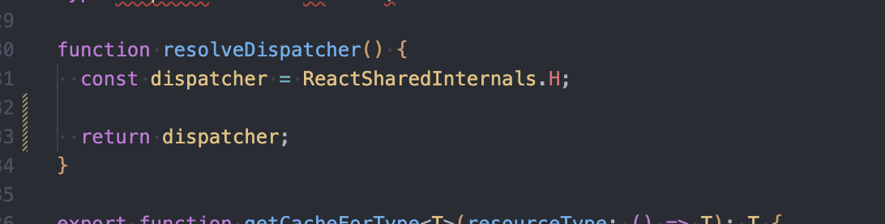
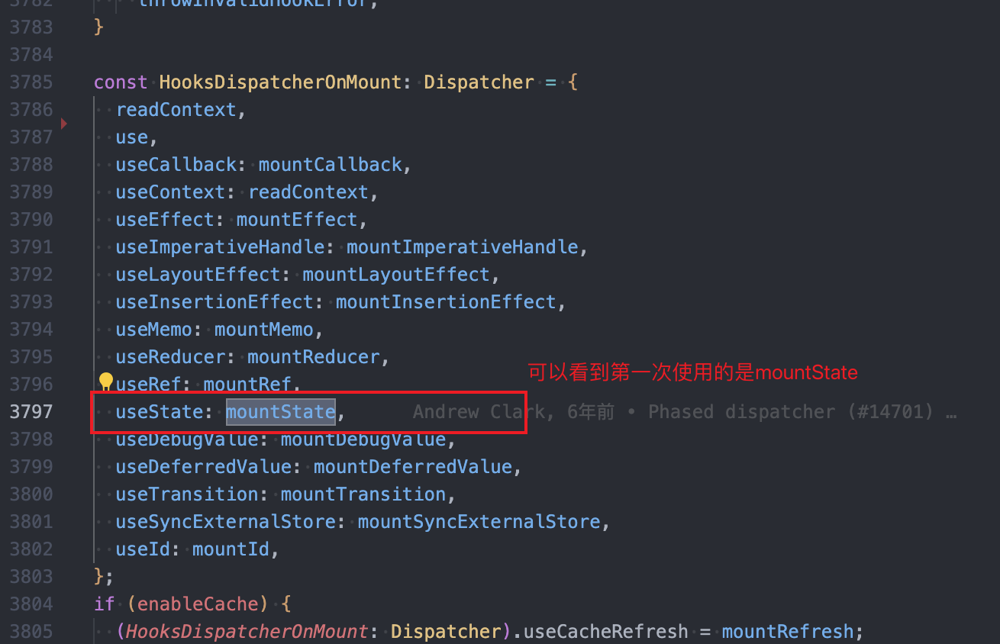

### 1.useState的本质


- 可以看到useState的本质上就是dispatcher.useState(initialState)
- 那么这个dispatcher是个啥呢？



### 2.dispatcher是什么？

- 上面可以看到dispatcher是resolveDispatcher生成的
- 在renderWithHooks里面，如果是有hook的组件，那就回调用这个函数
- 所以dispatcher本质上是HooksDispatcherOnMount（第一次执行）或者HooksDispatcherOnUpdate（后续更新）
- 这个current是fiber，第一次渲染的时候，肯定是null
- 然后current.memoizedState就是我们的state，被挂载到fiber上面了


### 3.看一下第一次使用useState调用的HooksDispatcherOnMount是干嘛的



### 4.看下mountState是干嘛的

- 首先通过mountWorkInProgressHook创建好hook
  - mountWorkInProgressHook内部会判断当前有没有hook
  - 没有就创建并返回，有的话会创建用next以链表的形式连接在当前hook后面
  - 然后用末尾的hook设置为 workInProgressHook
- 判断mountState传的参数是不是函数
  - 如果是函数需要执行得到初始值然后赋值给hook对象的memoizedState
  - 如果不是函数就直接赋值给memoizedState
- 然后把初始值和dispatch返回出去了


### 5.dispatch是怎么生成的？

- 可以看到dispatch = dispatchSetState.bind(null, currentlyRenderingFiber, queue)
  - currentlyRenderingFiber是一个全局fiber，第一次肯定没有值，第二次就有值了
  - queue的话就是mountStateImpl创建的

### 6.如果调用setState会发生什么？如果调用很多次？

- 首先会创建一个update对象，为什么要一个update对象而不是直接执行呢？
  - update这种更新操作不是创建就要执行的
  - 需要等到浏览器有空闲时间的时候再去更新fiber的
- 如果执行多次的话，它会把这些更新以链表的形式放到mountState创建的queue队列里面


### 7.如何提交update的更新？

- 本质上是调用lastRenderedReducer，其实本质是useState底层就是useReucer
- lastRenderedReducer把action（就是setState的值）传入会生成新的state，再把新state存在update里面
- 所以update是可以记录最新的state的，更新完的值是会保留下来的，保存在update（fiber）里面的eagerState

## 二、第二次执行UseState

### 1.第二次useState的本质

- 根据上面第二节renderWithHooks的图可知，第二次进去执行的可是HooksDispatcherOnUpdate
- 里面的useState是updateState而非mountState了
- 那么updateState的本质是啥
  - 可以看到源码是updateReducer


### 2.updateReducer做了啥？

- 里面做的也是将我们定义的多个hook用链表的形式存起来
- 这就是为什么hooks不能用if或者其他判断语句，因为这样的话链表会错乱


### 3.updateReducer如何执行更新？

- 之前调用setState的时候，是会存一些pending到queue里面的
- 然后会把这些pending取出来，判断是否为空
  - 如果是空的话，就不需要执行了
  - 如果不是空的话，需要查看优先级，然后里面do while循环去执行，计算出最新的state
  - 然后会把最新的state存在*hook*.memoizedState里面


## 数据结构

### 1.hook

```js
const hook = {
  // hook的状态
  memoizedState: null,

  baseState: null,
  baseQueue: null,
  queue: null,

  next: {// 链接的下一个hook
    memoizedState: null,
    baseState: null,
    baseQueue: null,
    queue: null,
    next: null
  }, 
};
```

### 2.queue

```js
const queue: UpdateQueue<S, A> = {
  pending: null,
  lanes: NoLanes,
  dispatch: null,
  lastRenderedReducer: reducer,
  lastRenderedState: initialState,
};
```

