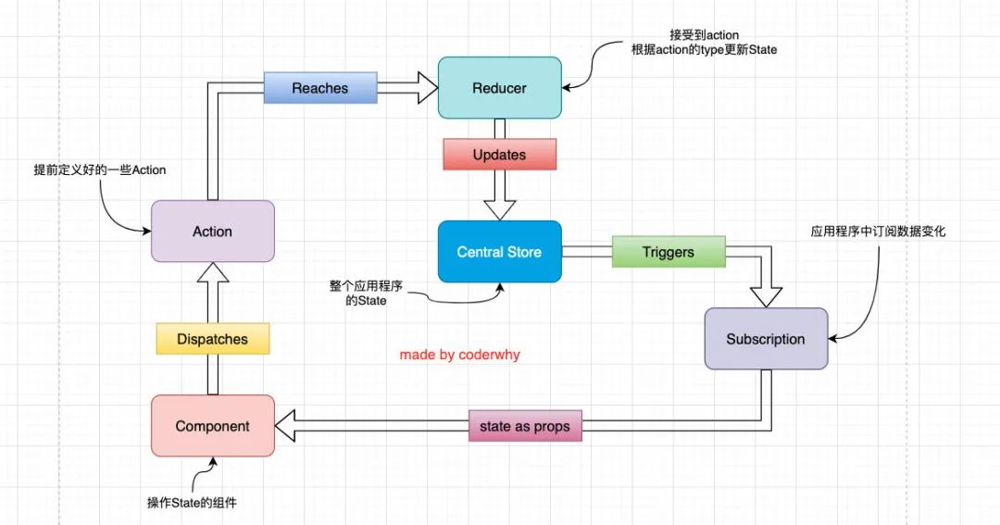

### 1.使用redux流程

```
1.Central Store: 唯一数据源开始。
2.在组件里面进行订阅Store，保持state永远最新。
3.修改数据的时候就派发action。action是体检定义好的。
4.dispatch的时候，action就会到达reducer里面。
5.在reducer里面对action进行switch，最后对state进行更新到Central Store。
```



### 2.在组件中展示redux数据&修改数据

```
1.在组件中导入store，action
2.使用store.getState().属性获取相关数据
3.记得使用生命周期函数监听数据的改变，及取消订阅，否则不会重新render
4.修改数据的时候直接调用store里面的dispatch(action)即可
```

```jsx
import React, { PureComponent } from 'react'
import store from './store/index'
import {
  addAction,
  subAction,
  incrementAction
} from "./store/actionCreators";

export default class Counter extends PureComponent {
  constructor(props) {
    super(props)

    this.state = {
      counter: store.getState().counter
    }
  }
  componentDidMount() {
    this.unsubscribue = store.subscribe(() => {
      this.setState({
        counter: store.getState().counter
      })
    })
  }

  componentWillUnmount() {
    this.unsubscribue();
  }

  render() {
    console.log(store)
    return (
      <div>
        <h2>
          <button onClick={e => this.addNumber(-10)}>-10</button>
          当前计数: {this.state.counter}
        </h2> 
        <button onClick={e => this.addNumber(5)}>+5</button>
        <button onClick={e => this.increment()}>+1</button>
      </div>
    )
  }
  addNumber(n) {
    store.dispatch(addAction(n))
  }
  subNumber(n) {
    store.dispatch(subAction(n))
  }
  increment() {
    store.dispatch(incrementAction())
  }
}
```


### 3.实现connect函数

> 可以看到上面那种书写方式的冗余代码非常多，所以需要一个方法将冗余代码抽离出去，在高阶函数里面为组件添加这些公共的属性。

connect高阶函数接收两个参数：

- mapStateToProps 将store里面的数据共享给组件
- mapDispatchToProps 将dispatch函数传给组件，让他自己完成相关操作

connect内部实现的操作：

- 接收两个参数。。。
- 返回一个高阶函数，里面需要传入一个参数，为组件
- 高阶函数返回一个组件，在这个组件里面为其添加各种属性，为数据做订阅及取消订阅事件

具体代码实现：

```jsx
import React,{ PureComponent } from "react"
import store from '../store'

export function connect(mapStateToProps, mapDispatchToProps) {
  return function enhanceHOC(WrappedComponent) {
    return class extends PureComponent {
      constructor(props) {
        super(props);

        this.state = {
          storeState: mapStateToProps(store.getState())
        }
      }
      // 需要生命周期函数对数据进行监听才可以更新数据，不然无法完成更新数据

      componentDidMount() {
        this.unsubscribe = store.subscribe(()=> {
          this.setState({
            storeState: mapStateToProps(store.getState())
          })
        })
      }

      // 做取消订阅事件
      componentWillUnmount() {
        this.unsubscribe();
      }
      render() {
        return <WrappedComponent {...this.props} // 将自己本身的属性传给组件
                                 {...mapStateToProps(store.getState())} //将store里面数据共享给组件
                                 {...mapDispatchToProps(store.dispatch)}/> // 将dispatch这个函数传给它，自己完成操作
      }
    }
  }
}
```

