## 一、JSX的本质

### 1.JSX的语法糖

- 本质是React.createElement的语法糖
- 所有的JSX最终都会被转成React.createElement的函数调用。

```jsx
const message1 = <h2>Hello React</h2>
const message2 = React.createElement(标签，属性，子组件);
```

### 2.源码

目录：packages/react/index.js

判断环境：开发环境就会有更多的报错提示

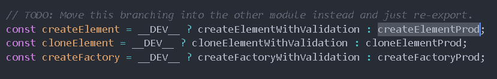

报错：

- 你是否忘记导出的你的组件

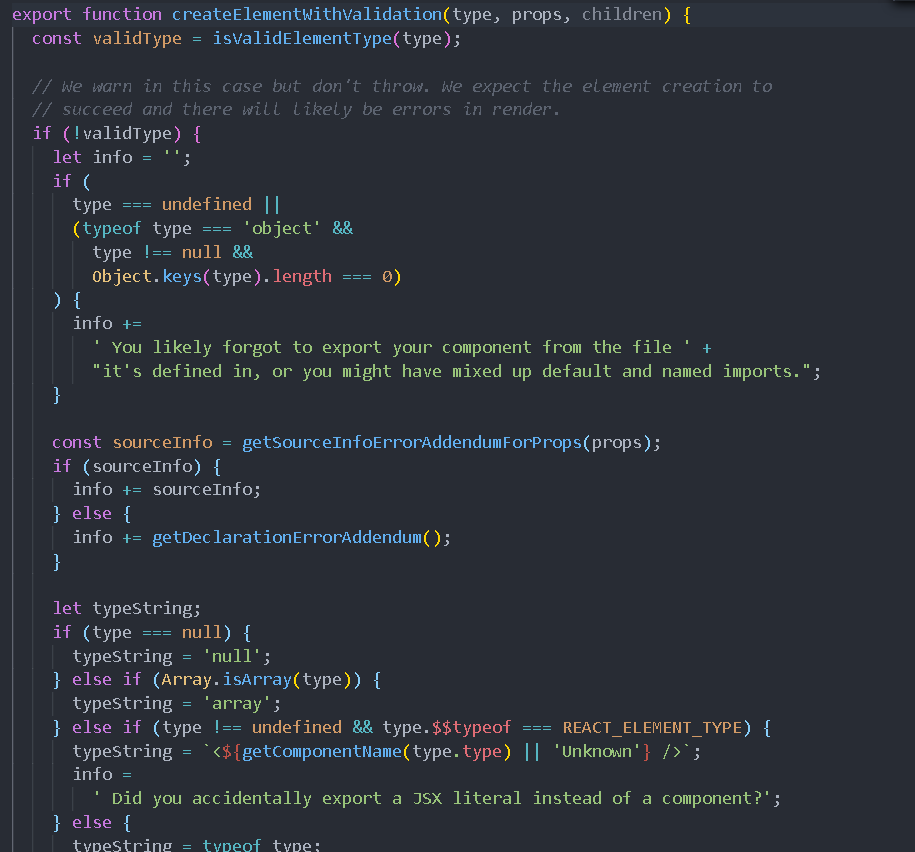

### **3.createElement源码**

#### 判断环境部分

- export function createElement(type, config, children)
- 参数分别是tag类型（组件），属性，子组件

疑问：children是复数，但是这里只传一个参数，那么怎么传复数形式呢？

#### 取出config属性部分

- 这一步将config里面的属性值取出来。
- 判断有没有key，ref，self，source这些属性，取出来保存在当前函数内部。
- 然后再用for in 遍历将config里面的propName保存在函数内部的propName里面。

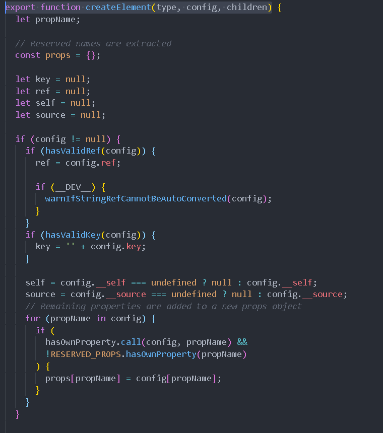

#### 判断children部分

- 孩子的长度为arguments.length - 2
- 长度不同做不同的事，长度1的话props.children = children; 长度>1,创建数组，把每个child存入数组。props.children = childrenArray；

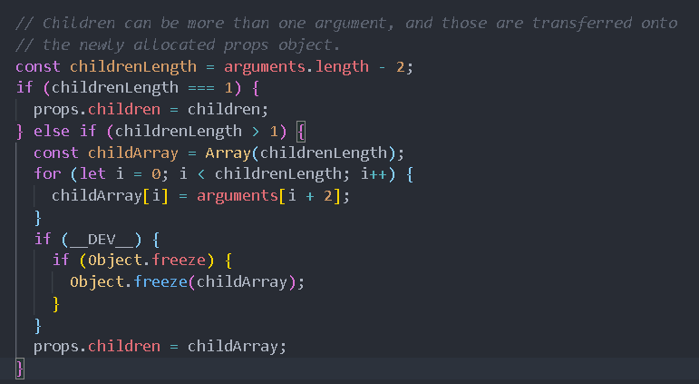

#### type部分

#### 返回部分

- 返回的是ReactElement对象,最终创建的是ReactElement对象。
- 因为React利用ReactElement对象组成了一个JavaScript的对象树。
- 这个对象树就是大名鼎鼎的 **虚拟DOM**

```js
 return ReactElement(
    type,
    key,
    ref,
    self,
    source,
    ReactCurrentOwner.current,
    props,
  );
```

## 二、setState同步异步判断

说明：setState有些时候是同步的，有些时候是异步的。多次累加只会作用一次，内部都是怎么做的？

### 初始判断

- partialState要么是对象，要么是函数，要么是null，必须是其中一个。
- 不是三个其中一个就会报出警告
- 实际执行的是**updater.enqueueSetState**

```js
Component.prototype.setState = function(partialState, callback) {
  invariant(
    typeof partialState === 'object' ||
      typeof partialState === 'function' ||
      partialState == null,
    'setState(...): takes an object of state variables to update or a ' +
      'function which returns an object of state variables.',
  );
  this.updater.enqueueSetState(this, partialState, callback, 'setState');
};
```

### updater

#### enqueueSetState

- 上面提到的**updater**又是什么？它是属于**react-reconciler**里面的。他会把更新内容渲染到真实DOM上。
- 每个类组件都有updater，对应的是**classComponentUpdater**,setState就是把里面的enqueueSetState取出来调用。

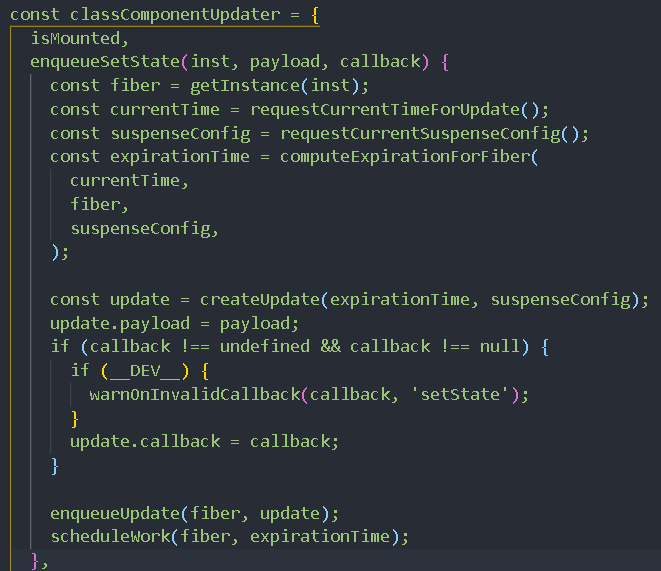

#### **enqueueSetState里面的requestCurrentTimeForUpdate**

- 里面关键的一点就是在**requestCurrentTimeForUpdate**这个函数里面，同步异步就是根据该函数里面的上下文决定的，生命周期和React合成事件/setTimeout和原生DOM事件 这两个渲染上下文是不一样的。
- 根据不同上下文，返回一个不同时间currentTime

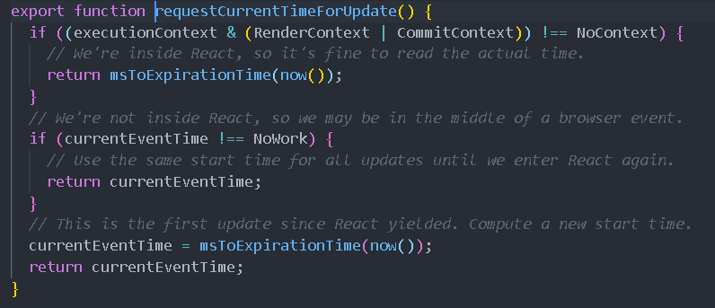

#### enqueueSetState里面的computeExpirationForFiber

- 计算过期时间，把currentTime传进去，再把fiber(当前组件实例)传进去。
- 在computeExpirationForFiber函数内部把fiber的mode取出来，去判断返回的是同步还是批量处理
- 批处理就是异步的意思

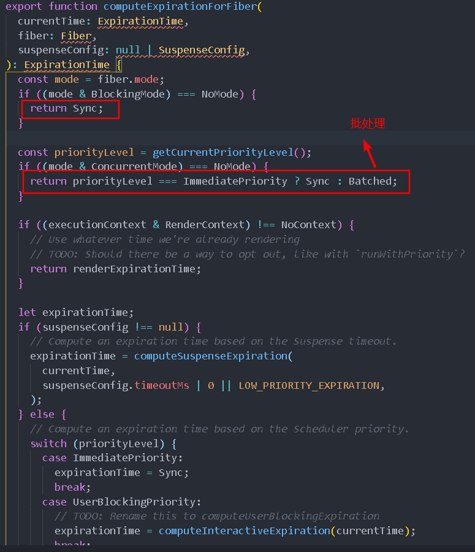

#### enqueueSetState里面的createUpdate

- 上面计算过期时间的返回值，作为参数传给createUpdate，生成update(最上面源码)

## 三、setState数据合成

在setState修改数据时，state里面有多个属性，但修改只需要传入被修改的属性即可，怎么做到的呢？

### processUpdateQueue里面的getStateFromUpdate函数

- 获取到更新的state放入新的state

```
// Process this update.
  newState = getStateFromUpdate(
    workInProgress,
    queue,
    update,
    newState,
    props,
    instance,
  );
  
该函数返回
  return Object.assign({}, prevState, partialState);
原因是做了一个浅拷贝
```

## 四、setState本身合成

一个合成事件里面有多个setState时，都只会进行一次，因为源码内部，进行了do...while...循环，do...while里面把进行了多次的setState，getStateFromUpdate就是在这个循环里面执行，每一次都是将前一次的state和下一次的state进行合并。

因为prevState一定是每一次都是do...while循环之前的值，所以多次更新只会执行最后一次。

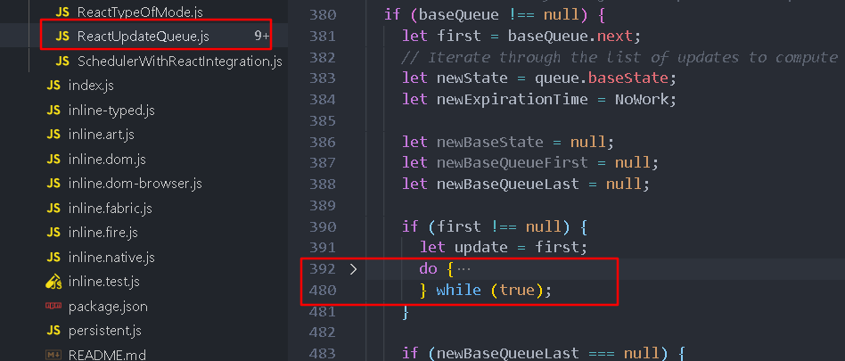

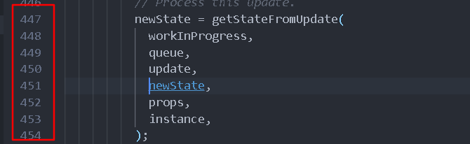

但是如果想要他进行多次累加，就可以把setState里面的参数换为函数。

## 五、SCU、Memo、Pure

> 父组件里面嵌套子组件，当父组件重新render时，里面所有组件都会进行重新渲染，这是非常没必要的，可以通过SCU（类特有）手动判断是否需要更新，Memo包裹函数组件，继承PureComponent去自动判断是否更新。

### SCU

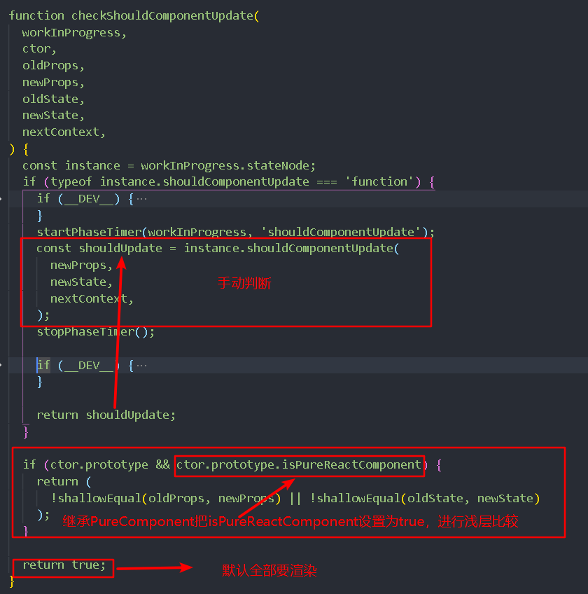

### PureComponent

- 继承这个组件时，他就会把isPureReactComponent = true
- 那么SCU里面的浅层比较将会被调用

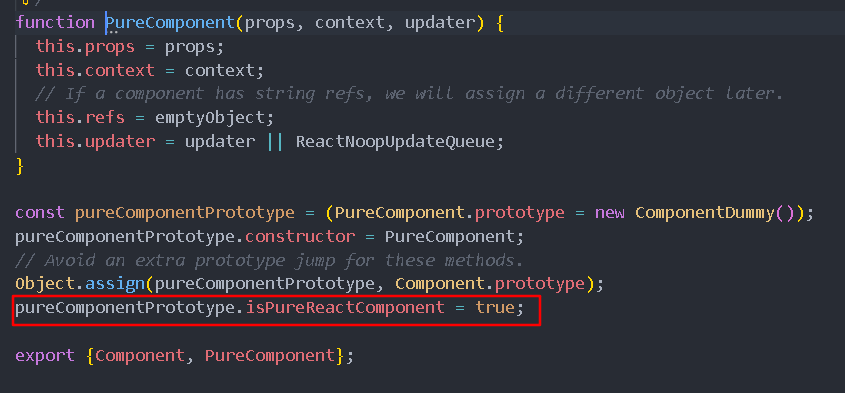

### 浅层比较函数

- 里面比较的是新旧props和新旧state
- pureComponent默认返回的是false，不更新(render不调用)
- 只要浅层比较就行了，深层比较浪费性能。

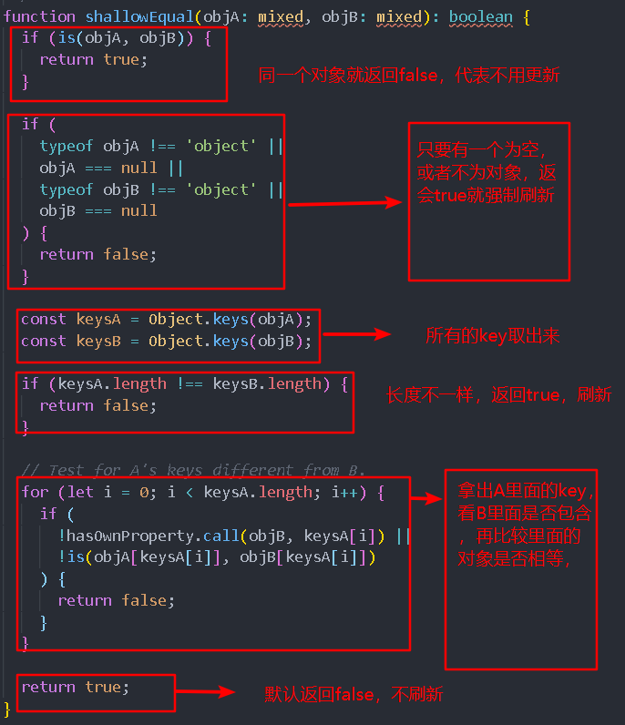

- 


## 六、hooks原理

- 源码：packages/react/src/ReactHooks.js
- 本质上是一个dispatcher，用的是dispatcher.useReducer(reducer, *initialArg*, *init*)

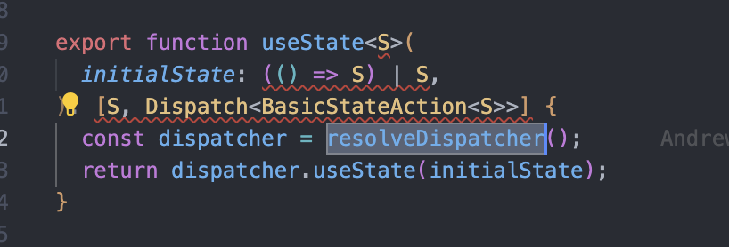

- 第一次进来的时候
  - current就是fiber，fiber是为null的
  - memoizedState就是记录state数据的，也是空的
  - 这个时候用的是挂载hooksDispatcher（HooksDispatcherOnMount）
- 再后面进来的时候
  - 使用的是HooksDispatcherOnUpdate，更新hooks的Dispatcher 

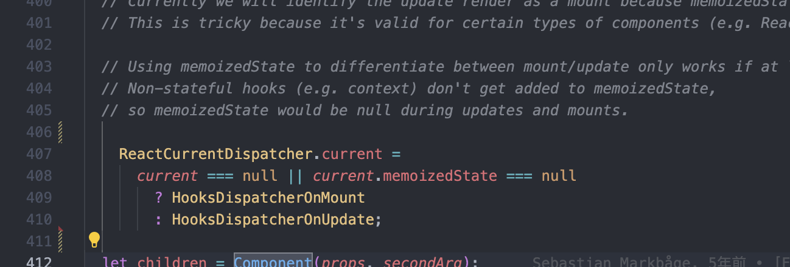

### 2.挂载hooks——HooksDispatcherOnMount

- 第一次进来需要给current赋值HooksDispatcherOnMount
- 这样current就有hooks了
- 里面useState的值是mountState

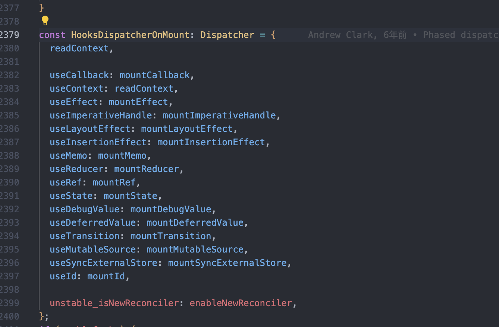

- mountState源码
  - 所以第一次进来的时候hook是通过调用mountWorkInProgressHook得到的，见下面源码
  - 第一次进来得到空hook，然后判断当前传进来的initialState是否为函数，是的话，执行一下得到initialState值
  - 然后把初始值给保存到hook的memoizedState里面
  - 最后会把 return [hook.memoizedState, dispatch]，初始值和dispatch修改方法都返回出去
  - useState内部是useReducer
  - dispatch又是怎么来的？

```js
function mountState<S>(
  initialState: (() => S) | S,
): [S, Dispatch<BasicStateAction<S>>] {
  const hook = mountWorkInProgressHook();
  if (typeof initialState === 'function') {
    // $FlowFixMe: Flow doesn't like mixed types
    initialState = initialState();
  }
  hook.memoizedState = hook.baseState = initialState;
  const queue: UpdateQueue<S, BasicStateAction<S>> = {
    pending: null,
    interleaved: null,
    lanes: NoLanes,
    dispatch: null,
    lastRenderedReducer: basicStateReducer,
    lastRenderedState: (initialState: any),
  };
  hook.queue = queue;
  const dispatch: Dispatch<
    BasicStateAction<S>,
  > = (queue.dispatch = (dispatchSetState.bind(
    null,
    currentlyRenderingFiber,
    queue,
  ): any));
  return [hook.memoizedState, dispatch];
}
```

- mountWorkInProgressHook源码
  - 首先定义了一个空hook
  - 第一次进来workInProgressHook肯定是null，所以workInProgressHook定义为了空hook
  - 第二次进来的时候就 workInProgressHook = workInProgressHook.next = hook，用链表结构挂载hooks了

```js
function mountWorkInProgressHook(): Hook {
  const hook: Hook = {
    memoizedState: null,

    baseState: null,
    baseQueue: null,
    queue: null,

    next: null,
  };

  if (workInProgressHook === null) {
    // This is the first hook in the list
    currentlyRenderingFiber.memoizedState = workInProgressHook = hook;
  } else {
    // Append to the end of the list
    workInProgressHook = workInProgressHook.next = hook;
  }
  return workInProgressHook;
}
```

- dispatchSetState源码
  - 通过mountState源码可以看到，修改State的方法dispatch是通过dispatchSetState获取到的
  - 那现在看看dispatchSetState是长什么样的，也就是调用setState会发生什么操作
  - 调用setCount的时候，会生成update，将新的数值存进去，等浏览器有空闲时间的时候去执行
  - 如果多次调用setCount，把会多个update用链表的形式存储起来，等浏览器空闲的时候执行
  - 然后会把更新后的值保存下来，下一次可以使用

```js
function dispatchSetState<S, A>(
  fiber: Fiber,
  queue: UpdateQueue<S, A>,
  action: A,
) {

  const lane = requestUpdateLane(fiber);

  const update: Update<S, A> = {
    lane,
    action,
    hasEagerState: false,
    eagerState: null,
    next: (null: any),
  };

  if (isRenderPhaseUpdate(fiber)) {
    enqueueRenderPhaseUpdate(queue, update);
  } else {
    enqueueUpdate(fiber, queue, update, lane);

    const alternate = fiber.alternate;
    if (
      fiber.lanes === NoLanes &&
      (alternate === null || alternate.lanes === NoLanes)
    ) {
      const lastRenderedReducer = queue.lastRenderedReducer;
      if (lastRenderedReducer !== null) {
        let prevDispatcher;
        if (__DEV__) {
          prevDispatcher = ReactCurrentDispatcher.current;
          ReactCurrentDispatcher.current = InvalidNestedHooksDispatcherOnUpdateInDEV;
        }
        try {
          const currentState: S = (queue.lastRenderedState: any);
          const eagerState = lastRenderedReducer(currentState, action);
          update.hasEagerState = true;
          update.eagerState = eagerState;
  
        } catch (error) {
          // Suppress the error. It will throw again in the render phase.
        } finally {
          if (__DEV__) {
            ReactCurrentDispatcher.current = prevDispatcher;
          }
        }
      }
    }
    const eventTime = requestEventTime();
    const root = scheduleUpdateOnFiber(fiber, lane, eventTime);
    if (root !== null) {
      entangleTransitionUpdate(root, queue, lane);
    }
  }

  markUpdateInDevTools(fiber, lane, action);
}
```

### 3.总结第一次进来的操作

```
1.调用useState本质上内部调用的是dispatcher：resolveDispatcher().useState(initialState)
2.那这个dispatcher是什么，内部有什么东西呢？第一次进来的时候是啥都没有的，所以需要挂载hooksDispatcher
3.里面有mountState，也就是useState。
4.mountState里面做了啥呢？
	1.首先调用mountWorkInProgressHook生成了一个空hook，初始值，链表的next，队列等啥都是空的
	2.然后判断当前的初始值是否为函数，如果是函数那就执行得到初始值，赋值给这个hook的记忆值（hook.memoizedState）
	3.然后会生成一个队列，将队列放入hook中
	4.然后生成dispatch，同时将dispatch加入queue中，也就是setState修改方法，需要把队列和当前fiber（全局对象）传进去生成
5.如何生成dispatch？
	1.因为需要再浏览器空闲时间才执行fiber的更新，所以生成dispatch函数里面生成了一个update，多次调用生成多个update
	2.update里面有next属性，也就是链表结构，浏览器空闲的时候会一个一个拿出来更新
6.执行setCount发生什么？
	1.本质上就是执行内部的dispatchAction
	2.首先会创建一个update，因为浏览器需要等空闲时间才能执行fiber更新，然后把update存进queue里面 
	3.然后拿到update里面的action一个一个执行更新
		1.执行lastRenderedReducer获取到最新的值，然后把最新的值保存下来，渲染更新
```

### 4.更新State

- 第二次进来的时候，useState就不是mountState了，而是updateState了
- 可以看到，updateState本质上就是updateReducer，也就说更新的时候，useState===useReducer

```js
function updateState<S>(
  initialState: (() => S) | S,
): [S, Dispatch<BasicStateAction<S>>] {
  return updateReducer(basicStateReducer, (initialState: any));
}
```

### 5.为啥不能用if

- 本质上这些hooks都是用链表存储，如果if语句，会导致链表错乱，next取错

## 七、Redux

### 1.redux中间件实现原理

