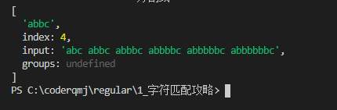

## 一、正则表达式字符匹配攻略

### 1.1模糊匹配

- 对于大多数场景，精确匹配是没有意义的，如 `/hello/`只能匹配字符串的 `"hello"`这个子串

```js
let regex = /hello/;
console.log(regex.test("hello"));  // true
console.log(regex.test("hello1"));  // true
console.log(regex.test("hdllo1"));  // false
```

- 正则的强大归功于模糊匹配，分为**横向模糊**与**纵向模糊**

#### 1.1.1横向模糊

- 一个正则可匹配的字符串的长度不是固定的，可以是多种情况的。
- 比如正则 `/ab{2,5}c/` 表示匹配这样一个字符串：第一个字符是 "a"，接下来是 2 到 5 个字符是 "b"（2个b——5个b，1个和6个都不行），最后 是字符 "c"

```js
let regex1 = /ab{2,5}c/g   // 开始是a，2-5个是b，结束是c
let string = "abc abbc abbbc abbbbc abbbbbc abbbbbbc";
console.log(string.match(regex1));
// [ 'abbc', 'abbbc', 'abbbbc', 'abbbbbc' ]
```

- 注意，`/ab{2,5}c/g`中的g(global)代表这个字符串所有的子集，返回一个数组，下面是没有g的输出:




#### 1.1.2纵向模糊

- 匹配某一个字符串，可以不是某个确定的字符，如[a,b,c]，表示"a", "b", "c"中的任何一个
  - 如`/a[123]b/` 可以匹配："a1b", "a2b", "a3b"

```js
// 纵向模糊匹配
let regex2 = /a[123]b/g   // 可以匹配所有情况为：a1b a2b a3b
let string1 = "a0c a1b a2b a3b a4b";
console.log(string1.match(regex2));
// [ 'a1b', 'a2b', 'a3b' ]
```

### 1.2字符组

- 虽然是字符组，但只是其中一个字符
- 例如`[abc]`,表示匹配一个字符，他可以是a,b,v之一

#### 1.2.1范围表示法

- 如果要匹配数组0-9的，字母a-z的，难道需要写入10个数字和26个字母吗？虽然可以，但是效率和可读性都是非常差的。
- 比如`[123456abcdefGHIJKLM]`，可以写成 `[1-6a-fG-M]`。
- 那么又有一个问题，如果想要匹配字符串a-z三个中的一个呢？
  - 答案肯定是不能`[a-z]`，因为其表示了任意小写字母
  - 需要写成`[-az]` || `[az-]` || `[a\-z]`

#### 1.2.2排除字符组

- 纵向模糊匹配中，还有一种情况是，字符串不能有某些字符，比如说不能有a || b || c
- 如`[^abc]`表示是除了a,b,c之外的任意一个字符，^表示求反。

#### 1.2.3常见的简写形式

| 字符组 | 具体含义                                                     |
| ------ | ------------------------------------------------------------ |
| \d     | 表示[0-9]，是一个数字                                        |
| \D     | 表示["^"0-9]，表示除了数字外的任意字符                       |
| \w     | 表示[0-9a-z-A-Z_]。表示数字、大小写字母和下划线              |
| \W     | 表示["^"0-9a-zA-Z_]                                          |
| \s     | 表示[\t\v\n\r\f]。表示空白符，包括空格，水平制表符、垂直制表符、换行符、回车符、换页符 |
| \S     | 非空白符                                                     |
| .      | [^\n\r\u2028\u2029]。通配符，表示几乎任意字符。换行符、回车符、行分隔符和段分隔符 除外。 |

想要匹配任意字符怎么办？可以使用 [\d\D]，[\w\W]、[\s\W]和[^]

