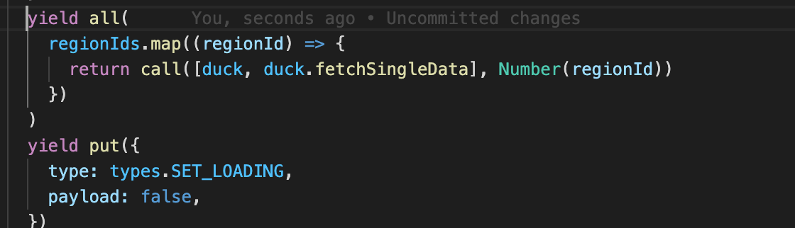
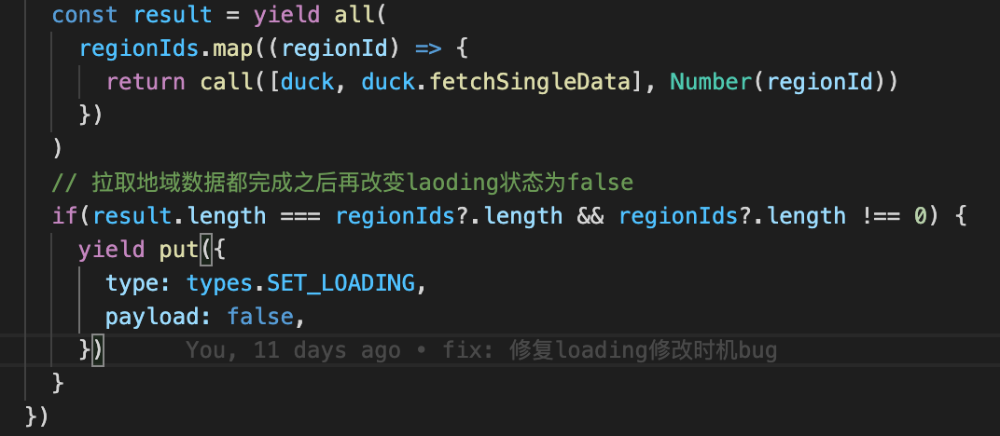

## 一、工作记录

### 1.lighthouse空白页设计

**需求**

- 基于新的Tea2空白页组件，对lighthouse空白页进行更新
- 在lighthouse没有服务器的时候，那就需要展示空白页
- 

**说明**

- 属于一个比较简单的小需求，只需要根据新版的tea2组件库填充相应的内容即可
- 但是遇到了一个之前同事的bug，更新机制不对，造成了闪屏：
  - 里面有服务器列表，但是会先展示空白页，再展示服务器列表

**问题分析**

- 代码逻辑中会有若干个地域列表，然后会去每个地域列表数组中拉取该账号的服务器
- 
- 可以看到上面代码
  - 想拉取全部地域数据完成之后，再改变loading为不加载状态，展示页面
  - 但是`yield all`里面是异步的，下面的`yield put`会先执行，那么这个时候没有拉取到服务器数据，服务器列表长度为0，那么就会展示空白页了，之后`yield all`被执行，有数据了，更新页面，展示列表
  - 以上就是闪屏的原因分析

**解决方案**

- 第一个解决方案由导师提供
  - 设置一个map，key为地域列表，value为boolean值，代表是否被请求过，默认为false，等所有的value都为true则说明完成地域列表服务器请求，可以改变loaidng状态
  - 每一次执行`call([duck, duck.fetchSingleData], Number(regionId))`就在这个函数里面去改变对应id的value
  - 最终可以解决这个问题，但是由于map需要传到子函数立面，可阅读性较差，最终review代码时，不予以采用。
- 第二个方案也是由导师提供
  - 用一个变量记录下地域列表的长度，然后每次执行拉取服务器数据的子函数时，就对这个变量进行-1
  - 等到这个变量减到0时，那么就可以把loading状态改为false了
  - 最终这个方案并没有解决问题，因为这个组件可能被多个地方使用，每次执行时会执行两遍，把变量减为负数（比如地域列表长度10，最终被减到-10）
- 第三个解决方案由自己想出
  - 阅读文档后发现，yield all后也会返回数组
  - 去判断返回的这个数组的长度为地域列表的长度即说明其完成请求
  - 

**感悟与思考**

- 归根结底还是对redux-saga的api各方面细节不够熟悉，之前是一直使用redux-thunk，虽然大致思想差不多，但是有些细节性的东西需要我们去注意，我想对某些技术的细节认知的够不够深，往往也是评价一个工程师资深与否的重要标准。
- 如果想要做一个优秀的工程师，需要写出优雅的代码，具有较好的阅读性，这个需求的第一个解决方案，虽然解决了问题，但是别人可能读不懂代码。

