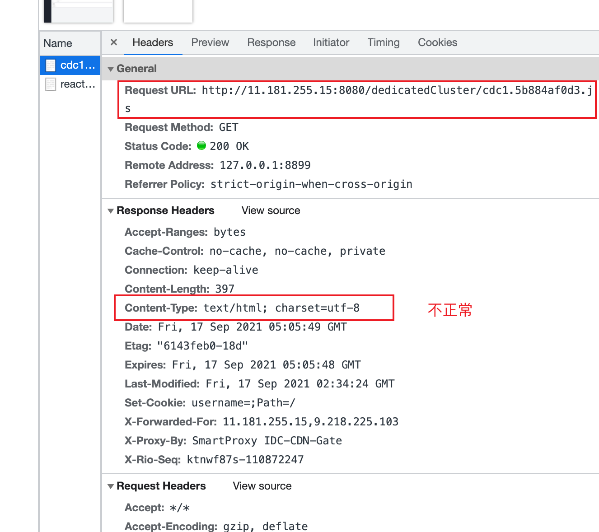
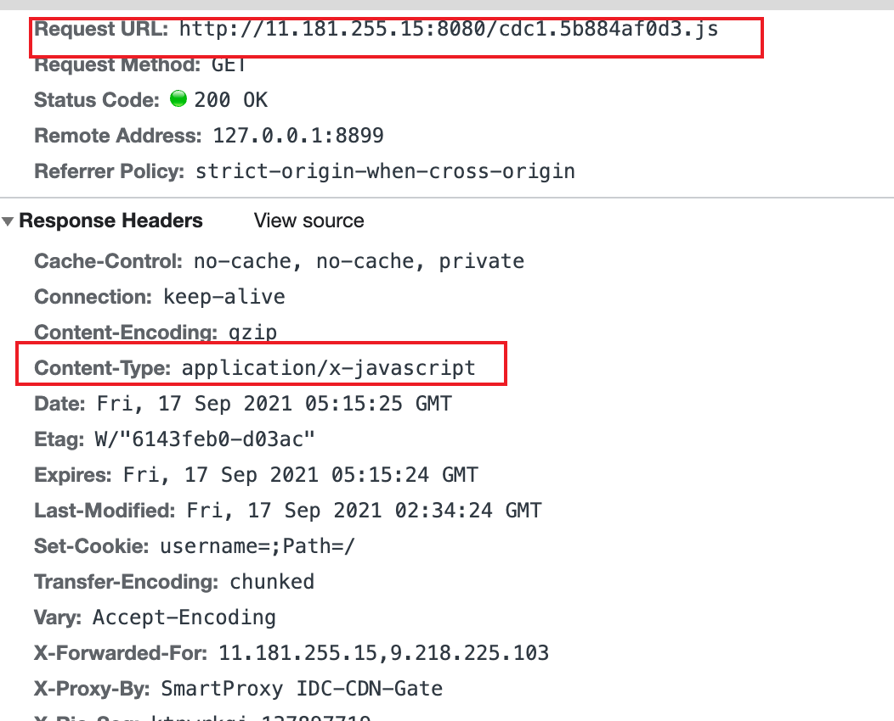

### 1.20210811购买页404

**事件描述**

- 0810时在ars上做了正式灰度发布，当天发了一批机器没发现什么问题。
- 等第二天把剩余机器发布之后，就产生现网404的事故

**事故原因**

- 在我正式发布之后（0810-0811），又有另外的同事在同一台机器上发布测试版本，把我的Lighthouse版本文件覆盖住了。
- 所以等我第二天发布，我就把我同事的版本给发布到现网上去，造成了404

**事故分析**

#### 2.20210811Unexpected token '<'

- 本地项目是没问题的，上线后正常没问题，但是刷新就会报错：
  - Unexpected token '<'
- `<!DOCTYPE html>`

**分析**

- 第一张图片请求到的文件变为html格式解析，第二张则是正常有用的。

### 2.useQuery缓存问题

**事件描述**

- 在使用query请求信息时，使用antd的Input的defaultValue时，会使用到上一次的缓存值

**解决**

- 设置cacheTime: 0,

### 3.版本不同的npm为啥一个报错，一个是正常的

### 4.post请求为啥变成了options请求？为啥跨域头设置了*还是报跨域的错

### 5.实现导出功能

### 6.请求api如何缓存，提高性能