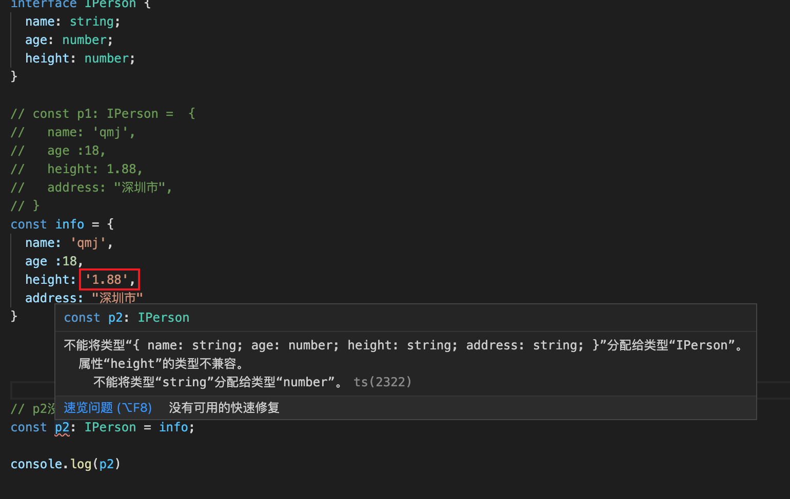
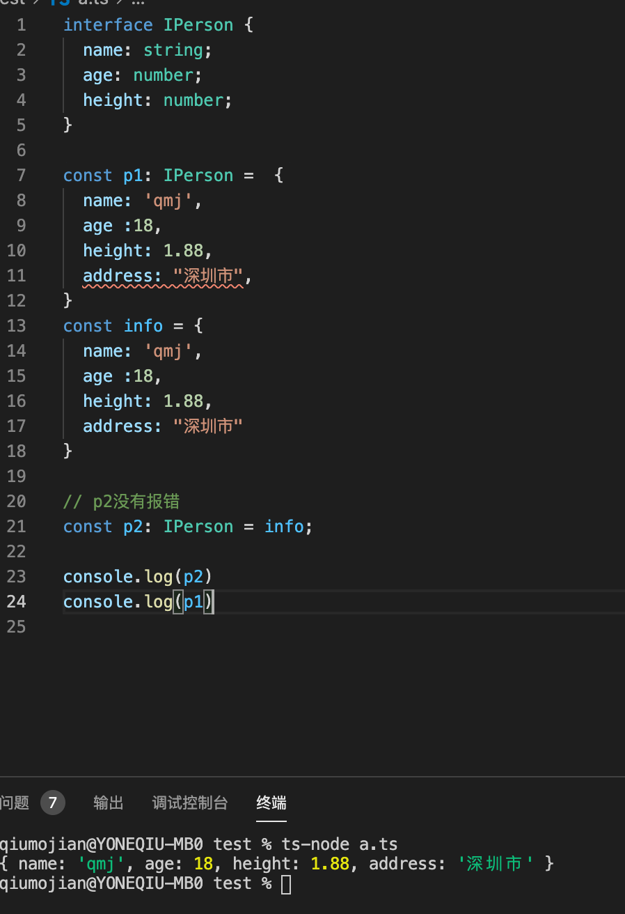
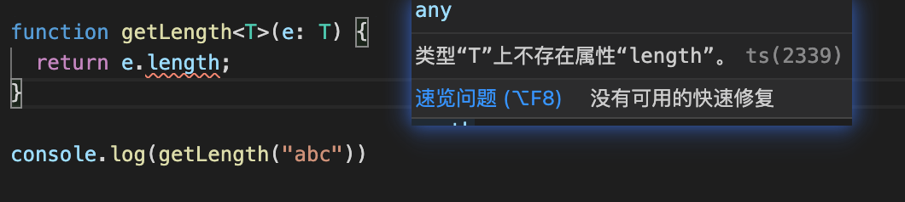
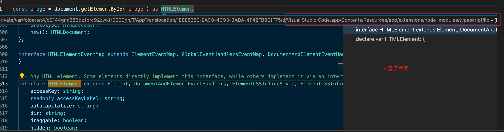

## 一、TypeScript的初体验

### 1.1TS的环境

- TS最终会被编译成JS来运行，所以我们需要搭建对应的环境：
  - 安装tsc: `npm i typescript -g` , 执行 `tsc --version`可以查看版本号
  - webpack的babel插件

**hello_ts**

- 当我们传入期望之外的值会报错提示

```typescript
let message: string = 'coderqmj';
message = 123 // 这里会报错
function foo(payload: string) {
  console.log(payload)
}
foo() // 报错
foo(123) // 报错
foo('hello') 正确
```

### 1.2执行ts

- `tsc 文件名` => 会生成一个同名的js文件，但里面的代码是ts经过转换生成的js代码
- 如果检查到传入非正确类型的值，会编译不通过

### 1.4搭建ts环境

- webpack搭建
  - 安装并使用ts-loader `tnpm i ts-loader typescript -D`
  - 配置tsconfig.json文件（可以使用tsc --init生成默认文件）
  - 然后`npm run build`，就可以根据配置生成可执行的js代码
  - 但是每次都要打包，那就太麻烦了，这个时候安装`npm i webpack-dev-server -D`，然后package.json配置 "serve": "webpack serve"
    - 然后再安装模板：`npm i html-webpack-plugin -D`
- 配置文件
  

```json
const path = require('path')
const HtmlWebpackPlugin = require('html-webpack-plugin')

module.exports = {
  mode: "development",
  entry: "./src/main.ts",
  output: {
    path: path.resolve(__dirname, "./dist"),
    filename: "bundle.js"
  },
  devServer: {
  },
  resolve: {
    extensions: [".ts", ".js", ".cjs", ".json"]
  },
  module: {
    rules: [
      {
        test: /\.ts$/,
        loader: 'ts-loader'
      }
    ]
  },
  plugins: [
    new HtmlWebpackPlugin({
      template: "./index.html"
    })
  ]
}
```


- ts-node库直接执行
  - npm i ts-node tslib @types/node -g

### 1.3一些思考与感悟

- 默认情况下，同一个目录下的ts文件在同一个作用域，所以a目录下的a1和a2文件都命名了name这个变量，会提示报警
- 解决办法：
  - 在文件中写 `export {}` 

## 二、Typescript基础

### 2.1变量声明

- 在TS中定义变量需要指定 **标识符** 的类型
- 所以完整的声明格式如下：
  - 声明了类型后TS就会进行**类型检测**， 声明的类型可以称之为**类型注解**
  - `var/let/const 标识符： 数据类型 = 赋值`

一个例子：

```typescript
// 1.类型注解
// 2.var/let/const
// 3.string和String的区别
var name: string = "qmj"
let age: number = 18
const height: number = 1.88

// 4.类型推导
let foo = 123
foo = "123" // 报错，因为类型推导
```

- 思考：有些时候定义类型的时候，string 有些时候 小写 string， 有些时候大写String，这两者之间有什么区别？
  - 如果是小写的代表是Typescript中的字符串类型
  - 如果是大写，代表是JavaScript的字符串包装类的类型
- 所以真正在typescript中定义数据类型的是小写的写法，不要用错了
- ts还有一个特性就是类型推导
  - 在ts文件中给一个变量赋值了number类型，再给他赋值string类型，就会报错，即使没有对该变量进行定义类型

### 2.2number类型

- 十进制，二进制，八进制都可以定义

```typescript
let num: number = 123
num = 222

// num = "123"

let num1: number = 100 
let num2: number = 0b100
let num3: number = 0o100
let num4: number = 0x100

console.log(num1, num2, num3, num4)
```

### 2.3boolean类型

- 只有true和false

```typescript
let flag: boolean = true
flag = 20 > 30
```

### 2.4string类型

```typescript
let message1: string = 'hello world'
let message2: string = "Hello World"


// 个人习惯: 默认情况下, 如果可以推导出对应的标识符的类型时, 一般情况下是不加
const name = "qmj"
const age = 18
const height = 1.88

let message3 = `name:${name} age:${age} height:${height}`
console.log(message3)

export {}

```

### 2.5array类型的使用

- 思考一个问题，定义一个数组，那么数组中应该存放的是什么元素呢？
- 但是在Typescript中，数组存放的数据类型最好是单一固定的
- 定义数组类型一般有两种方法
  - 注意数组没有小写的array，只有大写的Array
  - 一般推荐下面第二种的写法，因为第一种写法在 React中的 jsx是有冲突的
    - 因为jsx中有`<div></div>`这种尖括号，babel解析可能会出现问题

```typescript
// 1.定义一个只存放字符串的数组
const names: Array<string> = []  // 一般不推荐这种写法
// 2.
const names2: string[] = [] // 推荐这写法
```

### 2.6object类型的使用

- 在ts文件中这样定义，每一个key都会被类型推导，进行类型的限制

```typescript
const info = {
	name: 'qmj',
	age: 18
}
```

### 2.7Typescript-any类型

- 某些情况下，我们无法确定该数据的类型，或者以后有可能涉及到类型的修改，才会使用any

### 2.8Typescript-unknown类型

- 用法和any差不多，但是比any更安全点，因为unknown类型的数据不可以拿出去用，复制，传参都不可以。
- 而any是可以的

### 2.9Typescript-void类型

- 通常指一个函数没有返回值，那么它的返回值就是void类型：
  - 可以把null和undefined复制给void类型，

### 2.10对象类型

```typescript
function printPoint(point: {x: number, y: number}) {
  console.log(point.x, point.y)
}
printPoint({}) // 报错
printPoint({x: '123'}) // 报错
printPoint({x: 1, y: 2}) // 正确
```

### 2.11可选类型

```typescript
function printPoint(point: {x: number, y: number, z?: number}) {
  console.log(point.x, point.y)
}
printPoint({}) // 报错
printPoint({x: '123'}) // 报错
printPoint({x: 1, y: 2}) // 正确
printPoint({x: 1, y: 2, z: 3}) // 正确
```

### 2.12联合类型

- TS允许我们使用多种运算符，从现有类型中构建新类型

```typescript
function foo(id: number|string) {
  console.log(id)
}
```

## 三、TS特性

### 3.1类型断言as

- 有些时候TS无法获取具体的类型信息，这个我们需要使用类型断言（Type Assertions）。
  - 比如我们通过document.getElementById，TS只知道该函数会返回HTMLElement，但并不知道它具体的类型

**场景一**

- 上面通过id获取到HTML元素，TS类型推导为HTMLElement类型，然后通用的这些类型里面可以调用`style`, `className`等属性可以取用。
- 但是如果通过id获取到的是Img标签呢？取用`src`属性时就会报错，那么怎么去缩小这个范围呢？
- 答案是断言，断言可以把比较普遍的类型转成具体的类型

```typescript
const el = document.getElementById("qmj") as HTMLImageElement;

el.src = 'http:xxx' // 就可以正常取用src属性不会报错了
```

**场景二**

- 在类继承的时候，拿不到子类的属性，就可以使用断言

```typescript
class Person {

}

class Student extends Person {
	studying() {
    
  }
}

function sayHello(p: Person) {
	p.studying(); // 报错
  (p as Student).studying();
}
```

**非空断言**

- 有一种场景，使用可选参数的属性时，无论是否传入参数编译会不通过，因为存在安全隐患。
- 那如果确保你传入了这个参数，那么就可以使用非空断言
- 非空断言表示其一定有值

```typescript
function foo(message?: string) {
	console.log(message.length)  // 编译会不通过	
  console.log(message!.length)  // 编译会通过，表示这个message一定有值，不需要判断什么的
}
```

### 3.2  `??` 和 `!!`的作用

- !!操作符：
  - 将一个其他类型转换成Boolean类型
  - 类似于Boolean（变量）的方式

```typescript
const message = 'hello world';

// 转换成Boolean类型
const flag = Boolean(message); // true
// 使用!!
const flag = !!message
```


- ??操作符：
  - ES11新增的特性
  - 空值合并操作符（??）是一个逻辑操作符，当操作符的左侧是undefined或者null时，返回其右侧操作数，否则返回则侧操作数

```typescript
let message: string|null = null;

const content = message ?? '你好啊';
```

### 3.3字面量类型

- 如果按照第二行代码去限制类型，那么就不能改变其他值，那又有什么意义呢？
- 字面量类型必须结合联合类型，才有意义。
  - 应用就是就是在UI组件源码中经常出现的，只能在其中几个值修改

```typescript
const message = 'Hello TS'; // 这个message在ts里面是Hello TS类型;
const message: 'Hello TS' = 'Hello TS'; // 和上面是等价的

// 结合联合类型
let align: 'left' | 'right' | 'center' = 'left'
// 开发中
type Alignment = 'left' | 'right' | 'center'
```

### 3.4字面量推理

- 思考下面场景：
  - 调用的时候会第二个参数直接报错，因为这样只对method限制为string，而函数是要求 `GET`  和 `POST`
- 方法一从书写时就限制了类型，不规范直接不通过编译（**推荐**）
- 方法二使用了断言是其参数更加具体化，从而能通过编译
- 方法三就是限制其只能是只读模式（readonly），不能被其他地方修改，可以通过编译

```typescript
type Method = 'GET' | 'POST';

function request(url: string, method: Method) {
  
}

const option = {
  url: 'www.123.com',
  method: 'POST'
}

request(option.url, option.method)

// 解决办法一
type Request= {
	url: string,
  method: Method
}

const option: Request = {
  url: 'www.123.com',
  method: 'POST'
}

// 解决办法二
request(option.url, option.method as Method)

// 方法三 as const 字面量推理
const option = {
  url: 'www.123.com',
  method: 'POST'
} as const 
```

### 3.5类型缩小

- 类型缩小的英文是Type Narrowing
- 可以使用 typeof padding === 'number'的判断语句来改变TS执行路径
- 在给定的执行路径中，我们可以缩小比声明是更小的类型，这个过程称之为 缩小

```typescript
type IDType = number | string

// 1.typeof 类型缩小
function printID(id: IDType) {
  console.log(id.length) // 报错，因为number可没有
  if(typeof id === 'string') {
    console.log(id.length) // 不会报错，因为确定这是一个字符串
}
  
// 2.平等的类型缩小
type Dir = 'left' | 'right' | 'top' | 'bottom'

function printDir(dir: Dir) {
  if(dir === 'left') {}// 操作
  switch (dir) {
    case 'right':
      console.log(dir)
      break;
    case 'top':
      console.log(dir)
      break;
    default:
      break;
  }
}
```

### 3.6TS函数类型

- 函数类型的注解怎么写呢？

```typescript
function bar(fn: () => void) {
	fn()  
}
bar(foo)

// 定义常量时，编写函数的类型
type AddFnType = (num1: number, num2: number) => number
const add: AddFnType = (num1: number, num2: number) => {
  return  num1 + num2;
}
```

**函数可选类型**

- 可选类型必须放在必选的后面

**参数的默认值**

- 使用了默认值就可以不传该参数，直接使用默认值

```typescript
function foo(x:number, y: number = 100) {
  console.log(x + y)
}
foo(20)
```

**传参顺序**

- 建议是按照 必传 -> 有默认值 -> 可选 的顺序去传入参数

**函数的剩余参数**

- 我们想定义一个函数，传进来多少个参数，就把多少个参数相加

```typescript
function sum(...nums: number[]) {
  let total = 0;
  for (const num of nums) {
    total += num
  }
  return total;
}

sum(20, 30);
sum(20, 30, 40);
```

### 3.7函数联合类型

- 如果函数传入连个参数，是联合类型，然后进行运算，会造成代码编译错误，甚至最后的返回值也无法确定类型
- 那应该怎么办？答案是重载

```js
function (num1: number | string, num2: number | string) {
    // 1.直接运算返回报错
    return num1 + num2;
    // 2.进行逻辑判断，可以编译通过，但是返回值无法确定类型
    if(typeof num1 === 'number' && typeof num2 === 'number') {
        ...
    }else if() {...}
}
```

### 3.8函数的重载

```js
// 函数的重载: 函数的名称相同, 但是参数不同的几个函数, 就是函数的重载
function add(num1: number, num2: number): number; // 没函数体
function add(num1: string, num2: string): string;

function add(num1: any, num2: any): any {
  if (typeof num1 === 'string' && typeof num2 === 'string') {
    return num1.length + num2.length
  }
  return num1 + num2
}

const result = add(20, 30)
const result2 = add("abc", "cba")
console.log(result)
console.log(result2)

// 在函数的重载中, 实现函数是不能直接被调用的
// add({name: "why"}, {age: 18})
```

## 四、TS类的使用

### 4.1类的定义

- constructor初始化类，必须要传入
- 初始化的方式有两种：
  - 在下面 2、3行就进行赋值
  - 在constructor中

```js
class Person {
  name: string
  age: number

  constructor(name: string, age: number) {
    this.name = name
    this.age = age
  }

  eating() {
    console.log(this.name + " eating")
  }
}

const p = new Person("qmj", 18)
console.log(p.name)
console.log(p.age)
p.eating()
```

### 4.2类的继承

- 多态、继承、封装
- 继承时多态的前提
- 可以简化代码，减少代码的冗余量

```js
class Person {
  name: string = ""
  age: number = 0

  eating() {
    console.log("eating")
  }
}

class Student extends Person {
  sno: number = 0

  studying() {
    console.log("studying")
  }
}

class Teacher extends Person {
  title: string = ""

  teaching() {
    console.log("teaching")
  }
}

const stu = new Student()
stu.name = "coderwhy"
stu.age = 10
console.log(stu.name)
console.log(stu.age)
stu.eating()
```

- 开发中会用到的技巧
  - 继承时使用super关键字对父类进行初始化，就可以对子类的数据进行保存

```js
class Person {
  name: string
  age: number

  constructor(name: string, age: number) {
    this.name = name
    this.age = age
  }

  eating() {
    console.log("eating 100行")
  }
}

class Student extends Person {
  sno: number

  constructor(name: string, age: number, sno: number) {
    // super调用父类的构造器
    super(name, age)
    this.sno = sno
  }

  eating() {
    console.log("student eating")
    super.eating()
  }

  studying() {
    console.log("studying")
  }
}

const stu = new Student("qmj", 18, 111)
console.log(stu.name)
console.log(stu.age)
console.log(stu.sno)

stu.eating()

```


### 4.3类的多态

- 最终执行的是重写之后的action

```js
class Animal {
  action() {
    console.log("animal action")
  }
}

class Dog extends Animal {
  action() {
    console.log("dog running!!!")
  }
}

class Fish extends Animal {
  action() {
    console.log("fish swimming")
  }
}

class Person extends Animal {

}

// animal: dog/fish
// 多态的目的是为了写出更加具备通用性的代码
function makeActions(animals: Animal[]) {
  animals.forEach(animal => {
    animal.action()
  })
}

makeActions([new Dog(), new Fish(), new Person()])
```

### 4.4类的修饰符

- 修饰符一共有4个：public、private、protected，readonly默认的是public
- public：
  - 随便访问，都可以被访问到
- private：
  - 只能在类的内部进行访问，外部不可以进行直接访问/修改，需要通过内部方法去访问/修改private的值
- protected:
  -  在类内部和子类中可以访问

```js
// 私有，子类都不能直接访问，必须通过内部方法访问
class Person {
  private name: string = ""

  // 封装了两个方法, 通过方法来访问name
  getName() {
    return this.name
  }

  setName(newName) {
    this.name = newName
  }
}
// 保护，只有本身和子类才能访问
class Person {
  protected name: string = "123"
}

class Student extends Person {
  getName() {
    return this.name
  }
}
```

- readonly：
  - 只可以被访问，但不能被修改
  - 只读属性是可以在构造器中赋值, 赋值之后就不可以修改
  - 属性本身不能进行修改, 但是如果它是对象类型, 对象中的属性是可以修改

```js
class Person {
  // 1.只读属性是可以在构造器中赋值, 赋值之后就不可以修改
  // 2.属性本身不能进行修改, 但是如果它是对象类型, 对象中的属性是可以修改
  readonly name: string
  age?: number
  readonly friend?: Person
  constructor(name: string, friend?: Person) {
    this.name = name
    this.friend = friend
  }
}

const p = new Person("why", new Person("kobe"))
console.log(p.name)
console.log(p.friend)

// 不可以直接修改friend
// p.friend = new Person("james")
if (p.friend) {
  p.friend.age = 30
} 

// p.name = "123"
```


### 五、接口的使用

### 5.1声明对象类型

当我们要在TS中定义对象并限制属性的类型时，我们可以通过类型（Type）别名来声明：

```typescript
type InfoType = {name: string, age: number};

const info: InfoType = {
    name: 'qmj',
    age: 18
}
```

当然，我们也可以使用另一种方式去声明对象类型：接口interface

- 作用和上面是等价的，但是要注意每个属性之间都**没有逗号**隔开
- 可以定义可选类型，也可以定义只读属性

```typescript
interface InfoType = {
    name: string
    age?: number // 表示该接口是可选属性
    readonly height: number // 表示只读，身高改不了了
}
```

- 在react中hooks中使用

```typescript
const[obj,setObj]=useState<{name:string;age:number;sex:string}>({name:'tom',age:15,sex:'男'})  对象
const[arr,setArr]=useState<Array<{name:string;age:number}>>=([{name:'tom',age:15}
const[sex,setSex]=useState<boolean>(true)
const[name,setName]=useState<string>
```


### 5.2索引类型

- 可以观察到下面键值对是有规律的，键是数字，值是字符串

```typescript
// 普通写法
const frontLanguage = {
  0: "HTML",
  1: "CSS",
  2: "JavaScript",
  3: "Vue",
  'adasd': 'wdad'  // 不报错
}
// 通过interface来定义索引类型
interface IndexLanguage = {
    [index: number]: string
}
const frontLanguage: IndexLanguage  = {
  0: "HTML",
  1: "CSS",
  2: "JavaScript",
  3: "Vue",
  'ads': 'w'  // 报错
}
```

### 5.3函数类型

- 之前可以通过type去定义函数，现在也可以使用接口去
- 但是函数类型的接口形式可读性比较差，所以推荐type方法去定义

```typescript
// type CalcFn = (n1: number, n2: number) => number

// 接口去定义函数类型，且是可调用的接口
interface CalcFn {
  (n1: number, n2: number): number
}

function calc(num1: number, num2: number, calcFn: CalcFn) {
  return calcFn(num1, num2)
}

const add: CalcFn = (num1, num2) => {
  return num1 + num2
}

calc(20, 30, add)
```

### 5.4接口继承

- 接口是可以继承的，且是可以多继承

```typescript
interface ISwim {
  swimming: () => void
}

interface IFly {
  flying: () => void
}


interface IAction extends ISwim, IFly {

}

const action: IAction = {
  swimming() { // 继承了ISwim，所以必须要有swimming

  },
  flying() {
    
  }
}
```

### 5.5交叉类型

- 前面学习过联合类型，联合类型就是把可能用到的类型放在一起
- 另一种组合类型的方式：交叉类型，使用 `&` 符号进行连接
  - 表示这个类型即是number类型，优势string类型，一般情况下是不可能的，鼠标放上去直接never了

```typescript
// 前面学习的联合类型
type Type = number | string
type Direction = "left" | "right" | "center"

// 另一种组件类型的方式: 交叉类型
type WType = number & string
```

- 一般情况都是没有意义的，那么什么情况才有意义呢？
  - 答案是对象类型时

```typescript
// 下面有两个接口，分别是游泳和飞翔
interface ISwim {
    swimming: () => void
}
interface IFly {
    flying: () => void
}

// 下面两个类型，分别是联合类型和交叉类型
type MyType1 = ISwim | IFly
type MyType2 = ISwim & IFly
const obj1: MyType1 {
    flying: () { // 联合类型，只实现一个不会报错
	}
}

const obj2: MyType2 {
    flying: () { // 交叉类型，必须两个都实现，不然报错
	}
}
```


### 5.6接口的实现

### 5.7interface和type的区别

- interface和type都可以用来定义对象类型，那么在开发中，到底使用哪一个呢？
  - 如果定义非对象类型，推荐使用type，比如Direction、Alignment、一些Function
- 如果是定义对象类型，那么他们是有区别的
  - interface可以重复的对某个接口来定义属性和方法
  - 而type定义的是别名，别名是不能重复的

```typescript
interface IFoo {
  name: string
}

interface IFoo {  // 可以重复定义
  age: number
}
// 使用时必须传入两个
const foo: IFoo = {
  name: "qmj",
  age: 18
}

type IBar = {
  name: string
  age: number
}

type IBar = { // 直接报错
}
```


### 5.8字面量赋值

- 可以在编辑器上看见p1是报错的
- 但是p2又是正常的，这非常奇怪，编译不报错，且可以正常运行
- 

```typescript
interface IPerson {
	name: string;
  age: number;
  height: number;
}

// 报错
const p1: IPerson = {
  name: 'qmj',
  age :18,
  height: 1.88,
  address: "深圳市"
}

const info = {
  name: 'qmj',
  age :18,
  height: 1.88,
  address: "深圳市"
}

// p2没有报错
const p2: IPerson = info;
```

**上面这种现象是为什么？中间发生了什么？**

- 原因是当没有设置类型时，会进行类型推导，info就把4个类型都推导出来了。
- 而info赋值给p2时，发生了freshness擦除操作，
  - 意思是进行类型检测时，把引用（在这里是info）的属性擦除多余的属性，依然满足IPerson的检测条件，就会通过
  - 而要是擦除多余的，但是不满足的话还是会报错的。比如少属性，或者是类型不对




### 5.9TS枚举类型

- 枚举类型是TS特有的特性之一：
  - 枚举类型就是将一组可能出现的值，一个个列举出来，定义在一个类型中，这个类型就是枚举类型
  - 枚举允许开发者定义一组命名常量，常量可以是数字、字符串类型；
- 关键字是 **enum**
- 可读性比较强

```typescript
// 例子一，方向，多用于游戏开发？
enum Direction {
  LEFT,
  RIGHT,
  TOP,
  BOTTOM
}
function turnDirection(direction: Direction) {
  
}

turnDirection(Direction.LEFT);
```

## 六、泛型

### 6.1认识泛型

> 对于函数式编程是非常重要的。因为对于一个函数来说，参数的意义是非常重大的，没有参数，功能将变得非常单一。所以参数的类型也是非常有意义且重要的，在TS中我们不希望由函数本身去限制类型，希望由调用者去决定，否则功能变得单一。

**一句话概括泛型就是将类型参数化**

简单的例子：

```typescript
function sum<T>(num1: T): T {
  return num1;
}
// 调用方式一：明确指定类型
sum<number>(20);
sum<{name: string}>({name: 'qmj'})
sum<any[]>(["abc"])

// 调用方式二：类型推导
sum(50);
sum("abc")
```

### 6.2泛型接受多个类型参数

- 如果多个参数都是一样的，那么只需要写一个
- 如果多个参数不一样，也支持写多个类型

```typescript
function sum<T, E>(sum1, sum2) {
  return sum1 + sum2;
}

sum<number, string>(20, 'abc')
```

### 6.3泛型开发中的习惯

- T: Type的缩写，类型
- E，Element的缩写，元素
- K、V：key和value 的缩写，键值对
- O，Object的缩写，对象

### 6.4泛型接口

- 接口中每个元素的类型一般都是写死的，但如果想要更灵活点呢？

```typescript
// 也可以像函数一样设置默认值
interface IPerson<T1 = string, T2 = number> {
  name: T1,
  age: T2,
}
  
const p1: IPerson<string, number> = {
  name: "qmj",
  age: 18
}

```


### 6.5泛型类的使用

- 泛型既然可以在接口上使用，那就可以在类上使用f

### 6.6泛型的类型约束

- 有些时候我们想对函数做一些类似重载的功能，比如输出字符串或者数组长度的函数

  - 如果参数没有length属性肯定是不行，所以我们应该对泛型做一些约束，使其拥有length这个属性

  

  ```typescript
  // 这种情况就直接编译不通过
  function getLength<T>(e: T) {
    return e.length;
  }
  
  // 应该用下面的写法
  interface ILength {
    length: number;
  }
  
  function getLength<T extends ILength>(e: T) {
    return e.length;
  }
  
  console.log(getLength("abc"))
  ```

  

## 七、TS其它补充

### 7.1TS模块化开发

- ESModule本身就是支持的，和js是一样的

#### namespace命名空间

- namespace在TS早期时，称为内部模块，主要目的是将一个内部模块再进行作用域的划分，防止一些命名冲突的问题
- 一句话概括就是，在模块中划分模块

例子：

- 两个format函数，一个是格式化时间，一个是格式化价格，都用相同的函数名format

```typescript
export namespace time {
  export function format(time: string) {
    return '14: 32'
  }
}
  
export namespace price {
  export function format(time: string) {
    return '14: 32'
  }
}
  
// 使用的时候就可以取用命名空间里面的函数
time.format('')
```

### 7.2声明

- 我们npm i axios后可以直接导入使用并且不报错，但是安装lodash后导入，会报错：
  - could not find a declaration file for module ‘lodash’
- 原因是要看这个模块在TS中有没有被声明过，声明过就是不报错的
- 上面那个例子的原因就是axios被声明过了，但是lodash没有声明
- 那么我们应该在哪里声明？怎么去声明呢？

#### **.d.ts文件**

- 它是用来做类型的声明，它仅仅用于类型检测，告知TS我们有哪些类型，就不用去报错了

#### 声明来源

- 一般来自三个地方，内置，外部定义，自定义

- 内置：

  - 像document这个，就是VSCode帮我们内置了，不会报错

  


- 外部声明：
  - 像我们安装axios后，在modules中可以发现`.d.ts`文件中有许多interface，说明第三方库axios对类型做了声明
  - 而lodash为啥不行？因为他没有类型声明
  - 比如说想要在node项目中使用，就需要 npm i node 然后 npm i @types/node --save-dev
  - lodash也和node同理，安装完npm i @types/lodash --save-dev 就不会报错了
- 自定义：
  - 外部包也没有，内置也没有，就需要自己去编写了
  - 编写方式如下，之后在ts文件中就可以使用lodash的join了

```typescript
declare module 'lodash' {
  export function join(arr: any[]): void
}
```

### 7.3在vue中使用ref时对组件进行类型声明

```typescript
const accountRef = ref<InstanceType<typeof LoginAccount>>();
// LoginAccount为导入的组件
```


