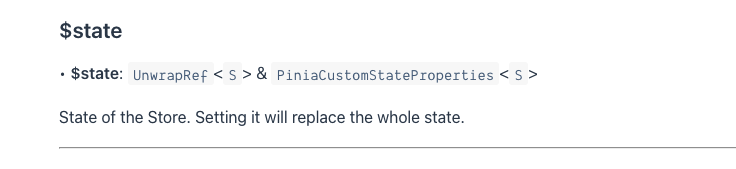

## 一、Pinia与Vuex对比

### 1.什么是Pinia？

- Pinia，西班牙语中菠萝的词
- 2019诞生于2019年，最初只是一个实验性的功能，是为了更好的适配（Composition API）**vuex不能吗？**
- vue3项目更适合pinia，vue2就是vuex
- Pinia本质上是一个状态管理库，用于跨组件、页面进行状态共享（vuex、Redux一样）

### 2.解决了什么问题？为什么有Pinia？

- 任何技术的出现都是为了解决问题的，不是为了让你学的
- Pinia最初是为了探索Vuex的下一次迭代会是什么样子，结合了Vuex5团队讨论中的许多想法
- 最后，团队意识到Pinia已经实现了Vuex5中大部分内容，所以决定用Pinia来替代Vuex
- 与Vuex相比，Pinia提供了一个更简单的API，具有更少的仪式，提供了Composition-API风格的API
- 最重要的是，在与TS一起使用时具有可靠的类型推断支持。（vue3+vuex+ts非常难用 ）

## 二、如何使用

**安装** `npm i pinia`

**创建并挂载store**

```js
// store/index.js
import { createPinia } from 'pinia';

const pinia = createPinia();

export default pinia;

// main.js
import pinia from '@/store'

createApp(App).use(pinia).mount('#app')
```

**创建并使用**

```js
// store/counter.js
import { defineStore } from 'pinia'
// 第一个参数“counter”是必要的，pinia用它来连接devtools
// 返回规范是使用useXXX来命名，看到这样就知道是拿来干嘛的
const useCounter = defineStore("counter", {
  state: () => ({
    count: 99
  }),
  actions: {
    increment() {
      this.count++
    }
  }
})
export default useCounter
// HomePage.vue
<template>
  <h2 class="app">Home Page</h2>
  <div>{{ counterStore.count }}</div>
  <button @click="handleClick">增加</button>
  <button @click="counterStore.$reset()">重置</button>
  <button @click="counterStore.$patch({count: 0})">count: 0</button>
</template>

<script setup >
import useCounter from '@/store/counter'
const counterStore = useCounter()

const handleClick = () => {
  counterStore.increment()
}

</script>

<style>

</style>
```

## 三、认识store

**什么是Store**

- 一个Store是一个实体，它会持有为绑定到你组件树的状态和业务逻辑，也就是保存了全局的状态；
- 他有点像始终存在，并且每个人都可以读取和写入的组件
- 你可以在你的应用程序中定义任何数量的Store来管理你的状态

**Store有3个核心概念**

- state、getters、actions
- 相当于saga-dcuk里面的 reducer、rowState、creator，相当与vue组件里面的data，computed、methods
- 一旦store被实例化，可以在store上访问state、getters和actions中定义任何属性

**注意事项**

- defineStore第一个参数用于标识id，连接devtools起到作用
- defineStore的返回用useXXX来命名，这是规范
- 取出来的值一般无法解构使用：
  - 为什么？
    - 因为结构出来的只有它的值，不能监听到值的改变
    - 如果是从 store.xxx取用的，就可以监听到，因为store发生变化是可以监听到的
  - 用什么手段才能解构
    - vue3的 `toRefs` `const { count } = toRefs(store)`
    - pinia提供的`storeToRefs `

## 四、认识State  

**什么是state**

- state是store的核心部分，因为store使用来帮助我们管理状态的
- 在pinia中，状态被定义为返回初始状态的函数
- 读取和写入state：
  - 默认情况，通过store实例访问状态来直接读取和写入状态
- 重置state：
  - 直接调用`userStore.$reset()`重置state
- 一次性修改多个值：
  - `userStore.$patch({name: 'qmj111', age: 199, level: 999})`
  
- 整个state替换掉
  - `userStore.$state = {name: '替换名字', age: 188} `
  - 文档上说的是会替换整个state，但是判断的新旧state发现是相等的，并没有完全替换
  - https://pinia.vuejs.org/api/interfaces/pinia._StoreWithState.html#state
  



- 订阅state变化

**定义state**

```js
import { defineStore } from 'pinia';

const useUser = defineStore("user", {
  state: () => ({
    name: 'qmj',
    age: 18,
    level: 99
  })
})

export default useUser
```

**修改state**

```js
// 方式一：直接修改
<template>
  <h2 class="app">Home Page</h2>
  <div>姓名：{{ userStore.name }}, 年龄： {{ userStore.age }}</div>
  <div>等级{{ userStore.level }}</div>
  <button @click="handleClick">增加等级</button>
  <button @click="userStore.$reset()">重置</button>
  <!-- <button @click="userStore.$patch({ count: 0 })">count: 0</button> -->
</template>

<script setup >
import useUser from "@/store/user";

const userStore = useUser();


const handleClick = () => {
  userStore.level++
  userStore.age++
  userStore.name = "changeName"
};
</script>

<style>
</style>

// 方式二：直接调用`userStore.$reset()`重置state
const handleClick = () => {
  userStore.$reset()
};
// 方式三：一次性修改多个值
userStore.$patch({name: 'qmj111', age: 199, level: 999})

// 方式四：替换整个state
userStore.$state = {name: '替换名字', age: 188} 
```

**订阅state变化**

```js
```

