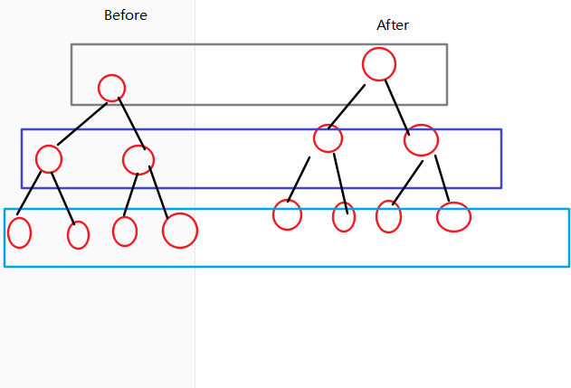
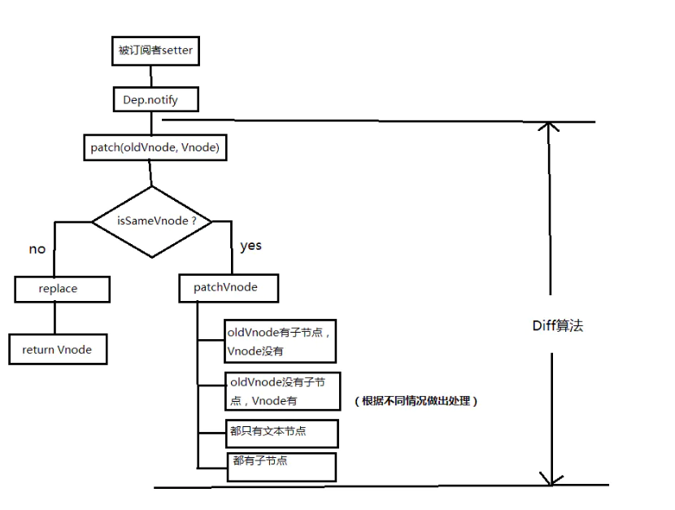

### 1.数据发生变化时，vue是怎么更新节点的？

直接渲染DOM开销非常大，比如修改了某个数据，直接渲染到真实dom上会让整个dom树重排、重绘。通过diff，可以只更新修改的地方，而不是整个dom。怎么做？


先根据真实DOM，生成对应的`virtual dom`，当虚拟dom某个节点的数据改变后会生成一个新的`Vnode`,然后`Vnode`和`oldVnode`进行对比，发现有不一样的地方就直接修改在真实的DOM上，然后使`oldVnode`的值为`Vnode`.


diff的过程就是调用名为`patch`的函数，比较新旧节点，一边比较一边 真实DOM 打补丁。


### 2.虚拟DOM和真实DOM的区别？

virtual DOM是将真实的DOM的数据抽取出来，以对象的形式模拟树形结构。

比如：

真实DOM：

```html
<div>
    <p>
        123
    </p>
</div>
```

虚拟DOM：

```javascript
var Vnode = {
	tag: 'div',
    children: [
        {
            tag: 'p',
            text:123
        }
    ]
}
```

### 3.比较的方式？

在采取diff算法比较新旧节点的时候，比较只会在同层级进行，不会跨层比较。

- 两个代码第一层都是div，所以div只会和div进行比较，而不会div和span比较
- 第二层分别是p和span，所以p和span进行比较

```html
<div>
    <p>
        123
    </p>
</div>

<div>
    <span>456</span>
</div>
```



### 4.diff流程图



### 5.具体分析

```
1.同层节点比较，如果不一样，直接替换(就算是子节点一样也不会复用)，如果一样，进行下一层比较；
2.找到对应的真实DOM：el
3.判断Vnode和oldVnode是否指向同一个对象，如果是，直接return
4.如果他们都有文本节点并且不相等，那么将el的文本节点设置为Vnode的文本节点。
5.如果oldVnode有子节点而Vnode没有，则删除el的子节点
6.如果oldVnode没有子节点而Vnode有，则将Vnode的子节点真实化之后添加到el
7.如果两者都有子节点，则执行updateChildren函数比较子节点，这一步很重要

```

### 6.部分源码

#### 比较相同节点

```js
function sameVnode (a, b) {
  return (
    a.key === b.key &&  // key值
    a.tag === b.tag &&  // 标签名
    a.isComment === b.isComment &&  // 是否为注释节点
    // 是否都定义了data，data包含一些具体信息，例如onclick , style
    isDef(a.data) === isDef(b.data) &&  
    sameInputType(a, b) // 当标签是<input>的时候，type必须相同
  )
}
```


### 7.总结

- 根node+文+子+更新子
- 匹配结束两个条件：
  - olds>olde代表旧Vnode 先遍历完了，然后把多余的新Vnode根据index放入dom上
  - S>E，代表着新Vnode节点更少，那么在真实DOM区间[olds,olde]节点删除

```
数据改变的时候，触发diff
生成一个新的Vnode与oldVnode进行比较
第一层比较：
	如果是不同的Vnode(根据key，tag,data（onClick,style），type的)，就直接进行替换，将oldVnode替换成新			Vnode
	如果是相同的节点，就进行下一层比较。

第二轮比较，就是打补丁：
	找到真实dom，判断新旧虚拟DOM是否指向同一个对象，是就return
	如果都有文本，且不相等，将真实DOM的文本节点设置为新Vnode的文本节点
	如果旧Vnode有子节点，而新Vnode没有节点，则删除真实DOM节点
	如果旧Vnode没有子节点，而新Vnode，则在真实DOM上创建节点
	如果两个都有子节点，则通过updateChildren比较子节点

第二轮的子节点比较updateChildren(重点):
	四种比较方式：
		olds/olde/S/E分别指向旧节点的开始/结束/新节点的开始/新节点的结束
		1.如果olds和E匹配上，真实DOM第一个节点移到最后
		2.oldE和S匹配上，最后一个节点移动到最前，匹配上的两个指针向中间移动
		3.如果上面匹配没有成功，又有两种情况：
			3.1都有key：根据oldChild生成hash表，用S的key去匹配，匹配成功就是一样的节点，就在真实DOM里面将成功的节点移到最前面
			3.2没有key，就直接将S插入到真实DOM里面
```

### 8.具体例子