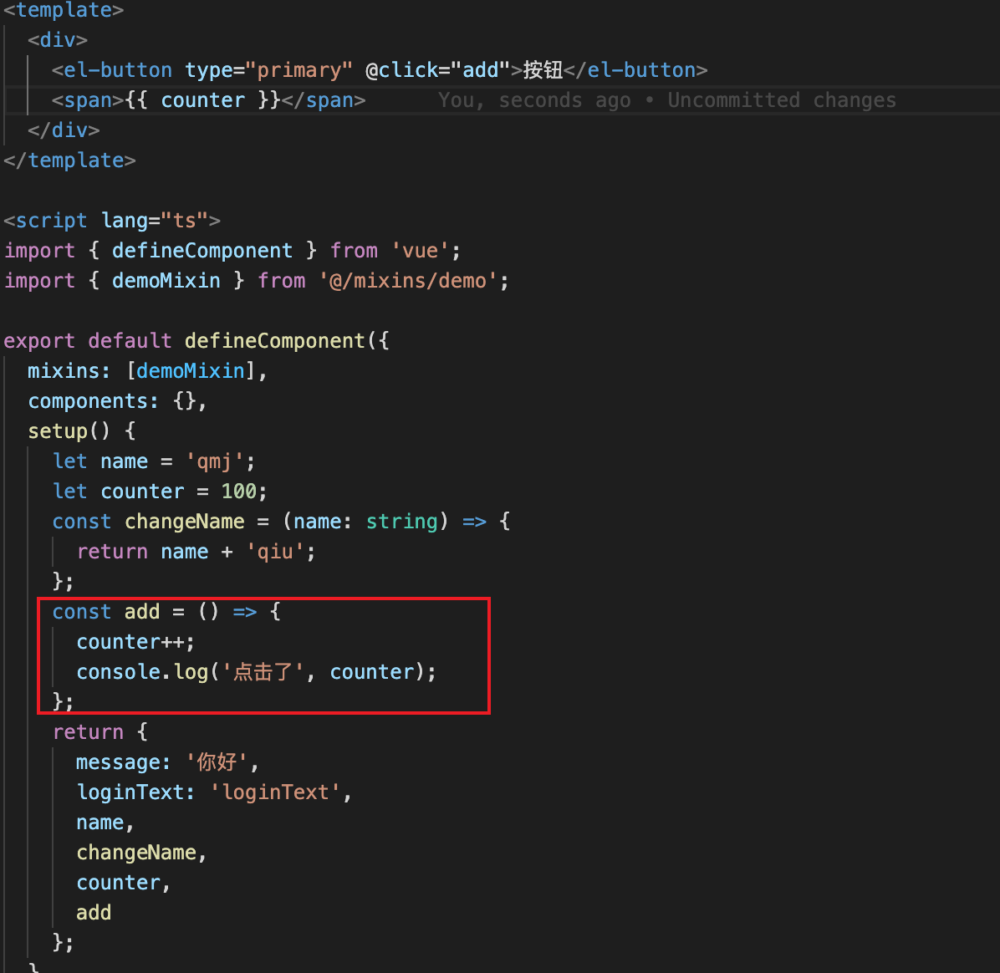

# VUE学习

## 一、Mixin

- 混入代码，可以做到代码复用
- 使用关键字mixins

### 1.1使用

```jsx
// 单独文件定义
export const demoMixin = {
  data() {
    return {
      message: '学习Mixin',
      isShow: true
    };
  },
  methods: {
    handleClick() {
      console.log('点击事件');
      // data.isShow
    }
  },
  created() {
    console.log('执行了创建');
  }
};

// 在业务组件使用
<template>
  <div>
    <el-button type="primary" @click="handleClick">按钮</el-button>
    <span>{{ isShow ? message : '' }}</span>
  </div>
</template>

<script lang="ts">
import { defineComponent } from 'vue';
import { demoMixin } from '@/mixins/demo';

export default defineComponent({
  mixins: [demoMixin],
  components: {},
  setup() {
    return {
      message: '你好'
    };
  }
});
</script>

<style scoped></style>
```

### 1.2命中规则

- 如果mixin对象和组件对象发生冲突，以谁为准呢？
- 情况一：如果是data函数的返回值对象
  - 返回值对象默认情况下合并
  - 如果data返回值对象的属性发生冲突，那么会保留组件自身的数据
- 情况二：如果是生命周期
  - 如果两者都有相同的生命周期，会合并到数组中，都会被执行一遍
- 情况三：对应是一个对象时，比如methods，components和directives，都会被合并为同一个对象
  - 如果都有methods选项，并且都定义了方法，那么他们都会生效，
  - 但相同key值时，只取用组件本身的，比如两者都在methods中定义了foo方法

### 1.3全局混入

- 如果组件中某些选项，是所有组件都需要拥有的，那么这个时候我们可以使用全局的mixin
  - 全局的Mixin可以使用应用app的方法mixin来完成注册
  - 一旦注册，那么全局混入的选项将会影响每一个组件

```js
const app = createApp(RootApp);

app.mixin({
  created() {
    console.log('全局的mixin');
  }
});
```

### 1.4extends关键字

- 类似于react类组件的继承，会拥有base组件的属性
- 可以使用期methods里面的东西，但是setup访问不到？

```vue
<template>
  <div>Main</div>
</template>

<script lang="ts">
import { defineComponent } from 'vue';
import Login from '../login/login.vue';

export default defineComponent({
  extends: Login,
  setup() {
    return {};
  }
});
</script>

<style scoped></style>
```

## 二、Composition API

::: tip 背景相关

options编写组件的时候逻辑非常分散，我们处理一个逻辑时，需要跳转到不同模块中去处理，而Composition可以把同一个逻辑关注点的相关代码放一起。我们在vue组件中的setup函数编写这些逻辑。

:::

### 2.1认识Composition API

- 从背景中得知Composition API要帮助我们完成什么，那具体要怎么做？
  - 为了开始使用Composition API，我们需要一个可以实际使用它的地方（编写代码的地方）
  - 在vue组件中，这个位置就是**setup函数**
- setup其实就是组件的另外一个选项
  - 只不过这个选项强大到我们可以用它来替代之前所编写的大部分其他选项
  -  比如methods、computed、watch、data、生命周期等等;

### 2.2认识setup

#### setup的参数

- 我们先来研究一个setup函数的参数，它主要**有两个参数**: 
  - 第一个参数:props
  - 第二个参数:context
- props非常好理解，它其实就是**父组件传递过来的属性**会被**放到props对象**中，我们在**setup中如果需要使用**，那么就可以直接**通过props参数获取**
  - 对于定义props的类型，我们还是和之前的规则是一样的，在props选项中定义
  - 并且在template中依然是可以正常去使用props中的属性，比如message
  - 如果我们在setup函数中想要使用props，那么不可以通过 this 去获取
  - 因为props有直接作为参数传递到setup函数中，所以我们可以直接通过参数来使用即可;
- 另外一个参数是context，我们也称之为是一个**SetupContext**，它里面**包含三个属性**:
  -  **attrs**:所有的非prop的attribute
  -  **slots**:父组件传递过来的插槽(这个在以渲染函数返回时会有作用，后面会讲到); 
  - **emit**:当我们组件内部需要发出事件时会用到emit(因为我们不能访问this，所以不可以通过 this.$emit发出事件);

#### setup的返回值

- setup既然是一个函数，那么它也可以有**返回值**，**它的返回值用来做什么呢?**
  - setup的返回值可以在模板template中被使用;
  - 也就是说我们可以通过setup的返回值来替代data选项
- 甚至是我们可以**返回一个执行函数**来**代替在methods中定义的方法**:
- 但是对与setup里面的数据，使用setup里面的方法去改变它的时候，做不到响应式
  - 因为对于一个定义的变量来说，默认情况下，Vue并不会跟踪它的变化，来引起界面的响应式操作;




#### setup不可以使用this

- 因为setup的调用发生在data、computed或者methods被解析之前，这些东西无法在setup中获取
- 调用顺序
  1. 调用 createComponentInstance 创建组件实例
  2. 调用 setupComponent 初始化component内 部的操作
  3. 调用 setupStatefulComponent 初始化有状态 的组件
  4. 在 setupStatefulComponent 取出了 setup 函 数
  5. 通过callWithErrorHandling 的函数执行 setup

#### Reactive API

- 如果想为在setup中定义的数据提供响应式的特性，那么我们可以**使用reactive的函数**
  - 使用reactive函数处理我们的数据之后，数据再次被使用时就会进行依赖收集;
  - 当数据发生改变时，所有收集到的依赖都是进行对应的响应式操作(比如更新界面);
  - 事实上，我们编写的data选项，也是在内部交给了reactive函数将其编程响应式对象的;


- reactive API对**传入的类型是有限制的**，它要求我们必须传入的是**一个对象或者数组类型**:

  - 如果我们传入一个基本数据类型(String、Number、Boolean)会报一个警告;

- 这个时候Vue3给我们提供了**另外一个API:ref API**

  - ref 会返回一个可变的响应式对象，该对象作为一个 **响应式的引用** 维护着它内部的值，这就是ref名称的来源;
  - 它内部的值是在ref的 value 属性中被维护的;
  - ref是可以放入reactive中的，也可以自动解包

  


#### **readonly**

-  在readonly的使用过程中，有如下规则：
  - readonly返回的对象都是不允许修改的
  - 但是经过readonly处理的原来的对象是允许被修改的
    - 比如 const info = readonly(obj)，info对象是不允许被修改的;
    - 当obj被修改时，readonly返回的info对象也会被修改;
    - 但是我们不能去修改readonly返回的对象info;
  - 其实本质上就是readonly返回的对象的setter方法被劫持了而已;
- 应用场景：
  - 传值给其他组件的时候，往往只希望别人使用这个值，不希望去改变它


#### toRefs

- 如果我们使用**ES6的解构语法**，对**reactive返回的对象进行解构获取值**，那么之后无论是**修改结构后的变量**，还是**修改reactive**

  **返回的state对象**，**数据都不再是响应式**的:

- 那么有没有办法**让我们解构出来的属性是响应式**的呢?

  - Vue为我们提供了一个toRefs的函数，可以将reactive返回的对象中的属性都转成ref; 
  - 那么我们再次进行结构出来的 name 和 age 本身都是 ref的;


## 面试

### 1.vue2和vue3的区别

::: details 点击查看解析

```
1.options Api 和 Composition API
	1.options编写组件的时候逻辑非常分散，而Composition可以把同一个逻辑关注点的相关代码放一起
```

:::

### 2.options Api的介绍及缺陷

::: details 点击查看解析

```
1.特点是对应的属性中编写对应的功能模块
	1.比如data定义数据，methods定义方法，计算属性，watch监听，生命周期
2.弊端：
	1.实现某一个功能时，对应的代码逻辑被拆分到各个属性中
	2.组件变大，复杂时，逻辑关注点的列表就会增长，同一个功能的逻辑会被拆分的很分散
	3.这样就造成了其组价的可阅读性较差
```

:::


