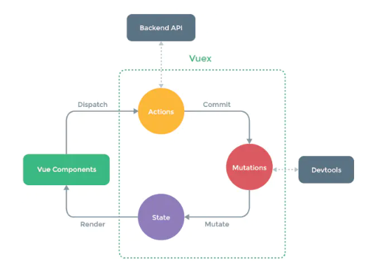

## 一、Vuex

### 1.1vuex是什么？什么作用？

> vuex是状态管理工具，用于多个组件之间进行状态共享。vuex可以看成一个大管家，管理着一些全局使用的数据(头像，昵称等)。还是响应式的

简单原理：

- 不能进行响应式

```javascript
const shareObj = {
	name: 'qmj'
}
Vue.prototype.shareObj = shareObj
```


### 1.2状态管理什么？

- 多个组件中共享的问题
- 比如用户的登录状态，昵称，头像，地理位置
- 商品收藏，购物车的物品
- 这些状态信息，可以放在一个对象里面，同意管理，供全局组件使用，重点还是响应式的

### 1.3怎么使用vuex？

使用步骤：

- 安装vuex `npm i vuex`
- 创建store(仓库)文件夹

```javascript
import Vue from 'vue'
import Vuex from 'vuex'

// 安装插件
Vue.use(Vuex)

// 创建对象
const store = new Vuex.Store({
  state:{
    counter:0 
  },
  mutations:{
    increment(state){
      state.counter++
    },
    decrement(state){
      state.counter--
    }
  }，
  actions: {
  	  
  }
})

// 导出对象
export default store

// 取出store
$store.state.counter

// 修改装状态 .vue中
add() {
    this.$store.commit('increment')
}
sub() {
    this.$store.commit('decrement')
}
```

修改状态：



- 正确的做法应该分发一个行为(dispath)到Actions里面
- 然后由Actions提交(commit)到Mutations里面，actions里面可以处理异步操作，Actions连了Backend API
- 再由Mutations改变(mutate)改变state

```javascript
// 错误用法： 
$store.state.counter++
```

为什么修改过程需要这么复杂呢？

- 通过Devtools可以跟踪状态的修改
- 知道是谁修改了状态，好判断哪里出了BUG

### 1.4vuex的核心概念

> vuex中有5个核心概念：State、Getters、Mutation、Actiuon、Module

#### 1.4.1 State单一状态树

> 什么是单一状态树呢？就是单一数据源，只创建一个store便于管理

#### 1.4.2 Getters基本使用

> Getters类似于vue中computed计算属性，有些时候，我们需要从store中获取一些state变异后的状态，比如取出年龄大于35岁的老程序员

```javascript
const store = new Vuex.Store({
    state: {
        programer: [
            {name: 'aaa', age: 28},
            {name: 'bbb', age: 25},
            {name: 'ccc', age: 37},
            {name: 'ddd', age: 36},
        ]
    }
})

// 计算属性computed
computed: {
	getOldProgramer() {
        return this.$store.state.programer.filter(age => age >= 35)
    }
}

// getters
getters: {
	getOldProgramer() {
        return this.$store.state.programer.filter(p => p.age >= 35)
    }
}
```

#### 1.4.3Mutation状态更新

> 官方明确指出，修改状态必须要通过mutations

**Mutation主要包括两个部分**：

- 字符串的事件类型
- 一个回调函数，该回调函数的第一个参数就是state

**例子：**

- increment和decrement是事件类型
- 后面的函数是回调函数

```javascript
  mutations:{
    increment(state){
      state.counter++
    },
    decrement(state){
      state.counter--
    }
  }，
```

**通过mutation更新：**

- 需要在.vue中通过commit
- 可以进行传参

```javascript
// 不传参提交
increment: function() {
	this.$store.commit('increment')
}

// 传参提交 .vue
increment: function(count) {
	this.$store.commit('increment',count)
}

// store中
increment(state, count) {
    state.counter += count
}
```

**mutaions特殊的提交风格**：

- 上面的代码就是普通提交风格
- 下面代码是特殊提交风格，通过传入对象形式

```javascript
mutations: {
    increment(state,payload) {
		this.$store.commit({
			type: 'increment', // 上面早就说过，这是个字符串的事件类型
    		count: count
		})
    }
}
```

#### 1.4.4 actions

> 进行异步操作的话，直接通过mutations修改是可以修改，但是无法跟踪状态，这个时候就需要添加一步操作，actions

```javascript
actions: {
    aUpdateInfo(context) {
		// 异步操作
        context.commit('updateInfo')
    }
}
mutations: {
	updateInfo(state) {
        state.info.name = 'qmj'
    }
}
// .vue中
uodateInfo() {
	this.$store.dispath('aUpdateInfo')
}
```

## 二、Vue-router

### 2.1 跳转页面不刷新

可以用hash进行路由跳转

- 可以用history.pushState({},'',"home"), history.back()
  - history.replaceState({},'','home') 这样不可以进行返回
  - history.go(-2)可以连续返回两个页面，正数就是前进
  - history.forward() 就是前进一个页面 相当于go(1)

### 2.2动态路由

映射表中：

path: '/user/:userId'

.vue中

```vue
<router-link :to="'/user/'+userId"></router-link>

data() {
	return {
		uerId: 'qmj'
	}
}


```

可以通过this.$route.params.id拿到用户id

### 2.3路由懒加载

#### 为什么要懒加载？

- 一个项目中页面很多，组件更多
- 打包后都会在一个js文件中，造成这个页面非常大
- 一下子请求全部组件的话消耗性能，出现短暂空白
- 需要加载时菜让他加载，就叫懒加载

#### 懒加载做了什么？

- 将路由对应的组件打包成一个个的js代码块
- 在这个路由被访问到时，才会加载对应组件

#### 路由懒加载的写法

```javascript
// 推荐写法，ES6
const Home = () => import('../components/Home.vue)
```

### 2.4路由的嵌套

#### 路由嵌套应用场景

- 在home页面中，希望通过/home/news和/home/message访问一些内容
- 一个路径映射一个组件，访问这两个路径也会分别渲染两个组件

#### 嵌套配置方法

```vue
配置信息
{
	path: '/home',
	component: Home,
	children: [
		{
			path: 'news',
			component: News
		},
		{
			path: 'message',
			component: Message
		}
	]
}

// 在Home.vue中站位符
<router-view></router-view>
```

### 2.5路由传参

: : : tip

传递参数主要有两种方式： params 和 query

: : :

#### 方式一——params

- 配置路由格式 /user/:id
- 传递方式： 在path后面跟上对应的值
- 传递后形成的路径： /user/123

#### 方式二——query

- 配置路由的格式：/user,就是普通配置
- 传递方式： 对象中使用query的key作为传递方式
- 传递后形成的路径：/router?id=123,/router?id=abc

```vue
<router-link :to='{path: '/profile', query: {name:'qmj',age:18}}'>档案</router-link>
```

#### 相关应用

```javascript
// 点击跳转
userClick() {
    this.$router.push('/user/'+this.suerId)
}

// 
profileCilck() {
    this.$router.push({
        path: '/profile',
        query: {
            name:'qmj'
        }
    })
}
```


