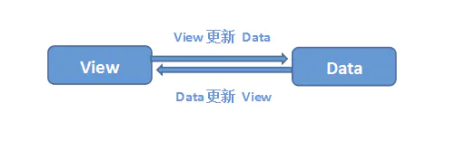

### 一、什么是MVVM数据双向绑定

`MVVM`数据双向绑定主要是指：数据变化更新视图，视图变化更新数据

体现：

- 当输入框内容变化，data中数据同步变化。view => data
- Data中的数据变化，文本节点的内容同步变化。Data => view

其中，view变化更新data，可以通过监听事件的方式来实现，所以主要解决data变化更新view

主要实现以下四个步骤，来实现数据双向绑定：

- 监听器Observer,劫持并监听所有属性,如果属性发生变化，就通知订阅者；
- 实现订阅器Dep，收集订阅者，对监听器Observer和订阅者Watcher进行统一管理
- 实现订阅者Watcher，可以收集到属性的变化通知并执行相应的方法，从而更新视图；
- 实现一个解析器Compile，可以解析每个节点的相关指令，对模板

