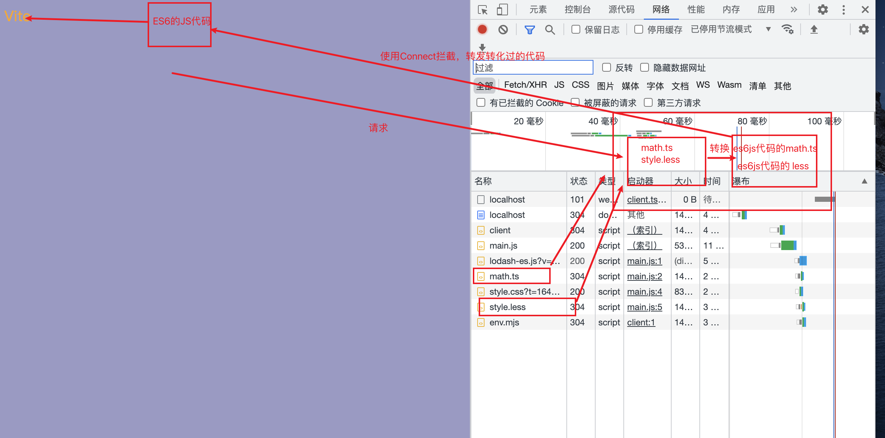
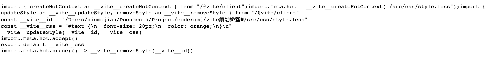
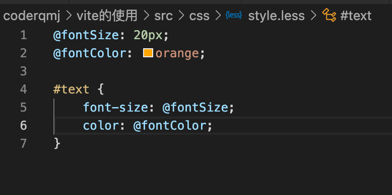

## 一、认识Vite

- 官方定义：**下一代前端开发与构建工具**
- 如何理解下一代开发和构建工具
  - 在实际开发中，编写的代码往往无法被浏览器识别，ES6、TS、VUE等
  - 所以必须通过构建工具来对代码进行转换、编译，类似工具有webpack
  - 随着项目越来越大，处理的JS越来越多，模块越来越多
  - 构建工具需要很长时间才能开启服务，HMR也需要几秒钟的时间才能在浏览器上反映出来
  - 总之一句话：**天下苦webpack久已**
- 我的理解：
  - 一些新的浏览器是支持ES模块化的，那我们开发阶段就不需要去构建，节省我们开发时的成本，等到要上线的时候再去适配低版本浏览器的用户。
  - 但是现在还是不支持ts，vue之类的，还是需要构建的，那么vite就是帮助我们去做这些事情，帮助把这些文件编译成ES模块化的，到时候请求使用.ts.vue文件都会转发ES模块化的文件给到浏览器

## 二、Vite的构造

- 两部分构成：
  - 一个开发服务器，它基于原生ES模块提供了丰富的内建功能，HMR的速度非常快
  - 一套构建指令，使用Rollup打开我们的代码，并且是预配置的，可以输出生产环境的优化过的静态资源

## 三、vite的功能及使用

### 3.1vite解决了什么？

- 识别某些浏览器无法识别的文件，如.ts，.vue，帮助把一些.ts，.vue转换成ES模块化
- 如果包之间的依赖过多，会发送一些不必要的网络请求，比如使用lodash，vite来解决
- 会对依赖做一些预打包的操作放在module中的.vite文件夹中，比如预打包vue，lodash，下一次跑的时候就可以节省这个时间了

**预打包**

- 对于某些不涉及编辑操作的第三方库：如vue源代码，lodash源代码，都会进行预打包的操作，这样下次就可以节省打包的时间了

### 3.2vite的使用

全局安装：`npm i vite -g`

局部安装：`npm i vite -D`

使用：`npx vite`

- 发现服务秒开，可以支持ts和vue了，导入文件可以不写后缀名了
- 使用lodash发现不会同时请求几百个文件了
- 使用css也发现不需要再去配什么loader了，直接导入在main.js文件上就可以使用

注意：

- 但是这个时候去使用less就直接报错了，会问我们是否安装了less？这个时候也很方便，直接`npm i less -D`即可
- 浏览器前缀也是需要安装(注意postcss也有依赖，可以选择autofixer或者postcss-preset-env)：`npm i postcss -D`和`npm i postcss-preset-env`，同时还需要配置postcss.config.js

```js
// postcss.config.js配置
module.exports = {
  plugin: [
    require("postcss-preset-env`")
  ]
}
```

## 四、Vite的原理

1. 首先会建立一个本地的服务器（webpack是express，vite1是koa，vite2用的是Connect）
2. 浏览器请求我们用到的文件，比如math.ts。
3. 但是这个请求会被Connect拦截，但返回的并不是我们直接在项目中编写的ts或者less文件。
4. 而是返回我们编写的文件经过vite转换的es6js代码的文件（less文件也会被转成js）



观察对比vite转换前后的文件



## 五、对vue 的支持

- vite对vue提供第一优先支持：
  - vue3单文件组件支持：`@vitejs/plugin-vue`
  - vue3JSX支持：`@vitejs/plugin-vue-jsx`
  - Vue2支持：`underfin/vite-plugin-vue2`
- 主要还需要编译.vue文件的插件：`npm i @vue/compiler-sfc`
- Vue插件就必须要配置了

```js
const vue = require('@vitejs/plugin-vue');
module.exports = {
  plugin: [
    vue()
  ]
}
```

## 六、Vite打包成dist

- 打包：`npx vite build`
- 预览：`npx vite preview`

## 七、为什么这么快

- 使用了ESBuild，其特点：
  - 超快的构建速度，并且不需要缓存（babel需要）
  - 支持ES6和CommonJS模块化
  - 支持ES6的TRee Shaking
  - 支持Go、JavaScript的Api
  - 支持TS，JSX等语法编译
  - 支持source-map
  - 支持代码压缩
  - 支持扩展其他插件

**ESbuild为啥这么快？**

- 使用go语言编写的，可以直接转换成机器代码，无需经过字节码
- ESBuild可以充分利用CPU的多内核，尽可能让他们饱和运行，会开启很多个进程
- ESBuild所有内容都是从0编写的，而不是使用第三方的东西，一开始就会考虑性能问题

## 八、Vite的脚手架

- 生成vue或者React项目模板

npm create vite@latest
