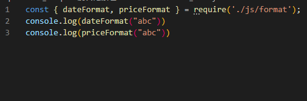

## 二、webpack配置文件

### 1.打包过程

**指定入口出口打包方式一：命令**

`webpack --ebtry ./src/main.js --output-path ./build`

**指定出口入口方式二：配置文件（重点）**

```js
// webpack.config.js
const path = require('path');
module.exports = {
  entry: './src/main.js',
  output: {
    filename: "boundle.js",
    // 必须是绝对路径
    path: path.resolve(__dirname, "./build")
  }
}
```

**假如文件名不是webpack.config.js**

- 那就没有办法打包成功了，怎么办？
- 因为执行`webpack`命令时，会去查找`webpack.config.js`这个文件执行 
- 解决：
  - 在配置文件里面修改build指令的配置参数


### 2.webpack依赖关系图

- webpack到底是如何对我们的项目进行打包的呢？
  - 事实上webpack处理应用程序时，根据命令或已配置的文件找到入口
  - 入口开始，生成一个 **依赖关系图**，这个依赖关系图会包含应用程序中所需的所有模块（js，css，图片，字体）
  - 遍历图结构，打包一个个模块（根据文件的不同使用不同的loader来解析）
- 上述的例子：
  - 例子一：安装了某个第三方库`axios`，但是并没有使用，所以打包不会带进去，打包后总体积不会增大。
  - 例子二：项目中创建的文件，没有被引用，最后打包不会在依赖图上，所以体积也不会增大。
  - 例子三：假如有个js文件里面有函数，js确实被引用了，但是函数未被执行，函数也不会被打包。
    - 涉及到tree shaking 

###  3.代码编写案例

- 写了个css，导入到文件，最后把它打包，最后会报错，原因是缺少加载css的loader

- loader是什么呢？

  - 用于对模块的源代码进行替换
  - css文件也可以看成是一个模块，通过 **import**来加载这个模块
  - 在加载这个模块时，webpack其实并不知道如何对其进行加载，我们必须制定对应的loader来完成这个功能

- 那么什么样的loader可以加载css呢？

  - 这个常用的loader最常用的是css-loader
  - 安装：`npm install css-loader -D`

- css-loader的三种使用方案：

  - 内联 

  

  - CLI方式（webpack5中不再使用）
  - 配置方式 

  

- 有`css-loader`表示正常处理解析了css文件，但是解析之后的css文件没有插入到页面上。

- 想要插入style，就需要使用`style-loader`

  - `npm i style-loader -D `
  - use: ["style-loader"]
  - style-loader的原理就是在document.createElement(style)创建了个样式表

- 注意：webpack处理loader的时候是从下往上的，从右往左的


### 4.loader配置方式

- module.rules的配置如下：
- rules属性对应的值是一个数组 **[Rule]**
- 数组中存放的时 一个个的Rule，Rule是一个对象，对象中可以设置多个属性：
  - test属性：用于对resource（资源）进行匹配，通常设置成正则表达式
  - use属性：对应的值是一个数组：**[UseEntry]**，也是一个对象，有两个key
    - loader：指明要用哪些loader
    - options：可选属性，值可以使字符串或对象，值会被传入到loader中
  - `use:["css-loader"]`相当于键值对的写法


### 5.如何处理less文件？

#### 5.1安装相关工具

- 肯定是要把less转换成css的，需要安装less工具 `npm i less -D`

- 然后 `npx less ./src/css/component.less > component.css`即可转换成正常css文件

- 但是在正常开发中需要同时安装 **less** 和 **less-loader**  `npm i less less-loader -D`

  

#### 5.2配置相关rule（less）


## 二、第二章

### 2.1PostCSS工具

#### 2.1.1初识PostCSS

- 什么是PostCss？
  - PostCss是通过**JavaScript**来**转换样式**的工具
  - 这个工具可以帮助我们进行**CSS的转换和适配**，比如**自动添加浏览器前缀**，**css样式重置**
    - 需要添加前缀的样式网站是：`autoprefixer.github.io`
  - 实现这些功能，都需要借助于PostCSS对应的插件
- 如何使用PostCSS呢？主要就是两个步骤：
  - 先查找PostCSS在构建工具的扩展，比如webpack中的postcss-loader；
  - 选择可以添加你需要的PostCSS相关插件

#### 2.1.2命令行使用postcss

- 我们可以直接在终端中使用PostCSS，只需要单独安装一个工具`postcss-cli`
  - `npm i postcss -D`
  - `npm i postcss-cli -D` 目的是为了能在命令行中使用PostCSS
- 举个栗子：现在有个css文件里面有些样式，但是这些样式是需要加上浏览器前缀的
  - 现在这些样式是不行的，需要进行处理才能正常运行
  - `npx postcss -o result.css ./src/css/test.css`


- 执行完上面命令行发现是有输出的，但是并没有添加前缀，是因为没有添加插件


- 想要自动添加前缀需要安装什么插件呢？
  - `npm i autoprefixer -D`
  - 然后再执行的时候也需要告诉这次你要使用的插件
    - `npx postcss --use autoprefixer -o result.css ./src/css/test.css`
  - 大功告成


#### 2.1.3在项目（webpack）中使用postcss

- 大致流程就是我们需要把自己写的css通过postcss转换成有前缀的result.css
- 然后再交给css-loader处理，渲染
- 首先需要安装 **postcss-loader**
  - `npm i postcss-loader -D`
- 然后需要在css-loader之前通过postcss-loader处理
  - 但要注意的是要使用对应的插件，上面也提到过


**使用之前**


**使用之后**


#### 2.1.4postcss-preset-env的使用

- 上面介绍了 **autoprefixer**，但是很多项目中使用更多的是 **postcss-preset-env**
- 他的作用也是转换 **现代css特性**，让这个css可以被大多数浏览器识别
- 举个栗子：
  - 我们一般写16进制颜色的时候写6位：如 `#123456`, 代表着rgb
  - 但是我们写成8位 `#12345678` ,代表着 rgba，后面两个代表透明度
  - 但这个8位最新的浏览器确实可以解析，但是旧浏览器无法解析，而且上面使用的 **autoprefixer**也不会帮我们转换
  - 那怎么办? 答案就是使用 **postcss-preset-env**
- 使用步骤：
  - 安装： `npm i postcss-preset-env -D`
  - 在postcss-loader中使用该插件
- 使用之前效果：


- 使用之后效果：


- 这个css新特性就可以转换成大多数浏览器可识别的代码了

#### 2.1.5配置相关优化

- 在普通css中这样处理需要写一大推代码，项目中又有less有需要写一遍相同的代码，有没有办法优化？
- 将整个代码块直接改成像`css-loader`一样，写个字符串
- 把相关的插件依赖写到`postcss.config.js`里面，名字一定是要这个，不然无法读取
- 配置相关代码：

```js
module.exports = {
    pluginL [
    	require('postcss-preset-env')
    ]
}
```

#### 2.1.6 css-loader中importLoaders属性

- 有些场景是在一个样式中通过 **@import**引入另外一个css文件
- 这种情况就不会被 **postcss-loader**处理，需要为 **css-loader**添加 **importLoaders**属性
- 代码：

```js
{
	loader: "css-loader",
    options: {
		importLoaders: 1
    }
}
```

### 2.2mode配置

> mode有4中取值，默认是development，none，production等

#### 2.2.1 development

- 代表了开发模式，打包的js代码没有进行丑化

## 三、处理其他资源

- 在日常开发中，一个项目会依赖js，css文件，也还会依赖图片资源

### 3.1file-loader（处理其他文件资源loader）

- 要处理jpj、png等格式图片，我们也要有对应的loader：**file-loader**
  - file-loader的作用就是帮助我们处理 **import/require()**方式引入的一个文件资源，并且会将它放到我们输出的文件夹中；

#### 3.1.1使用file-loader

安装：`npm i file-loader -D`

配置规则：

```js
{
    test:/\.(png|jpg|jpeg|gif|svg)$/ ,
    use: "file-loader"
},
```

这样就可以正常处理图片资源了。

**但是考虑一个问题，打包之后的图片资源名称是经md4加密后的哈希值，不方便 和原资源名称对应起来，想要对应起来，怎么做？**

#### 3.1.2对打包生成的图片资源重命名

- 这种重命名的方式也是vue脚手架的配置

```js
{
    test:/\.(png|jpg|jpeg|gif|svg)$/ ,
    use: [
      {
        loader: 'file-loader',
        options: {
          name: "[name].[hash:6].[ext]"
        }
      }
    ]
}    
```

**再来思考一个问题，图片资源有很多，打包后都默认放在build目录下，岂不是很不方便管理？想要把它放在对应的目录下，怎么做？**

#### 3.1.3打包后的文件放入对应的目录

- 在这里就是放在img目录下面，便于管理

```js
 {
    test:/\.(png|jpg|jpeg|gif|svg)$/ ,
    use: [
      {
        loader: 'file-loader',
        options: {
          name: "[name].[hash:6].[ext]",
          outputPath: "img"
        }
      }
    ]
  }
```

### 3.2url-loader

- **url-loader**和 **file-loader**工作方式是相似的，但是可以将较小的文件转成base64的URI

#### 3.2.1 url-loader的使用

**安装** `npm i url-loader -D`

**配置代码** 

- 不会像 **file-loader**一样去生成图片，而是转换成 **base-64**直接嵌入到js文件当中

```js
 {
    test:/\.(png|jpg|jpeg|gif|svg)$/ ,
    use: [
      {
        loader: 'url-loader',
        options: {
          name: "[name].[hash:6].[ext]",
          outputPath: "img"
        }
      }
    ]
  }
```

#### 3.2.2 url-loader带来的问题

- 一般比较适合于小文件的使用
- 如果是大文件的话，把base64代码直接嵌入到js文件当中会造成文件过大
- 意味着首次加载这个网页的时候需要花费更多的时间去下载这个js文件，造成白屏时间加长

#### 3.2.3 怎么决定如何使用url-loader和file-loader

- 首先肯定的是，大文件使用file-loader按图片格式打包，小文件直接转成base64
- 那么如何在配置文件中配置呢？

**配置文件**

- 该配置表示100kb作为一个分界点

```js
 {
    test:/\.(png|jpg|jpeg|gif|svg)$/ ,
    use: [
      {
        loader: 'url-loader',
        options: {
          name: "[name].[hash:6].[ext]",
          limit: 100 *1024
        }
      }
    ]
  }
```

### 3.3 在webpack5中加载其他资源

> 在webpack5之前，会使用到 **raw-loader**、 **url-loader**、 **file-loader**。但是webpack5出来之后，我们可以直接使用资源模块类型（asset module type），来替代上面这些loader

**资源模块类型（asset module type）**，通过添加4种薪的模块类型，来替换所有这些loader：

- **asset/resource** 发送单独的文件并导出URL。之前对应的是 **file-loader**
-  **asset/inline** 导出一个资源的 data URI。之前通过使用 **url-loader**实现
-  **asset/source**导出资源的源代码。之前对应 **raw-loader**
- **asset**在导出一个data URI和发送一个单独的文件之间自动选择。之前通过 **url-loader**，并且配置资源体积限制实现。

#### 3.3.1使用asset module type模块

**安装** ：无需安装，直接使用。

**配置代码** ：

```js
  {
    test:/\.(png|jpg|jpeg|gif|svg)$/ ,
    type: "asset/resource"
  }
```

#### 3.3.2 指定存放目录

**方式一（在output中设置）**

```js
  output: {
    filename: "boundle.js",
    path: path.resolve(__dirname, "./build"),
    assetModuleFilename: "img/[name].[hash:6][ext]"  // 和file-loader不一样的地方，扩展名之前少一个.，模块帮我们加过了
  },
```

**方式二（在generator属性中设置）**

```js
  {
    test:/\.(png|jpg|jpeg|gif|svg)$/ ,
    type: "asset/resource",
    generator: {
      filename: "img/[name].[hash:6][ext]"
    }
  },
```

#### 3.3.3 大图片和小图片采用不同type打包

- 就是把大图片带走打包，小图片就转换为base64嵌入行内；
- 直接把 **type类型设置为asset**
- 设置parser属性中的maxSize

```js
  {
    test:/\.(png|jpg|jpeg|gif|svg)$/ ,
    type: "asset",  // 二选一打包 
    generator: {
      filename: "img/[name].[hash:6][ext]"
    },
    parser: {
      dataUrlCondition: {
        maxSize: 100 *1024
      }
    }
  },
```

### 3.4加载字体文件

> 很多场景下都会使用到特殊的字体或者字体图标，就会引入很多字体相关的文件，这些文件的处理方式都是一样的。
>
> 在webpack5之前也是通过file-loader来处理，但是在webpack5中就完全没必要了。

#### 3.4.1使用asset/resource加载字体文件

**安装** ： 无需安装

**代码配置** 

```js
  {
    test: /\.ttf|eot|woff2?$/i,
    type: "asset/resource",
    generator: {
      filename: "font/[name].[hash:6][ext]"
    }
  }
```


## 四、Plugin

### 4.1Plugin和Loader区别

> While loaders are used to transform certain types of modules, plugins can be leveraged to perform a wider range of tasks like bundle optimization, asset management and injection of environment variables.

- 上面是webpack官方对plugin的描述，四级水平对其作个翻译：
  - Loader是用于特定的模块类型进行转换
  - Plugin用于执行更加广泛的任务，比如打包优化、资源管理、环境变量注入等；

**举个简单的栗子说明loader和plugin的作用**

- css文件需要用css-loader去加载
- 但是多个css文件需要合并成一个就需要使用插件


**举个plugin使用的栗子**

- 不经过特殊处理的话，每次打包后的build文件夹，同名称的文件会被覆盖，但是多余文件不会被删除，
- 想要它删除多余文件，也就是重新生成新的build文件夹，该怎么做？

**安装** `npm i clean-webpack-plugin -D`

**导入** `const { CleanWebpackPlugin } = require('clean-webpack-plugin');`

**配置代码**

```js
plugins: [
  new CleanWebpackPlugin()
]
```

### 4.2 HtmlwebpackPlugin

- 在build中自动生成html文件去引入我们的css文件

#### 4.2.1 html插件的简单使用

**安装** `npm i html-wenpack-plugin -D`

**配置代码**

```js
plugins: [
    new CleanWebpackPlugin(),
    new HtmlWebpackPlugin({
        title: "coderqmj webpcak app"
    })
]
```

- 这样做的话就可以打包之后在build生成HTML文件，根据模板引擎生成。
- 但是某些特除场景下提供的模板引擎无法满足需求，如vue中是需要把 组件挂载到`<div id="app"></div>`中的
- 所以我们还需要自定义模板引擎。

#### 4.2.2自定义模板引擎

- 首先需要在根目录下创建 **public**目录，在里面创建 **index.html**

**配置代码**

```js
plugins: [
    new HtmlWebpackPlugin({
        title: "coderqmj webpcak app",
        template: "./public/index.html"
    })
]
```

### 4.3定义全局常量DefinePlugin插件

#### 4.3.1使用DefinePlugin插件

- 由于这个是内置插件，无需安装，可以直接导入。

**配置代码**

- 改代码是配置网站图标的url全局变量

```js
// 导入
const { DefinePlugin } = require('webpack');
...
plugins: [
    new DefinePlugin({
       BASE_URL: '"./"'
    })
]
```

### 4.4CopyWebpackPlugin

- 在日常开发中，我们肯定是想要一些文件拷贝到我们dist文件夹里面
- 例如，网站图标，public里面的东西
- 那么我们就可以使用这个插件去实现

#### 4.4.1 拷贝插件的使用

**安装** `npm i copy-webpack-plugin -D`

**配置**

- 这样做技能复制public下面的文件，也能忽略复制对应的文件
- 需要注意的是，忽略配置的形式是 `**/文件名`

```js
// 导入
const CopyWebpackPlugin = require('copy-webpack-plugin');
...
new CopyWebpackPlugin({
  patterns: [
    {
      from: "public", // 从这个地方复制，to是默认在build文件夹下面的
      globOptions: {
        ignore: [
          "**/index.html",
          "**/.DS_Store"
        ]
      }
    }
  ]
})
```


## 五、模块化原理和source-map

### 5.1webpack模块化原理

- webpack打包代码，允许使用各种各样的模块化，但最常使用的是CommonJS，ESModule，**浏览器默认是不支持CommonJS的，但是查看打包后的代码有这个模块化，可以被执行**，它是如何帮助我们代码中实现模块化的呢？
- 我们可以来研究下它的原理，包括如下原理：
  - CommonJS模块化实现原理（浏览器默认不支持）
  - ES Module实现原理
  - CommonJS加载 ES Module的原理
  - ES Module加载CommonJS的原理.

#### 5.1.1mode属性

- 设置了mode就相当于设置了一大推属性，如cache: true等等
  - 默认是production这个值，代码是被压缩，丑化过的，体积变小
  - 如果是development，打包后的代码就不会压缩，可以阅读

#### 5.1.2CommonJS模块化原理

- 编写一个CommonJS模块化的文件，然后导出使用，发现可以在浏览器中使用，浏览器不是不支持吗？这是怎么做到的？

**观察打包前后的文件** ：




- 可以看到，打包后的代码还是没啥阅读性，还有eval这东西，那怎么能再优化一下呢？
  - 在webpack的配置文件里面加个devtool: "source-map"（默认是eval）即可，和正常代码差不多


##### **解析webpack实现CommonJS模块化的原理**

- 执行`webpack_require`函数， 参数是路径（路径：模块化 函数）这样的形式
- 先查找缓存，有缓存就直接使用，没有就下一步赋值
- 赋值：让缓存和module都指向同一个对象，方便同步修改
- 开始去webpack_modules对象里读取该路径对应的函数，把对应的`dateFormat`放到module.exports.对象中，最后返回这个对象
- 解构使用


##### ESmodule实现原理

- 本质上是一层代理，exports["sum"] => definition["sum"]


### 5.2认识source-map

- 我们的代码通常运行在浏览器上时，是通过打包压缩的：
  - 真实跑在浏览器上的代码，和我们编写的代码是有差异的
  - ES6的代码可能被转换成ES5（babel）
  - 对应代码行号、列号在经过编译之后肯定不一致
  - 进行代码丑化压缩时，会将变量名称修改
  - 比如使用TS写代码，最终转换成JS
- 这样的话，我们代码报错时，很难去定位错误：
  - 因为到时候报错信息是在bundle.js下面的某行
  - 肯定和原来的编写文件不一样
- 那么我们如何去试条这种转换后不一致的代码呢？答案就是source-map
  - **source-map是从已转换的代码，映射到原始的源文件**
  - 使浏览器可以重构原始源并在调试器中显示重建的原始源
  - 到时候哪里报错了，就直接在这个文件中体现出来，定位到某一行，便于试调

#### 5.2.1如何使用source-map

一共两个步骤：

- 根据源文件，生成source-map文件，webpack在打包时，可以通过配置生成source-map
- 在转换后的代码，最后添加一个注释，它指向sourcemap


- 报错信息非常高级，会提示哪个文件，哪行代码，和我们自己编写的文件一模一样


#### 5.2.2 分析sourcemap

- 最初source-map生成的文件带下是原始文件的10倍，第二版减少了月20%，第三版减少了50%，所以目前一个133kb的文件，最终的source-map大小大概在300kb
- 性能在慢慢变好
- source-map的字段
  - version，代表哪个版本的source-map，目前第三版
  - sources，这个bundle文件从哪里加载来的
  - names，转换之前的变量属性名称
  - mappings，采用base64 VLQ（可变长度质量）编码，存放映射位置信息，变量名称信息
  - file，对应打包后的文件，一般为 js/bundle.js
  - sourcesContent，对应的是我们的源代码
  - sourceRoot，相对根目录
- 以下是一个第三版本的sourcemap

```json
{
  "version": 3,
  "sources": [
    "webpack://coderqmj/./src/js/format.js",
    "webpack://coderqmj/./src/js/math.js",
    "webpack://coderqmj/webpack/bootstrap",
    "webpack://coderqmj/webpack/runtime/compat get default export",
    "webpack://coderqmj/webpack/runtime/define property getters",
    "webpack://coderqmj/webpack/runtime/hasOwnProperty shorthand",
    "webpack://coderqmj/webpack/runtime/make namespace object",
    "webpack://coderqmj/./src/index.js"
  ],
  "names": [],
  "mappings": ";;;;;;;;;AAAA;AACA;AACA;;AAEA;AACA;AACA;;;AAGA;AACA;AACA;AACA;;;;;;;;;;;;;;;;;ACZO;AACP;AACA;;AAEO;AACP;AACA;;;;;;;;UCNA;UACA;;UAEA;UACA;UACA;UACA;UACA;UACA;UACA;UACA;UACA;UACA;UACA;UACA;UACA;;UAEA;UACA;;UAEA;UACA;UACA;;;;;WCtBA;WACA;WACA;WACA,cAAc,0BAA0B,EAAE;WAC1C,cAAc,eAAe;WAC7B,gCAAgC,YAAY;WAC5C;WACA,E;;;;;WCPA;WACA;WACA;WACA;WACA,wCAAwC,yCAAyC;WACjF;WACA;WACA,E;;;;;WCPA,6CAA6C,wDAAwD,E;;;;;WCArG;WACA;WACA;WACA,sDAAsD,kBAAkB;WACxE;WACA,+CAA+C,cAAc;WAC7D,E;;;;;;;;;;;;;;ACNA;AACA,aAAa,mBAAO,CAAC,mCAAW;;AAEhC;AACiC;;AAEjC;AACA;;AAEA,YAAY,4DAAiB;AAC7B,YAAY,6DAAkB;;AAE9B,gB",
  "file": "js/boundle.js",
  "sourcesContent": [
    "const dateFormat = (date) => {\n  return \"2020-12-12\";\n}\n\nconst priceFormat = (price) => {\n  return \"100.00\";\n}\n\n\nmodule.exports = {\n  dateFormat,\n  priceFormat\n}\n",
    "export const sum = (num1, num2) => {\n  return num1 + num2;\n}\n\nexport const mul = (num1, num2) => {\n  return num1 * num2;\n}\n\n",
    "// The module cache\nvar __webpack_module_cache__ = {};\n\n// The require function\nfunction __webpack_require__(moduleId) {\n\t// Check if module is in cache\n\tvar cachedModule = __webpack_module_cache__[moduleId];\n\tif (cachedModule !== undefined) {\n\t\treturn cachedModule.exports;\n\t}\n\t// Create a new module (and put it into the cache)\n\tvar module = __webpack_module_cache__[moduleId] = {\n\t\t// no module.id needed\n\t\t// no module.loaded needed\n\t\texports: {}\n\t};\n\n\t// Execute the module function\n\t__webpack_modules__[moduleId](module, module.exports, __webpack_require__);\n\n\t// Return the exports of the module\n\treturn module.exports;\n}\n\n",
    "// getDefaultExport function for compatibility with non-harmony modules\n__webpack_require__.n = function(module) {\n\tvar getter = module && module.__esModule ?\n\t\tfunction() { return module['default']; } :\n\t\tfunction() { return module; };\n\t__webpack_require__.d(getter, { a: getter });\n\treturn getter;\n};",
    "// define getter functions for harmony exports\n__webpack_require__.d = function(exports, definition) {\n\tfor(var key in definition) {\n\t\tif(__webpack_require__.o(definition, key) && !__webpack_require__.o(exports, key)) {\n\t\t\tObject.defineProperty(exports, key, { enumerable: true, get: definition[key] });\n\t\t}\n\t}\n};",
    "__webpack_require__.o = function(obj, prop) { return Object.prototype.hasOwnProperty.call(obj, prop); }",
    "// define __esModule on exports\n__webpack_require__.r = function(exports) {\n\tif(typeof Symbol !== 'undefined' && Symbol.toStringTag) {\n\t\tObject.defineProperty(exports, Symbol.toStringTag, { value: 'Module' });\n\t}\n\tObject.defineProperty(exports, '__esModule', { value: true });\n};",
    "// esmodule 导出内容， CommonJS导入内容\r\nconst math = require('./js/math');\r\n\r\n// commonjs 导出内容， es module导入内容\r\nimport format from \"./js/format\";\r\n\r\nconsole.log(math.sum(20,30));\r\nconsole.log(math.mul(20,30));\r\n\r\nconsole.log(format.dateFormat(\"abba\"))\r\nconsole.log(format.priceFormat(\"a\"))\r\n\r\nconsole.log(bav)"
  ],
  "sourceRoot": ""
}
```

#### 5.2.3如何在webpack打包时，生成对应的sputce-map呢

- 目前webpack提供了26个不同的值，来处理source-map
- 根据不同的值会有不同的作用，打包过程也有性能的差异，可以根据不同的情况进行选择
- https://webpack.docschina.org/configuration/devtool/

**devtool下面几个值不会生成source-map**

- false，直接生成build文件
- none，production模式下的默认值，不生成source-map，和上面的区别就是，none在development模式下就会报错
- eval，development模式下的默认值，不生成source-map
  - 但是他会在eval执行的代码中，添加//#sourceURL= ;
  - 他会被浏览器执行时解析，并且在试调面板中生成对应的一些文件目录，方便试调代码
  - 速度会快一点
  - 但是不是非常准确，还原了一个大概的值
- source-map，会生成独立的source-map文件，并在bundle文件中有一个注释，指向sourcemap文件
  - bundle文件中有如下的注释： 
  - //# sourceMappingURL = bundle.js.map
- eval-source-map, 不生成单独的source-map文件，但是在bundle文件里面中的eval中，包含了source-map的代码
- inline-source-map，用base64编码，将source-map 的代码放到bundle文件的最后
- cheap-source-map，
  - 会生成source-map，但是会更加高效（cheap是低开销），因为他没有生列成映射，没有列的信息
  - 因为在开发中，我们只需要行信息通常就可以可以定位到错误了


- Cheap-moudle-source-map
  - 会生成source-map，类似于cheap-source-map，但是对源自loader的sourcemap处理会更好
  - 如果是ES6语法，肯定要经过一些列loader处理，经过loader处理的后再使用其他source-map，会使得报错信息不准确，行号会变，源代码也会变
  - 但是经过loader和cheap-moudle-source-map同时处理的打包文件就不会改变行号，会准确一些

#### 5.2.4 在开发中，最佳实践是什么呢？

- 开发阶段：推荐使用source-map或者cheap-module-source-map
  - 这里分别是vue和react使用的值，可以获取试调信息，方便快速开发
- 测试节点：推荐使用source-map或者cheap-module-source-map
  - 测试阶段我们也希望在浏览器下看到正确的错误提示
- 发布阶段，false、缺省值（不写）
  - 首先是用户使用的，人家也看不懂
  - 最重要的是要是把源码放出去，就很危险，造成安全隐患

## 六、Babel深入解析

### 6.1Babel简单介绍

**为什么需要babel？**

- 在编码中，很少接触babel，但是对于前端开发来说，这是不可获取的
- 我们想要在项目中使用ES6，TS，开发React项目，都是离不开babel转换的
- 所以，学习babel对于我们理解代码从编写到上限的转变过程至关重要

**那babel到底是什么？**

- babel是一个工具链，主要用于旧浏览器或者缓解中将ES2015+代码转换为向后兼容版本的JS
- 包括语法转换、源代码转换、Polyfill实现目标缓解缺少的功能等

### 6.2Babel使用

#### 6.2.1babel简单使用

```js
// 源文件
const message = "Hello World";

const foo = (info) => {
  console.log(info)
}


foo(message);
```


**安装** ：`npm i @babel/core -D`

**在命令行中使用babel** ： `npm i @babel/cli -D `

**babel输出** ： `npx babel src --out-dir result`

- 可以看到上面结果是无法转换箭头函数的，所以还需要转换箭头函数的插件

**箭头函数转换插件** ： `npm i @babel/plugin-transform-arrow-functions -D`

**使用插件** ： `npx babel src --out-dir result --plugins=@babel/plugin-transform-arrow-functions`

- 可以看到，箭头函数转换了，但是ES6的`const`没有转换
- 这个时候就需要装`@babel/plugin-transform-block-scoping`

```js
const message = "Hello World";

const foo = function (info) {
  console.log(info);
}; 

foo(message);
```

**块级作用域转换插件** ： `npm i @babel/plugin-transform-block-scoping -D`

- 使用箭头转换和块级作用域转换，生成如下代码
- const被转换，箭头函数也被转换

```js
var message = "Hello World";

var foo = function (info) {
  console.log(info);
};

foo(message);
```


#### 6.2.2那么问题来了，ES6这么多需要转换的，难道都需要一个个写吗？

- 当然不是，如果一次性需要配置很多转换的话，就需要预设
- **安装预设** ： `npm i @babel/preset-env -D`
- **使用预设** ： `npx babel src --out-dir result --presets=@babel/preset-env`
- 生成代码如下

```js
"use strict";

var message = "Hello World";

var foo = function foo(info) {
  console.log(info);
};

foo(message);
```

### 6.3babel底层原理

**先看下JS执行过程** ：源代码 -> AST（abstract syntax tree） -> ByteCode -> 被V8引擎处理执行 

**我们把帮我们完成上面这一系列操作的叫做编译器，最主要帮我们做三个操作**

- 对代码进行解析生成AST，AST之后再对代码进行转换，生成另外一种代码，如字节码，也有可能是另外一中代码
  - 源码是ES6的，生成原AST，再生成新AST树，再生成ES5的代码
  - 这个过程就是babel帮我们完成

**babel如何做到把我们的代码（ES6，TS，JSX）转成ES5代码的？**

- 源一中源码（原生语言）转换成另外一种源码（目标语言），有这种功能的工具叫什么呢？
- 这个就叫做编译器，事实上我们可以把babel看成就是一个编译器
- babel编译器的作用就是将我们的源代码，转换成浏览器可以直接识别的另外一段源代码

**babel的编译器工作流程**

- 解析阶段
- 转换阶段
- 生成阶段
- 总结一下就是： 源代码 -> 解析 -> 转换 -> 代码生成 -> 目标代码 （大致过程）
- 详细流程：


**下面就根据一段代码来分析下整个编译流程**

```js
// 原生代码文件
const name = "coderwhy";
const foo = (name) => console.log(name);
foo(name);
```

- 开始词法分析，像const name = 字符串会被一个个提取出来
- 这些词提取出来会生成tokens数组

```js
[
  {
      "type": "Keyword", // 关键字
      "value": "const"
  },
  {
      "type": "Identifier", // 标识符
      "value": "foo"
  },
  {
      "type": "Punctuator", // 括号，等号，分号，逗号都叫这个
      "value": "="
  },
  {
      "type": "Punctuator",
      "value": "("
  },
  {
      "type": "Identifier",
      "value": "name"
  },
  {
      "type": "Punctuator",
      "value": ")"
  },
  {
      "type": "Punctuator",
      "value": "=>"
  },
  {
      "type": "Identifier",
      "value": "console"
  },
  {
      "type": "Punctuator",
      "value": "."
  },
  {
      "type": "Identifier",
      "value": "log"
  },
  {
      "type": "Punctuator",
      "value": "("
  },
  {
      "type": "Identifier",
      "value": "name"
  },
  {
      "type": "Punctuator",
      "value": ")"
  },
  {
      "type": "Punctuator",
      "value": ";"
  },
  {
      "type": "Identifier",
      "value": "foo"
  },
  {
      "type": "Punctuator",
      "value": "("
  },
  {
      "type": "String",
      "value": "\"coderwhy\""
  },
  {
      "type": "Punctuator",
      "value": ")"
  },
  {
      "type": "Punctuator",
      "value": ";"
  }
]
```

- 再然后就是语分析
  - 怎么分析呢？就是拿到这个tokens数组进行遍历
  - 判断当前的值是个“const”的话，就知道它定义个变量
  - 这个过程也叫做 Parsing
- 经过各种分析之后，就会生成AST，抽象语法树长什么样呢？
  - 最外层有一些信息，type存放Program，
  - body存放着一些代码信息，比如定义了一个foo标识符，初始化为箭头函数

```json
{
  "type": "Program",
  "body": [
    {
      "type": "VariableDeclaration",
      "declarations": [
        {
          "type": "VariableDeclarator",
          "id": {
            "type": "Identifier",
            "name": "foo"
          },
          "init": {
            "type": "ArrowFunctionExpression",
            "id": null,
            "params": [
              {
                "type": "Identifier",
                "name": "name"
              }
            ],
            "body": {
              "type": "CallExpression",
              "callee": {
                "type": "MemberExpression",
                "computed": false,
                "object": {
                  "type": "Identifier",
                  "name": "console"
                },
                "property": {
                  "type": "Identifier",
                  "name": "log"
                }
              },
              "arguments": [
                {
                  "type": "Identifier",
                  "name": "name"
                }
              ]
            },
            "generator": false,
            "expression": true,
            "async": false
          }
        }
      ],
      "kind": "const"
    },
    {
      "type": "ExpressionStatement",
      "expression": {
        "type": "CallExpression",
        "callee": {
          "type": "Identifier",
          "name": "foo"
        },
        "arguments": [
          {
            "type": "Literal",
            "value": "coderwhy",
            "raw": "\"coderwhy\""
          }
        ]
      }
    }
  ],
  "sourceType": "script"
}
```

- 然后就是对上面这个AST进行遍历，深度优先
- 去访问这个树上的每一个节点
- 然后在访问的过程中应用每一个插件对代码进行转换，对某些节点进行修改（插件就是在这个过程中被应用的）
- 访问完每一个节点并且应用插件修改完之后，就会生成一个新的AST

```json
{
  "type": "Program",
  "body": [
    {
      "type": "VariableDeclaration",
      "declarations": [
        {
          "type": "VariableDeclarator",
          "id": {
            "type": "Identifier",
            "name": "foo"
          },
          "init": {
            "type": "FunctionExpression",
            "id": {
              "type": "Identifier",
              "name": "foo"
            },
            "params": [
              {
                "type": "Identifier",
                "name": "name"
              }
            ],
            "body": {
              "type": "BlockStatement",
              "body": [
                {
                  "type": "ReturnStatement",
                  "argument": {
                    "type": "CallExpression",
                    "callee": {
                      "type": "MemberExpression",
                      "computed": false,
                      "object": {
                        "type": "Identifier",
                        "name": "console"
                      },
                      "property": {
                        "type": "Identifier",
                        "name": "log"
                      }
                    },
                    "arguments": [
                      {
                        "type": "Identifier",
                        "name": "name"
                      }
                    ]
                  }
                }
              ]
            },
            "generator": false,
            "expression": false,
            "async": false
          }
        }
      ],
      "kind": "var"
    },
    {
      "type": "ExpressionStatement",
      "expression": {
        "type": "CallExpression",
        "callee": {
          "type": "Identifier",
          "name": "foo"
        },
        "arguments": [
          {
            "type": "Literal",
            "value": "coderwhy",
            "raw": "\"coderwhy\""
          }
        ]
      }
    }
  ],
  "sourceType": "script"
}
```

- 然后再根据这个新的AST生成ES5的代码

### 6.4根据目标浏览器生成对应ES版本的代码

- 我们每次打包都要手动去输入插件（箭头函数转换，const/let转换）都非常麻烦？那怎么样才能更方便的生成我们想要的目标代码呢？
- 方法就是使用浏览器配置文件+preset（包含多个插件）
- 下面的配置就会根据浏览器配置文件生成对匹配到的浏览器可以识别的代码

```js
module: {
  rules: [
    {
      test: /\.jsx?$/,
      exclude: /node_modules/,
      use: {
        loader: "babel-loader",
        options: {
            presets: [
              ["@babel/preset-env", {
                // targets: ["chrome 88"]  // 对应浏览器可以识别的版本，这个优先级高，但是不建议使用
                // enmodules: true
              }]
            ]
        //   // plugins: [
        //   //   "@babel/plugin-transform-arrow-functions",
        //   //   "@babel/plugin-transform-block-scoping"
        //   // ]
        // }
      }
    }
  ]
},

// .browserlistrc
>1%
last 2 version
not dead
```

### 6.5babel四个不同的Stage

- Stage0，稻草人阶段，尚未提交作为正式提案的讨论
- Stage1，提议阶段，提案被正式化，并期望解决此问题，还需要观察与其他提案的互相影响
- Stage2，草稿阶段，提供规范初稿，草稿
- Stage3，后补，必须在最终规范上签字
- Stage4完成
- 但是已经不推荐使用了，使用上一节提到的preset

### 6.6Babel的配置文件

- 我们可以把babel配置写在webpack.config.js中，也可以单独写一个文件进行配置
- babel提供了两种配置文件的编写：
  - babel.config.json(或者.js, .cjs, .mjs)文件；
  - .babelrc.json(或者.babelrc，.js, .cjs, .mjs)
- 为什么要两个文件呢？是因为目前很多的项目都采用多包管理的方式（element-plus，umi等）
  - .babelrc.json，早起使用较多，但是对于配置Monorepos项目是比较麻烦的
  - babel.config.json（babel 7）：可以直接作用于Monorepos项目的子包，更加推荐

### 6.7Polyfill

> 帮助我们更好的使用JavaScript，我们使用了一些特性如，promise，generator，以及实例Array.prototype.includes等，但是某些浏览器不认识这些特性，就会报错，这时候我们使用polyfill来填充打补丁，就会包含该特性了

#### 6.7.1如何使用Polyfill

- 第一步安装： `npm i @babel/polyfill`
  - 
  - 但现在安装的话会报警告，说使用polyfill已经过时了，并推荐安装下面两个包：
    - core-js
    - regenerator-runtime
  - 所以我们安装这个就好了： `npm i core-js  regenerator-runtime`
- 第二步配置：在babel.config.js中配置
- 但是需要注意的一点，打包的时候需要把node_modules中排除了，避免版本不一致的打包造成安全隐患

```js
module.exports = {
  presets: [
    ["@babel/preset-env", {
      // false: 不用任何的polyfill相关的代码
      // usage: 代码中需要哪些polyfill, 就引用相关的api
      // entry: 手动在入口文件中导入 core-js/regenerator-runtime, 根据目标浏览器引入所有对应的polyfill
      useBuiltIns: "entry",
      corejs: 3
    }],
    ["@babel/preset-react"]
  ],
  // plugins: [
  //   ["@babel/plugin-transform-runtime", {
  //     corejs: 3
  //   }]
  // ]
}
```

- 第三步：在文件中引入包

```js
import "core-js/stable";
import "regenerator-runtime/runtime";

// 不一定要引入全部，也可以按需引入
import 'core-js/feature/array/flat';
```

### 6.8React的jsx支持

- 在我们编写react代码时，react使用的语法是jsx，jsx是可以直接使用babel来转换的
- 对react jsx代码进行处理需要如下插件：
  - @babel/plugin-syntax-jsx
  - @babel/plugin-transform-react-jsx
  - @babel/plugin-transform-react-display-name
- 但是在开发中这样一个个装实在是麻烦了，babel针对于react项目，提供了个专门的插件：
  - @babel/prest-react 
  - 这个插件是包含上面的三个的

### 6.9Typescript的编译

- npm i typescript -g  然后 tsc index.ts 就可以完成编译，真实开发中不可能这样去做

#### 使用ts-loade对ts进行编译

- 安装ts：npm i ts-loader -D

```js
module: {
    rules: [
      {
        test: /\.ts$/,
        exclude: /node_modules/,
        // 本质上是依赖于typescript(typescript compiler)
        use: "ts-loader"
      }
    ]
},
```

##### 缺点：

- 使用ts-loader编译出来的代码是没有使用polyfill的，所以有些浏览器就不能使用高级语法

#### 使用babel编译TS

- babel不需要像ts-loader一样依赖tsc
- 做法非常简单，只需要把ts-loader改为babel-laoder
- 但是通过babel去处理的时候需要去设置预设（在babel.config.js中）

```js
// webpack.config.js
module: {
    rules: [
      {
        test: /\.ts$/,
        // 最好排除掉依赖包，不然会出现问题
        exclude: /node_modules/,
        // 本质上是依赖于typescript(typescript compiler)
        use: "babel-loader"
      }
    ]
},
    
// babel.config.js
 module.exports = {
  presets: [
    ["@babel/preset-env", {
      // false: 不用任何的polyfill相关的代码
      // usage: 代码中需要哪些polyfill, 就引用相关的api
      // entry: 手动在入口文件中导入 core-js/regenerator-runtime, 根据目标浏览器引入所有对应的polyfill
      useBuiltIns: "usage",
      corejs: 3
    }],
    ["@babel/preset-react"],
    ["@babel/preset-typescript"]
  ],
  // plugins: [
  //   ["@babel/plugin-transform-runtime", {
  //     corejs: 3
  //   }]
  // ]
}
```

### 6.10TS编译最佳实践

#### 6.10.1ts-loader和babel-loader选择

**babel-loader**

- babel-loade最大的优点就是polyfill，但缺点就是不会对代码进行类型的校验
- 在ts中，我们可以对ts进行校验类型，但使用babel的话，打包就不会校验类型了
  - 如果使用的是ts-loader的话，build 打包就不会让你通过，原因是会对类型做检测的

**ts-loader**

- ts-loader可以在打包的时候对代码做类型检测，如果不符合类型规范，那么则不会通过编译
- 但ts-loader的缺点就是无法使用polyfill

#### 6.10.2我们即想用polyfill，还想做类型检测怎么做？

- 事实上TS的官方文档有对其进行说明：说明连接https://www.typescriptlang.org/docs/handbook/babel-with-typescript.html
  - 如果大部分文件输入和输出都一样的话，直接使用tsc即可
  - 如果有多个输出就用babel-loader转换，但是使用tsc进行类型检查
    - 先执行tsc看看有没有错误，再去打包 `build: npm run type-check & webpack`


### 6.11babel的预设

## 七、ESLint

> ESLint是一个静态代码分析工具，在没有任何程序执行的情况下，对代码进行分析。ESLint可以帮助我们在项目中建立统一的团队代码规范，保持正确、统一的代码风格，提高代码的可读性、可维护性；并且其是可以配置id，我们可以定义属于自己的规则

### 7.1使用ESLint

#### 安装：

- `npm i  eslint -D`
- 单单安装是不行的，因为还没有规则，它不知道如何去规范的。

#### 规则：

- npx eslint --init 执行它会生成`.eslintrc.js`文件里面会有些基础的配置


