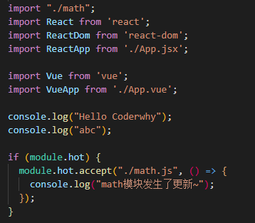

## 二、webpack 配置文件

### 1.打包过程

**指定入口出口打包方式一：命令**

`webpack --ebtry ./src/main.js --output-path ./build`

**指定出口入口方式二：配置文件（重点）**

```js
// webpack.config.js
const path = require("path");
module.exports = {
  entry: "./src/main.js",
  output: {
    filename: "boundle.js",
    // 必须是绝对路径
    path: path.resolve(__dirname, "./build"),
  },
};
```

**假如文件名不是 webpack.config.js**

- 那就没有办法打包成功了，怎么办？
- 因为执行`webpack`命令时，会去查找`webpack.config.js`这个文件执行
- 解决：
  - 在配置文件里面修改 build 指令的配置参数


### 2.webpack 依赖关系图

- webpack 到底是如何对我们的项目进行打包的呢？
  - 事实上 webpack 处理应用程序时，根据命令或已配置的文件找到入口
  - 入口开始，生成一个 **依赖关系图**，这个依赖关系图会包含应用程序中所需的所有模块（js，css，图片，字体）
  - 遍历图结构，打包一个个模块（根据文件的不同使用不同的 loader 来解析）
- 上述的例子：
  - 例子一：安装了某个第三方库`axios`，但是并没有使用，所以打包不会带进去，打包后总体积不会增大。
  - 例子二：项目中创建的文件，没有被引用，最后打包不会在依赖图上，所以体积也不会增大。
  - 例子三：假如有个 js 文件里面有函数，js 确实被引用了，但是函数未被执行，函数也不会被打包。
    - 涉及到 tree shaking

### 3.代码编写案例

- 写了个 css，导入到文件，最后把它打包，最后会报错，原因是缺少加载 css 的 loader

- loader 是什么呢？

  - 用于对模块的源代码进行替换
  - css 文件也可以看成是一个模块，通过 **import**来加载这个模块
  - 在加载这个模块时，webpack 其实并不知道如何对其进行加载，我们必须制定对应的 loader 来完成这个功能

- 那么什么样的 loader 可以加载 css 呢？

  - 这个常用的 loader 最常用的是 css-loader
  - 安装：`npm install css-loader -D`

- css-loader 的三种使用方案：

  - 内联

  

  - CLI 方式（webpack5 中不再使用）
  - 配置方式

* 有`css-loader`表示正常处理解析了 css 文件，但是解析之后的 css 文件没有插入到页面上。

* 想要插入 style，就需要使用`style-loader`

  - `npm i style-loader -D`
  - use: ["style-loader"]
  - style-loader 的原理就是在 document.createElement(style)创建了个样式表

* 注意：webpack 处理 loader 的时候是从下往上的，从右往左的

### 4.loader 配置方式

- module.rules 的配置如下：
- rules 属性对应的值是一个数组 **[Rule]**
- 数组中存放的时 一个个的 Rule，Rule 是一个对象，对象中可以设置多个属性：
  - test 属性：用于对 resource（资源）进行匹配，通常设置成正则表达式
  - use 属性：对应的值是一个数组：**[UseEntry]**，也是一个对象，有两个 key
    - loader：指明要用哪些 loader
    - options：可选属性，值可以使字符串或对象，值会被传入到 loader 中
  - `use:["css-loader"]`相当于键值对的写法


### 5.如何处理 less 文件？

#### 5.1 安装相关工具

- 肯定是要把 less 转换成 css 的，需要安装 less 工具 `npm i less -D`

- 然后 `npx less ./src/css/component.less > component.css`即可转换成正常 css 文件

- 但是在正常开发中需要同时安装 **less** 和 **less-loader** `npm i less less-loader -D`

#### 5.2 配置相关 rule（less）


## 二、第二章

### 2.1PostCSS 工具

#### 2.1.1 初识 PostCSS

- 什么是 PostCss？
  - PostCss 是通过**JavaScript**来**转换样式**的工具
  - 这个工具可以帮助我们进行**CSS 的转换和适配**，比如**自动添加浏览器前缀**，**css 样式重置**
    - 需要添加前缀的样式网站是：`autoprefixer.github.io`
  - 实现这些功能，都需要借助于 PostCSS 对应的插件
- 如何使用 PostCSS 呢？主要就是两个步骤：
  - 先查找 PostCSS 在构建工具的扩展，比如 webpack 中的 postcss-loader；
  - 选择可以添加你需要的 PostCSS 相关插件

#### 2.1.2 命令行使用 postcss

- 我们可以直接在终端中使用 PostCSS，只需要单独安装一个工具`postcss-cli`
  - `npm i postcss -D`
  - `npm i postcss-cli -D` 目的是为了能在命令行中使用 PostCSS
- 举个栗子：现在有个 css 文件里面有些样式，但是这些样式是需要加上浏览器前缀的
  - 现在这些样式是不行的，需要进行处理才能正常运行
  - `npx postcss -o result.css ./src/css/test.css`


- 执行完上面命令行发现是有输出的，但是并没有添加前缀，是因为没有添加插件


- 想要自动添加前缀需要安装什么插件呢？
  - `npm i autoprefixer -D`
  - 然后再执行的时候也需要告诉这次你要使用的插件
    - `npx postcss --use autoprefixer -o result.css ./src/css/test.css`
  - 大功告成


#### 2.1.3 在项目（webpack）中使用 postcss

- 大致流程就是我们需要把自己写的 css 通过 postcss 转换成有前缀的 result.css
- 然后再交给 css-loader 处理，渲染
- 首先需要安装 **postcss-loader**
  - `npm i postcss-loader -D`
- 然后需要在 css-loader 之前通过 postcss-loader 处理
  - 但要注意的是要使用对应的插件，上面也提到过


**使用之前**


**使用之后**


#### 2.1.4postcss-preset-env 的使用

- 上面介绍了 **autoprefixer**，但是很多项目中使用更多的是 **postcss-preset-env**
- 他的作用也是转换 **现代 css 特性**，让这个 css 可以被大多数浏览器识别
- 举个栗子：
  - 我们一般写 16 进制颜色的时候写 6 位：如 `#123456`, 代表着 rgb
  - 但是我们写成 8 位 `#12345678` ,代表着 rgba，后面两个代表透明度
  - 但这个 8 位最新的浏览器确实可以解析，但是旧浏览器无法解析，而且上面使用的 **autoprefixer**也不会帮我们转换
  - 那怎么办? 答案就是使用 **postcss-preset-env**
- 使用步骤：
  - 安装： `npm i postcss-preset-env -D`
  - 在 postcss-loader 中使用该插件
- 使用之前效果：


- 使用之后效果：


- 这个 css 新特性就可以转换成大多数浏览器可识别的代码了

#### 2.1.5 配置相关优化

- 在普通 css 中这样处理需要写一大推代码，项目中又有 less 有需要写一遍相同的代码，有没有办法优化？
- 将整个代码块直接改成像`css-loader`一样，写个字符串
- 把相关的插件依赖写到`postcss.config.js`里面，名字一定是要这个，不然无法读取
- 配置相关代码：

```js
module.exports = {
    pluginL [
    	require('postcss-preset-env')
    ]
}
```

#### 2.1.6 css-loader 中 importLoaders 属性

- 有些场景是在一个样式中通过 **@import**引入另外一个 css 文件
- 这种情况就不会被 **postcss-loader**处理，需要为 **css-loader**添加 **importLoaders**属性
- 代码：

```js
{
	loader: "css-loader",
    options: {
		importLoaders: 1
    }
}
```

### 2.2mode 配置

> mode 有 4 中取值，默认是 development，none，production 等

#### 2.2.1 development

- 代表了开发模式，打包的 js 代码没有进行丑化

## 三、处理其他资源

- 在日常开发中，一个项目会依赖 js，css 文件，也还会依赖图片资源

### 3.1file-loader（处理其他文件资源 loader）

- 要处理 jpj、png 等格式图片，我们也要有对应的 loader：**file-loader**
  - file-loader 的作用就是帮助我们处理 **import/require()**方式引入的一个文件资源，并且会将它放到我们输出的文件夹中；

#### 3.1.1 使用 file-loader

安装：`npm i file-loader -D`

配置规则：

```js
{
    test:/\.(png|jpg|jpeg|gif|svg)$/ ,
    use: "file-loader"
},
```

这样就可以正常处理图片资源了。

**但是考虑一个问题，打包之后的图片资源名称是经 md4 加密后的哈希值，不方便 和原资源名称对应起来，想要对应起来，怎么做？**

#### 3.1.2 对打包生成的图片资源重命名

- 这种重命名的方式也是 vue 脚手架的配置

```js
{
    test:/\.(png|jpg|jpeg|gif|svg)$/ ,
    use: [
      {
        loader: 'file-loader',
        options: {
          name: "[name].[hash:6].[ext]"
        }
      }
    ]
}
```

**再来思考一个问题，图片资源有很多，打包后都默认放在 build 目录下，岂不是很不方便管理？想要把它放在对应的目录下，怎么做？**

#### 3.1.3 打包后的文件放入对应的目录

- 在这里就是放在 img 目录下面，便于管理

```js
 {
    test:/\.(png|jpg|jpeg|gif|svg)$/ ,
    use: [
      {
        loader: 'file-loader',
        options: {
          name: "[name].[hash:6].[ext]",
          outputPath: "img"
        }
      }
    ]
  }
```

### 3.2url-loader

- **url-loader**和 **file-loader**工作方式是相似的，但是可以将较小的文件转成 base64 的 URI

#### 3.2.1 url-loader 的使用

**安装** `npm i url-loader -D`

**配置代码**

- 不会像 **file-loader**一样去生成图片，而是转换成 **base-64**直接嵌入到 js 文件当中

```js
 {
    test:/\.(png|jpg|jpeg|gif|svg)$/ ,
    use: [
      {
        loader: 'url-loader',
        options: {
          name: "[name].[hash:6].[ext]",
          outputPath: "img"
        }
      }
    ]
  }
```

#### 3.2.2 url-loader 带来的问题

- 一般比较适合于小文件的使用
- 如果是大文件的话，把 base64 代码直接嵌入到 js 文件当中会造成文件过大
- 意味着首次加载这个网页的时候需要花费更多的时间去下载这个 js 文件，造成白屏时间加长

#### 3.2.3 怎么决定如何使用 url-loader 和 file-loader

- 首先肯定的是，大文件使用 file-loader 按图片格式打包，小文件直接转成 base64
- 那么如何在配置文件中配置呢？

**配置文件**

- 该配置表示 100kb 作为一个分界点

```js
 {
    test:/\.(png|jpg|jpeg|gif|svg)$/ ,
    use: [
      {
        loader: 'url-loader',
        options: {
          name: "[name].[hash:6].[ext]",
          limit: 100 *1024
        }
      }
    ]
  }
```

### 3.3 在 webpack5 中加载其他资源

> 在 webpack5 之前，会使用到 **raw-loader**、 **url-loader**、 **file-loader**。但是 webpack5 出来之后，我们可以直接使用资源模块类型（asset module type），来替代上面这些 loader

**资源模块类型（asset module type）**，通过添加 4 种薪的模块类型，来替换所有这些 loader：

- **asset/resource** 发送单独的文件并导出 URL。之前对应的是 **file-loader**
- **asset/inline** 导出一个资源的 data URI。之前通过使用 **url-loader**实现
- **asset/source**导出资源的源代码。之前对应 **raw-loader**
- **asset**在导出一个 data URI 和发送一个单独的文件之间自动选择。之前通过 **url-loader**，并且配置资源体积限制实现。

#### 3.3.1 使用 asset module type 模块

**安装** ：无需安装，直接使用。

**配置代码** ：

```js
  {
    test:/\.(png|jpg|jpeg|gif|svg)$/ ,
    type: "asset/resource"
  }
```

#### 3.3.2 指定存放目录

**方式一（在 output 中设置）**

```js
  output: {
    filename: "boundle.js",
    path: path.resolve(__dirname, "./build"),
    assetModuleFilename: "img/[name].[hash:6][ext]"  // 和file-loader不一样的地方，扩展名之前少一个.，模块帮我们加过了
  },
```

**方式二（在 generator 属性中设置）**

```js
  {
    test:/\.(png|jpg|jpeg|gif|svg)$/ ,
    type: "asset/resource",
    generator: {
      filename: "img/[name].[hash:6][ext]"
    }
  },
```

#### 3.3.3 大图片和小图片采用不同 type 打包

- 就是把大图片带走打包，小图片就转换为 base64 嵌入行内；
- 直接把 **type 类型设置为 asset**
- 设置 parser 属性中的 maxSize

```js
  {
    test:/\.(png|jpg|jpeg|gif|svg)$/ ,
    type: "asset",  // 二选一打包
    generator: {
      filename: "img/[name].[hash:6][ext]"
    },
    parser: {
      dataUrlCondition: {
        maxSize: 100 *1024
      }
    }
  },
```

### 3.4 加载字体文件

> 很多场景下都会使用到特殊的字体或者字体图标，就会引入很多字体相关的文件，这些文件的处理方式都是一样的。
>
> 在 webpack5 之前也是通过 file-loader 来处理，但是在 webpack5 中就完全没必要了。

#### 3.4.1 使用 asset/resource 加载字体文件

**安装** ： 无需安装

**代码配置**

```js
  {
    test: /\.ttf|eot|woff2?$/i,
    type: "asset/resource",
    generator: {
      filename: "font/[name].[hash:6][ext]"
    }
  }
```

## 四、Plugin

### 4.1Plugin 和 Loader 区别

> While loaders are used to transform certain types of modules, plugins can be leveraged to perform a wider range of tasks like bundle optimization, asset management and injection of environment variables.

- 上面是 webpack 官方对 plugin 的描述，四级水平对其作个翻译：
  - Loader 是用于特定的模块类型进行转换
  - Plugin 用于执行更加广泛的任务，比如打包优化、资源管理、环境变量注入等；

**举个简单的栗子说明 loader 和 plugin 的作用**

- css 文件需要用 css-loader 去加载
- 但是多个 css 文件需要合并成一个就需要使用插件


**举个 plugin 使用的栗子**

- 不经过特殊处理的话，每次打包后的 build 文件夹，同名称的文件会被覆盖，但是多余文件不会被删除，
- 想要它删除多余文件，也就是重新生成新的 build 文件夹，该怎么做？

**安装** `npm i clean-webpack-plugin -D`

**导入** `const { CleanWebpackPlugin } = require('clean-webpack-plugin');`

**配置代码**

```js
plugins: [new CleanWebpackPlugin()];
```

### 4.2 HtmlwebpackPlugin

- 在 build 中自动生成 html 文件去引入我们的 css 文件

#### 4.2.1 html 插件的简单使用

**安装** `npm i html-wenpack-plugin -D`

**配置代码**

```js
plugins: [
  new CleanWebpackPlugin(),
  new HtmlWebpackPlugin({
    title: "coderqmj webpcak app",
  }),
];
```

- 这样做的话就可以打包之后在 build 生成 HTML 文件，根据模板引擎生成。
- 但是某些特除场景下提供的模板引擎无法满足需求，如 vue 中是需要把 组件挂载到`<div id="app"></div>`中的
- 所以我们还需要自定义模板引擎。

#### 4.2.2 自定义模板引擎

- 首先需要在根目录下创建 **public**目录，在里面创建 **index.html**

**配置代码**

```js
plugins: [
  new HtmlWebpackPlugin({
    title: "coderqmj webpcak app",
    template: "./public/index.html",
  }),
];
```

### 4.3 定义全局常量 DefinePlugin 插件

#### 4.3.1 使用 DefinePlugin 插件

- 由于这个是内置插件，无需安装，可以直接导入。

**配置代码**

- 改代码是配置网站图标的 url 全局变量

```js
// 导入
const { DefinePlugin } = require('webpack');
...
plugins: [
    new DefinePlugin({
       BASE_URL: '"./"'
    })
]
```

### 4.4CopyWebpackPlugin

- 在日常开发中，我们肯定是想要一些文件拷贝到我们 dist 文件夹里面
- 例如，网站图标，public 里面的东西
- 那么我们就可以使用这个插件去实现

#### 4.4.1 拷贝插件的使用

**安装** `npm i copy-webpack-plugin -D`

**配置**

- 这样做技能复制 public 下面的文件，也能忽略复制对应的文件
- 需要注意的是，忽略配置的形式是 `**/文件名`

```js
// 导入
const CopyWebpackPlugin = require('copy-webpack-plugin');
...
new CopyWebpackPlugin({
  patterns: [
    {
      from: "public", // 从这个地方复制，to是默认在build文件夹下面的
      globOptions: {
        ignore: [
          "**/index.html",
          "**/.DS_Store"
        ]
      }
    }
  ]
})
```

## 五、模块化原理和 source-map

### 5.1webpack 模块化原理

- webpack 打包代码，允许使用各种各样的模块化，但最常使用的是 CommonJS，ESModule，**浏览器默认是不支持 CommonJS 的，但是查看打包后的代码有这个模块化，可以被执行**，它是如何帮助我们代码中实现模块化的呢？
- 我们可以来研究下它的原理，包括如下原理：
  - CommonJS 模块化实现原理（浏览器默认不支持）
  - ES Module 实现原理
  - CommonJS 加载 ES Module 的原理
  - ES Module 加载 CommonJS 的原理.

#### 5.1.1mode 属性

- 设置了 mode 就相当于设置了一大推属性，如 cache: true 等等
  - 默认是 production 这个值，代码是被压缩，丑化过的，体积变小
  - 如果是 development，打包后的代码就不会压缩，可以阅读

#### 5.1.2CommonJS 模块化原理

- 编写一个 CommonJS 模块化的文件，然后导出使用，发现可以在浏览器中使用，浏览器不是不支持吗？这是怎么做到的？

**观察打包前后的文件** ：


- 可以看到，打包后的代码还是没啥阅读性，还有 eval 这东西，那怎么能再优化一下呢？
  - 在 webpack 的配置文件里面加个 devtool: "source-map"（默认是 eval）即可，和正常代码差不多


##### **解析 webpack 实现 CommonJS 模块化的原理**

- 执行`webpack_require`函数， 参数是路径（路径：模块化 函数）这样的形式
- 先查找缓存，有缓存就直接使用，没有就下一步赋值
- 赋值：让缓存和 module 都指向同一个对象，方便同步修改
- 开始去 webpack_modules 对象里读取该路径对应的函数，把对应的`dateFormat`放到 module.exports.对象中，最后返回这个对象
- 解构使用


##### ESmodule 实现原理

- 本质上是一层代理，exports["sum"] => definition["sum"]


### 5.2 认识 source-map

- 我们的代码通常运行在浏览器上时，是通过打包压缩的：
  - 真实跑在浏览器上的代码，和我们编写的代码是有差异的
  - ES6 的代码可能被转换成 ES5（babel）
  - 对应代码行号、列号在经过编译之后肯定不一致
  - 进行代码丑化压缩时，会将变量名称修改
  - 比如使用 TS 写代码，最终转换成 JS
- 这样的话，我们代码报错时，很难去定位错误：
  - 因为到时候报错信息是在 bundle.js 下面的某行
  - 肯定和原来的编写文件不一样
- 那么我们如何去试条这种转换后不一致的代码呢？答案就是 source-map
  - **source-map 是从已转换的代码，映射到原始的源文件**
  - 使浏览器可以重构原始源并在调试器中显示重建的原始源
  - 到时候哪里报错了，就直接在这个文件中体现出来，定位到某一行，便于试调

#### 5.2.1 如何使用 source-map

一共两个步骤：

- 根据源文件，生成 source-map 文件，webpack 在打包时，可以通过配置生成 source-map
- 在转换后的代码，最后添加一个注释，它指向 sourcemap


- 报错信息非常高级，会提示哪个文件，哪行代码，和我们自己编写的文件一模一样


#### 5.2.2 分析 sourcemap

- 最初 source-map 生成的文件带下是原始文件的 10 倍，第二版减少了月 20%，第三版减少了 50%，所以目前一个 133kb 的文件，最终的 source-map 大小大概在 300kb
- 性能在慢慢变好
- source-map 的字段
  - version，代表哪个版本的 source-map，目前第三版
  - sources，这个 bundle 文件从哪里加载来的
  - names，转换之前的变量属性名称
  - mappings，采用 base64 VLQ（可变长度质量）编码，存放映射位置信息，变量名称信息
  - file，对应打包后的文件，一般为 js/bundle.js
  - sourcesContent，对应的是我们的源代码
  - sourceRoot，相对根目录
- 以下是一个第三版本的 sourcemap

```json
{
  "version": 3,
  "sources": [
    "webpack://coderqmj/./src/js/format.js",
    "webpack://coderqmj/./src/js/math.js",
    "webpack://coderqmj/webpack/bootstrap",
    "webpack://coderqmj/webpack/runtime/compat get default export",
    "webpack://coderqmj/webpack/runtime/define property getters",
    "webpack://coderqmj/webpack/runtime/hasOwnProperty shorthand",
    "webpack://coderqmj/webpack/runtime/make namespace object",
    "webpack://coderqmj/./src/index.js"
  ],
  "names": [],
  "mappings": ";;;;;;;;;AAAA;AACA;AACA;;AAEA;AACA;AACA;;;AAGA;AACA;AACA;AACA;;;;;;;;;;;;;;;;;ACZO;AACP;AACA;;AAEO;AACP;AACA;;;;;;;;UCNA;UACA;;UAEA;UACA;UACA;UACA;UACA;UACA;UACA;UACA;UACA;UACA;UACA;UACA;UACA;;UAEA;UACA;;UAEA;UACA;UACA;;;;;WCtBA;WACA;WACA;WACA,cAAc,0BAA0B,EAAE;WAC1C,cAAc,eAAe;WAC7B,gCAAgC,YAAY;WAC5C;WACA,E;;;;;WCPA;WACA;WACA;WACA;WACA,wCAAwC,yCAAyC;WACjF;WACA;WACA,E;;;;;WCPA,6CAA6C,wDAAwD,E;;;;;WCArG;WACA;WACA;WACA,sDAAsD,kBAAkB;WACxE;WACA,+CAA+C,cAAc;WAC7D,E;;;;;;;;;;;;;;ACNA;AACA,aAAa,mBAAO,CAAC,mCAAW;;AAEhC;AACiC;;AAEjC;AACA;;AAEA,YAAY,4DAAiB;AAC7B,YAAY,6DAAkB;;AAE9B,gB",
  "file": "js/boundle.js",
  "sourcesContent": [
    "const dateFormat = (date) => {\n  return \"2020-12-12\";\n}\n\nconst priceFormat = (price) => {\n  return \"100.00\";\n}\n\n\nmodule.exports = {\n  dateFormat,\n  priceFormat\n}\n",
    "export const sum = (num1, num2) => {\n  return num1 + num2;\n}\n\nexport const mul = (num1, num2) => {\n  return num1 * num2;\n}\n\n",
    "// The module cache\nvar __webpack_module_cache__ = {};\n\n// The require function\nfunction __webpack_require__(moduleId) {\n\t// Check if module is in cache\n\tvar cachedModule = __webpack_module_cache__[moduleId];\n\tif (cachedModule !== undefined) {\n\t\treturn cachedModule.exports;\n\t}\n\t// Create a new module (and put it into the cache)\n\tvar module = __webpack_module_cache__[moduleId] = {\n\t\t// no module.id needed\n\t\t// no module.loaded needed\n\t\texports: {}\n\t};\n\n\t// Execute the module function\n\t__webpack_modules__[moduleId](module, module.exports, __webpack_require__);\n\n\t// Return the exports of the module\n\treturn module.exports;\n}\n\n",
    "// getDefaultExport function for compatibility with non-harmony modules\n__webpack_require__.n = function(module) {\n\tvar getter = module && module.__esModule ?\n\t\tfunction() { return module['default']; } :\n\t\tfunction() { return module; };\n\t__webpack_require__.d(getter, { a: getter });\n\treturn getter;\n};",
    "// define getter functions for harmony exports\n__webpack_require__.d = function(exports, definition) {\n\tfor(var key in definition) {\n\t\tif(__webpack_require__.o(definition, key) && !__webpack_require__.o(exports, key)) {\n\t\t\tObject.defineProperty(exports, key, { enumerable: true, get: definition[key] });\n\t\t}\n\t}\n};",
    "__webpack_require__.o = function(obj, prop) { return Object.prototype.hasOwnProperty.call(obj, prop); }",
    "// define __esModule on exports\n__webpack_require__.r = function(exports) {\n\tif(typeof Symbol !== 'undefined' && Symbol.toStringTag) {\n\t\tObject.defineProperty(exports, Symbol.toStringTag, { value: 'Module' });\n\t}\n\tObject.defineProperty(exports, '__esModule', { value: true });\n};",
    "// esmodule 导出内容， CommonJS导入内容\r\nconst math = require('./js/math');\r\n\r\n// commonjs 导出内容， es module导入内容\r\nimport format from \"./js/format\";\r\n\r\nconsole.log(math.sum(20,30));\r\nconsole.log(math.mul(20,30));\r\n\r\nconsole.log(format.dateFormat(\"abba\"))\r\nconsole.log(format.priceFormat(\"a\"))\r\n\r\nconsole.log(bav)"
  ],
  "sourceRoot": ""
}
```

#### 5.2.3 如何在 webpack 打包时，生成对应的 sputce-map 呢

- 目前 webpack 提供了 26 个不同的值，来处理 source-map
- 根据不同的值会有不同的作用，打包过程也有性能的差异，可以根据不同的情况进行选择
- https://webpack.docschina.org/configuration/devtool/

**devtool 下面几个值不会生成 source-map**

- false，直接生成 build 文件
- none，production 模式下的默认值，不生成 source-map，和上面的区别就是，none 在 development 模式下就会报错
- eval，development 模式下的默认值，不生成 source-map
  - 但是他会在 eval 执行的代码中，添加//#sourceURL= ;
  - 他会被浏览器执行时解析，并且在试调面板中生成对应的一些文件目录，方便试调代码
  - 速度会快一点
  - 但是不是非常准确，还原了一个大概的值
- source-map，会生成独立的 source-map 文件，并在 bundle 文件中有一个注释，指向 sourcemap 文件
  - bundle 文件中有如下的注释：
  - //# sourceMappingURL = bundle.js.map
- eval-source-map, 不生成单独的 source-map 文件，但是在 bundle 文件里面中的 eval 中，包含了 source-map 的代码
- inline-source-map，用 base64 编码，将 source-map 的代码放到 bundle 文件的最后
- cheap-source-map，
  - 会生成 source-map，但是会更加高效（cheap 是低开销），因为他没有生列成映射，没有列的信息
  - 因为在开发中，我们只需要行信息通常就可以可以定位到错误了


- Cheap-moudle-source-map
  - 会生成 source-map，类似于 cheap-source-map，但是对源自 loader 的 sourcemap 处理会更好
  - 如果是 ES6 语法，肯定要经过一些列 loader 处理，经过 loader 处理的后再使用其他 source-map，会使得报错信息不准确，行号会变，源代码也会变
  - 但是经过 loader 和 cheap-moudle-source-map 同时处理的打包文件就不会改变行号，会准确一些

#### 5.2.4 在开发中，最佳实践是什么呢？

- 开发阶段：推荐使用 source-map 或者 cheap-module-source-map
  - 这里分别是 vue 和 react 使用的值，可以获取试调信息，方便快速开发
- 测试阶段：推荐使用 source-map 或者 cheap-module-source-map
  - 测试阶段我们也希望在浏览器下看到正确的错误提示
- 发布阶段，false、缺省值（不写）
  - 首先是用户使用的，人家也看不懂
  - 最重要的是要是把源码放出去，就很危险，造成安全隐患

## 六、Babel 深入解析

### 6.1Babel 简单介绍

**为什么需要 babel？**

- 在编码中，很少接触 babel，但是对于前端开发来说，这是不可或缺的
- 我们想要在项目中使用 ES6，TS，开发 React 项目，都是离不开 babel 转换的
- 所以，学习 babel 对于我们理解代码从编写到上限的转变过程至关重要

**那 babel 到底是什么？**

- babel 是一个工具链，主要用于旧浏览器或者缓解中将 ES2015+代码转换为向后兼容版本的 JS
- 包括语法转换、源代码转换、Polyfill 实现目标缓解缺少的功能等

### 6.2Babel 使用

#### 6.2.1babel 简单使用

```js
// 源文件
const message = "Hello World";

const foo = (info) => {
  console.log(info);
};

foo(message);
```

**安装** ：`npm i @babel/core -D`

**在命令行中使用 babel** ： `npm i @babel/cli -D`

**babel 输出** ： `npx babel src --out-dir result`

- 可以看到上面结果是无法转换箭头函数的，所以还需要转换箭头函数的插件

**箭头函数转换插件** ： `npm i @babel/plugin-transform-arrow-functions -D`

**使用插件** ： `npx babel src --out-dir result --plugins=@babel/plugin-transform-arrow-functions`

- 可以看到，箭头函数转换了，但是 ES6 的`const`没有转换
- 这个时候就需要装`@babel/plugin-transform-block-scoping`

```js
const message = "Hello World";

const foo = function(info) {
  console.log(info);
};

foo(message);
```

**块级作用域转换插件** ： `npm i @babel/plugin-transform-block-scoping -D`

- 使用箭头转换和块级作用域转换，生成如下代码
- const 被转换，箭头函数也被转换

```js
var message = "Hello World";

var foo = function(info) {
  console.log(info);
};

foo(message);
```

#### 6.2.2 那么问题来了，ES6 这么多需要转换的，难道都需要一个个写吗？

- 当然不是，如果一次性需要配置很多转换的话，就需要预设
- **安装预设** ： `npm i @babel/preset-env -D`
- **使用预设** ： `npx babel src --out-dir result --presets=@babel/preset-env`
- 生成代码如下

```js
"use strict";

var message = "Hello World";

var foo = function foo(info) {
  console.log(info);
};

foo(message);
```

### 6.3babel 底层原理

**先看下 JS 执行过程** ：源代码 -> AST（abstract syntax tree） -> ByteCode -> 被 V8 引擎处理执行

**我们把帮我们完成上面这一系列操作的叫做编译器，最主要帮我们做三个操作**

- 对代码进行解析生成 AST，AST 之后再对代码进行转换，生成另外一种代码，如字节码，也有可能是另外一中代码
  - 源码是 ES6 的，生成原 AST，再生成新 AST 树，再生成 ES5 的代码
  - 这个过程就是 babel 帮我们完成

**babel 如何做到把我们的代码（ES6，TS，JSX）转成 ES5 代码的？**

- 源一中源码（原生语言）转换成另外一种源码（目标语言），有这种功能的工具叫什么呢？
- 这个就叫做编译器，事实上我们可以把 babel 看成就是一个编译器
- babel 编译器的作用就是将我们的源代码，转换成浏览器可以直接识别的另外一段源代码

**babel 的编译器工作流程**

- 解析阶段
- 转换阶段
- 生成阶段
- 总结一下就是： 源代码 -> 解析 -> 转换 -> 代码生成 -> 目标代码 （大致过程）
- 详细流程：


**下面就根据一段代码来分析下整个编译流程**

```js
// 原生代码文件
const name = "coderwhy";
const foo = (name) => console.log(name);
foo(name);
```

- 开始词法分析，像 const name = 字符串会被一个个提取出来
- 这些词提取出来会生成 tokens 数组

```js
[
  {
    type: "Keyword", // 关键字
    value: "const",
  },
  {
    type: "Identifier", // 标识符
    value: "foo",
  },
  {
    type: "Punctuator", // 括号，等号，分号，逗号都叫这个
    value: "=",
  },
  {
    type: "Punctuator",
    value: "(",
  },
  {
    type: "Identifier",
    value: "name",
  },
  {
    type: "Punctuator",
    value: ")",
  },
  {
    type: "Punctuator",
    value: "=>",
  },
  {
    type: "Identifier",
    value: "console",
  },
  {
    type: "Punctuator",
    value: ".",
  },
  {
    type: "Identifier",
    value: "log",
  },
  {
    type: "Punctuator",
    value: "(",
  },
  {
    type: "Identifier",
    value: "name",
  },
  {
    type: "Punctuator",
    value: ")",
  },
  {
    type: "Punctuator",
    value: ";",
  },
  {
    type: "Identifier",
    value: "foo",
  },
  {
    type: "Punctuator",
    value: "(",
  },
  {
    type: "String",
    value: '"coderwhy"',
  },
  {
    type: "Punctuator",
    value: ")",
  },
  {
    type: "Punctuator",
    value: ";",
  },
];
```

- 再然后就是语分析
  - 怎么分析呢？就是拿到这个 tokens 数组进行遍历
  - 判断当前的值是个“const”的话，就知道它定义个变量
  - 这个过程也叫做 Parsing
- 经过各种分析之后，就会生成 AST，抽象语法树长什么样呢？
  - 最外层有一些信息，type 存放 Program，
  - body 存放着一些代码信息，比如定义了一个 foo 标识符，初始化为箭头函数

```json
{
  "type": "Program",
  "body": [
    {
      "type": "VariableDeclaration",
      "declarations": [
        {
          "type": "VariableDeclarator",
          "id": {
            "type": "Identifier",
            "name": "foo"
          },
          "init": {
            "type": "ArrowFunctionExpression",
            "id": null,
            "params": [
              {
                "type": "Identifier",
                "name": "name"
              }
            ],
            "body": {
              "type": "CallExpression",
              "callee": {
                "type": "MemberExpression",
                "computed": false,
                "object": {
                  "type": "Identifier",
                  "name": "console"
                },
                "property": {
                  "type": "Identifier",
                  "name": "log"
                }
              },
              "arguments": [
                {
                  "type": "Identifier",
                  "name": "name"
                }
              ]
            },
            "generator": false,
            "expression": true,
            "async": false
          }
        }
      ],
      "kind": "const"
    },
    {
      "type": "ExpressionStatement",
      "expression": {
        "type": "CallExpression",
        "callee": {
          "type": "Identifier",
          "name": "foo"
        },
        "arguments": [
          {
            "type": "Literal",
            "value": "coderwhy",
            "raw": "\"coderwhy\""
          }
        ]
      }
    }
  ],
  "sourceType": "script"
}
```

- 然后就是对上面这个 AST 进行遍历，深度优先
- 去访问这个树上的每一个节点
- 然后在访问的过程中应用每一个插件对代码进行转换，对某些节点进行修改（插件就是在这个过程中被应用的）
- 访问完每一个节点并且应用插件修改完之后，就会生成一个新的 AST

```json
{
  "type": "Program",
  "body": [
    {
      "type": "VariableDeclaration",
      "declarations": [
        {
          "type": "VariableDeclarator",
          "id": {
            "type": "Identifier",
            "name": "foo"
          },
          "init": {
            "type": "FunctionExpression",
            "id": {
              "type": "Identifier",
              "name": "foo"
            },
            "params": [
              {
                "type": "Identifier",
                "name": "name"
              }
            ],
            "body": {
              "type": "BlockStatement",
              "body": [
                {
                  "type": "ReturnStatement",
                  "argument": {
                    "type": "CallExpression",
                    "callee": {
                      "type": "MemberExpression",
                      "computed": false,
                      "object": {
                        "type": "Identifier",
                        "name": "console"
                      },
                      "property": {
                        "type": "Identifier",
                        "name": "log"
                      }
                    },
                    "arguments": [
                      {
                        "type": "Identifier",
                        "name": "name"
                      }
                    ]
                  }
                }
              ]
            },
            "generator": false,
            "expression": false,
            "async": false
          }
        }
      ],
      "kind": "var"
    },
    {
      "type": "ExpressionStatement",
      "expression": {
        "type": "CallExpression",
        "callee": {
          "type": "Identifier",
          "name": "foo"
        },
        "arguments": [
          {
            "type": "Literal",
            "value": "coderwhy",
            "raw": "\"coderwhy\""
          }
        ]
      }
    }
  ],
  "sourceType": "script"
}
```

- 然后再根据这个新的 AST 生成 ES5 的代码

### 6.4 根据目标浏览器生成对应 ES 版本的代码

- 我们每次打包都要手动去输入插件（箭头函数转换，const/let 转换）都非常麻烦？那怎么样才能更方便的生成我们想要的目标代码呢？
- 方法就是使用浏览器配置文件+preset（包含多个插件）
- 下面的配置就会根据浏览器配置文件生成对匹配到的浏览器可以识别的代码

```js
module: {
  rules: [
    {
      test: /\.jsx?$/,
      exclude: /node_modules/,
      use: {
        loader: "babel-loader",
        options: {
            presets: [
              ["@babel/preset-env", {
                // targets: ["chrome 88"]  // 对应浏览器可以识别的版本，这个优先级高，但是不建议使用
                // enmodules: true
              }]
            ]
        //   // plugins: [
        //   //   "@babel/plugin-transform-arrow-functions",
        //   //   "@babel/plugin-transform-block-scoping"
        //   // ]
        // }
      }
    }
  ]
},

// .browserlistrc
>1%
last 2 version
not dead
```

### 6.5babel 四个不同的 Stage

- Stage0，稻草人阶段，尚未提交作为正式提案的讨论
- Stage1，提议阶段，提案被正式化，并期望解决此问题，还需要观察与其他提案的互相影响
- Stage2，草稿阶段，提供规范初稿，草稿
- Stage3，后补，必须在最终规范上签字
- Stage4 完成
- 但是已经不推荐使用了，使用上一节提到的 preset

### 6.6Babel 的配置文件

- 我们可以把 babel 配置写在 webpack.config.js 中，也可以单独写一个文件进行配置
- babel 提供了两种配置文件的编写：
  - babel.config.json(或者.js, .cjs, .mjs)文件；
  - .babelrc.json(或者.babelrc，.js, .cjs, .mjs)
- 为什么要两个文件呢？是因为目前很多的项目都采用多包管理的方式（element-plus，umi 等）
  - .babelrc.json，早起使用较多，但是对于配置 Monorepos 项目是比较麻烦的
  - babel.config.json（babel 7）：可以直接作用于 Monorepos 项目的子包，更加推荐

### 6.7Polyfill

> 帮助我们更好的使用 JavaScript，我们使用了一些特性如，promise，generator，以及实例 Array.prototype.includes 等，但是某些浏览器不认识这些特性，就会报错，这时候我们使用 polyfill 来填充打补丁，就会包含该特性了

#### 6.7.1 如何使用 Polyfill

- 第一步安装： `npm i @babel/polyfill`
  - 
  - 但现在安装的话会报警告，说使用 polyfill 已经过时了，并推荐安装下面两个包：
    - core-js
    - regenerator-runtime
  - 所以我们安装这个就好了： `npm i core-js regenerator-runtime`
- 第二步配置：在 babel.config.js 中配置
- 但是需要注意的一点，打包的时候需要把 node_modules 中排除了，避免版本不一致的打包造成安全隐患

```js
module.exports = {
  presets: [
    [
      "@babel/preset-env",
      {
        // false: 不用任何的polyfill相关的代码
        // usage: 代码中需要哪些polyfill, 就引用相关的api
        // entry: 手动在入口文件中导入 core-js/regenerator-runtime, 根据目标浏览器引入所有对应的polyfill
        useBuiltIns: "entry",
        corejs: 3,
      },
    ],
    ["@babel/preset-react"],
  ],
  // plugins: [
  //   ["@babel/plugin-transform-runtime", {
  //     corejs: 3
  //   }]
  // ]
};
```

- 第三步：在文件中引入包

```js
import "core-js/stable";
import "regenerator-runtime/runtime";

// 不一定要引入全部，也可以按需引入
import "core-js/feature/array/flat";
```

### 6.8React 的 jsx 支持

- 在我们编写 react 代码时，react 使用的语法是 jsx，jsx 是可以直接使用 babel 来转换的
- 对 react jsx 代码进行处理需要如下插件：
  - @babel/plugin-syntax-jsx
  - @babel/plugin-transform-react-jsx
  - @babel/plugin-transform-react-display-name
- 但是在开发中这样一个个装实在是麻烦了，babel 针对于 react 项目，提供了个专门的插件：
  - @babel/prest-react
  - 这个插件是包含上面的三个的

### 6.9Typescript 的编译

- npm i typescript -g 然后 tsc index.ts 就可以完成编译，真实开发中不可能这样去做

#### 使用 ts-loade 对 ts 进行编译

- 安装 ts：npm i ts-loader -D

```js
module: {
    rules: [
      {
        test: /\.ts$/,
        exclude: /node_modules/,
        // 本质上是依赖于typescript(typescript compiler)
        use: "ts-loader"
      }
    ]
},
```

##### 缺点：

- 使用 ts-loader 编译出来的代码是没有使用 polyfill 的，所以有些浏览器就不能使用高级语法

#### 使用 babel 编译 TS

- babel 不需要像 ts-loader 一样依赖 tsc
- 做法非常简单，只需要把 ts-loader 改为 babel-laoder
- 但是通过 babel 去处理的时候需要去设置预设（在 babel.config.js 中）

```js
// webpack.config.js
module: {
    rules: [
      {
        test: /\.ts$/,
        // 最好排除掉依赖包，不然会出现问题
        exclude: /node_modules/,
        // 本质上是依赖于typescript(typescript compiler)
        use: "babel-loader"
      }
    ]
},

// babel.config.js
 module.exports = {
  presets: [
    ["@babel/preset-env", {
      // false: 不用任何的polyfill相关的代码
      // usage: 代码中需要哪些polyfill, 就引用相关的api
      // entry: 手动在入口文件中导入 core-js/regenerator-runtime, 根据目标浏览器引入所有对应的polyfill
      useBuiltIns: "usage",
      corejs: 3
    }],
    ["@babel/preset-react"],
    ["@babel/preset-typescript"]
  ],
  // plugins: [
  //   ["@babel/plugin-transform-runtime", {
  //     corejs: 3
  //   }]
  // ]
}
```

### 6.10TS 编译最佳实践

#### 6.10.1ts-loader 和 babel-loader 选择

**babel-loader**

- babel-loade 最大的优点就是 polyfill，但缺点就是不会对代码进行类型的校验
- 在 ts 中，我们可以对 ts 进行校验类型，但使用 babel 的话，打包就不会校验类型了
  - 如果使用的是 ts-loader 的话，build 打包就不会让你通过，原因是会对类型做检测的

**ts-loader**

- ts-loader 可以在打包的时候对代码做类型检测，如果不符合类型规范，那么则不会通过编译
- 但 ts-loader 的缺点就是无法使用 polyfill

#### 6.10.2 我们即想用 polyfill，还想做类型检测怎么做？

- 事实上 TS 的官方文档有对其进行说明：说明连接https://www.typescriptlang.org/docs/handbook/babel-with-typescript.html
  - 如果大部分文件输入和输出都一样的话，直接使用 tsc 即可
  - 如果有多个输出就用 babel-loader 转换，但是使用 tsc 进行类型检查
    - 先执行 tsc 看看有没有错误，再去打包 `build: npm run type-check & webpack`


### 6.11babel 的预设

## 七、ESLint

> ESLint 是一个静态代码分析工具，在没有任何程序执行的情况下，对代码进行分析。ESLint 可以帮助我们在项目中建立统一的团队代码规范，保持正确、统一的代码风格，提高代码的可读性、可维护性；并且其是可以配置 id，我们可以定义属于自己的规则

### 7.1 使用 ESLint

#### 安装：

- `npm i eslint -D`
- 单单安装是不行的，因为还没有规则，它不知道如何去规范的。

#### 规则：

- npx eslint --init 执行它会生成`.eslintrc.js`文件里面会有些基础的配置

## 八、DevServer 和 HMR

### 8.1webpack 的 DevServer

- 开发时服务，类似于 live-server
- 之前项目存在的问题：
  - 项目中的 html 文件都需要重新打包生成最新的 html 才能渲染到浏览器上
  - 每次修改完代码后想看效果的话，都需要打包一次，那这个效率是非常低的。
- 改进方法：
  - 方法一：通过 watch 监听源代码的变化 （`watch: webpack --watch` 或者在 webpack.config.js 里面`watch: true`）
    - 只要在目录树下面的文件任何代码发生变化后，都会重新编译打包

#### **分析方法一**Watch

**缺陷**

- 监听文件的变化然后重新打包，这样的**效率低**，原因是有文件变化后重新编译打包所有文件
- 且重新编译后都会生成新的文件，每次都要进行文件写入操作，file system，对性能也造成影响
- liver-server 属于 vscode 的插件，使用其他编辑器就不行
- live-server 只要是监听到变化就直接刷新整个页面，可能不会保存状态

#### 方法二：`webpack-dev-server`

安装：`npm i webpack-dev-server -D`

配置：

**分析**

- 所有代码还是会重新编译，性能差
- 注意不是服务在 build 文件夹，很多资料这么说是错误的
- 编译后不会放到本地文件，不会进行 file system，而是直接放到内存里面，从内存直接加载性能会高点。
- 原先这个内存的管理是 webpack 官方写的，memory-fs 的一个库，已经很久不更新了，被放弃
- 现在用的缓存库是 memfs 这个库

### 8.2 认识模块热替换（HMR）——重要

**概念**

- Hot module replacement
- 指的是应用程序运行过程中，替换、添加、删除模块，而无需刷新整个页面
- 所以这种方式对我们提高开发速度和效率是非常有用的

**HMR 通过如下几种方式来提高开发效率**

- 不重新加载整个页面，这样可以保留某些应用程序的状态不丢失
- 只需更新需要变化的内容，节省开发时间
- 修改 JS、css 源代码，会立即在浏览器更新，相当于直接在浏览器的 devtools 中直接修改样式

**应用**

- 需要在`webpack.config.js`中配置 devServer


- 但是你会发现，我们修改了某一个模块的代码时，依然是刷新整个页面：
  - 原因是我们需要去指定哪些模块发生更新时，进行 HMR
- 如果去指定要热更新的模块，应当做如下配置



### 8.3 框架中的 HMR

- 上面是我们自己配的，但在日常开发 Vue 和 React 时，没有必要这么去做
- 对此 webpack 官网也有提到：[官方文档解释](https://www.webpackjs.com/guides/hot-module-replacement/#%E5%85%B6%E4%BB%96%E4%BB%A3%E7%A0%81%E5%92%8C%E6%A1%86%E6%9E%B6)
- 官方文档提到的 loader ReactHot Loader 和 Vue loader 都是开箱即用
- 但是 React 官方不再使用 React ，改成使用 React-refresh

#### 8.3.1React 中的热更新

- 开启 devServer { hot: true } 时，整个页面都会进行刷新

**如何自己配置热更新**

- 如果是直接使用官方脚手架，那肯定是已经配好了的

**安装** ：`npm i react-refresh-webpack-pugin react-refresh`

**导入并使用插件**

- `const ReactRefreshWebpackPlugin = require('@pmmmwh/react-refresh-webpack-plugin');`
- `plugins: [new ReactRefreshWebpackPlugin()]`

**在 babel 处理 JSX**

- 因为处理 JSX 都是在 babel 中的，所以需要在 babel.config.js 中使用一下 react-refresh
- plugins: ["react-refresh/babel"]

**总结**

- 以上 3 个步骤完成之后，再去修改源代码，就可以进行热更新了。
- 安装并使用还不能够时 HMR 生效，还需要在 babel 处理 JSX 时带上 react-refresh/babel

### 8.4HMR 的原理

**HMR 的原理是什么呢？如何做到只更新一个模块中的内容呢？**

- webpack-dev-server 会创建两个服务：提供静态资源的服务（express）和 Socket 服务（net.Socket)
- express server 负责直接提供静态资源的服务（打包后的资源直接被浏览器请求和解析）


**之前更新的原理**

- 源代码生成 bundle.js，使用 http 短连接，每次更新文件时，重新编译打包再返回给客户端。
- 但是每次客户端都必须重新请求才能获取最新的文件
- 所以更新文件后本地服务需要给客户端一个信号，让其重新请求。

**HMR 的更新原理**

- 每次更新文件后，都会生成一个 js 文件和一个 json 文件。
- js 文件时这次变化的具体内容，json 文件记录一些相关的信息，那里发生了变化等。
- 然后把这两个文件主动的给客户端发过去（通过长链接），**客户端不会发生请求**
- 然后客户端根据这两个文件的数据更新对应模块的内容
- 为什么客户端没有请求而本地服务可以随便向客户端随意发送数据呢?
  - 因为建立的是长链接，建立了一个通道，可以即时通信
  - 这种技术一般应用于聊天，直播等

**总结**

HMR 更新原理就是 HMR 帮我们创建一个叫 HMR Server 的服务，然后建立了一个长链接，然后文件有更新的时候，然后就会把 js 和 json 文件发送给浏览器，然后根据最新的文件去单独对这个模块进行执行，不会影响其他模块，所以其他模块就保留了原来的数据和原来的状态。

## 九、路径解析

### 9.1output 的 publicPath

**用到的场景**

- 项目中开发时，在本地跑是没问题的，路径跳转、刷新等操作都没问题。
- 但是等打包成 dist 文件夹上传静态资源服务器上就会出现问题：
  - 刷新会找不到资源。
  - 原因是把 js 文件当成 html 文件去识别了

**output 的 path**

- 告诉这个项目打包输出到哪个目录

#### output 的 publicPath 属性

- 该属性是指定 _index.html_ 文件打包引用的一个基本路径：
  - 默认值是一个空字符串，所以我们打包后引入 js 文件时，路径是 bundle.js
  - 在开发中我们一般设置`/`，路径是/bundle.js，那么浏览器会根据所在的域名+路径去请求对应的资源
  - 要是想在本地打开 index.html 直接运行的话，需要把 publicPath 设置为`./`，这样才可以查找正确的资源

### 9.2DevServer 中的 publicPath

- devServer 中也有个 publicPath，它的作用是什么呢？
- 首先，DevServer 是做什么的？
  - 是在开发过程中，开启一个本地服务
  - 再生产环境下是用不到的
- DevServer 中的 publicPath 这个属性是指定本地服务所在的文件夹：
  - 默认值是`/`，直接访问端口即可访问其中的资源
  - 如果设置成`/abc`，那么我们需要通过`http://localhost:8080/abc`才可以访问到对应打包后的资源。
  - 并且这个时候，我们其中的 bundle.js 通过`http//localhost:8080/bundle.js`也是无法访问
    - 所以必须把 output.publicPath 也设置为/abc
    - 官方建议 DevServer.publicPath 与 output.PublicPath 相同

### 9.3DevServer 的 contentBase

- 一般我们都会直接设置成`./build`，但是意义并不大
- 对于我们打包后的资源并没有什么作用，它的主要作用是如果我们打包后的资源，有依赖于其他的一些资源，那么就需要指定从哪里来查找这个内容

### 9.4DevServer 的 hotOnly

- 如果没有开启 hotOnly，只开启了 hot，源代码写错了，浏览器会出现错误信息，但是这个时候又修正错误，hot 热更新替换就帮我们刷新浏览器，不会保留原来的报错信息。
- 原来保存的状态也会被重置，比如计数到 100 之类的
- 如果我们想保留报错信息以及之前的状态，且只更新我们修改过的模块。
- 这个时候只需要新增`hotOnly:true`即可

### 9.5DevServer 的 host 配置

- 设置主机地址，默认地址是 localhost
- 如果希望其他地方也可以访问，可以设置`0.0.0.0`

**port 属性**

- 指定在那个端口运行程序

**open**

- npm run serve 后是否打开浏览器

**compress**

- 打包的静态资源是否进行一个 gzip 压缩
- 让网络传输成本小一点，当浏览器去请求的时候发现是 gizp 文件，浏览器自动对 gzip 文件做一个解压，再去引入解压后的文件
- 请求头中的`Content-Encoding: gizp`
- 亲测一个 1.7M 的文件经过压缩后变为 421KB

### 9.6DevServer 中的 Proxy 代理

- 开发中很常用的一个功能，主要用于解决跨域的问题。
- 比如我们的一个 api 请求是 8888 端口的，但本地服务是 8000 端口的，那么就会出现跨域问题。
- 我们可以将请求发送到一个代理服务器，代理服务器和 API 服务器没有跨域的问题，就可以解决上面的问题。
- 也可以通过部署解决跨域问题，但是我们再开发中需要试调，所以就需要代理了。
- 默认是无法向 https 发送请求的，如果想这么做的话，设置`secure: false`
- 默认情况下也是不会处理请求源的变更的，服务器会以为是代理服务器发来的请求
  - 如果有校验的，可能会拿不到数据
  - 没校验那就没事了
- 所以需要`changeOrigin: true`，这样请求头才会带上原本客户端的信息

```js
 proxy: {
      // "/api": "http://localhost:8888"
      "/api": {
        target: "http://localhost:8888",
        pathRewrite: {
          "^/api": ""
        },
        secure: false,
        changeOrigin: true
      }
    },
```

### 9.7DevServer 中的 historyApiFallback

- 我们使用不同的路由跳转时（history），比如从`localhost:8080/home`跳转到`localhost:8080/about`，这个时候我们点击左侧刷新按钮，会直接报错找不到资源。
- 是因为前端向后端请求了`localhost:8080/about`这个资源，但是服务器哪有这个，所以就直接报错了。
- 如果实在 Nginx 部署中做了配置就不会，刷新的时候是返回 index.html 再拼接当前的路由，这样就保证了我们请求的资源不会错。
- 但是在开发环境中无法应用 Nginx，那应该如何去解决
- 答案也很简单：DevServer 中的 historyApiFallback 属性
- 直接设置为`historyApiFallback: true`
  - 每次返回 404 的时候直接返回 index.html 就行
- 但如果想具体哪一个路由去匹配 index.html，需要给一个对象
  - abc 找不到时，就返回 index.html

```js
historyApiFallback: {
  rewrites: [{ from: /abc/, to: "/index.html" }];
}
```

## 十、对 webpack 配置拆分

### 10.1 基本概念及如何判断环境

**在一个 webpack 所有配置一般分为三种配置**

1. 开发时需要的配置
2. 生产环境的配置
3. 开发和生产都需要的配置
4. 且还需要我们需要的一些公共函数方法


**注意事项**

- build 命令进行 webpack 打包且没有任何参数时，则会去找 package.json 同级目录下的 webpack.config.js
- 如果我们做分离的话，则需要指定位置
  - `build: webpack --config ./config/webpack.prod.js`
  - `serve: webpack server --config webpack.dev.js`

**如何判断环境**

- 根据传入的参数
  - `webpack --config ./config/webpack.common.js --env production` 生产
  - `webpack serve --config ./config/webpack.common.js --env development`开发环境


- 一般在 webpack.common.js 里面去判断环境


### 10.2 配置文件分离

**哪些东西需要分离？**

- mode：在不同环境是不一样的，需要分离


#### 一个例子

**webpack.common.js**

- 最后还需要用 merge 合并生产环境和开发环境合并起来

```js
const resolveApp = require("./paths");
const HtmlWebpackPlugin = require("html-webpack-plugin");
const VueLoaderPlugin = require("vue-loader/lib/plugin");

const { merge } = require("webpack-merge");

const prodConfig = require("./webpack.prod");
const devConfig = require("./webpack.dev");

const commonConfig = {
  entry: "./src/index.js",
  output: {
    filename: "bundle.js",
    path: resolveApp("./build"),
  },
  resolve: {
    extensions: [".wasm", ".mjs", ".js", ".json", ".jsx", ".ts", ".vue"],
    alias: {
      "@": resolveApp("./src"),
      pages: resolveApp("./src/pages"),
    },
  },
  module: {
    rules: [
      {
        test: /\.jsx?$/i,
        use: "babel-loader",
      },
      {
        test: /\.vue$/i,
        use: "vue-loader",
      },
      {
        test: /\.css/i,
        use: ["style-loader", "css-loader"],
      },
    ],
  },
  plugins: [
    new HtmlWebpackPlugin({
      template: "./index.html",
    }),
    new VueLoaderPlugin(),
  ],
};

module.exports = function(env) {
  const isProduction = env.production;
  process.env.NODE_ENV = isProduction ? "production" : "development";

  const config = isProduction ? prodConfig : devConfig;
  const mergeConfig = merge(commonConfig, config);

  return mergeConfig;
};
```

**webpack.dev.js**

```js
const resolveApp = require("./paths");
const ReactRefreshWebpackPlugin = require("@pmmmwh/react-refresh-webpack-plugin");

const isProduction = false;

console.log("加载devConfig配置文件");

module.exports = {
  mode: "development",
  devServer: {
    hot: true,
    hotOnly: true,
    compress: true,
    contentBase: resolveApp("./why"),
    watchContentBase: true,
    proxy: {
      "/why": {
        target: "http://localhost:8888",
        pathRewrite: {
          "^/why": "",
        },
        secure: false,
        changeOrigin: true,
      },
    },
    historyApiFallback: {
      rewrites: [{ from: /abc/, to: "/index.html" }],
    },
  },
  plugins: [
    // 开发环境
    new ReactRefreshWebpackPlugin(),
  ],
};
```

**webpack.prod.js**

```js
const { CleanWebpackPlugin } = require("clean-webpack-plugin");
const isProduction = true;

module.exports = {
  mode: "production",
  plugins: [
    // 生成环境
    new CleanWebpackPlugin({}),
  ],
};
```

**解决路径相关**

- 优化路径写法，不用去写`./和../之类的`

```js
const path = require("path");

// node中的api
const appDir = process.cwd();
const resolveApp = (relativePath) => path.resolve(appDir, relativePath);

module.exports = resolveApp;
```

**对于生产环境不需要的 babel 配置**

- 比如 HMR 所需要的的`react-refresh/babel`

```js
const presets = [["@babel/preset-env"], ["@babel/preset-react"]];
const plugins = [];
const isProduction = process.env.NODE_ENV === "production";

// React HMR -> 模块的热替换 必然是在开发时才有效果
if (!isProduction) {
  plugins.push(["react-refresh/babel"]);
} else {
}
module.exports = {
  presets,
  plugins,
};
```

## 十一、代码分离

- 代码分离是 webpack 一个非常重要的特性
  - 它主要目的是将代码分离到不同的 bundle 中，之后我们可以按需加载，或者并行加载这些文件；
  - 比如默认情况下，所有的 JS 代码（业务代码、第三方依赖、暂时没有用到的模块）在首页全部加载，就会影响首页的加载速度
  - 代码分离可以分出更小的 bundle，以及控制资源加载优先级，提供代码的加载性能
  - 如果代码都在一个 bundle 中文件就很大，影响加载速度

### 11.1webpack 常用的代码分离方式

- 入口起点，使用 entry 配置手动分离代码
- 防止重复：使用 Entry Dependencies 或者 SplitChunksPlugin 去重和分离代码
- 动态导入：通过模块的内联函数调用来分离代码

### 11.2 使用 entry 配置手动分离代码

- 对于一些没有逻辑关系的代码，可以抽离出去单独打包
- 需要在 entry 中配置多入口，然后在 output 中使用占位符动态生成文件名
- 关键配置代码如下：
  - 打包后就会生成两个 bundle.js 文件

```js
entry: {
    main: "./src/main.js",
    index: "./src/index.js"
    // main: { import: "./src/main.js", dependOn: "shared" },
    // index: { import: "./src/index.js", dependOn: "shared" },
    // lodash: "lodash",
    // dayjs: "dayjs"
    // shared: ["lodash", "dayjs"]
},

output: {
    path: resolveApp("./build"),
    filename: "[name].bundle.js",
    chunkFilename: "[name].[hash:6].chunk.js"
},
```

### 11.3 防止重复：使用 Entry Dependencies 或者 SplitChunksPlugin 去重和分离代码

**概念**

- 假如有两个入口，在 mian.js 用到`loadsh`这个库，在 index.js 也用到这个库，那么到时候会分别对这个库进行打包两次。
- 那么到时候，不管是 index 或者还是 main 都会有大量的 loadsh 这个库的源码
- 那其实整个项目中只需要一份打包的`loadsh`即可

**解决方案一：修改 entry 配置（不推荐）**

- 在 entry 中加一个属性，然后告诉这两个文件如何去引入这个包

```js
entry: {
    main: "./src/main.js",
    index: "./src/index.js",
    main: { import: "./src/main.js", dependOn: "shared" },
    index: { import: "./src/index.js", dependOn: "shared" },
    lodash: "lodash",
    dayjs: "dayjs",
    shared: ["lodash", "dayjs"]
},
```

**解决方案二：使用 SplitChunks（推荐）**

- 使用 SplitChunksPlugin 来实现的
  - 因该插件 webpack 已经默认安装和集成，所以我们并不需要安装就可以直接使用
  - 我们要做的是写好 SplitChunksPlugin 相关的配置即可
- 相关配置如下
  - chunks 代表什么情况下才会做分离
    - async 异步导入做分离
    - initial 同步导入做分离
    - all 都做分离

```js
  optimization: {
    // 对代码进行压缩相关的操作
    minimizer: [
      new TerserPlugin({
        extractComments: false,
      }),
    ],
    // natural: 使用自然数(不推荐),
    // named: 使用包所在目录作为name(在开发环境推荐)
    // deterministic: 生成id, 针对相同文件生成的id是不变
    // chunkIds: "deterministic",
    splitChunks: {
      // async异步导入
      // initial同步导入
      // all 异步/同步导入
      chunks: "all",
      // 最小尺寸: 如果拆分出来一个, 那么拆分出来的这个包的大小最小为minSize
      minSize: 20000,
      // 将大于maxSize的包, 拆分成不小于minSize的包
      maxSize: 20000,
      // minChunks表示引入的包, 至少被导入了几次
      minChunks: 1,
      cacheGroups: {
        vendor: {
          test: /[\\/]node_modules[\\/]/,
          filename: "[id]_vendors.js",
          // name: "vendor-chunks.js",
          priority: -10
        },
        // bar: {
        //   test: /bar_/,
        //   filename: "[id]_bar.js"
        // }
        default: {
          minChunks: 2,
          filename: "common_[id].js",
          priority: -20
        }
      }
    },
    // true/multiple
    // single
    // object: name
    runtimeChunk: {
      name: function(entrypoint) {
        return `qmj-${entrypoint.name}`
      }
    }
  },
```

**总结**

- 其实上面属性看起来很多，但是在真正项目配置中，直接把*chunks*设置为*all*即可

## 十二、打包优化

### 1.懒加载

- 最佳实践：
  - 首次打开页面无需展示的文件先不请求
  - 待请求完展示文件空闲时再去进行预请求
  - 再需要展示的时候就无需请求就可以直接展示
- webpack 中有一个 prefetch 的操作
  - 需要进行魔法注释
  - /_ webpackPrefetch _/
  - 这样这个文件就可以再其他文件都下载完之后进行预下载了
- 其实还有 webpackPreload 的操作
  - 这个下载时跟随着父文件进行下载的，其实性能没有进行多大的优化，推荐使用 prefetch


**prefetch和preload的区别**

```
prefetch:
	1.当浏览器下载完关键资源有空闲时间回去进行下载需要prefetch的文件（具体的加载时间为父chunk加载完之后）
	2.不会影响到关键资源的下载，体验更优
	3.官方定义为预获取
	
preload：
	1.跟随着父脚本一起下载的，比如在index.js中preload一个文件，那就是跟随着index.js一起下载
	2.
	3.官方定义为预加载
```

### 2.runtimeChunk

- 该选项的作用是**要不要把运行时的代码抽离到单独的文件当中**

```js
// true/multiple
// single
// object: name
runtimeChunk: {
  name: function(entrypoint) {
    return `${entrypoint.name}`
  }
}
```

### 3.CDN

**CDN的概念**

- CDN中文叫做内容分发网络
- 它是指通过互相链接的网络系统，利用最靠近每个用户的服务器
- 更快、更可靠地将音乐、图片、视频、应用程序及其他文件发送给用户
- 来提供高性能、可扩展性及低成本的网络内容传递给用户

**CDN的原理**

```
1.是一个互相连接的网络系统。
2.离用户最近的叫边缘节点，我们会部署在源节点（也就是源站），每个边缘节点有个父节点（父节点会向源站请求）
3.当A地的用户向离他最近的边缘节点请求资源时，发现没有资源，便会向父节点要，然后父节点向源站要，最终返回给A地的边缘节点，并且缓存。
4.A地的其他用户再去请求时就会很快，因为已经被缓存了，直接取用缓存即可。
```

**开发中如何使用CDN**

- 方式一：打包所有静态资源，放到CDN服务器，用户所有资源都是通过CDN服务器加载的
  - 缺点就是要收费
- 方式二：一些第三方资源放到CDN服务器上
  - 就是将dayjs，lodash这些第三方库让其去CDN下载，更快

**如何在webpack中配置**

- html文件中默认都是在自己的服务器加载的
- 修改publicPath属性可以改变引入脚本的地址(这种需要自行购买CDN服务器，成本高，小公司不推荐)

```js
output: {
    path: resolveApp("./build"),
    filename: "js/[name].bundle.js",
    chunkFilename: "js/[name].[hash:6].chunk.js",
    publicPath: "https://coderqmj.com/cdn/"
  },
```

- 第三方库使用CDN
  - 这样不用花钱就可以让某些资源在CDN服务器上，优化的同时也节省成本
  - 思路是找到我们使用的第三方库，配置属性externals（排除一些不打包的），告诉他dayjs、lodash这些不打包
  - 到时候生成代码时，dist因为没有第三方库就变小了
  - 然后在index.html里面配置第三方库的CDN地址 

```js
externals: {
  // window._
  lodash: "_",
  // window.dayjs
  dayjs: "dayjs"
},
```

- 配置完之后就发现vendors文件没有了
- 还有最后一步就是要在模板里加载CDN资源，不然不会生效

```html
  <!-- ejs中的if判断 -->
  <% if (process.env.NODE_ENV === 'production') { %> 
  <script src="https://unpkg.com/dayjs@1.8.21/dayjs.min.js"></script>
  <script src="https://cdn.jsdelivr.net/npm/lodash@4.17.21/lodash.min.js"></script>
  <% } %> 
```


**第三方库的CDN服务器**

- 通常一些比较出名的开源框架都会将打包后的源码放到一些比较出名的、免费的CDN服务器上：
  - 国际上使用比较多的是unpkg、JSDelivr、cdnjs
  - 国内比较好用的CDN是bootcdn

### 4.shimming

- 我们在代码中找不到变量时（一般指第三方库，比如axios），没有导入，又想使用他们
- 就可以配置插件 webpack.ProvidePlugin，会帮我们做自动导入
- 想直接使用某一个方法

```js
new webpack.ProvidePlugin({
  axios: "axios"  // 名称：库
  get: ["axios", "get"] // 名称: ["库", "属性"]
})
```

**注意**

- wbepack非常不建议这样去使用这个特性，因为webpack设计理念就是前端更加模块化
- 这样去使用的话，上面axios或者get方法从业务代码阅读来说根本就不知道哪个模块的（只能从webpack配置从知道是axios）

### 5.CSS抽离——MiniCSSExtractPlugin

- 不作处理默认情况下是在html里面去体现样式的
- 这个插件可以帮我们抽离CSS代码到单独的css文件中
- 安装：`npm i mini-css-extract-plugin -D`
- 使用：
  - 在生产环境中使用该插件
  - 然后使用loader时也要注意下，生产环境需要MiniCssExtractPlugin.loader，所以得判断下

```js
// webpack.prod.js
plugins: [
  // 生成环境
  new CleanWebpackPlugin({}),
  new MiniCssExtractPlugin({
    filename: "css/[name].[hash:8].css"
  })
]

// common.js
  {
    test: /\.css/i,
    // style-lodader -> development
    use: [
      isProduction ? MiniCssExtractPlugin.loader: "style-loader", 
      "css-loader"],
  },
```

### 6.多入口不要直接使用hash

- 当修改了其中一个入口的文件时，会影响到另外一个文件的打包，产生不同的名字，这样的话就需要重新发布了
- 多入口可以使用ChunkHash

### 7.DLL库（待重学）

**DLL的概念**

- DLL全称是动态链接库，是为软件在win系统中实现共享函数库的一种实现方式
- webpack中也有内置DLL功能，它指的是我们可以将共享，并且不经常改动的代码，抽取成一个共享的库
- 这个库在之后的编译过程中，会被引入到其他项目的代码中

**DLL使用**

- 第一步：打包一个DLL库
- 第二步：项目中引入DLL库

**注意**

- 在webpack4之后，React和Vue脚手架都移除了DLL库（webpack4+已经有足够好的性能，所以没有必要在脚手架里再去维护DLL）

### 8.Terser(简洁的)

#### 什么是Terser

- 是JS的解释（Parser）、Mangler（绞肉机）、Compressor（压缩机）的工具集
  - Mangler：把一个很长的变量编程一个a，减少体积，相当于丑化
  - Compressor：把一些deadCode去掉（如 if(false) {...}）
- 早期我们使用uglify-js来压缩，丑化我们的JS代码，但目前不维护，且不支持ES6

#### 使用

- 安装：`npm i terser` 无需安装其他插件什么的
- 文档：https://github.com/terser/terser

#### **webpack 中使用**

- 如果是在生产模式下面，该插件是自动应用的，还会使用其他很多插件优化项目
- 如果想要练习查看效果，需在开发模式下面使用，在optimization里面进行配置
- 文档：https://webpack.docschina.org/plugins/terser-webpack-plugin/
- terserOptions：https://github.com/terser/terser#minify-options

```js
optimization: {
  minimize: false, // 把默认配置禁止，命中下面的配置
  minimizer: [
    new TerserPlugin({
      parallel: true,  // 并发数量 os.cpus().length - 1
      extractComments: false, // 是否把注释放到单独的文件里面，一般不需要
      terserOptions: { // 不想使用默认值就开启这个选项
        compress: {
          arguments: true, // 参数简化
          dead_code: true
        },
        mangle: true,
        toplevel: true,
        keep_classnames: true,
        keep_fnames: true
      }
    })
  ]
},
```

### 9.CSS压缩

- CSS压缩通常是去除无用的空格等，因为很难去修改选择器、属性名称、值等
- 安装插件：`npm i css-minnimizer-webpack-plugin -D`
- 配置：

```js
plugins: [
  // 生成环境
  new CleanWebpackPlugin({}),
  new MiniCssExtractPlugin({
    filename: "css/[name].[contenthash:6].css"
  }),
  // 直接使用即可
  new CssMinimizerPlugin(),
  new webpack.optimize.ModuleConcatenationPlugin()
]
```

#### 10.Scope Hoisting

- 什么是Scope Hoisting

  - 该功能是webpack3新增的一个功能

  - 功能是对作用域进行提升，使打包后的代码更小、运行更快

- 默认情况下webpack 打包会有很多的函数作用域，包括IIFE
  - 无论是最开始的代码运行，还是加载模块，都需要执行一系列函数
  - Scope Hoisting可以将函数合并到一个模块中来运行
- **该插件在生产环境下面默认开启使用，无需任何配置**

### 10.Tree Shaking——JS

**什么是Tree Shaking？**

- 这是一个术语，在计算机中表示消除死代码（dead_code）
- 起源于LISP，用于消除未调用的代码（纯函数无副作用，放心消除，这也是为什么推崇纯函数的原因）
- 后来被应用于其他语言，如JS、Dart

**JS的Tree Shaking**

- JS的Tree Shaking源自于打包工具roll up
- 这是因为Tree Shaking依赖于ESModule的静态语法分析（不执行任何代码，可以明确知道模块的依赖关系）
- webpack2正式内置支持ES2015模块，和检测未使用模块的能力
- webpack4正式扩展了这个能力，并且通过package.json的sideEffects属性作为标记，告知webpack在编译时，哪个文件可以安全的删除掉
- 在webpack5中，也提供了对部分CommonJS的Tree Shaking的支持

**webpack中使用Tree Shaking**

- webpack提供了两种方案：
  - usedExports：通过标记某些函数是否被使用，之后通过Terser来进行优化
  - sideEffects：跳过整个模块/文件，直接查看该文件是否有副作用
  - 官网提到，这两种优化是完全不同的事情，千万不要混为一谈
- 生产环境下也是默认开启的，无需任何配置，想要练习同样也要开启开发模式

**usedExports**

- 只需要在optimization选项里面添加`usedExports: true`
  - 目的是标注出来哪些函数未被使用
  - 这样就会被标记为未使用代码，之后teser解析时就会把他消除掉


- 必须要结合terser才有意义，使用terser把无用代码删除
- 配置：

```js
optimization: {
  // usedExports: 目的是标注出来哪些函数是没有被使用 unused
  usedExports: true, // production
  minimize: true,
  minimizer: [
    // 由Terser将未使用的函数, 从我们的代码中删除
    new TerserPlugin({
      parallel: true,
      extractComments: false,
      terserOptions: {
        compress: {
          arguments: false,
          dead_code: true
        },
        mangle: true,
        toplevel: true,
        keep_classnames: true,
        keep_fnames: true
      }
    })
  ]
},
```

**SideEffects**

- useExports有个缺陷，场景：
  - 导出一个函数，在另外一个地方导入且未使用（import "./format"）
  - useExports之后，函数体确实被删除了，但是导入的代码还存在，所以还需要使用SideEffects
- sideEffects用于告知webpack compiler哪些模块是有副作用的
  - 假如在package.json新增配置`"sideEffects: false"`,就代表告诉webpack所有模块都不存在副作用，这个时候去打包，无效的导入的代码都没有了
- 那怎么样才是有副作用呢？有影响到其他东西的，比如
  - 再导入的文件里，有行代码：window.abc = "abc"
  - 导入的时候，会把这个文件的代码从上到下执行一遍，然后对window造成了影响，产生了副作用（因为这个abc可能会在其他地方使用）
  - 这个时候上面的配置（sideEffects: false）去打包代码去运行就会产生问题了
- 如果把该属性写成true，到时候认为都有副作用了，不删除代码了
- 正确的做法是应该把该属性写成一个数组，告诉哪些模块是有副作用的，然后第有副作用的就
  - sideEffects: [./src/format.js]
  - 然后有副作用的代码就会被保留了，但是未使用到的还是会被删除，比如format.js里面的函数删除，但是window.abc = "abc"保留

**SideEffects注意点**

- css导入方式也是`import "./index.css"`
- 要是没在sideEffects数组里面配置，那么也会认为导入的样式是无副作用的，到时候就会被删除掉 
- 所以配置需要加上["**.css"]，代表所有css都是有副作用的

**SideEffects最佳实践**

- 应该把该属性都设置为false，因为我们推荐使用无副作用的模块，纯模块不应该产生副作用
- 处理css 的话我们可以使用loader，效果是和在package.jsonsideEffects: ["**.css"]一样的
- 记得要在optimization里面把usedExports: true, 

```js
  module: {
    rules: [
      {
        test: /\.css/i,
        // style-lodader -> development
        use: [
          isProduction ? MiniCssExtractPlugin.loader: "style-loader", 
          "css-loader"],
        sideEffects: true // react 脚手架中默认配置了
      },
    ],
  },
```

### 11.Tree Shaking——CSS

- 上面都是针对JS的Tree Shaking，虽然优涉及到css，但都是通过import css层面去处理的
- 如果我们想去判断一个样式类，是否又被使用过，如果没用的话就把他去除了，应该怎么做？

**如何对CSS做Tree Shaking**

- 需要借助插件，早期使用PurityCss插件完成CSS的Tree Shaking，但是目前已经不再维护了
- 目前推荐使用PurgeCSS这个库完成CSS的Tree Shaking，帮助我们删除未使用的CSS。

**步骤**

- 安装：`npm i purgecss-webpack-plugin -D`
- 生产环境使用
- 按照下面配置了，一些无用的css就会被删除了
- h2这些元素不需要添加safelist里面，可以自动识别

```js
plugins: [
  new PurgeCssPlugin({
    paths: glob.sync(`${resolveApp("./src")}/**/*`, {nodir: true}), // 哪些文件需要被检查，nodir: true表示匹配文件而不是文件夹
    safelist: function() {
      return {
        standard: ["body", "html"]   // 哪些样式不需要删除，body {}肯定是不能删除的
      }
    }
  })
]
```

### 12.HTTP压缩

**什么是HTTP压缩？**

- 是内置在服务器和客户端之间的，以改进传输速度和带宽利用率的方式
- 压缩流程：
  - HTTP数据在服务器发送之前已经被压缩了（可以在webpack中完成）；
  - 兼容的浏览器在向服务器发送请求时，会告知服务器自己支持哪些压缩格式（Accept-Encoding：gizp、br）
  - 服务器在浏览器支持的压缩格式下，直接返回对应压缩后的文件，并且在响应头告诉浏览器格式（content-encoding：gizp）
    - 浏览器可以自动对其进行解压使用 

**webpack如何进行文件压缩**

- webpack相当于实现上面提到的第一步HTTP压缩，我们可以使用CompressionPlugin插件
- 主要用于生产环境，开发环境不需要
- 安装：`npm i  compression-wepack-plugin -D`
- 对于html文件和map文件无需进行压缩，没有意义

```js
plugins: [
  // 生成环境
  new CompressionPlugin({
    test: /\.(css|js)$/i,  // 匹配到哪些文件才进行压缩
    threshold: 0,
    minRatio: 0.8, // 压缩比例达到0.8的时候才进行压缩，不然就没必要压缩
    algorithm: "gzip",  // 压缩算法
    // exclude  // 排除哪些
    // include  // 包括哪些
  }),
  new InlineChunkHtmlPlugin(HtmlWebpackPlugin, [/runtime.*\.js/,])
]
```


### 13.HTML中代码压缩

- 我们想要对HTML里面的空格，属性之类的进行压缩
- 我们可以使用HTMLWebpackPlugin这个插件来实现这个效果

```js
plugins: [
  new HtmlWebpackPlugin({
    template: "./index.html",
    inject: true, // 控制css/js文件要不要注入，注入那个位置 head | body,直接使用默认值即可
    cache: true, // 当文件没有发生任何改变时, 再次打包直接使用之前的缓存
    minify: isProduction ? {  // 主要优化是在minify里面进行
      removeComments: true, // 是否要移除注释
      removeRedundantAttributes: false, // 是否移除一些空属性，像<input type="text">默认值就是text，就是多余属性
      removeEmptyAttributes: true, // 是否移除空属性，比如<input id="">这个id就属于空属性没有意义
      collapseWhitespace: false,  // 是否把空格删除
      removeStyleLinkTypeAttributes: true,
      minifyCSS: true,  // 要不要对html代码里面的style进行压缩
      minifyJS: {  // 是否对html里面的js进行压缩
        mangle: {
          toplevel: true  // 代码丑化且更换变量
        }
      }
    }: false
  }),
  new VueLoaderPlugin(),
  // 当在代码中遇到某一个变量找不到时, 我们会通过ProvidePlugin, 自动导入对应的库
  // new webpack.ProvidePlugin({
  //   axios: "axios",
  //   get: ["axios", "get"]
  // })
],
```


## 十二、性能优化之代码分包

## 十三、打包Library

### 1.自定义工具类库进行发布

- 登录npm：npm login 登录账号密码，电子邮件
- 发布：npm publish

**问题**

- 直接publish肯定是无法在浏览器里面直接使用的，因为不一定能够支持模块化
- 所以我们应该对这些源代码进行打包

### 2.打包源代码

**安装webpack**

- npm i webpack webpack-cli -D
- 进行配置再发布，注意打包时要设置 libraryTarget: "umd"
  - 这样同时支持AMD/CommonJS/浏览器
  - 这样打包的代码才会根据当前环境进行一个导出
- 同时还要把包名给出，这样会在window上挂在这个包名，到时候可以直接取用

```js
const path = require('path');
module.exports = {
  mode: "development",
  entry: "./index.js",
  output: {
    path: path.resolve(__dirname, "./build"),
    filename: "coderqmj_utils.js",
    libraryTarget: "umd",  // 支持AMD/CommonJS/浏览器，最终代码会做判断环境
    library: "coderqmjUtils", // 包名，挂载到window上的，浏览器直接取用
    globalObject: "this",  // 把包挂载到哪里,this就是window或者document
  }
}
```

## 十四、打包分析和源码 

### 1.分析打包时间

- 直接`npm run build`给出的是总时间
- 我们可以使用相关库去给出每一个插件和loader打包的时间：`speed-measure-webpack-plugin`
- 配置及相关数据：

```js
const SpeedMeasure = require('speed-measure-webpack-plugin');

const smp = new SpeedMeasure();

module.exports = function(env) {
  const isProduction = env.production;
  process.env.NODE_ENV = isProduction ? "production" : "development";

  const config = isProduction ? prodConfig : devConfig;
  const mergeConfig = merge(commonConfig(isProduction), config);
  // 使用 smp.wrap
  return smp.wrap(mergeConfig);
};
```


**注意**

- 部分插件及loader不兼容，比如*mini-css-extract-plugin*，使用分析时间插件时需要注释不兼容插件

## 十四、补充

### 1.process.env.属性不管复制什么类型，都会被转化为string

```js
process.env.isProduction = undefined;

console.log(process.env.isProduction, typeof process.env.isProduction) // undefined  string
```

### 2.hash、contentHash、ChunkHash

- 在我们给打包文件进行命名的时候，会使用placeholder，placeholder中有几个比较相似的属性：
  - hash，contentHash，ChunkHash
  - hash本身是通过MD4散列函数处理后，生成一个128位的hash值（32个十六进制）
- hash值的生成和整个项目有关系
  - 比如项目里有两个入口index.js和main.js
  - 他们分别会输出到不同bundle文件中，并且在文件名称中我们用了hash，但是两个文件的hash值是一样的
  - 修改了两个中的一个（比如index.js）时，整个项目也就变化了，所以两个（index.js和main.js）对应的hash也会变，但是值还是还是一样的
  - 所以多入口就尽量不要使用hash，使用ChunkHash会好一点
- ChunkHash
  - 多入口构建时，index.js入口内容改了，但是main.js没有改
  - 生成的打包文件，main还是原来的hash，只有index.js才会变，比直接使用hash会好
  - 但是这样做在CSS中又有另外一个问题
    - css也使用ChunkHash，且在main.js中引用
    - 最后css打包到单独的文件时也是和main使用一样的hash
    - 然后去改动main内容，但是不修改css内容，最后打包出来的css的hash也会发生变化
    - 没有去修改css，但让其hash发生变化，显然不是最优的
    - 我们可以在css和main中使用contentHash解决这个问题

