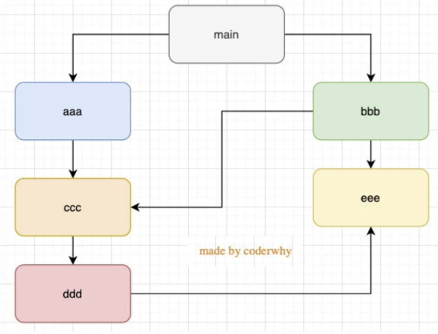

## 前端模块化：CommonJS，AMD，CMD，ES6

前端模块化可以提供代码的复用率，方便管理。一般一个文件就是一个模块，有自己的作用域，只向外暴露特定的变量和函数。目前的前端模块化有CommonJS，AMD，CMD

## 一、CommonJS

Node.js是commonJS规范的主要实践者，它有四个重要的环境变量为模块化的实现提供支持：`module`、`exports`、`require`、`global`。实际使用时，用`module.exports`定义当前模块对外输出的接口（不推荐直接用`exports`），用`require`加载模块。

```
// 定义模块math.js
var basicNum = 0;
function add(a, b) {
  return a + b;
}
module.exports = { //在这里写上需要向外暴露的函数、变量
  add: add,
  basicNum: basicNum
}

// 引用自定义的模块时，参数包含路径，可省略.js
var math = require('./math');
math.add(2, 5);

// 引用核心模块时，不需要带路径
var http = require('http');
http.createService(...).listen(3000);
复制代码
```

commonJS用同步的方式加载模块。在服务端，模块文件都存在本地磁盘，读取非常快，所以这样做不会有问题。但是在浏览器端，限于网络原因，更合理的方案是使用异步加载。

## 二、AMD和require.js

AMD规范采用异步方式加载模块，模块的加载不影响它后面语句的运行。所有依赖这个模块的语句，都定义在一个回调函数中，等到加载完成之后，这个回调函数才会运行。这里介绍用require.js实现AMD规范的模块化：用`require.config()`指定引用路径等，用`define()`定义模块，用`require()`加载模块。

首先我们需要引入require.js文件和一个入口文件main.js。main.js中配置`require.config()`并规定项目中用到的基础模块。

```
/** 网页中引入require.js及main.js **/
<script src="js/require.js" data-main="js/main"></script>

/** main.js 入口文件/主模块 **/
// 首先用config()指定各模块路径和引用名
require.config({
  baseUrl: "js/lib",
  paths: {
    "jquery": "jquery.min",  //实际路径为js/lib/jquery.min.js
    "underscore": "underscore.min",
  }
});
// 执行基本操作
require(["jquery","underscore"],function($,_){
  // some code here
});
```

引用模块的时候，我们将模块名放在`[]`中作为`reqiure()`的第一参数；如果我们定义的模块本身也依赖其他模块,那就需要将它们放在`[]`中作为`define()`的第一参数。

```
// 定义math.js模块
define(function () {
    var basicNum = 0;
    var add = function (x, y) {
        return x + y;
    };
    return {
        add: add,
        basicNum :basicNum
    };
});
// 定义一个依赖underscore.js的模块
define(['underscore'],function(_){
  var classify = function(list){
    _.countBy(list,function(num){
      return num > 30 ? 'old' : 'young';
    })
  };
  return {
    classify :classify
  };
})

// 引用模块，将模块放在[]内
require(['jquery', 'math'],function($, math){
  var sum = math.add(10,20);
  $("#sum").html(sum);
});
```

## 三、CMD和sea.js

require.js在申明依赖的模块时会在第一之间加载并执行模块内的代码：

```
define(["a", "b", "c", "d", "e", "f"], function(a, b, c, d, e, f) { 
    // 等于在最前面声明并初始化了要用到的所有模块
    if (false) {
      // 即便没用到某个模块 b，但 b 还是提前执行了
      b.foo()
    } 
});
复制代码
```

CMD是另一种js模块化方案，它与AMD很类似，不同点在于：AMD 推崇依赖前置、提前执行，CMD推崇依赖就近、延迟执行。此规范其实是在sea.js推广过程中产生的。

```
/** AMD写法 **/
define(["a", "b", "c", "d", "e", "f"], function(a, b, c, d, e, f) { 
     // 等于在最前面声明并初始化了要用到的所有模块
    a.doSomething();
    if (false) {
        // 即便没用到某个模块 b，但 b 还是提前执行了
        b.doSomething()
    } 
});

/** CMD写法 **/
define(function(require, exports, module) {
    var a = require('./a'); //在需要时申明
    a.doSomething();
    if (false) {
        var b = require('./b');
        b.doSomething();
    }
});

/** sea.js **/
// 定义模块 math.js
define(function(require, exports, module) {
    var $ = require('jquery.js');
    var add = function(a,b){
        return a+b;
    }
    exports.add = add;
});
// 加载模块
seajs.use(['math.js'], function(math){
    var sum = math.add(1+2);
});
复制代码
```

## 四、ES6 Module

ES6 在语言标准的层面上，实现了模块功能，而且实现得相当简单，旨在成为浏览器和服务器通用的模块解决方案。其模块功能主要由两个命令构成：`export`和`import`。`export`命令用于规定模块的对外接口，`import`命令用于输入其他模块提供的功能。

```
/** 定义模块 math.js **/
var basicNum = 0;
var add = function (a, b) {
    return a + b;
};
export { basicNum, add };

/** 引用模块 **/
import { basicNum, add } from './math';
function test(ele) {
    ele.textContent = add(99 + basicNum);
}
复制代码
```

如上例所示，使用`import`命令的时候，用户需要知道所要加载的变量名或函数名。其实ES6还提供了`export default`命令，为模块指定默认输出，对应的`import`语句不需要使用大括号。这也更趋近于ADM的引用写法。

```
/** export default **/
//定义输出
export default { basicNum, add };
//引入
import math from './math';
function test(ele) {
    ele.textContent = math.add(99 + math.basicNum);
}
复制代码
```

ES6的模块不是对象，`import`命令会被 JavaScript 引擎静态分析，在编译时就引入模块代码，而不是在代码运行时加载，所以无法实现条件加载。也正因为这个，使得静态分析成为可能。

## 五、 ES6 模块与 CommonJS 模块的差异

### 1. CommonJS 模块输出的是一个值的拷贝，ES6 模块输出的是值的引用。

- CommonJS 模块输出的是值的拷贝，也就是说，一旦输出一个值，模块内部的变化就影响不到这个值。
- ES6 模块的运行机制与 CommonJS 不一样。JS 引擎对脚本静态分析的时候，遇到模块加载命令`import`，就会生成一个只读引用。等到脚本真正执行时，再根据这个只读引用，到被加载的那个模块里面去取值。换句话说，ES6 的`import`有点像 Unix 系统的“符号连接”，原始值变了，`import`加载的值也会跟着变。因此，ES6 模块是动态引用，并且不会缓存值，模块里面的变量绑定其所在的模块。

### 2. CommonJS 模块是运行时加载，ES6 模块是编译时输出接口。

- 运行时加载: CommonJS 模块就是对象；即在输入时是先加载整个模块，生成一个对象，然后再从这个对象上面读取方法，这种加载称为“运行时加载”。
- 编译时加载: ES6 模块不是对象，而是通过 `export` 命令显式指定输出的代码，`import`时采用静态命令的形式。即在`import`时可以指定加载某个输出值，而不是加载整个模块，这种加载称为“编译时加载”。

CommonJS 加载的是一个对象（即`module.exports`属性），该对象只有在脚本运行完才会生成。而 ES6 模块不是对象，它的对外接口只是一种静态定义，在代码静态解析阶段就会生成。

## 一、CommonJs

### 1.exports与require()

- require是一个函数，它有返回值，返回值是exports
- 所以导入的时候可以使用解构

```
// bar.js
exports.name = 'qmj';
exports.age = 18;

// 导入
const demo = require('./bar.js');
demo = {
	name: 'qmj',
	age: 18
}
const {name, age} = require('./bar.js')
```

### 2.module.exports

- 为什么有了exports还要有module.exports呢？
- 其实CommonJS没有提到module.exports，但是Node中为了导出，实现了Module类，每个模块是Module的实例。
- 真正导出的是 module.exports，在源码里 module.exports = exports;

```js
// 内部源码
exports = {};
module.exports = exports;
这样做的目的是为了让module.exports和exports指向同一个对象；
```


### 3.require细节

- require是一个函数，帮我们引入一个文件（模块）中导入的对象

#### require的查找细节

```
导入格式如：require(X):

情况一：X是一个核心模块
	直接返回核心模块，并停止查找
	
情况二：X是./ ../或 /
	第一步：将X当做一个文件在对应的目录下查找：
		1.有文件后缀名，按照后缀名的格式查找对应的文件
		2.无后缀名，会按照下面顺序：
			1）直接查找文件X
			2）查找X.js文件
			3）查找X.json文件
			4）查找X.node文件
	第二步：X作为一个目录
		1.查找目录下面的index文件
			1）查找X/index.js文件
			2）查找X/index.json文件
			3）查找X/index.node文件
	第三步：没有找到
		1.报错Not Found
		
情况三：直接是X，X并不是一个核心模块
	1.是在/Users/didi/Documents/Project/Node下编写文件main.js
		1）/Users/didi/Documents/Project/Node/node_modules
		2）/Users/didi/Documents/Project/node_modules
		3）/Users/didi/Documents/node_modules
		4）/Users/didi/node_modules
		5）/Users/node_modules
    6）/node_modules
  2.上面这些还没找到就直接返回Not Found
```

### 4.模块的加载过程

- commonJs加载是同步的，模块加载完之后才会进行下一步代码
- 例子：先打印加载文件，再打印文本本身，

```js
// bar.js
consloe.log('qmj')

// index.js 
require('./bar.js');
console.log('hello world');
// cmd node index.js
// result => qmj hello world
```

- 模块在多次引入时，只会执行一次，因为被缓存
  - 每个模块对象都有一个属性：loaded
  - false表示没有加载，true表示已经加载
- 模块被循环引用时，不会执行多次
  - 这种情况是一种闭环，加载顺序是按照图的深度优先遍历加载的
  - main=>aaa=>ccc=>ddd=>eee=>bbb
  - 之所以bbb后面不会加载ccc是因为ccc的loaded被设置为true了



