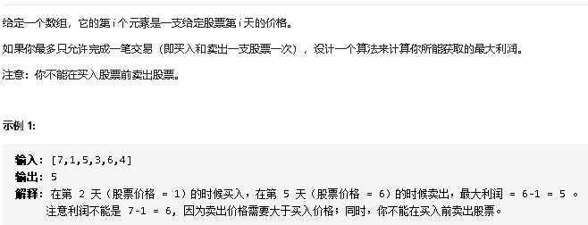

### 1.LeetCode121题



题解很简单，记录最优解和当前最小值，遍历一次数组就可以求出答案。

```js
/**
 * @param {number[]} prices
 * @return {number}
 */
var maxProfit = function(prices) {
  let maxProfit = 0;
  let minPrice = prices[0]
  
  // 数组解法
  for (let i = 1; i < prices.length; i++) {
     if(prices[i]<minPrice) {
      minPrice = prices[i];
     }else {
       maxProfit = Math.max(maxProfit, prices[i] - minPrice);
     }

    prices[i]<minPrice ? minPrice = prices[i] : maxProfit = Math.max(maxProfit, prices[i] - minPrice)
  }
  return maxProfit;
};
```

第一次提交是用的if else，耗时90ms。

第二次提交用的是三木运算，本想着应该时间会减少吧，但是耗时120ms。


### 2.疑惑？

- 疑惑一：在我以前的认知中，三木比if else高级，所以以为效率也会比他高。
- 疑惑二：到底谁的效率高？