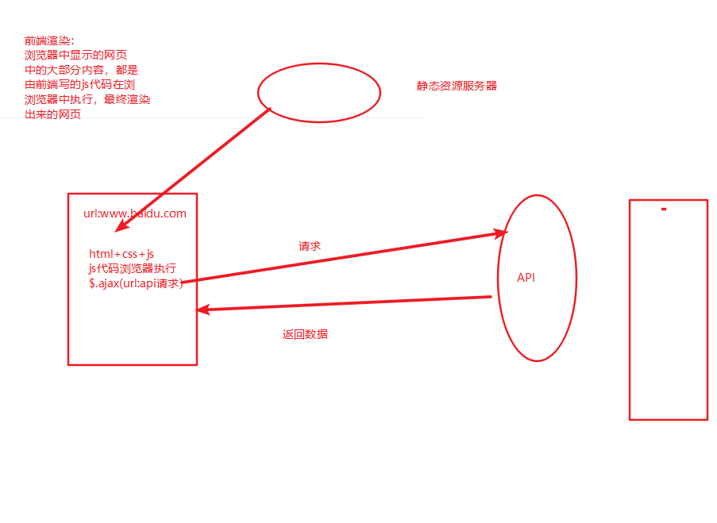

## 一、什么是前端渲染，什么是后端渲染？

## 一、后端渲染

### 1.后端渲染

> 早前通过jsp/php/c#，只有html+css; 去服务器请求的时候，会拿到html+css+java，动态的放到页面当中。
>
> 每个不同的url，都映射到不同的资源，都是服务器在处理

通服务器里面拿到后端已经渲染好的页面进行展示

### 2.后端路由

后端里面有路由的映射表

#### 一个网站这么多页面，服务器如何处理？

- 一个页面由自己对应的网址URL
- url发送到服务器，服务器通过正则匹配，控制器进行处理生成HTML和数据，返回前端
- 这就是一个IO操作

## 二、前后端分离阶段

### 1.前端渲染



前后端分离阶段：

```
1.是ajax出现后才开始的
2.后端只提供API返回数据，前端通过ajax获取数据，并用js渲染到页面中
3.这样前后端责任清晰，后端专注数据，前端专注交互，页面
```

单页面富应用阶段(SPA)：

- vue

```
1.SPA是在前后端分离的基础上加了一层前端路由
2.前端来维护一套路由规则
```

## 三、SPA阶段——单一页面富应用

> 全网站只有一个html页面，通过不同的路由，会抽取不同的组件进行展示，映射关系也是由前端进行管理

- 当url改变的时候，并不会从服务器请求信的静态资源
- 而是通过js监听url 的改变，去重新渲染新的页面
- 前端去配置路由的映射表

### 四、前端路由的原理

- 前端路由改变url不会刷新页面的

#### 1.URL的hash

- URL的hash也就是锚点(#),本质上是改变window.location的href的属性
- 可以通过直接赋值location.hash来改变href，但是页面不发生刷新
- 通过window.addEventListener('hashchange')
- 优点是兼容性好，缺点是#不像URL

```js
  <div id="app">
    <a href="#/home">首页</a>
    <a href="#/about">关于</a>

    <div class="router-view">
    </div>
  </div>
  <script>
    const routerViewEl = document.getElementsByClassName('router-view')[0]
    console.log(routerViewEl)
    window.addEventListener('hashchange',()=>{
      console.log('hashChange',location.hash)
      switch(location.hash){
        case '#/home':
          break;
          routerViewEl.innerHTML = '首页'
        case '#/about':
          routerViewEl.innerHTML = '关于'
          break;
        default:
          routerViewEl.innerHTML = ''
      }
    })
  </script>
```

#### 2.HTML的history

history接口是HTML5新增的，有6种改变URL的方法且不刷新页面

- replaceState：替换原来的路径
- pushState：使用路径名
- popState：路径回退
- go：向前或向后改变
- forward：向前1位
- back：向后改变路径


**history的简单实现**：

- '/home'默认是会刷新页面的，获取a元素，阻止a的默认事件，自己监听a元素改变。
- 返回/前进操作时，更新视图，用window.addEventListener('popstate')/go

```js
    // 获取router-view的dom
    const routerViewEl = document.getElementsByClassName('router-view')[0]
    //  获取a元素，自己监听改变
    const aEls = document.getElementsByTagName('a');
    for (let el of aEls) {
      el.addEventListener('click', e => {
        e.preventDefault(); // 阻止a的默认事件
        const href = el.getAttribute("href")
        console.log('a发生了点击')
        history.pushState({}, "", href)
        urlChange()
      })
    }

    // f返回操作时，更新视图
    window.addEventListener('popstate',urlChange)
    window.addEventListener('go',urlChange)

    function urlChange() {
      console.log(location.pathname)
      switch (location.pathname) {
        case '/home':
          routerViewEl.innerHTML = '首页'
          break;
        case '/about':
          routerViewEl.innerHTML = '关于'
          break;
        default:
          routerViewEl.innerHTML = ''
      }
    }
  </script>
```

