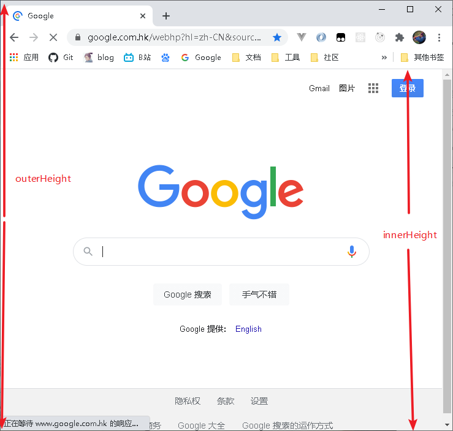
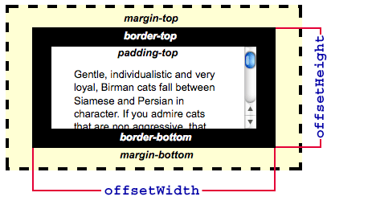
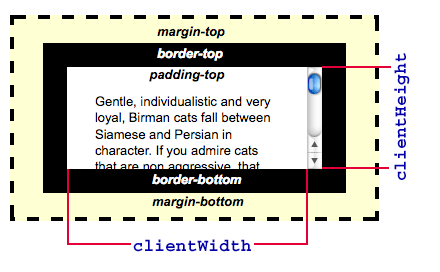

### 1.滚动方法

#### window的scrolTo方法

**作用**

滚动到页面的某个坐标

**使用方法**

```html
window.scrollTo(x, y)
windwo.scrollTo({top: y, left: x, behavior: smooth || instant})
```

#### element的scrollIntoView方法

**作用**

滚动到该element所在位置

**使用方法**

- behavior是滑动的方式
- block是定义垂直方向的对齐方式
- inline是水平对齐的方式

```html
element.scrollIntoView();
element.scrollIntoView({
	behavior: auto || smooth,
	block: start || center || end, 
	inline: start || center || end, 
});
```

#### 思考与总结

一开始在年度报告中使用的是scrolTo方法，但是并不起作用，最终采用了scrollIntoView方法得以解决第一屏滑到第二屏的问题。通过网上查阅资料发现也有许多scrollTo失效的例子，进过分析是因为这个方法的兼容性不太好，所以失效。

### 2.高度的相关属性

#### window.innerHeight/outerHeight

**概念**

innerHeight:

浏览器的窗口的视口（viewport）高度，单位是像素；如果有水平滑动条也包含它的高度。

outerHeight:

 整个浏览器窗口的高度 。

**图像示例**




#### HTMLElement.offsetHeight

**概念**

它是该元素的像素高度，高度 = height + padding + border, 不包含伪元素的高度。而且数值是一个四舍五入的整数，需要浮点数用getBoundingClientRect。

**图片示例**



#### element.clientHeight

**概念**

它是元素内部的高度(单位像素)，包含内边距，但不包括水平滚动条、边框和外边距。  `clientHeight` 可以通过 CSS `height` + CSS `padding` - 水平滚动条高度 (如果存在)来计算. 

**图片示例**



#### Element.scrollHeight

**概念**

 `scrollHeight `的值等于该元素在不使用滚动条的情况下为了适应视口中所用内容所需的最小高度。 没有垂直滚动条的话，scrollHeight值与元素视图填充所有内容所需要的最小值`clientHeight`相同。包括元素的padding，但不包括元素的border和margin。

