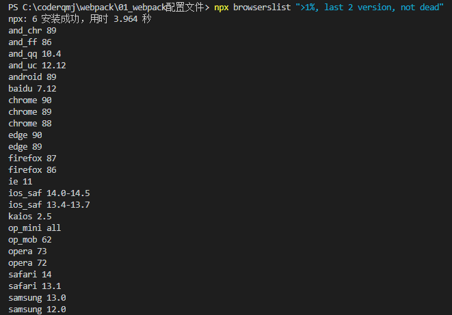

### 一、浏览器兼容性

#### 1.在开发过程中，浏览器兼容性的问题如何去解决和处理？

- 这里的兼容指的不是屏幕大小，指的是不同浏览器中支持的特性：如CSS，JS语法之间的兼容性
- 比如：
  - css有些样式在不同浏览器中不一定支持，那么就要添加浏览器前缀
  - 之前都是手动添加，现在有`autoprefiexer`自动加上浏览器前缀
  - 但是并不是每一个浏览器都需要添加前缀的，所以需要知道哪些需要进行适配

#### 2.怎么选择哪些浏览器需要适配呢？

- 市面上有很多浏览器，根据他们的市场占有率去对它进行兼容
- 我们在用脚手架配置时经常看到这样的配置代码：

```
> 1%
last 2 versions
not dead
```

- 上面这些条件就是提供个工具，告诉它需要进行适配哪些浏览器
- 那么问题又来了，我怎么知道你的市场占有率是否 > 1%呢？
  - 这个时候需要一个权威的机构去统计
  - 这个网站就是 `caniuse`,查询浏览器的兼容性等

#### 3.认识browerslist工具

- 当前条件支持哪些浏览器，并且把查询到的结果进行共享

#### 4.查询适配浏览器命令

`npx browserslist ">1%, last 2 version, not dead"`

查询结果：



- 查询命令后面也可以不用跟参数，写一个`.browserslistrc`文件即可，执行`npx browserslist`命令时会自动读取里面的配置信息，就可以把条件写在里面了