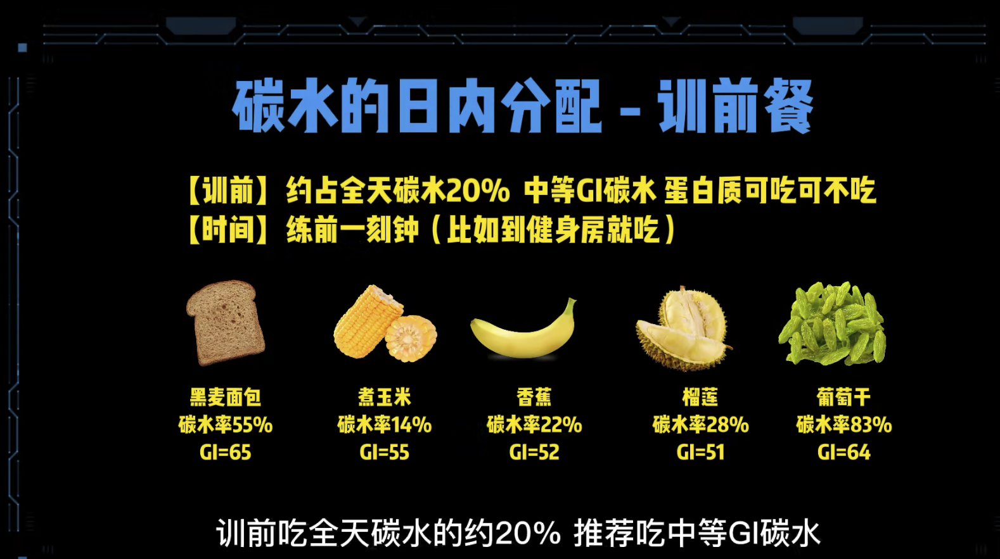
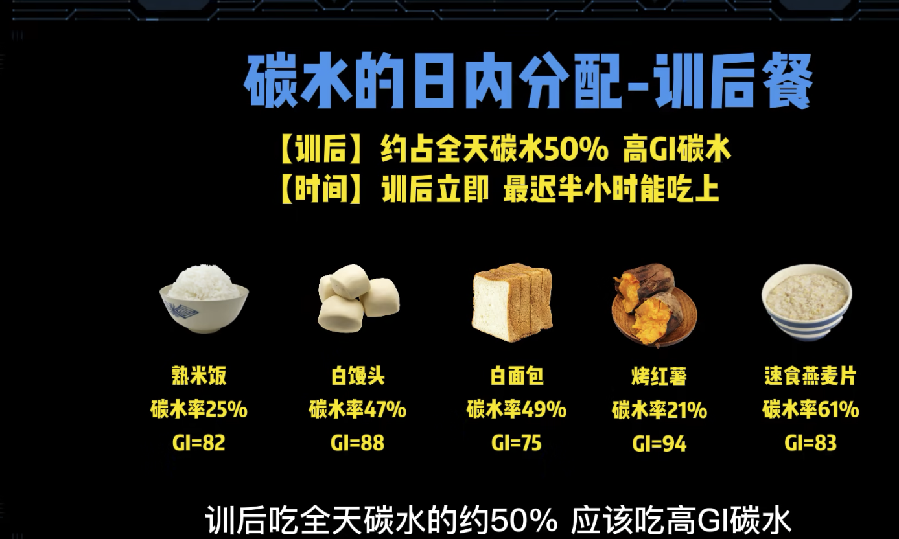
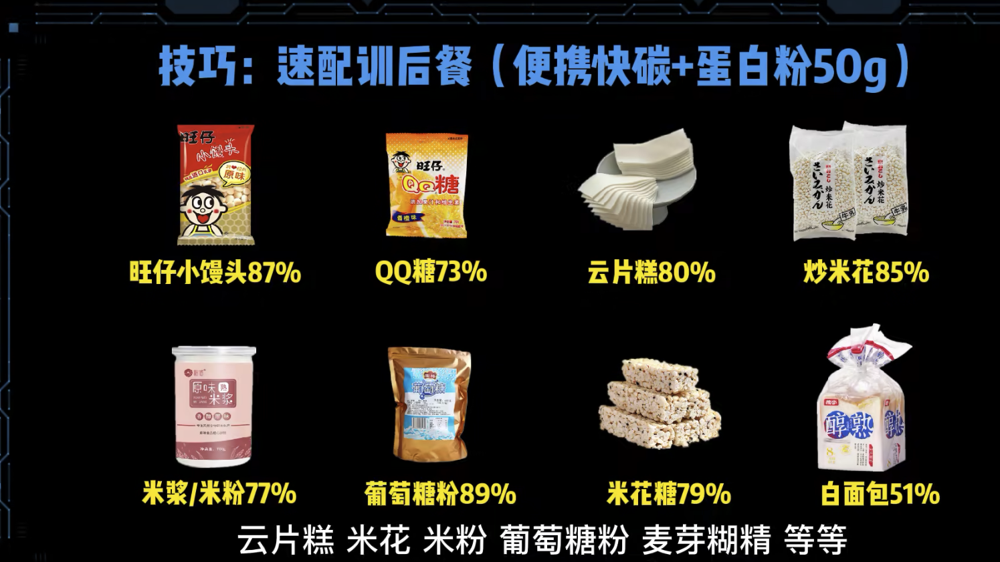
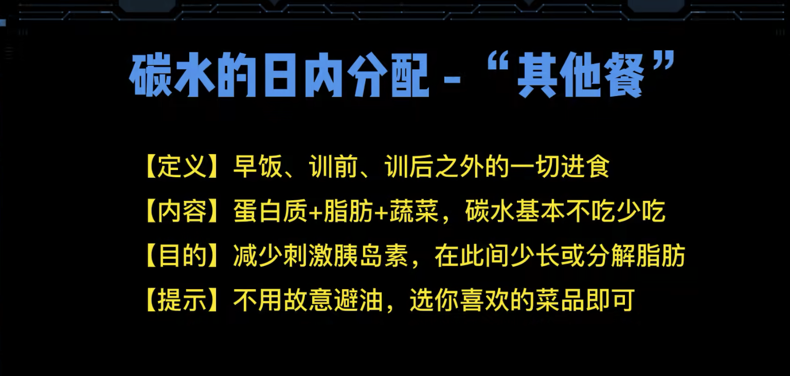
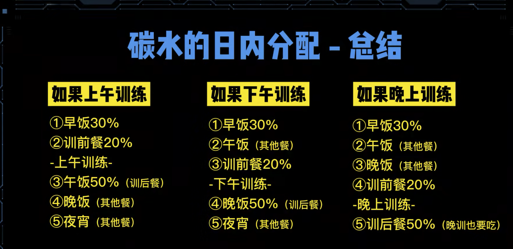

### jj一、碳水属性

**碳水率（0-100%）**

- 100g食物多少g碳水

**碳水速度（GI指数）**

- 不同碳水分解为葡萄糖的速度不同，导致血糖升高程度不同
- 测量GI方法：不是用相同克数的食物来测，**是取用含有50g碳水的这种食物来测**

### 二、碳水配额（每kg体重的日常摄入）

#### 新手

- 碳水3.5g，蛋白质1.5g，脂肪1g

#### 有基础

- 碳水4g，蛋白质2g，脂肪1g

#### 增肌

- 试吃两周后观察：
  - 增肌每个月体重增加不超过3斤，超过降碳水，否则加碳水

#### 减脂

- 碳水3.5g，蛋白质1.5g，脂肪0.8g 开始尝试，可以逐步较少碳水，但不能低于2.5g碳水

### 三、碳水日内分配（重点）

#### **早饭**

- 全天碳水30%，GI无所谓

#### 训前

- 全天的20%，中等GI碳水，蛋白质无所谓
- 时间：训前1刻钟

#### 训后

- 全天的50%，高GI碳水，升高胰岛素，促进增肌
- 时间：立即，最迟不能超过半小时

### 快速训后餐

#### 其他餐

#### 总结

