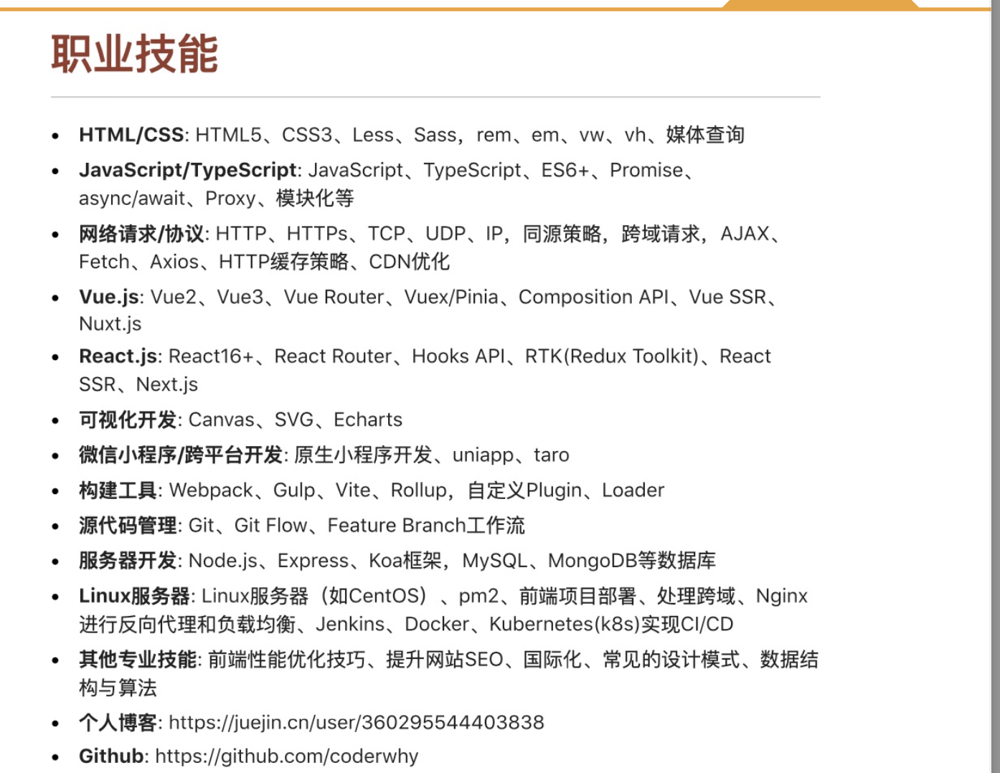
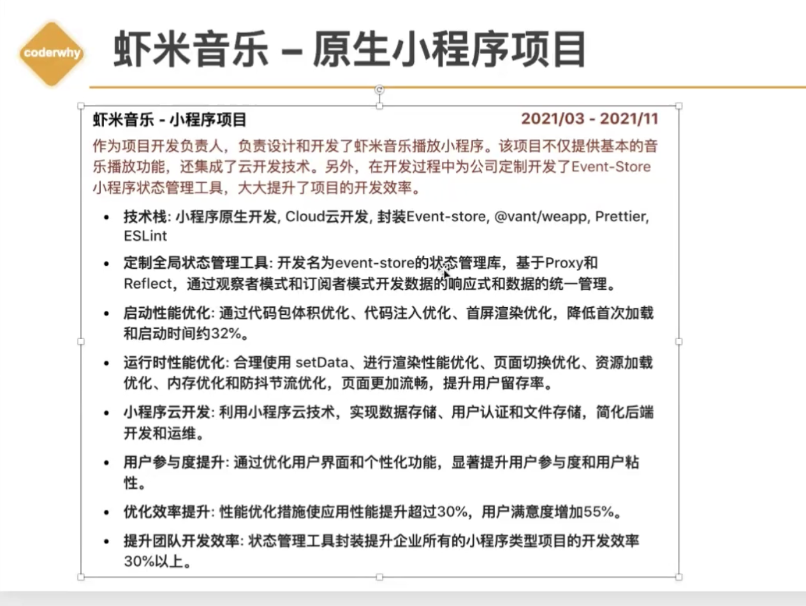
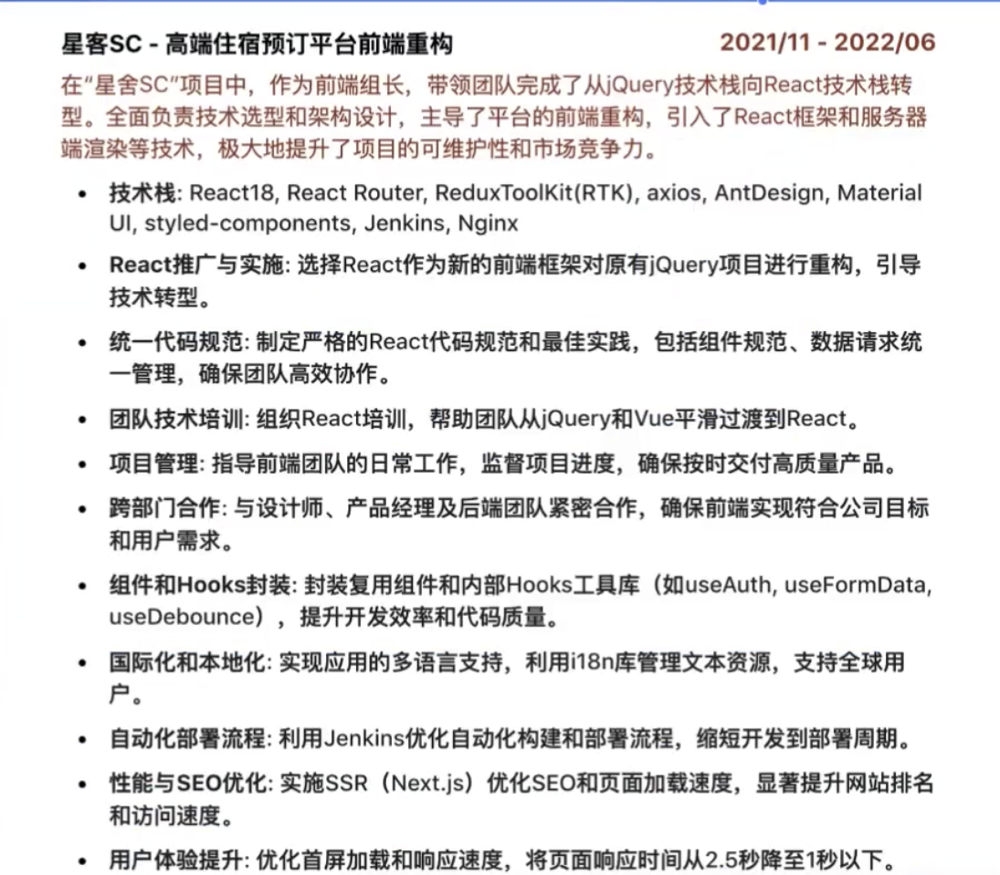

### 零、简历事项

```
1.1-2天写好一份简历，1-2周的时间（3000字）
2.1-2周将自己简历中每一个细节都进行扩展成3w字的论文
3.1-2周准备八股文，面试题

注意：
	1.简历准备需要花费占比80%
	2.八股文20%
```


### 一、个人信息

```
1.姓名 
2.电话
3.邮箱
4.工作经验
5.学校
```

### 二、职业技能

- 需要写和岗位契合匹配的技能
- 技能亮点，我有，别人没有（会xxx优先考虑）
- 总结：岗位匹配技能+个人亮点技能



```

   
```

### 四、项目经验 ——核心要点

- **团队贡献**：为团队封装工具CLI ,UI组件库，其他工具库，项目架构、代码规范，自动化部署、团队培训，编写文档iwiki
  - common-cvm-util
  - tea-sdk-cvm
  - cvm-uniform-request
  - iaas-component
- 项目难点/亮点：性能优化、界面适配、浏览器兼容适配、低代码平台、技术转型、BFF
- 用户体验：
  - 量化一些数值：界面性能提升、用户体验提升、团队沟通效率、开发效率提升
  - 技术为产品服务，提升用户体验，提升效益和业绩
- 弱化业务/技术栈
  - 尽量少强调具体的业务功能，尽量少强调常见的技术栈 
- 没有用过的东西能不能写
  - 在别的项目里面用过，这个项目没有用的：一定能写
  - 在自己课下学习过，但是没有在实际项目中应用：一定可以写
  - 根本不会的：
    - 愿意花时间（一周内能掌握）的内容，可以（Docker、K8s）
    - 没时间学，岗位也需要，千万不要写
- 学一个技术：
  - 会用 => 用户这个技术所有API => 理解它的原理 => 读过该技术的源码

### 五、项目经验——模板

#### 5.1 H5民宿预定平台（实习）

```
作为核心前端开发者，负责设计和实现民宿预定平台的H5网站。这个项目目标是提供一个只管、响应式的用户界面，使用户能轻松浏览和预定全国各地的民宿
 1.技术栈：vue2，vuex
 2.核心项目：利用Vue2构建高性能的SPA，实现流畅用户体验的即时页面响应
 3.统一代码规范：通过Editorconfig,Pretter,EsLint,Commitizen,Commitlint,husky制定统一代码规范，提高代码质量
 4.界面适配优化：进行响应式设计，确保在不同设备上页面的一致性和适配
 5.性能优化：采用防抖节流优化搜索框和滚动监听，使用虚拟列表和懒加载技术优化民宿列表，加快首页加载速度
 6.用户满意度提升：通过用户反馈和行为分析不断优化用户界面和交互流程，用户满意度提升20%；
 7.访问量与转换率提升：通过优化SEO和加载速度，平台日访问量增加30%，预定转换率提高15%
```

#### 5.2后台管理系统——多后台管理系统的统一解决方案

```
作为云霄前端负责人，负责设计和实施了一套多功能的后台管理系统，这套系统不仅服务与单一项目，更为公司提供了一套通用的、高效的后台管理平台开发解决方案。通过封装组件库和开发CLI工具，前端团队能迅速开发新的后台系统，并有效维护现有10+个管理系统
	1.技术栈：Vue3，Pinia，Vue Router，Axios，TS，Sass，Jenkins
	2.技术领导：前端组长，负责技术决策、包括选型，架构设计，指导和管理前端开发团队，安排任务，监督项目进度，确保按时高质量完成
	3.高度指定的UI组件库：对React进行深度定制和封装，开发企业级UI组件库，灵活应用于多个后台管理系统，提升开发和维护效率
	4.动态系统构建：开发基于配置的动态构建系统，快速生成后台管理系统UI界面，包括表格、查询、、数据模态窗口等，缩短开发周期，提升效率
	5.全功能的Cli工具：Cli工具支持一件生成项目、组件、页面、store模块等，标准化项目架构，加速新项目启动
	6.RBAC权限管理：实现基于角色的权限管理系统，支持角色第一和权限分配，动态界面元素和操作权限，增强系统安全性
	7.报表与数据分析：整合Echarts进行数据可视化，提供实时数据报表，辅助决策支持，提升管理决策效率
	8.继续集成交付：通过Jenkins实现自动化集成流程CI/CD，确保代码质量和快速迭代
	9.开发效率提升：通过CLI部署和UI组件库，显著降低项目开发和维护成本，提升决策速度
	10.人员资源优化：组件库和CLI工具使用使前端团队效率提升2倍，减少20%加班需求，降低项目开发成本
```

### 5.3 虾米音乐——小程序



### 5.4 React项目


