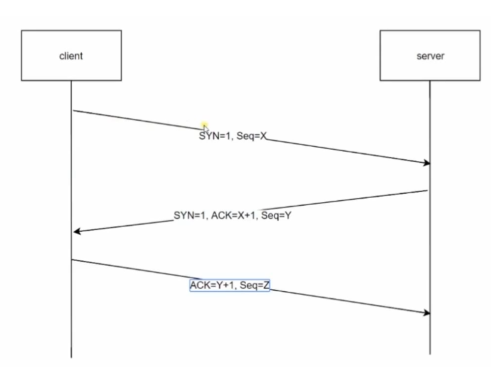
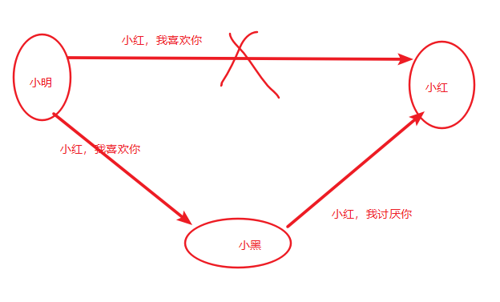
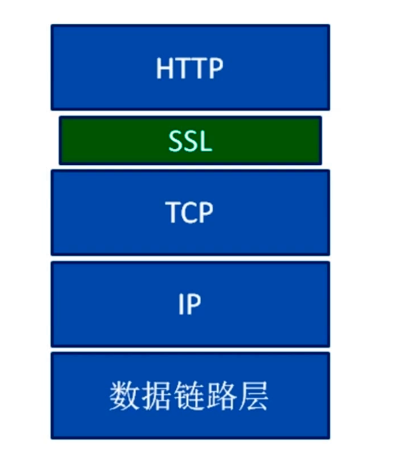

## 一、透过TCP/IP看HTTP
### 1.1TCP/IP协议族

- 该协议是一系列与互联网相关的协议集合总称
- 分层管理是其主要特征

### 1.2四层模型

链路层(网络) -> 网络层(IP) -> 传输层(TCP) -> 应用层(HTTP)

#### 1.2.1应用层

> 一般编写的应用程序，决定了向用户提供的服务，应用层可以通过系统调用与传输层进行通信。如：FTP(公司内部)，DNS，HTTP等

#### 1.2.2传输层

> 传输层通过系统调用向计算机提供处于网络连接中的两台计算机之间的数据传输功能

- 两个性质不同的协议
  - TCP
    - 面向连接的
    - 效率低
    - 安全搞
  - UDP
    - 无连接的
    - 效率高
    - 安全性低

#### 1.2.3网络层

> 处理网络上流动的数据包，数据包是网络传输的最小数据单位。改成规定了通过怎样的路径达到对方计算机。并把数据包传输给对方

#### 1.2.4链路层

> 处理连接网络的硬件部分，控制操作系统，硬件设备驱动

### 1.3传输层——TCP三次握手



使用tcp协议双方必须先建立连接，才能开始传输数据，三次握手

三次握手具体过程：

- 1.第一次客户端发送网络包，服务端收到网络包；服务端知道客户端的发送能力正常，自己接受能力正常
- 2.服务端要告诉客户端自己接受能力正常，发一个确认包。客户端就知道服务端接受能力正常，双方发送能力正常
- 3.客户端要告诉服务端的接受发送能力是正常的，向服务端发送确认报文段

经过三次握手之后，双方都知道彼此发送和接收能力是正常的

### 1.4应用层——DNS解析

> 把域名解析成ip地址

具体过程：

- 输入网址，先到本地host里面找映射关系，有就返回；
- 没有就到本地DNS服务器，有返回
- 没有一层一层向上找

## 二、第二章

### 2.1HTTP的特点

#### 2.1.1无状态

- HTTP协议是无状态协议
- 对事物处理没有记忆。
- 服务器不需要先前信息时他的应答很快

解决办法：session，cookie

### 2.2迷之兄弟——URL与URI

URI：一个紧凑的字符串用来表示抽象或物理资源

URI可以进一步分为 定位符、名字或者两者都是

URI包括了URL和URN（唯一标识符） 位置和名字

URI可不一定是URL，提供了访问机制才是URL

### 2.3HTTP报文结构

#### 请求报文

```
请求方法/请求URI/HTTP协议及版本/报文头/报文体
```

通用报文头：

| 首部字段名        | 说明                     |
| ----------------- | ------------------------ |
| Cache-Control     | 控制缓存的行为           |
| Date              | 创建报文的时间           |
| Transfer-Encoding | 传输编码方式             |
| Accept            | 用户代理可处理的媒体类型 |
| Authorization     | Web认证信息              |
|                   | 请求资源所在的服务器     |
|                   | HTTP客户端程序信息       |

```
user-agent判断浏览器类型，从而进行不同的兼容设计

content-type 说明了报文体内对象的内体类型
	text/html html
	text/plain 纯文本
	text/xml xml
```

#### 响应头

| Age           | 资源创建经过的时间      |
| ------------- | ----------------------- |
| Cache-Control | 缓存行为                |
| location      | 令客户端重定向至指定URI |
| ETag          | 资源匹配的信息          |
| content-type  | 文件类型                |
| content-type  | 文本长度                |
|               | keep-alive 表示长连接   |

响应体就是html资源

### 2.4 HTTP请求方法

HTTP/1.1常用方法：

- get  获取资源
- post 提交请求
- put 修改指定内容
- head 类似于get，只获取报文头
- delete 删除指定资源
- connect

### 2.5状态码

> 存在于响应头里面

| 200  |      | 成功                           |
| ---- | ---- | ------------------------------ |
| 201  |      | 创建                           |
|      |      | 永久重定向                     |
|      |      |                                |
|      |      |                                |
|      |      |                                |
|      |      |                                |
|      |      |                                |
| 401  |      | 未授权，需要身份认证           |
| 403  |      | Forbidden                      |
| 404  |      | 找不到资源                     |
| 405  |      | Method Not Allowed请求方法禁止 |
| 500  |      | 服务器错误                     |
| 501  |      | 服务器不支持请求功能           |
| 503  |      | 超载或系统维护，无法完成请求   |


### 2.6cookie和session

> http是无状态的，没有记忆，需要cookie和session帮助记忆

#### 2.6.1Cookie

存储于客户端

cookie是一小段的文本信息。一般用于服务器记录用户的登录状态，当客户端再次发起请求的时候会携带cookie，服务器会检查cookie，返回相应的数据

#### 2.6.2session

存储于服务器的，用于记录客户端的状态，保存在服务器上

Session超时自动失效

session也可以手动清除

#### 2.6.3两者区别

| cookie                         | session                                     |
| ------------------------------ | ------------------------------------------- |
| 保存于客户端                   | 保存于服务端                                |
| 客户端可见（可以被获取，修改） | 在服务器中，安全性较高                      |
| cookie有效期，自己设置         | 服务器会定时清理session，关闭浏览器就没有了 |

## 第三章

### 3.1HTTP协议身份认证

> 需要登录者本人才知道的信息，才能授权相关的操作

#### basic 认证

- 缺点就是密码在HTTP上明文传输

```
1.客户端发起请求
2.服务器发给客户端401状态码，要求客户端验证身份
3.用户名和密码输入后会以base64编码发给服务器，Authorization：Basic base64
4.验证通过返回200，不通过返回401
```

### SSL客户端认证

需要证书

### 3.2HTTP长连接与短连接

> 长连接：节省很多资源
>
> 他是通过TCP连接的，实际上也是TCP的短连接和长连接
>
> HTTP1.0默认都是短连接，响应后就断开连接了
>
> HTTP1.1默认使用了长连接

#### 短连接

- 建立连接
- 数据传输
- 关闭连接

```
如果发起多次请求的话
不断建立连接与断开连接消耗时间，增加等待时间，影响性能
```


不断重复上述操作

#### 长连接

- 建立连接
- 数据传输
- .....
- 数据传输
- 关闭连接

```
多次发起请求的时候
	一次建立连接，一次断开连接，传输数据便捷
	
99%都是用长连接
```

### 3.3HTTP缓存

#### 为什么使用缓存？

试想：每次用户请求同一个资源时，都要重新请求资源，重新渲染，但是页面和上次的一样，这样浪费流量，浪费时间，为什么不把和上一次一样的资源缓存在本地呢？

#### 缓存内容是什么？

HTML/CSS/JS/等更新频率不大的内容进行缓存，是一些静态资源

#### HTTP缓存头部字段——cache-control

请求/响应头，缓存控制字段

- no-store 都不缓存
- no-cache 缓存，但是缓存前，会请求服务器判断缓存资源是否是最新的
- public 客户端和代理服务器(CDN)都可缓存
- private 只有客户端可缓存
- max-age=x 请求缓存后多少秒不在发起请求

#### HTTP缓存字段 Expires

响应头，代表资源过期时间，由服务器返回提供，HTTP1.0属性，与max-age共存情况下，优先级要低 

约定一个过期时间，过期了在发起请求

#### HTTP缓存字段——last-modified

响应头，资源最新修改时间，由服务器告诉浏览器

#### HTTP除外缓存方案

md5/hash缓存

通过不缓存html，为静态资源添加MD5或者hash标识，解决浏览器无法跳过缓存过期时间主动感知文件变化的问题

CDN缓存

内容分发网，依靠部署在各地的边缘服务器，通过中心平台的负载均衡，内容分发，调度，使得用户就近获取内容，降低网络拥塞，提高用户的访问响应速度和命中率

### 3.4内容协商机制

应用场景，访问Google，在国内中文，在国外英文

### 3.5断点续传和多线程下载

在Header里面两个参数实现的

客户端请求时对应的是Range

服务器响应式对应的是Content-Range 


#### Range

用于请求头中，指定第一个字节的位置和最后一个字节的位置

一般格式：

Range：(unit = first byte pos) - [last byte pos]

```http
Range: bytes = 0-499 0到499字节
Range: bytes = 500-999 500到999字节
Range: bytes = -500	最后500字节 
Range: bytes = 500- 从500字节到文件结束
Range: bytes = 500-600,601-999
两边都是闭区间
```


#### Content-Range

用于响应头中，在发出带Range的请求后，服务器会在Content-Range头部返回当前接收的范围和文件总大小。

一般格式unit：

Content-Range:bytes（unit first byte pos）- [last]

**返回响应头内容不同**

HTTP/1.1 200OK 不使用断点续传

HTTP/1.1 206 Partial Content 使用断点续传

#### 大致过程

```
1.客户端下载了一个1024k的文件，已经下载了其中512k

2.网络中断，客户端请求续传，因此需要在HTTP头中申明本次需要续传的片段： Range:bytes = 512000-
这个头通知服务端从文件的512k位置开始传输文件

3.服务端收到断点续传请求，从512k位置开始传输，并且在HTTP头部增加：
	content-range：bytes 512000-/1024000
并且此时服务端返回的HTTP状态码应该是206，而不是200
```

### 第四章

### 4.1 趣解HTTP与HTTPS

> 这是两个完全不同的传输协议，虽然就差个字母，但本质确大不相同，不得掉以轻心

#### HTTP简单回顾


::: tip
位于四层网络模型 中的应用层，通过请求/响应在客户端与服务端进行通信，但是不够安全，因为文本是在网络上明文传输，相当于在网络上裸奔
:::

明文传输举个栗子：

- 小明发信息给小红表白
- 但是发送信息的时候被中间人攻击篡改了信息，变为：小红我讨厌你



解决办法——加密传输

#### 对称加密


::: tip
加密和解密使用的都是同一个密钥，事先约定好解密方式，但是密钥也会被中间人获取，导致加密信息被获取后被解密
:::


#### 非对称加密


::: tip
加密和解密使用的不是同一个密钥，可以用公钥加密，私钥解密；也可以用私钥加密，公钥解密；
:::


虽然对称加密和非对称加密可以提高安全性，但是对于技术好的黑客来说，还是照样能解密获取篡改信息，所以要通过第三方

### 4.2HTTPS协议概述

HTTP可以认为是 **HTTP** + **TLS**

TLS是传输加密协议，他的前身是SSL协议


TLS是介于传输层与应用层之间的

 

#### HTTPS功能介绍

- 内容加密
  - 对称与非对称加密
- 身份认证(ca)
  - 数字证书
- 数据完整性

#### ca证书

服务端向权威机构申请证书。证书包含：证书机构，服务器网址，机构加密私钥，私钥机密过的公钥，证书签名；

客户端向服务端通信的时候，服务端向客户端船体证书，客户端收到证书，用证书机构的公钥解密证书签名，然后用签名生成的规则生成一个签名，对比一致就是真证书；确认真证书后，解密服务器公钥key1，

### 4.3HTTPS使用成本

#### 证书费用以及更新维护

证书费用很便宜

#### HTTPS降低用户访问速度

#### 消耗CUP，需要增加大量机器

