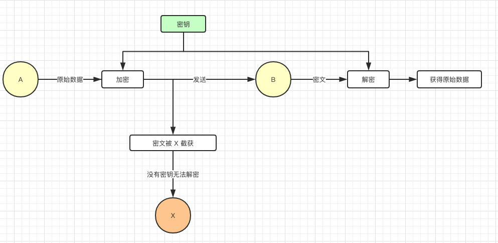
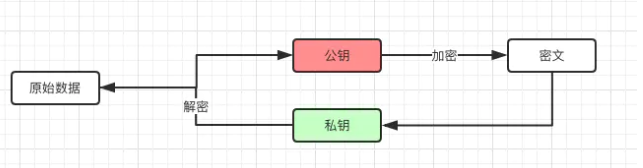
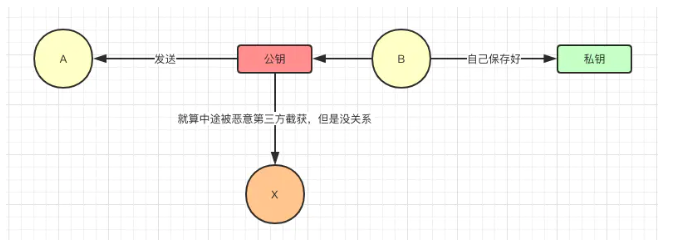
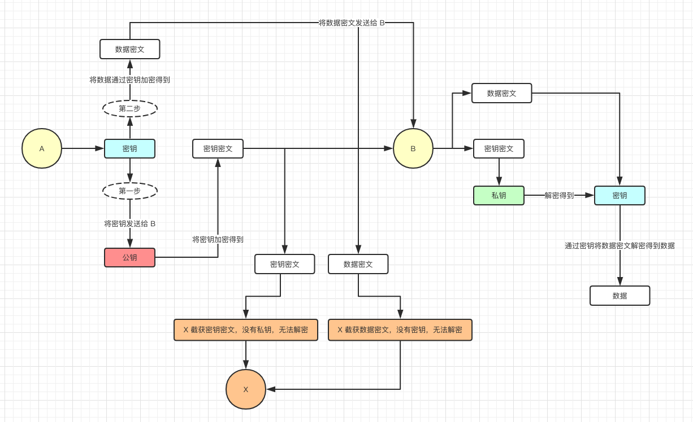
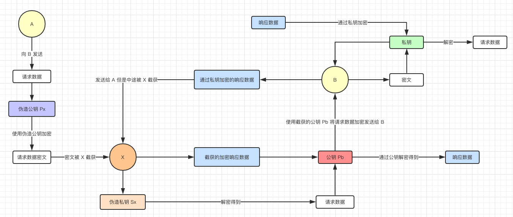
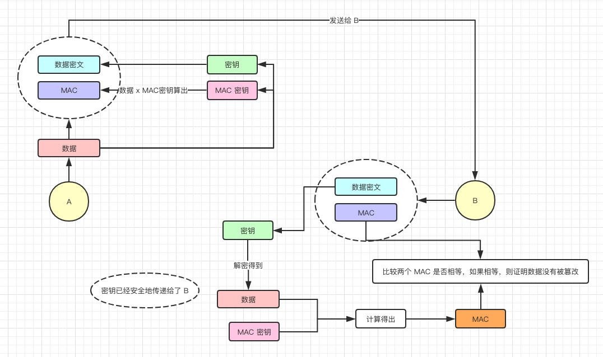
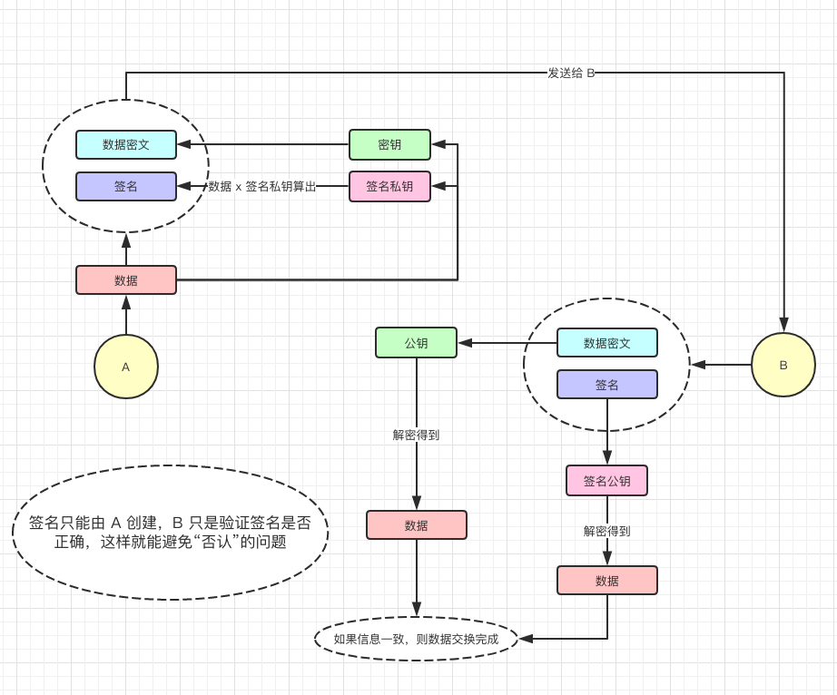
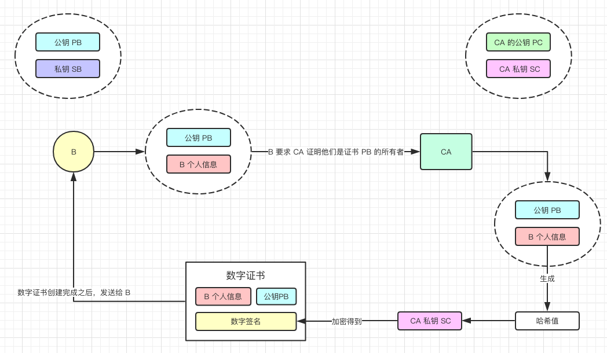
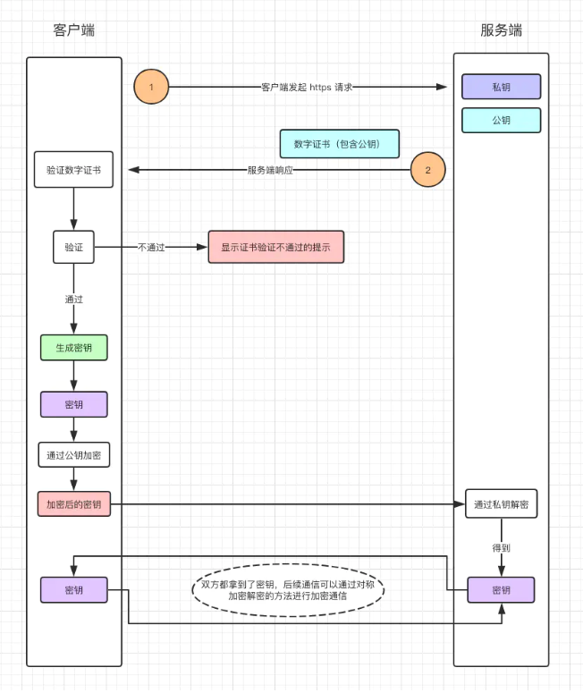

### 1.对称性加密

- 加密解密使用同一个密钥
- 优点是速度比较快
- 缺点是中间人截取密钥的话也能解密

- 因为B是没有密钥的，需要从A接收密钥，接收密钥时也会被截取
- 所以X可以通过密钥去解密

### 2.非对称性加密

- 因为私钥是保存在自己身上的，不会被发送到网络上，中间人截取公钥加密的密文也不能解密，所以比较安全
- 缺点是消耗时间比较多

- 解决对称性加密的安全性问题就是解决钥匙交付的问题
- 那么怎么分配钥匙才能不被中间人解密呢？使用对称性加密

非对称性加密原理：

非对称性加密过程：

- 接收方创建一个公钥一个私钥，私钥留给自己，公钥给发送方

- 发送方使用接收方发送的公钥进行加密，将密文发送出去
- 接收方使用自己创建的私钥进行解密，得到数据

在这个过程中：

- 密文和公钥可能被第三方截取
- 但是第三方没有私钥进行解密，自然没法破解

### 3.混合加密

- 发送者通过公钥加密对称性加密的密钥
- 发送者使用**非对称性加密的公钥**将钥匙密文与通过**密钥**数据密文加密发送给接受者
- 接受者通过自己的私钥解密得到密钥，再通过密钥解密出密文
- 这样做的好处是即保证了安全性，也保证了速度

### 4.中间人攻击

- 中间人在接收方向发送方发送 **公钥**的时候，截取并替换公钥，从而窃取数据
- 原因是发送方无法确定这个 **公钥** 就是发送方创建的

中间人攻击原理：

-  `A` 拿到的其实是 `X` 发送给他的伪造公钥，但是 `A` 无法察觉 

- 1.A通过伪造的公钥去加密请求信息的密文
- 2.改密文被中间人X所截取，并用伪造的私钥进行解密
- 3.解密得到原文在通过第一次截取到的公钥进行加密，发送给B
- 4.B接收中间人X发送的真公钥加密过的请求密文，通过私钥解密得到原文，再用私钥机密响应数据。并且发送出去
- 5.中间人截取真私钥加密的响应数据密文，再通过截取到的真公钥进行解密，得到响应数据

由上面得到结论：

对称性加密也能被破解信息，原因在于他们无法A无法确认他所接受到的公钥是由B发送的，那么如何解决这个问题呢？

### 5.消息鉴别码

- 其英文名称是MAC， `MAC` 可以理解为密钥和密文组成的字符串的哈希值 
- 传输数据时将MAC也传输过去，B解密得到MAC与传输来的MAC进行对比
- 可以防止伪造，但不能避免否认

### 6.数字签名

- 数字签名只能由A创建，B验证签名是否正确，可以避免否认问题
- 数据通过密钥和签名私钥进行加密，传输给B
- B用公钥解密数据，用签名公钥解密签名得到两个相应的数据，进行对比，一致的话就可以

### 7.数字证书

上面的方法已经解决了 **窃听**，**伪造**， **否认**等问题，但是还没有办法避免中间人攻击，因为我们还没有办法验证公钥的所有者。所以我们需要一个“数字证书”系统去验证公钥的所有者。

证书申请过程，数字证书机构称为CA：

### 8.HTTPS

HTTPS其实就是 **混合加密** + **数字证书** 两种加密，保证了数据传输的安全性

 `HTTPS` 做的事情其实就是在传输层跟应用层之间加了一层 `SSL/TLS`，用于对 `TCP` 传输内容的加密和解密 

HTTPS加密过程：

- 客户端发起HTTPS请求
- 服务端返回包含公钥的数字证书
- 客户端进行验证，不通过就提示，通过则继续
- 通过生成密钥，密钥用公钥加密，发送给服务端。
- 服务端得到密钥，双方之后的加密解密就通过对称性加密的进行通信

