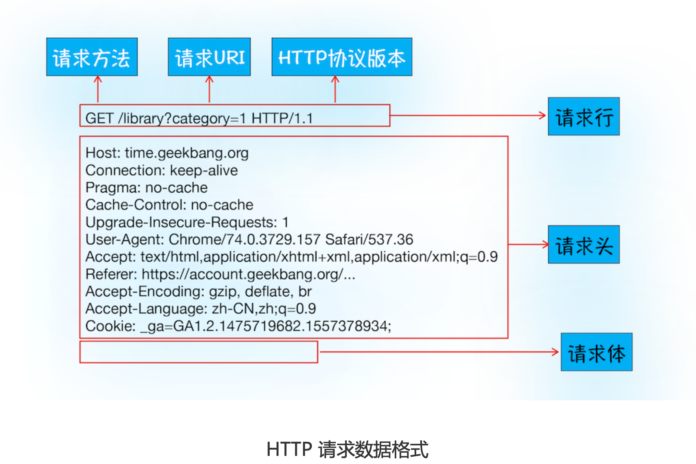

### 1.前言

HTTP协议，是建立在TCP连接的基础上的。**HTTP 是一种允许浏览器向服务器获取 资源的协议，是 Web 的基础**，由浏览器发起请求，获取文件HTML 文件、CSS 文件、JavaScript 文件、图片、视频等。**HTTP 也是浏览器使用 最广的协议**，所以要想学好浏览器，就要先深入了解 HTTP。

两个问题：

- 为什么第一次打开网站时有点慢，第二次打开就很快
- 登录一个网站后，下次再访问就无需登录了

其实这些现象都和HTTP请求有关。

### 2.浏览器端发起HTTP请求流程

在浏览器地址栏输入网址，后续发生了什么呢？

#### 1.构建请求

首先，浏览器构建**请求行**信息，完成后，浏览器发起网络请求

```http
get /index.html HTTP1.1
```

#### 2.查找缓存

在发起请求之前，浏览器会先在本地查询是否又要请求的文件。

浏览器发现请求的资源在浏览器缓存中有副本，则拦截请求，返回该资源的副本，并直接结束请求，好处：

- 减少HTTP请求，减少服务器压力，提升性能

如果缓存查找失败，就需要网络请求了。

#### 3.准备IP地址和端口

**HTTP 的内容是通过 TCP 的传输数据阶段来实现的**，所以需要TCP建立连接先，获取域名通过**DNS解析IP**，url没有指明端口号，则默认80

#### 4.等待TCP队列

Chrome机制是一个域名最多建立6个TCP连接，如果是个TCP请求，则4个需要排队。如果少于6的话，直接进行下一步连接即可

#### 5.建立TCP连接

进行三次握手，工作原理。

#### 6.发送HTTP请求

建立TCP连接后，浏览器可以和服务器通信了。HTTP的数据就是在这个阶段发送的



### 3.服务端处理HTTP请求流程

HTTP请求信息到达了服务器，接下来，服务器会根据浏览器的请 求信息来准备相应的内容。

#### 1.返回请求

服务器处理结束后，便可以返回数据给浏览器了


#### 2.断开连接

一般情况下，服务器向浏览器返回请求数据，TCP就要断开连接。但是浏览器或者服务器在其头信息加上了

```http
Connection:Keep-Alive
```

那么TCP连接在发送后任然保持打开状态，这样浏览器就可以继续通过同一个TCP连接发送请求。**保持TCP连接可以省去下次请求的建立连接时间**，提升资源加载速度。

#### 3.重定向

有些时候输入`baidu.com`，最终发现打开的是`https://www.baidu.com`


### 4.解答疑惑

#### 1.为什么第一次打开很慢？第二次快？

- 第一次加载页面时，缓存了一些数据：
  - DNS资源缓存，在本地做IP与域名映射即可
  - 页面资源缓存
- 第二次很多资源被缓存，少去请求时间

#### 2.为什么第二次打开页面保持登陆状态？

第一次登陆成功之后，服务器生成表示用户身份的字符串，写到响应头Set-Cookie字段里，把响应头给浏览器

```http
Set-Cookie: UID=3431uad;
```

浏览器接收到响应后，解析响应头，遇到Set-Cookie字段，浏览器将会它保存本地。用户再次访问时，浏览器发起请求前就会读取之前保存的Cookie数据，并把数据写进请求头里的Cookie字段，然后浏览器再将请求头发送给服务器。服务器接收到HTTP请求数据后，查找请求头Cookie字段，服务器查询后台，判断该用户登录状态，然后生成含有该用户信息页面的数据，并把生成的数据发送给浏览器。

