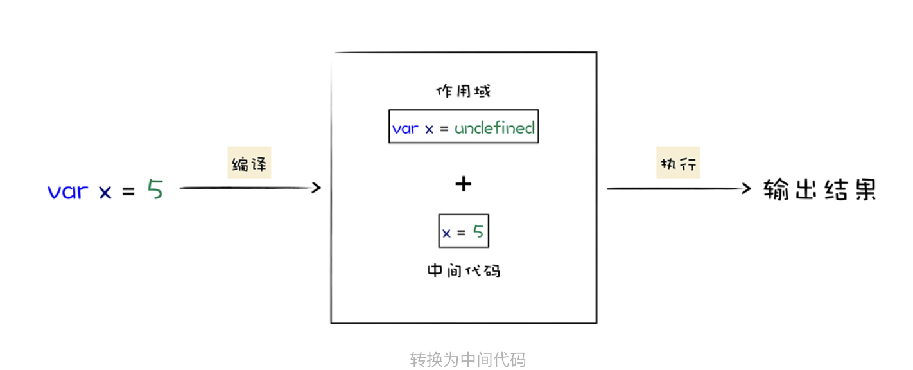

# 一、宏观视角的V8

## V8如何执行一段JS代码

### 1.什么是V8?

::: tip 什么是V8

**V8**是一个由[Google](https://zh.wikipedia.org/wiki/Google)开发的[开源](https://zh.wikipedia.org/wiki/开源)[JavaScript引擎](https://zh.wikipedia.org/wiki/JavaScript引擎)，用于[Google Chrome](https://zh.wikipedia.org/wiki/Google_Chrome)及[Chromium](https://zh.wikipedia.org/wiki/Chromium)中。其核心功能是执行易于开发人员理解的代码。

:::

**V8如何执行JS代码**

- 主要步骤分为编译和执行两步
- 先将JS代码转换为低级中间代码或者机器能够理解的机器代码，然后再执行转换后的代码，并输出执行结果。

我们可以把V8看成是一个虚构出来的计算机，也成虚拟机，虚拟机通过模拟实际计算机的何种功能来实现代码的执行，如模拟计算机的CPU、堆栈、寄存器等，计算机还具有它自己的一套指令系统。

所以对于JS代码来说，V8就是他的整个世界，当V8执行JS时，不需要担心不同操作系统的差异，也不需要担心不同体系结构计算机的差异，只需要按照虚拟机的规范写好代码就可以了。

V8是虚构出来的计算机，用于编译和执行JS代码，**那为什么计算机要对JS这样的高级语言进行编译，编译完又是如何执行的呢**？

### 2.高级代码为什么要编译再执行？

- CPU如何执行机器码：
  - CPU是一个运算器，必须使用二进制指令与CPU沟通，处理器接收到指令时，会按照指令的意思去实现相关操作
  - 为了完成复杂任务，设计了一大推指令，实现各种功能，把这些称为**指令集**，也就是**机器语言**
  - CPU只能识别二进制指令，对于程序员，二进制难以阅读和记。需要将二进制指令集转换为人们易于阅读和记忆的**汇编指令集**
  - 有了汇编语言，还需要将汇编代码转换成机器码的 **汇编编译器**
- 汇编语言依旧复杂
  - 虽然汇编语言解决了语义化的问题，但是**不同的CPU有不同的指令集**，那么汇编需要适配每一套CPU（Intel，ARM），这样会让工作变得繁琐

# 二、JavaScript设计思想

## 函数即对象：理解JS的函数特点

- 相比于其他语言来说，JS设计的很奇怪，函数可以赋值给一个变量；可以将函数作为参数传给另外一个函数；函数内可以返回另外一个函数。
- JS函数非常灵活，因为 **JS中的函数就是一种特殊的对象**，我们称之为 **一等公民**

基于函数是一等公民的设计，使得JS非常容易实现一些特性，比如闭包，函数式编程等。函数式编程和闭包需要经常用到，不做深入了解的话，很难写出像第三方库一样优雅的代码。

### 什么是JavaScript中的对象

在JavaScript中，函数是一种特殊的对象，什么是JavaScript中的对象，和其他语言的对象有什么区别？

和其他主流语言不一样的是，JavaScript是一门 **基于对象**的语言，函数、数组也是对象；

而这些对象在运行时

