# 一、宏观视角的下的浏览器

## 1.1打开浏览器，为什么有多个进程

#### 并行处理

- 同时处理多个没有依赖的任务
- 就是多线程的原理
- 可以提升效率

#### 线程VS进程

- 多线程可以并行处理任务，但是线程是不能单独存在的，他是由进程来启动和管理的。
- 一个进程就是一个程序的运行实例，详细点就是：
  - 启动一个程序，操作系统为该程序新建一块内存，用于存放代码、运行中的数据和一个执行任务的主线程。
  - 这样的运行环境叫进程
- 进程中任意一个线程出错，都会导致整个进程崩溃
- 线程之间共享进程的数据
- 当一个进程关闭之后，操作系统会回收进程所占用的内存
- 进程之间的内容互相隔离
  - 一个进程崩溃或者挂起，不会影响其他进程
  - 如果要通信的话，就涉及到进程间的通信机制了（IPC）

#### 3.单进程时代

**概念**

- 浏览器所有功能模块都在同一个进程里面，比如网络线程，页面线程
- 这样就导致了**不稳定**、**不流畅**和**不安全**这些问题

**问题一：不稳定**

- 早期浏览器丰富的功能，如视频，游戏等，是需要借助插件去实现的
- 但插件是最容易出问题的模块，那么一个线程出问题了，整个进程就崩溃了，导致整个浏览器崩溃

**问题二：不流畅**

- 因为是单进程，里面的渲染模块，JS执行环境，以及一些插件都是在同一进程进行的，意味着同一时间只能有一个模块执行
- 里面的一些脚本和插件都会让浏览器变卡顿，页面内存泄露；

**问题三：不安全**

- 通过插件可以过去到系统资源，当页面运行这个插件时，意味着这个插件可以操作你的电脑

#### 4.多进程时代

**早期多进程**

- **如何解决不稳定**
  - 进程之间互相隔离，一个页面崩溃，只会影响当前页面进程或插件进程
  - 并不会影响到其他页面，这样就避免了整个浏览器崩溃

**目前多进程架构**

- 目前的Chrome浏览器包括：1个浏览器主进程、1个GPU进程、1个网络进程、多个渲染进程、多个插件进程
- 浏览器进程：
  - 主要负责界面显示、用户交互、子进程管理，同时提供存储功能
- 渲染进程：
  - 核心任务是将HTML、CSS、JS转换为用户可以交互的网页，排版引擎Blink和JS引擎V8都是运行在该进程中；
  - 默认情况下，Chrome会为每个tab标签创建一个渲染进程
  - 处于安全考虑，渲染进程运行在沙箱模式下
- GPU进程：
  - 一开始没有的，初衷是为了实现3D CSS效果
  - 随后网页、Chrome的UI界面都选择采用GPU来绘制
  
- 网络进程：
  - 负责页面网络资源加载
  - 之前是作为一个模块运行在浏览器进程里面的，这两年独立出来的
  
- 插件进程：
  - 负责插件的运行，因为插件比较容易崩溃，所以通过插件进程来隔离
  - 这样就保证了插件进程崩溃不会对浏览器页面造成影响
  

**多进程总结**

- 优点：
  - 多进程模式解决了稳定性，流畅性、安全性
- 缺点：
  - 更高资源的占用：每个进程都会包含一些公共基础结构的副本（如JS运行环境），这样意味着浏览器会消耗更多的内存资源
  - 更复杂的体系架构：浏览器各个模块之间耦合性高、扩展性差等问题，导致现在的架构很难适应新的需求

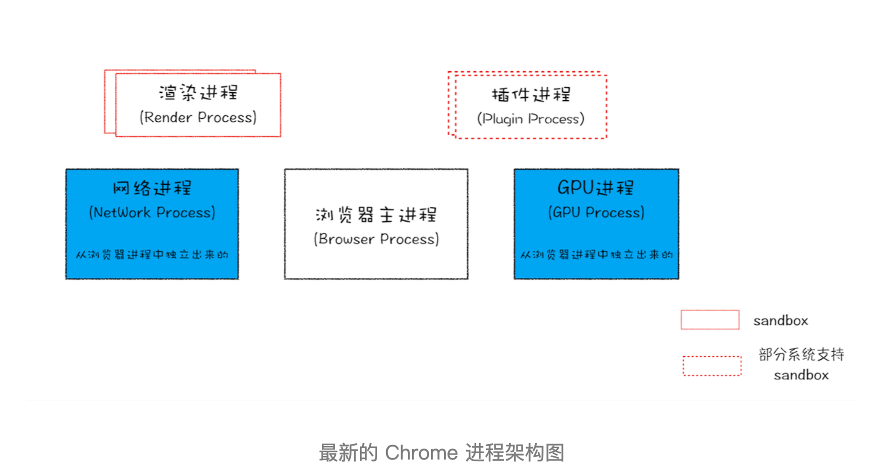

## 1.2TCP协议：如何保证页面文件能被完整送达浏览器？


在衡量Web性能有一个非常重要的指标——**FP（First Paint）**，是**指从页面加载到首次开始绘制的时长**。影响该指标非常重要的一个因素就是**网络加载速度**。


想要优化Web页面的加载速度，需要对网络有充分了解。特别是对网络传输协议，不管是HTTP还是Websocket，都是基于TCP/IP的，只有清楚这些原理，才能更好的去优化Web性能，可以轻松定位Web问题。


在网络中，一个文件通常会被拆分成很多数据包来进行传输，而在数据包传输的过程中又有很大概率丢失或者出错。**那么如何保证页面文件能被完整的送达浏览器呢？**


- 数据包如何送达主机？
  - 互联网都是通过数据包传输数据的，一个文件会被拆分成许多数据包来传输
- 主机如何将数据包转交给应用？
- 数据是如何被完整地送达应用程序？


#### **1.数据包如何送达主机**

- 数据包想要在网上传输，就要符合IP协议，不同在线设备都有唯一的地址，和家里的门牌号一样
- 计算机的地址就是IP，访问任何网站都是你的计算机向另外一台计算机请求信息

::: tips

把一个数据包从主机A传输到主机B，在传输之前，数据包上会加上主机B的IP地址信息，同时也会加上主机A自己的IP地址，就跟发快递一样，有发送地址和目标地址。这样才能回复信息。这些信息会被添加进IP头的数据结构里。IP头是IP数据包开头的信息，内容有：**IP版本**、**源IP地址**、**目标IP地址**、**生存时间**等信息。

:::

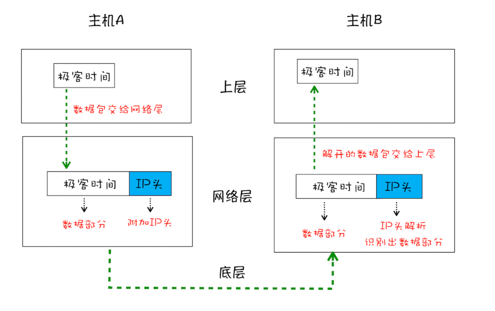

**数据包从主机A到主机B发生了什么**

- 应用层将数据包交给网络层
- 网络层将IP头附加到数据包上，组成新的IP数据包，并交给底层
- 底层通过物理网络将数据包传输给主机B
- 数据包传输到主机B的网络层，主机B解析数据包的IP头信息，拆开的数据交给上层


#### 2.UDP：把数据包送达应用程序

**为什么要有UDP**

- IP是非常底层的协议，只负责把数据包送达对方电脑，但是不知道送给哪个程序，一条信息过来不知道是给微信还是QQ
- 为此，计算机在IP协议的基础上开发了能和应用打交道的协议——“**用户数据包协议**（User Datagram Protocol）”，简称**UDP**。

**UDP介绍**

- UDP最重要的信息是端口号，每个想访问网络的程序都要端口号，这样就能把数据精准的送达到某个程序
- 和IP头一样，端口号也会被放进UDP头，UDP头和原始的数据包组合成新的UDP数据包。
- UDP头除了目的端口，还有源端口号的信息

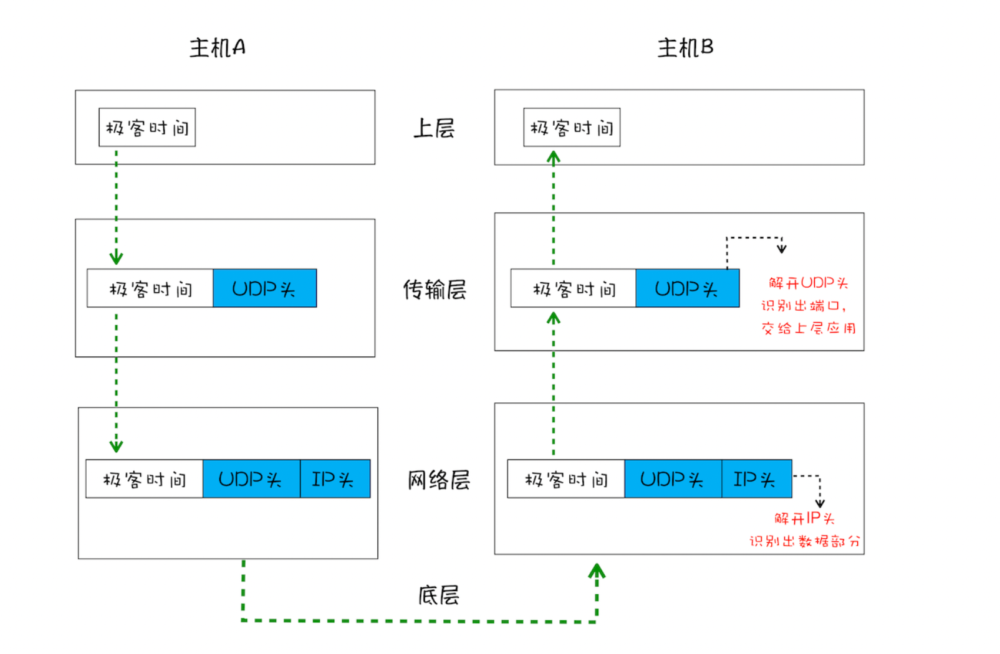

**通过UDP数据包从A主机到B主机发生了什么**

- 上层把数据包交给传输层
- 传输层在数据包前面加上UDP头，组成新的UDP数据包，在将新的UDP数据包交给网络层
- 网络层将IP头附加到数据包上，组成新的IP数据包，交给底层
- 数据包传给主机B的网络层，主机B拆开IP头的信息，将拆开的数据包部分交给传输层
- 在B的传输层，数据包中的UDP头会被拆开，并根据UDP中所提供的端口号，把数据部分交给上层的应用程序
- 最后，数据包信息被主机B的应用程序使用


#### TCP：把数据完整地送达应用程序

- 对于浏览器请求，或者邮件这些重要的信息，传输必须要保证数据的完整性以及可靠性
- UDP传输存在两个问题：
  - 数据包传输过程中容易丢失
  - 大文件拆成小数据包传输，不同时间到达接收端，UDP是不知道如何组装这些数据包的，所以无法还原成完整的数据
- 基于这两个问题，可以使用TCP，具有以下特点
  - 对应丢失的数据包，TCP提供了重传机制
  - TCP引入了数据包排序机制，可以把乱序的数据包组合成完整的文件
  - TCP头除了目标端口和本机端口，还有用于排序的序号

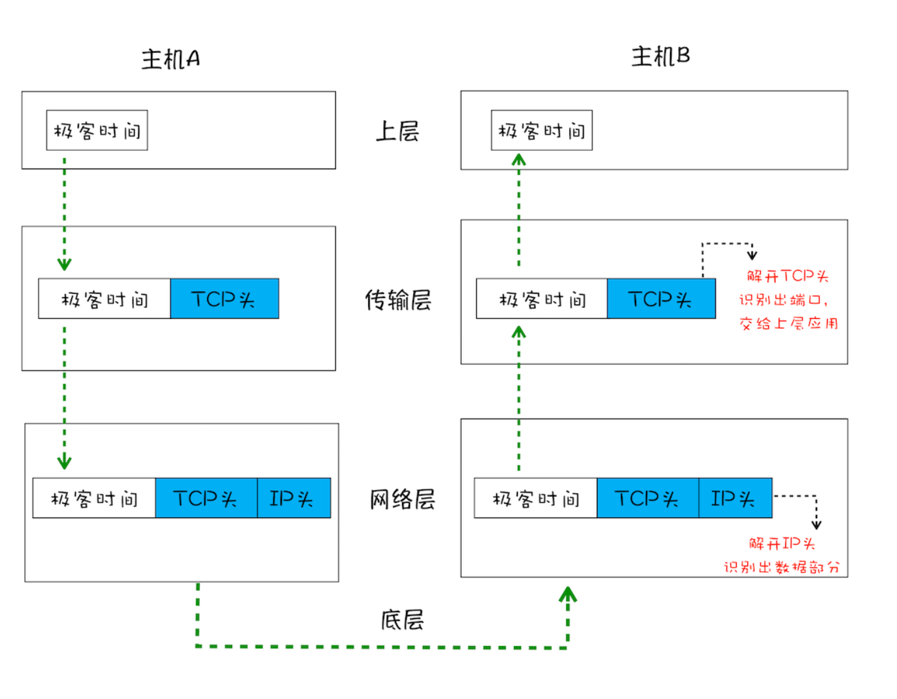

- 通过上图可以发现TCP单个数据包传输和UDP的流程差不多，不同的是，TCP头部信息保证了一大块数据传输的完整性


**TCP的生命周期**

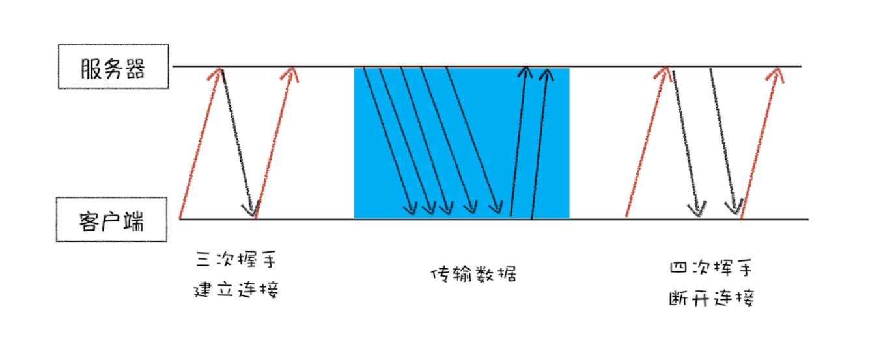

- 先**建立连接**。通过三次握手建立客户端和服务端的连接。TCP提供面向连接的通信传输。**面向连接**指在数据通信开始之前先做好两端的准备工作。三次握手是指在建立一个TCP连接时，两端总共需要发送三个数据包确认连接的建立
- **传输数据**，传输时，**接收端需要对每个数据包进行确认操作**，当发送端发送一个数据包后，在规定的时间内没有接收到接收端返回的确认消息，就判定为数据包丢失，就会触发发送端的重发机制。然后就是一个大文件会被拆分成许多数据包，到达接收端后会按照TCP头部的序号去组装数据包，**保证了数据的完整性**。
- **断开链接**，数据传输完成，终止连接，涉及到四次挥手保证双方断开连接。


**总结**

- TCP保证了数据的可靠性，但是牺牲了数据包的传输速度，三次握手和数据包校验机制把传输过程中的数据包数量提高了一倍

## 1.3 HTTP请求流程：为什么很多站点第二次打开速度会很快？

::: tips

HTTP协议是建立在TCP基础上的。**HTTP是一种允许浏览器向服务器获取资源的协议，是Web的基础**。由浏览器发起请求，获取不同类型的资源。

:::

- 为什么第一次打开一个站点时，打开速度很慢，再次访问时就变得很快了
- 当登录一个网站之后，下次再访问，就已经是登录状态了，怎么做？
- 上面的特性都和HTTP协议相关

### 浏览器端发起请求

#### 1.构建请求

- 首先需要构建**请求行**信息，然后浏览器准备发起网络请求

```http
GET /index.html HTTP1.1
```

#### 2.查找缓存

- 在发起真正的网络请求之前，浏览器回去查找浏览器缓存中是否有要请求的文件。
  - 如果有，则拦截请求，使用缓存
  - 减小了服务器压力，提升了渲染速度
- 查找失败则进入网络请求的过程

#### 3.准备IP地址和端口

- 需要先了解下HTTP和TCP之间的关系：
  - 浏览器使用HTTP协议作为应用层协议，用于封装请求的文本信息
  - 使用TCP/IP作传输层协议将它发到网络上
  - 所以HTTP开始工作之前，浏览器通过TCP与服务器建立连接
  - 也就是说HTTP的内容是通过TCP的传输数据阶段来实现的

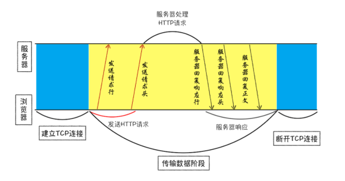

**思考**

- HTTP网络请求的第一步是什么？与服务器建立连接
- 建立连接需要哪些信息？IP地址和端口号
- 如何获取IP地址和端口号？
  - 根据HTTP请求的话，只有一个URL
  - 通过URL可以根据DNS获取到IP
  - 端口没有指定默认是80
- 其中DNS是负责把域名和IP地址做一一映射关系
  - DNS的数据可以被缓存，如果某个域名已经解析过了，浏览器可以缓存解析的结果，下一次查询可以直接使用

#### 4.等待TCP队列

- 通过上面步骤IP和端口都有了，但也不能立马就建立连接
- 因为同一个域名最多建立6个TCP连接，也就是该域名同时有10个请求发生，4个请求会进入排队等待状态
- 要是少于6个，那么就进行第5步

#### 5.建立TCP连接

- 三次握手

#### 6.发送HTTP请求

- 建立连接之后，浏览器就可以向服务器请求数据了


**请求行**

- 首先发送请求行，包含了请求方法，请求URI，HTTP版本号

**请求头**

- 把浏览器的基础信息告诉服务器
  - 比如操作系统，浏览器内核，域名信息，浏览器端的Cookie信息

### 服务端处理HTTP请求

#### 1.返回请求

- 一旦服务器处理结束，便可以返回数据给浏览器了。可以通过curl查看返回的数据

```
curl -i  https://time.geekbang.org/
```

- 返回结果如下


#### 2.断开连接

- 一般来说服务端返回请求后就关闭TCP连接，但是浏览器或者服务器在头部信息加上了 *Connection:Keep-Alive*
- 那么TCP连接在发送后任然保持打开状态这样浏览器就可以通过同一个TCP连接发送请求。
- 这样做是为了省去下一次连接所需要的时间，提高了性能，因为复用了该连接


#### 3.重定向

- 还有一种情况就是当你在浏览器打开 *baidu.com*，最后打开页面的地址是 *https://baidu.com*
- 这两个url之所以不一样，是因为涉及到了一个**重定向操作**
- 输入 *curl -I baidu.com*，看看返回什么
  - 返回包含*Location: https://baidu.com*，代表这会重定向到这个url

### 总结

#### 1.为什么很多站点第二次打开会很快

- 第一次加载页面时，缓存了一些耗时的数据
- 缓存了哪些数据：
  - DNS缓存和页面资源缓存
  - DNS缓存较为简单，只需把IP和域名对应起来

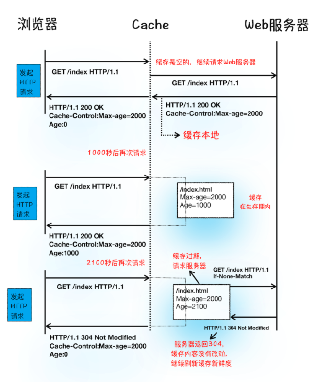

#### 2.如何保持登录状态

- 用户第一次需要向服务器发送post请求提交自己的账号密码
- 服务器接收到信息，回去后台校验，通过后会生成一个标识用户的字符串，写到响应头的Set-Cookie字段里（如 *Set-Cookie: UID=3431uad;*）
- 浏览器接收到服务器的响应后，开始解析响应头，有Set-Cookie这个字段，浏览器就会把它保存在本地
- 再次访问时，浏览器会发起HTTP请求，但是在发起请求之前，浏览器会读取之前保存的Cookie数据，把数据写进请求头的Cookie字段里，浏览器会把改请求头发给服务器。
- 服务器收到HTTP请求头数据后，会查找请求头是否有Cookie字段，有的话读取字符串，服务器查询后台，判断是登录状态，然后生成包含该用户信息的页面数据，并把生成的数据发送给浏览器
- 浏览器收到该含有当前用户的页面数据后，就可以正确展示用户登录的状态信息了

## 1.4从输入URL到页面展示发生了什么？

- 下图是输入URL之后到渲染页面发生的一系列流程：

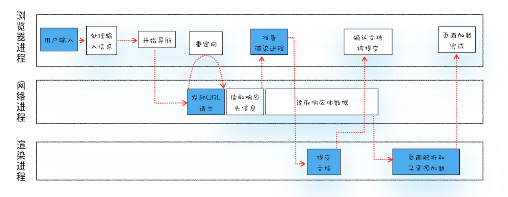

- 从上图不难发现，整个过程需要不同进程的配合：
  - 浏览器进程负责用户交互，子进程管理和文件存储等功能
  - 网络进程是面向渲染进程和浏览器进程提供网络下载功能
  - 渲染进程是负责把从网络下载的资源解析成可以显示和交互的页面。因为渲染进程所有的内容都是通过网络获取的，会存在一些恶意代码利用浏览器漏洞对系统进行攻击，所以渲染进程的代码是不被信任的。这也是为什么Chrome让渲染进程运行在安全沙箱里，就是为了保证系统的安全。
- 

## 1.4渲染流程（上）HTML、CSS和JavaScript，是如何变成页面的？

- 弄清楚渲染流程非常重要
- 优化页面卡顿，JS优化动画流程，优化样式防止强制同步

### 构建DOM树

- 浏览器无法直接理解和使用HTML，需要将HTML转换为浏览器能理解的结构——DOM树

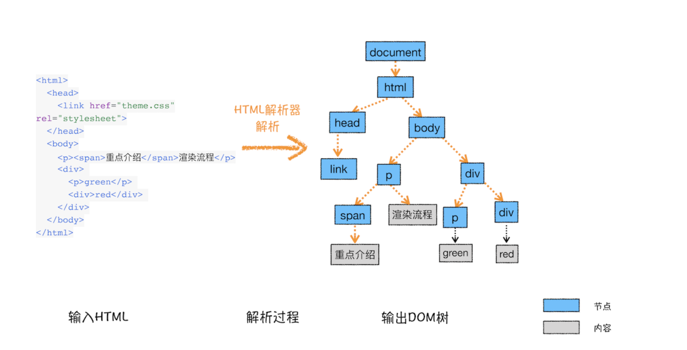

### 样式计算

- 计算出DOM节点每个元素的具体样式，这个阶段分为三步

#### 1.把CSS转换为浏览器能够直接理解的结构

- css来源主要有3种：
  - link引用
  - style标记
  - 内联
- 和html一样，浏览器无法直接理解纯文本css样式，所以**渲染引擎接收到CSS文本时，会执行一个转换操作，将CSS文本转换为浏览器可以理解的结构——styleSheets**
- 如图：

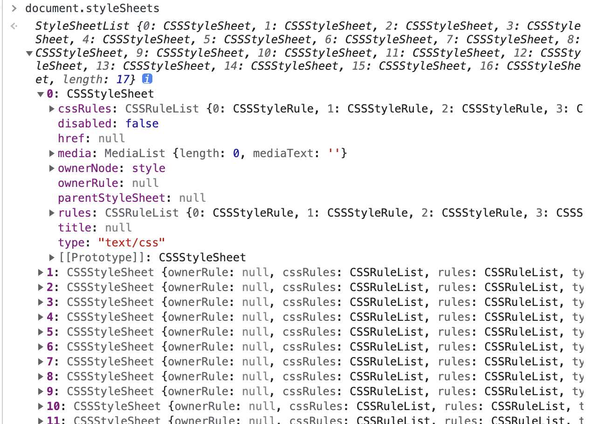

#### 2.转换样式表中的属性值，使其标准化

- 上面的转换操作已经把CSS文本转换成浏览器可以理解的结构了，**接下来还需要对其进行属性值的标准化操作**
- 什么是标准化：
  - 部分属性值是无法被渲染引擎所理解的，比如`color: green`需要转换成`color: rgb(0, 128, 0)`,还有1em单位等

#### 3.计算出DOM树中每个节点的具体样式

- 计算时需要严格遵守CSS的**继承规则**和**层叠样式**
- 首先是**CSS继承**，意思就是每个DOM节点都包含有父节点的样式
- 第二个就是**样式层叠**。
- 可以在Chrome的Elements中的Computed中查看具体的样式计算结果

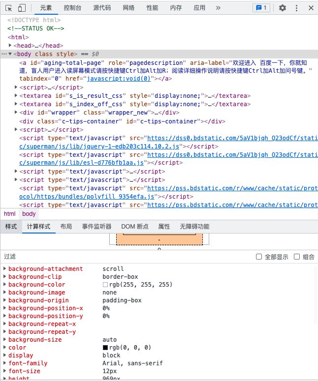

### 布局阶段

- 通过上面的流程，我们已经有了DOM树和DOM树的样式，但这还不足以显示页面，因为还不知道DOM元素的几何位置信息。接下来需要**计算DOM树中可见元素的几何位置，这个过程叫布局**。

## 1.6渲染流程（下）HTML、CSS和JavaScript，是如何变成页面的？

### 1.分层

- 经历了**DOM生成**、**样式计算**、**布局**三个阶段得到了**布局树**还不能马上进行渲染
- 因为页面中有很多复杂的效果，如3D转换，页面滚动，或者z-index做z轴排序
- 所以为了方便实现这些效果，**渲染引擎还需要为特定的节点生成专用的图层，并生成一棵对应的图层树**
- 各个图层的叠加才得到最终的页面图像
- 如何查看图层，打开Chrome，选择Layers，可以可视化页面分层

**总结**

- 浏览器的页面实际上被分成了很多图层，这些图层叠加后合成了最终的页面
- 图层和布局树节点之间的关系：

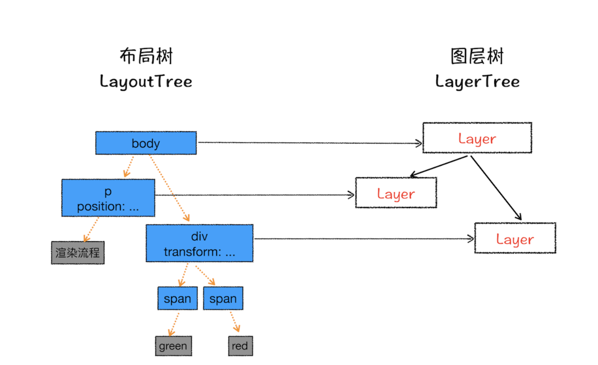

- 从上图发现，**并不是每一个节点都包含一个图层，如果一个节点没有对应的层，那么这个节点就属于父节点的图层**。
  - span标签就没有专属图层，就是于上面的div父节点图层
  - 这样的话其实每个节点都会直接或者间接属于一个层

**渲染引擎会为节点创建新的层需要满足下面其中一个条件即可：**

- **第一：拥有层叠上下文属性的元素会被提升为单独的一层。**
  - 页面是个二维平面，但是层叠上下文能让HTML具有三维的概念，这些HTML元素按照自身的优先级分布垂直于这个二维平面的Z轴上
  - 明确定位属性的元素、定义透明属性的元素、使用 CSS 滤镜的元素等，都拥有层叠上下文属性。

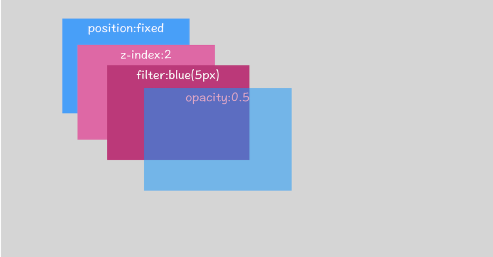

- **第二：需要剪裁（clip）的地方也会被创建为图层**
  - 什么是裁剪：
    - div的大小是200*200，但是里面有很多文字，超出了这个大小
    - 这个时候渲染引擎会为文字部分单独创建一个层
    - 出现滚动条的话，也会被提升为单独的层

### 2.图层绘制

- 完成图层树的构建之后，渲染引擎就需要对图层树的每个图层进行绘制
- 绘制例子：
  - 在一张纸上绘制蓝色背景
  - 在中间绘制红色的圆
  - 在圆上绘制绿色的三角形
- 渲染引擎实现图层绘制与之类似，把图层绘制拆分成很多小指令，然后再把这些指令按照顺序组成一个**待绘制列表**

### 3.栅格化（raster）操作

- 绘制列表只是用来记录绘制顺序和绘制指令的，然而实际上绘制操作是由渲染引擎中的**合成线程**来完成的

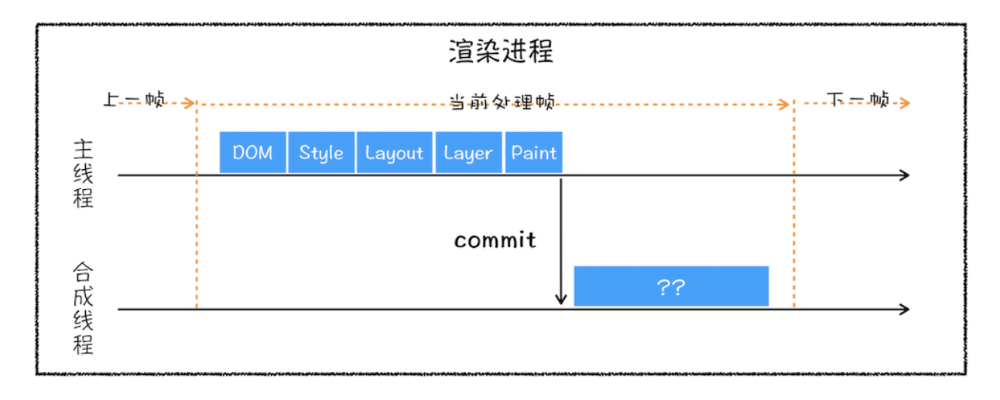

- 从上面流程图可以得知，当图层的绘制列表准备好之后，主线程把绘制列表交给合成线程去执行，然后生成下一帧的画面
- 先理解一下视口（view port）的概念：
  - 页面很大，但是**用户当前可见部分叫做视口**
- 有的图层很大，滚动条拖动很久才会到底部，但用户只能看到视口的大小，所以绘制全部图层内容的话，开销很大，没必要
- 基于上面的性能考虑，**合成线程会将图层划分为图块**

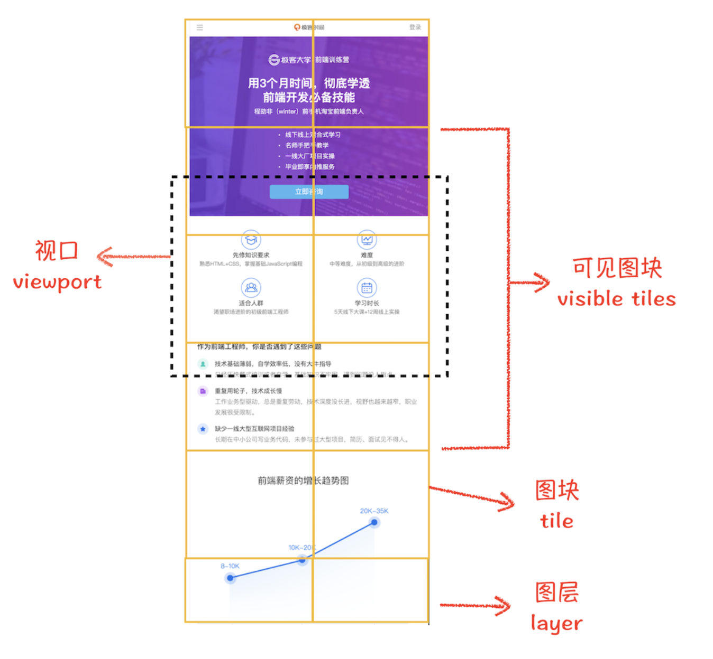

- **合成线程会按照视口附近的图块来优先生成位图，实际生成位图的操作是由栅格化来执行的。栅格化是指将图块转换为位图。**

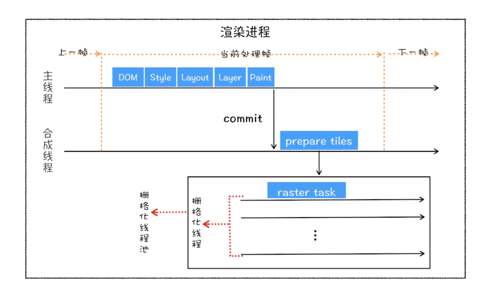

- 栅格化的过程都会使用GPU来加速生成，使用GPU生成位图的过程叫快速栅格化（或者GPU栅格化），生成的位图是保存在GPU内存中的
- 由于栅格化使用GPU，最终生成位图的操作是在GPU中完成的，属于跨进程操作了
  - 渲染进程把生成图块的指令发给GPU，然后在GPU中执行生成图块的位图，保在GPU内存中

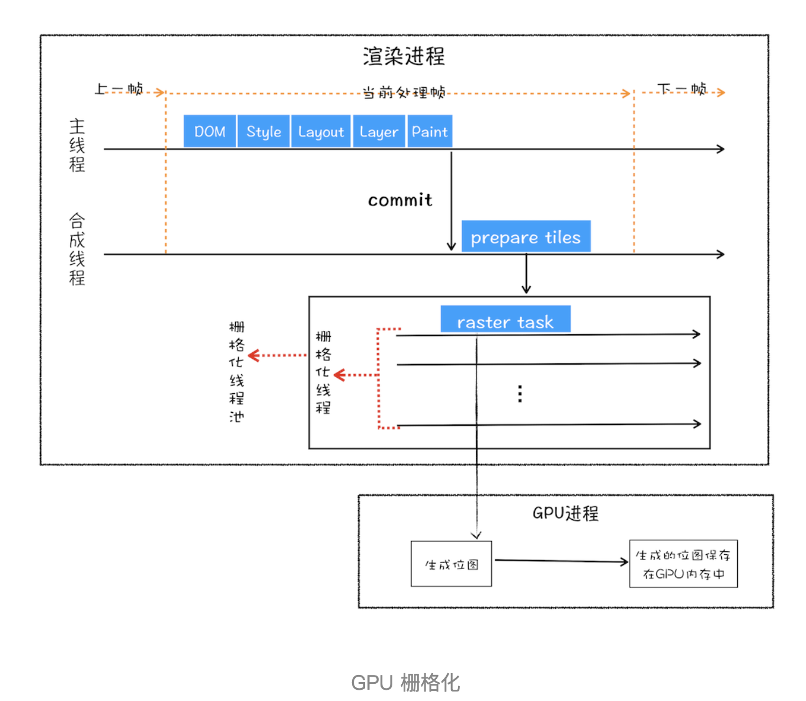

### 4.合成和显示

- 一旦所有图块都被光栅化，合成线程会生成一个绘制图块的命令——DrawQuad，然后该命令被提交给浏览器进程
- 浏览器进程有一个叫 **viz**的组件，用于接受合成线程发过来的DrawQuad命令，然后根据该命令，将页面内容绘制到内存中，最终将内存显示在屏幕

### 总结

- 通过上面七个步骤的分析，HTML到DOM，样式计算、布局、图层、绘制、光栅化、合成和显示
- 整个渲染流程：

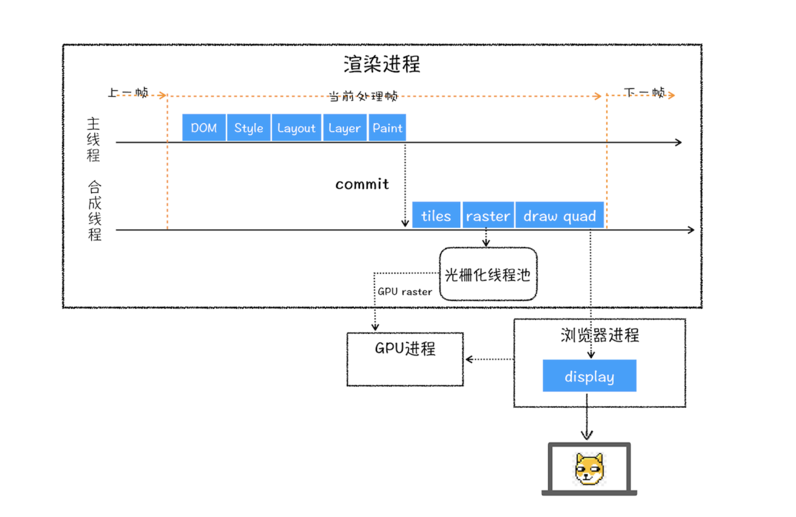

- 总结流程：
  1. 渲染进程将HTML内容转换为能够读懂的**DOM树**结构
  2. 渲染引擎将CSS样式表转换为浏览器可以识别的**styleSheets**，计算出DOM节点的样式
  3. 创建**布局树**，计算出布局信息
  4. 对布局树进行分层，并生成**分层树**。
  5. 为每个图层生成**绘制列表**，并将其提交到合成线程
  6. 合成线程将图层分为图块，并在**光栅化线程池**中将图块转换成位图
  7. 合成线程发送绘制图块命令**DrawQuad**给浏览器进程
  8. 浏览器进程根据 DrawQuad 消息**生成页面**，并**显示**到显示器上。

# 二、浏览器中的JS

## 2.1 变量提升：JS是按顺序执行的吗？

- 变量提升
  - 可以被看做是先定义了一遍，然后进行赋值

```js
showName()
console.log(myname)
var myname = 'qmj'
function showName() {
    console.log('函数 showName 被执行');
}

// output '函数 showName 被执行' undefined 
```

**所谓的变量提升，是指在 JavaScript 代码执行过程中，JavaScript 引擎把变量的声明部分和函数的声明部分提升到代码开头的“行为”。变量被提升后，会给变量设置默认值，这个默认值就是我们熟悉的 undefined。**


### JavaScript 代码的执行流程

- 字面上看，变量提升意味着函数的声明和变量会在物理层面移动到代码最前面，其实这是不准确的
- **实际上变量提升和函数声明在代码里的位置是不会改变的，而是在编译阶段被JS引擎放入内存中。**
  - JS在执行前需要被JS引擎编译
  - 编译完成之后才会被执行

## 2.2调用栈：为什么JavaScript代码会出现栈溢出？

# 三、V8工作原理

### 3.1 栈空间和堆空间：数据是如何存储的？

# 四、页面循环系统

