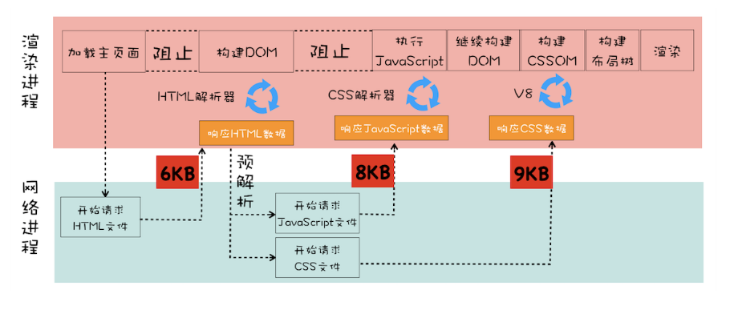

## 浏览器性能优化

> 浏览器性能好差就是体现在页面的显示速度，与响应速度。又由于页面在不同阶段侧重点也不同，页面优化就需要分析页面生存周期不同阶段。

### 一、加载阶段

**这是一个渲染流水线：**

- 图片，音频，视频等文件不会影响页面首次渲染。
- JS，CSS，HTML会影响首次渲染。



**这些能阻塞网页首次渲染的资源成为关键资源**，基于关键资源，可以继续分化出三个影响页面首次加载的核心因素：

**1.关键资源个数：**关键资源越个数多首次页面加载时间越多。

**2.关键资源大小：**关键资源越大，首次加载时间越长。

**3.请求关键资源需要的RTT（Round Trip Time）：**跟TCP有关，RTT就代表往返的时延，是网络中重要的性能指标，表示从发送端**发送数据开始**，到**发送端接收到接收端的确认**，经历的时间。通常1个HTTP包14KB左右，一个0.1MB的页面需要8个包，也就是8个RTT。

图例RTT说明：

		-	首先请求HTML资源，小于14KB，所以一个RTT。
		-	渲染引擎有预解析进程，他会扫描HTML里面的关键资源，扫描到了，同时(重叠)解析，所以可以认为CSS和JS是一起解析的，只要取他们最大的即可，9KB<14KB,所以也只需要1个。
		-	总计2个RTT。


所以，首次加载时间的减少，就是 **减少关键资源个数，降低关键资源大小，降低关键资源的 RTT 次数** 。

**减少关键资源个数**：

- css样式内联。
- js没操作DOM时，改为sync，defer属性
- css不是在构建页面之前加载的，添加每题取消阻止显示的标志。
- 因为JS标签上加了sync，defer，CSSLink属性之前加上了阻止取消显示的标志，他们就是非关键资源。

**减少关键资源大小**

- 压缩css，js。
- 移除注释。

**减少RTT**

- CDN减少RTT。
- 减少关键资源个数和大小。

### 二、交互优化

> 交互优化其实就是：渲染进程渲染帧的速度，交互时，渲染帧的速度决定了交互的流畅度。所以讨论页面优化就是讨论渲染引擎是如何渲染帧的，否则无法优化帧率。

**那么如何生成新的一帧？**

大部分情况，由JS操作DOM，CSSOM触发。一小部分由CSS触发。

**重排：**现有布局发生变化，触发后续渲染流水线的一些列操作。开销非常大。

**重绘：**仅仅发生了颜色之类的修改，那就不会涉及到布局的调整，跳过布局，直接进入绘制。但是消耗也挺大。

**合成：**通过一些CSS形变，渐变，动画等特效，由CSS触发，在合成线程上执行。不触发重排重绘，合成的速度很快，所以合成是效率最高的。

知道了帧是如何生成的，接下来可以讨论具体方案了。一个方案就是让**单个帧的生成速度变快**，接下来分析下交互阶段渲染流水线中有哪些因素影响了帧速度的生成速度及优化。


**1.减少JS执行时间**

有时JS函数执行一次要几百毫秒，严重占用主线程其他渲染任务的时间。有两种策略：

- 将函数分为多个任务，使得每次执行时间不要过久。

**2.避免强制同步布局：**

**正常：**如果发生了操作DOM，添加删除之类的，需要重新计算布局，正常情况是在另外的异步任务中完成。就是为了不占用主线程。

**强制同步：**JS强制将计算样式和布局操作提前到当前的任务中。

- 在添加完DOM之后，获取元素新的offsetHeight是会重新计算布局，强制让渲染引擎执行一次布局。

```
function foo() {
    let main_div = document.getElementById("mian_div")
    let new_node = document.createElement("li")
    let textnode = document.createTextNode("time.geekbang")
    new_node.appendChild(textnode);
    document.getElementById("mian_div").appendChild(new_node);
    // 由于要获取到 offsetHeight，
    // 但是此时的 offsetHeight 还是老的数据，
    // 所以需要立即执行布局操作
    console.log(main_div.offsetHeight)
}
```

**3.避免频繁垃圾回收**

JS垃圾回收是自动的，在一些函数中频繁创建临时对象，那么垃圾回收器也会频繁的执行垃圾回收，会占用主线程。影响其他任务执行，可能会掉帧。

**4.合理利用合成**

合成动画是在合成线程上执行的，跟主线程的执行布局，绘制不同，主线程被JS占用，CSS能够继续执行。动画能用CSS写就用CSS写。

另外，提前告知某个元素需要执行动画，will-change，告诉浏览器引擎需要将该元素单独生成一个层。