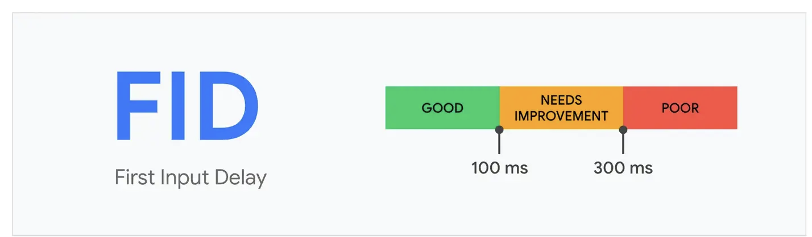

## 前言：浏览器性能指标有哪些？

根据chrome最新规则，前端性能指标考量主要有 FCP（First Contenful Paint）--10%、SI（Speed Index）--10%、LCP（Largest Contentful Paint）--25%、TBT（Total Blocking Time）--30%、CLS（Cumulative Layout Shift）--25%。

## 一、FCP相关

- 概念：First Contenful Paint 首次内容绘制 是 页面从开始加载到页面内容的任何部分在屏幕上完成渲染的时间

- Web-Vitals中的FCP源码
  - 优先使用performance.getEntriesByName('first-contentful-paint')[0]的值

```js

import { bindReporter } from './lib/bindReporter.js';
import { getVisibilityWatcher } from './lib/getVisibilityWatcher.js';
import { initMetric } from './lib/initMetric.js';
import { observe } from './lib/observe.js';
import { onBFCacheRestore } from './lib/onBFCacheRestore.js';
export const getFCP = (onReport, reportAllChanges) => {
    const visibilityWatcher = getVisibilityWatcher();
    let metric = initMetric('FCP');
    let report;
    const entryHandler = (entry) => {
        if (entry.name === 'first-contentful-paint') {
            if (po) {
                po.disconnect();
            }
            // Only report if the page wasn't hidden prior to the first paint.
            if (entry.startTime < visibilityWatcher.firstHiddenTime) {
              	// 优先使用performance.getEntriesByName('first-contentful-paint')[0]的值
                metric.value = entry.startTime;
                metric.entries.push(entry);
                report(true);
            }
        }
    };
    // TODO(philipwalton): remove the use of `fcpEntry` once this bug is fixed.
    // https://bugs.webkit.org/show_bug.cgi?id=225305
    // The check for `getEntriesByName` is needed to support Opera:
    // https://github.com/GoogleChrome/web-vitals/issues/159
    // The check for `window.performance` is needed to support Opera mini:
    // https://github.com/GoogleChrome/web-vitals/issues/185
    const fcpEntry = window.performance && performance.getEntriesByName &&
        performance.getEntriesByName('first-contentful-paint')[0];
    const po = fcpEntry ? null : observe('paint', entryHandler);
    if (fcpEntry || po) {
        report = bindReporter(onReport, metric, reportAllChanges);
        if (fcpEntry) {
            entryHandler(fcpEntry);
        }
        onBFCacheRestore((event) => {
            metric = initMetric('FCP');
            report = bindReporter(onReport, metric, reportAllChanges);
            requestAnimationFrame(() => {
                requestAnimationFrame(() => {
                    metric.value = performance.now() - event.timeStamp;
                    report(true);
                });
            });
        });
    }
};

```

## 二、CLS（布局偏移量）

- 交互阶段的优化

- 衡量页面**可见内容**在加载过程中的意外**偏移**，反映了视觉的稳定性
- 页面跳来跳去的，用户体验就极差
- 指标：cls<0.1良好， 0.1<cls<0.25需要改进， cls>0.25较差了
- 计算公式：
  - CLS = Impact Fraction × Distance Fraction
- CLS的重要性：
  - **提升用户视觉与操作体验**，页面突然移动，用户看了不爽，也容易误点导致操作错误
  - **可以改善SEO**，Google会将CLS的值作为一个影响因素，决定你的搜索排名
  - **提高转换率**，Google是有做过统计的，CLS体验不佳的电商网站会让用户放弃购买的
- 优化方式：
  - **给图片视频元素留好位置**，避免加载出来的时候改变布局，设置好宽高
  - **给广告和公告栏预留空间**，云控制台有公告栏，第三个语句占用两行，导致高度变高，下面的列表直接往下偏移
  - **尽量使用CSS实现动画**，使用JS可能会导致DOM结构发生改变且性能不好

## 三、FID（First Input Delay）首次输入(交互)延迟

### 3.1相关概念

- 用户衡量网页交互性的性能指标
- 用于第一次交互代表用户对该网站速度的第一映像，非常重要
- 一些资源的加载和网络请求会导致交互有延迟
- 100ms内用户才感知不到卡顿



### 3.2  FID慢的原因

- 需要加载的资源多，图片，JS，CSS等等
- Google做了这个报告，说JS是最主要的一个原因吧

### 3.3优化FID

- 尽量将我们的JS资源减小

## 四、LCP（最大内容绘制时间）

### 4.1概念

- 视口内最大元素渲染的时间点，需要再2.5s内才算good，大于4s就是差劲
- 会直接影响SEO搜索排名
- 以下元素才会被计算
  - img，svg，video
  - 带有背景图像的元素
  - 大文本

### 4.2 LCP的重要性

- 不仅仅是提高网站的加载速度，还会直接影响SEO
- 可以增加留存率

### 4.3如何计算LCP的时间

- 就是在渲染流水线执行的时候，浏览器会记录上面提到的这些元素的渲染时间
- 然后把加载最长的元素作为LCP

### 4.4如何优化LCP时间？

- **本质上就是要加快绘制速度，把整个绘制时间缩短**
- 将JS文件变小，可以缩短执行时间
- 将非关键的JS改为异步加载，就不会阻塞渲染了
- 使用懒加载，避免去加载不再当前视口中的图片
- 使用CDN缓存，因为需要的RTT是固定的，所以可以通过减少每个RTT需要花费的时间，就可以更快获取到资源
- 对于关键的CSSpreload，对于非关键的js之类的使用prefetch


## 五、TTFB（首字节渲染时间）

### 5.1概念

- 0 – 75ms 完美
- 75 – 200ms 理想
- 200 – 500ms 虽不足亦不远矣